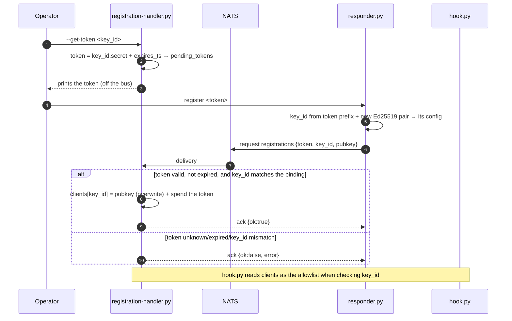
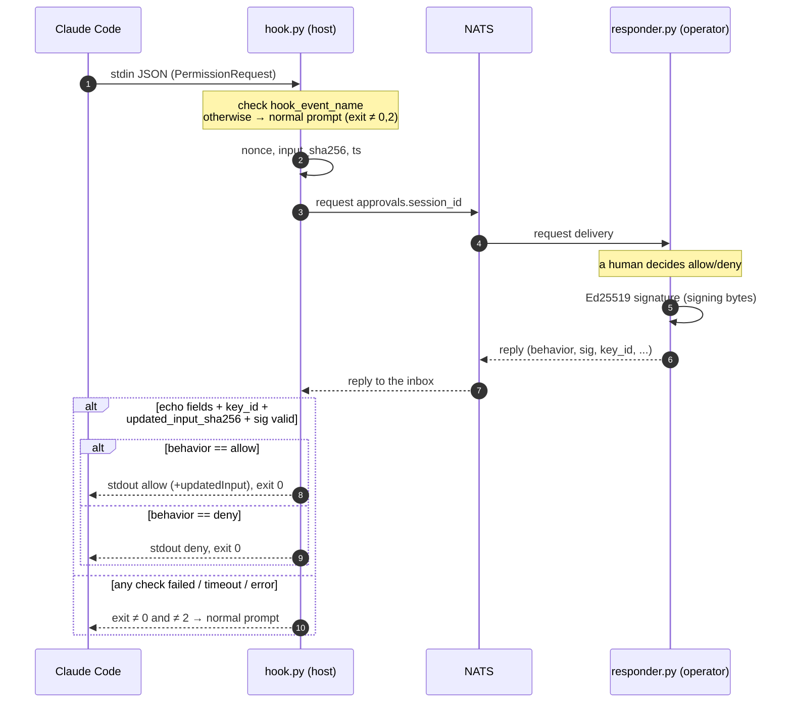

# Claude permission approver

The applied goal of the project is to move Claude Code's permission confirmation outside the terminal. Instead of the interactive permission prompt, the `PermissionRequest` hook sends a request into NATS (request-reply), an external human responder signs the decision with an Ed25519 key, and the hook verifies the signature and hands Claude Code an `allow`/`deny` verdict. Trusted responder keys are provisioned through a separate registration process using one-time tokens. The full protocol, message contracts, and fail-safe requirements are described in sections 6–7.

A local sandbox for experimenting with [NATS](https://nats.io/) on Docker Desktop under Windows. The infrastructure comes up with a single `docker compose` (section 3): the NATS server itself with JetStream enabled, a web dashboard to observe the bus, and a `nats-box` container with the `nats` CLI for manual checks of publishes, streams, and subscriptions.

## 1. Repository rules

- **TDD.** Test first, then code. The red → green → refactor cycle: write a failing test for the behavior → the minimal code to make it green → refactor under green tests. New functionality and bugfixes come together with tests; a PR without tests for the changed behavior is not merged. The test runner is **pytest**, tests live in `tests/`, files `test_*.py`.
- **List of libraries in use** (the only approved ones):
  - **Runtime:** `nats-py` (NATS client), `cryptography` (Ed25519 — sign/verify).
  - **Dev/tests:** `pytest`.
  - The Python standard library — no restrictions.
  - **Where they are declared.** The single source of truth is `pyproject.toml`: runtime in `[project.dependencies]`, dev/tests in `[dependency-groups].dev` (PEP 735). Versions are locked in `uv.lock` (committed). The project is non-package (`[tool.uv] package = false`, no `[build-system]`): we do not build a distribution, there is no editable install.
  - **Installation (uv):** `uv sync` (runtime + dev) or `uv sync --no-dev` (runtime only). No `requirements*.txt` — they do not exist.
- **You may not pull in new libraries without confirmation.** Any dependency outside the list above (including transitive ones that drag in noticeable weight, and dev tools) is added only after explicit sign-off from the repository owner. The preference is to solve the task with the standard library. If a new dependency really is needed — ask first, then add it and update this list.

## 2. Structure

- `nats/` — docker-compose with the NATS server, dashboard, and nats-box (CLI).
- `lib/` — reusable modules (stdlib + approved dependencies, no new ones of their own):
  - `lib/bus.py` — JSON request-reply over NATS (a thin async wrapper over `nats-py`). `connect()` (async context manager, yields a `Bus`, drains on exit; defaults to `nats://127.0.0.1:4222`); `Bus.request(subject, payload, timeout=)` (NATS errors → `RequestTimeout` / `NoResponders`); `Bus.reply(subject, handler, queue=)` (handler sync or async; `queue` — queue group for multiple responders, see §6). Used by both sides of the §7 flow.
  - `lib/config.py` — versioned, atomic JSON config store (`handler-config.json` / `responder-config.json`, see §6). `Config.load(path, default=)` (deep-copies the default if the file is missing; a mismatched/absent `v` → `ConfigVersionError`); `Config.save()` (atomic: temp + fsync + `os.replace`, creates parent directories, stamps `v`); dict-like access (`[]`, `get`, `setdefault`, `in`).
  - `lib/crypto.py` — Ed25519 (a wrapper over `cryptography`): `generate_keypair()` / `KeyPair` (`.generate()`, `.from_private_b64()`, `.private_b64()`, `.public_b64()`, `.sign(bytes)`), `sign(private_b64, bytes)`, `verify(public_b64, bytes, sig_b64) -> bool`. Keys and signatures are standard base64 (raw priv/pub 32 bytes, signature 64). The module is protocol-agnostic: it signs/verifies raw `bytes`, assembling the §7 "signing bytes" is up to the caller. `verify` is fail-safe: any malformed input → `False`, never raises (matching the hook's fail-safe, §7).
- `approver/` — the permission-approval code (NATS Request-Reply + Ed25519, see §6/§7):
  - `approver/protocol.py` — the shared wire-format contract (§7): `PROTOCOL_VERSION`, `canonical_json` (sort_keys, no spaces), `canonical_sha256`, `signing_bytes(...)` (fixed field order joined by `\n`, `reason` last). One implementation for both sides — the responder signs, the hook re-verifies.
  - `approver/responder.py` — the human responder. `register <token>`: generates a new Ed25519 pair, registers the public key over `registrations` using a one-time token, saves the pair to `responder-config.json` **only on `ok:true`** (a rejection does not clobber a working config). `serve`: subscribes to `approvals.*` (queue group `approvers`), prompts the operator on the console, signs the reply (§7). Pure functions `parse_key_id` / `build_registration_request` / `build_reply` — tested without NATS. Run: `py approver/responder.py {register|serve}`.
  - `approver/registration_handler.py` (in §6 — `registration-handler.py`; underscore so the module is importable) — the allowlist owner. `--get-token <key_id>`: mints a one-time token `<key_id>.<secret>` (TTL 15 min), writes it to `pending_tokens`, prints the token to stdout. Without the flag — listens on `registrations`: finds the token, checks `key_id`/expiry, writes `clients[key_id]` (rotation), consumes the token (one-time, only on success). Pure functions `handle_registration` / `add_pending_token` / `get_token` + `make_handler` (reloads the config from disk on every message + `asyncio.Lock` around the read-modify-write). Errors: `bad request|token unknown|key_id mismatch|expired`. Run: `py approver/registration_handler.py [--get-token <key_id>]`.
  - `approver/hook.py` — the Claude Code `PermissionRequest` hook (see §7). Reads the payload from stdin, checks `hook_event_name`, sends `nats request approvals.<session_id>` (with nonce/`input_sha256`/ts), verifies the signed reply against the allowlist (`clients` from `handler-config.json`), and prints the `decision` to stdout. Pure functions `build_request` / `verify_reply` / `decision_output` + `allowlist_from_config` / `servers_from_config` / `timeout_from_config` + `request_decision` (orchestration). **Fail-safe:** any error / invalid signature / mismatch / untrusted `key_id` → exit ≠0 and ≠2 (the normal prompt); the decision is delivered only via exit-0 JSON, never a "silent allow". The NATS server(s) and the approval timeout (default 60s) are read from `handler-config.json` (`servers` / `timeout` keys); only the config-file location is external — env `AI_REMOTE_HANDLER_CONFIG` or `--config`. Wired in `settings.json` — a `PermissionRequest` hook, matcher `*`, command `py <repo>\approver\hook.py`.
  - **Runtime configs with secrets** (`responder-config.json` — the private key; `handler-config.json` — token secrets in `pending_tokens`) are not committed to git (see `.gitignore`). Committed alongside them are `handler-config.example.json` (a usable starter: `servers`/`timeout` set, empty `clients`/`pending_tokens`) and `responder-config.example.json` (format reference — the real file is generated by `responder.py register`).
- `scripts/e2e-registration.cmd` — a command-file e2e of registration (§6): mints a token → brings up the handler with `--once` (it exits itself after the first successful registration) → `responder register` (with retries until ready) → checks `clients[key_id].pubkey` against the responder's `public_key`. Throwaway configs in `%TEMP%`, does not touch the repository. Requires NATS on localhost and the `py` launcher. Exit 0 = PASS, 1 = FAIL. Run: `scripts\e2e-registration.cmd`.
- `scripts/e2e-approval.cmd` — a command-file e2e of the approval loop (§7): registers a responder → starts real `responder.py serve` in the background (the operator's `allow` is fed from a redirected answers file instead of typed) → pipes a `PermissionRequest` into real `hook.py` (retries until the responder is subscribed) → verifies the hook emits a signed `allow` decision. Exercises the actual processes / stdin-stdout / exit codes, not just in-process calls. Throwaway configs in `%TEMP%`, does not touch the repository. Requires NATS on localhost and the `py` launcher. Exit 0 = PASS, 1 = FAIL. Run: `scripts\e2e-approval.cmd`.
- `tests/` — pytest tests (`test_*.py`), see §1. `conftest.py`: the `requires_nats` marker (skips integration tests when NATS is unreachable) and `run_async()` (drives async bodies via `asyncio.run` — we do not add `pytest-asyncio`).
- `pyproject.toml` — project metadata and dependencies (runtime + dev group); the source of truth for dependencies. In `[tool.pytest.ini_options]`: `pythonpath=["."]` (importing `lib.*` in a non-package project), `testpaths=["tests"]`, `--basetemp=.pytest_tmp` (the default temp root is unavailable in this sandbox).
- `uv.lock` — locked versions (uv), committed to the repository.
- `.gitignore` — `.venv/`, `__pycache__/`, `.pytest_cache/`, `.pytest_tmp/`, `.idea/`.

## 3. Infrastructure (`nats/docker-compose.yml`)

Bring up: `cd nats && docker compose up -d`

| Service          | Container        | Ports (host→container)          | Purpose                                                                   |
|------------------|------------------|---------------------------------|---------------------------------------------------------------------------|
| `nats`           | `nats-server`    | 4222→4222, 8222→8222, 6222→6222 | client; HTTP monitoring (8222 — `/varz`, `/jsz`, `/connz`); clustering    |
| `nats-dashboard` | `nats-dashboard` | 8080→**80**                     | Web UI (http://localhost:8080/)                                           |
| `nats-box`       | `nats-box`       | —                               | `nats` CLI (`docker exec -it nats-box sh`)                                |


## 4. NATS: key concepts
- `-js` only **enables** JetStream, it does not turn on persistence globally.
- Persistence is targeted: via a **stream** that captures the given subjects (`nats stream add ORDERS --subjects "orders.*"`). Subjects without a stream behave like Core NATS (fire-and-forget).
- `nats pub` prints "Published" = confirmation of sending, NOT of delivery/storage.

## 5. Python (host)
- Run via the **`py`** launcher (Python 3.14.6): `py script.py`, `py -m pytest`, `py -c "..."`.
- The real interpreter that `py` points to: `C:\Users\User\AppData\Local\Python\pythoncore-3.14-64\python.exe`.
  `C:\...\WindowsApps\python.exe` is the Microsoft Store stub, do NOT use it.

## 6. Responder registration (bootstrapping trusted keys)

How the responder's public key gets into the allowlist that `hook.py` checks. Keys are not written by hand — the responder generates its own pair and registers the public half using a one-time token. Registration is a prerequisite step: without a trusted key the approval flow (section 7) will not work.

**Roles and configs:**
- `registration-handler.py` — the allowlist owner. Stores it in its own JSON config next to the script (`handler-config.json`); this same config is read by `hook.py` when checking `key_id`. Issues one-time tokens and listens on the `registrations` subject.
- `responder.py` — stores its `key_id` and **private** key in its own JSON config (`responder-config.json`). The private key never leaves for the bus. The `key_id` is not chosen by the responder — it comes inside the token (see below).

`handler-config.json`:
```json
{
  "v": 1,
  "servers": "nats://127.0.0.1:4222",
  "timeout": 60,
  "pending_tokens": [
    { "key_id": "approver-1", "token": "approver-1.<b64 32 bytes>", "expires_ts": 1737346500 }
  ],
  "clients": {
    "approver-1": { "pubkey": "<b64 Ed25519 public>", "registered_ts": 1737345600 }
  }
}
```
- `clients` (a map `key_id → {pubkey, …}`) is precisely the allowlist for `hook.py`.
- `servers` / `timeout` (both optional) configure `hook.py`'s NATS connection and how long it waits for a human decision; absent/invalid values fall back to `nats://127.0.0.1:4222` / 60s. The registration handler preserves these keys across writes.

`responder-config.json`:
```json
{
  "v": 1,
  "key_id": "approver-1",
  "private_key": "<b64 Ed25519 private>",
  "public_key": "<b64 Ed25519 public>"
}
```

**The token is bound to a `key_id`.** The token format is `<key_id>.<b64 32 random bytes>`: a readable `key_id` on the left, the secret on the right. A `key_id` cannot contain `.` (the first dot is the separator). The token authorizes registration of **only** that `key_id` — it cannot be used to claim or hijack someone else's slot.

**Flow:**
1. `registration-handler.py --get-token <key_id>` — generates a secret (32 bytes b64), assembles the token `<key_id>.<secret>`, puts a record `{key_id, token, expires_ts}` into `pending_tokens` (`expires_ts` defaults to now+15 min), and prints the token to stdout. The token is handed to the operator off the bus.
2. `responder.py register <token>` — parses `key_id` from the token prefix, generates a new Ed25519 pair, saves it (`key_id` + private + public) to its config, and sends `nats request registrations` with the message (see below).
3. `registration-handler` listens on `registrations`. For each message: it finds the token in `pending_tokens`, checks that it has not expired **and that the `key_id` in the message matches the `key_id` the token is bound to** → writes `clients[key_id] = {pubkey, registered_ts}`, **overwriting** the client key with this `key_id` (rotation) → removes the token from `pending_tokens` (one-time use) → replies with an ack in the reply-inbox. From this moment `hook.py` trusts the new key for this `key_id`.

Request (`responder.py` → `registrations`):
```json
{
  "v": 1,
  "token": "approver-1.<b64 from --get-token>",
  "key_id": "approver-1",
  "pubkey": "<b64 Ed25519 public>",
  "ts": 1737346000
}
```
- `key_id` must match the prefix of `token` — the handler verifies this (mismatch → `ok:false`).

Reply (`registration-handler` → reply-inbox):
```json
{ "v": 1, "ok": true, "key_id": "approver-1" }
```
- On error — `{ "v": 1, "ok": false, "error": "<token unknown|expired|key_id mismatch|bad request>" }`. A token is considered spent only on success; a spent (or otherwise unrecognized) token comes back as `token unknown`.

**Multiple clients.** `clients` may hold several `key_id`s. But `approvals.<session_id>` is a regular subject: if several responders are running in parallel, the request reaches **all** of them, and each can reply (the hook takes the first valid reply). Hence the rule: keep **one** responder running at a time, or subscribe responders to `approvals.*` via a **queue group** (then each message goes to exactly one instance). The `registrations` subject is fan-out, but the token is one-time, so duplicate registrations are safe.

**Token trust model.** A token = authorization to register, bound to its `key_id`. The holder of a valid, unexpired token can register/rotate the key of **only** that `key_id` — claiming or hijacking someone else's slot is impossible. Rotating the key of the same `key_id` (overwriting `clients[key_id]`) is intentional. Tokens are short-lived, issued off the bus, and not logged. The `key_id` is not a secret (it is visible in the token) — only the right-hand part is the secret.



## 7. Feature: PermissionRequest hook → NATS Request-Reply (signed)

Replacing Claude Code's interactive permission prompt with external confirmation over NATS.

- **Hook event:** `PermissionRequest` (not `PreToolUse`). It fires only when Claude would actually reach the prompt; a rule-based auto-allow does not go onto the bus.
- **Matcher:** `*` (all tools).
- **Flow:** `hook.py` (on the host) reads stdin JSON, **checks `hook_event_name == "PermissionRequest"`** (otherwise the payload is not ours → fall through to the normal prompt) → sends `nats request approvals.<session_id>` with a nonce → `responder.py` (manual human input) signs the decision with Ed25519 and replies to the request's reply-inbox → the hook verifies the signature → prints `hookSpecificOutput.decision.behavior` (`allow`/`deny`) to stdout. There is no separate `.decision` subject: the reply travels over the request-reply channel.
- **We sign the entire content of the reply** — the concatenation `v + session_id + nonce + tool_name + input_sha256 + behavior + updated_input_sha256 + ts + reason` (nonce = anti-replay; `input_sha256` = the hash of `tool_input`, so the decision cannot be replayed onto a different command; `updated_input_sha256` is under the signature, otherwise what actually gets executed could be swapped; `reason`/`v`/`ts` are under the signature too). The exact format is in the "Signing bytes" section below.
- **Fail-safe:** any error (NATS unavailable, timeout, a bad/absent signature, a foreign nonce/key_id) → exit ≠ 0 and ≠ 2 → fall through to the **normal prompt**. Never a "silent allow". (Exit 2 is a blocking error: stdout is ignored, stderr goes to Claude; for `PermissionRequest` this is probably deny, but the exact semantics are not pinned down in the docs — so do NOT use it on errors, the decision is delivered only via exit-0 JSON.)
- **Client:** `nats-py`; **cryptography:** `cryptography` (Ed25519).

### 7.1 Sequence diagram



`PermissionRequest` hook contract:
- stdin: `{ hook_event_name, session_id, prompt_id, transcript_path, tool_name, tool_input, permission_mode, cwd }` — the hook must check `hook_event_name == "PermissionRequest"`. (`prompt_id` was added in Claude Code v2.1.196+; the hook does not need it, but it arrives in the payload.)
- stdout (exit 0): `{"hookSpecificOutput":{"hookEventName":"PermissionRequest","decision":{"behavior":"allow"|"deny","updatedInput"?:{…}}}}`
- exit codes: `0` — stdout is parsed as JSON (JSON is processed only on exit 0); `2` — a blocking error (stdout is ignored, stderr goes to Claude; the effect depends on the event, for `PermissionRequest` — probably deny, but the exact semantics are not pinned down in the docs); anything else (including `1`) — a non-blocking error, the normal prompt. The allow/deny decision is always delivered via exit-0 JSON, not via exit 2.

NATS message contract:

Request subject: `approvals.<session_id>`. The reply goes to the reply-inbox (request-reply).

Request (`hook.py` → the bus):
```json
{
  "v": 1,
  "session_id": "abc123",
  "tool_name": "Bash",
  "tool_input": { "command": "rm -rf build" },
  "input_sha256": "<hex sha256 of canonical JSON of tool_input: sort_keys=True, separators=(',',':')>",
  "permission_mode": "default",
  "cwd": "E:\\projects\\ai-remote\\nats",
  "nonce": "<b64, 32 random bytes>",
  "ts": 1737345600
}
```

Reply (`responder.py` → reply-inbox). The fields `v/session_id/tool_name/input_sha256/nonce/ts` are echoed from the request; `behavior/reason/updated_input` come from the responder:
```json
{
  "v": 1,
  "behavior": "allow",
  "reason": "approved by operator",
  "session_id": "abc123",
  "tool_name": "Bash",
  "input_sha256": "<echo from request>",
  "nonce": "<echo from request>",
  "ts": 1737345600,
  "updated_input": { "command": "npm ci" },
  "key_id": "approver-1",
  "sig": "<b64 Ed25519 signature over the signing bytes>"
}
```
- `updated_input` (optional, object) — overrides the tool arguments; if set, the hook prints it in `decision.updatedInput`. It enters the signature as `updated_input_sha256` (see below).
- The field is optional and applied only when `behavior == "allow"`. If it is absent — the signing bytes use an empty string `""` in the `updated_input_sha256` position.

**Signing bytes** (signed by the responder, verified by the hook) — a raw concatenation of the fields in a **fixed order** with the `\n` separator, utf-8:
```
str(v) + "\n" + session_id + "\n" + nonce + "\n" + tool_name + "\n" + input_sha256 + "\n" + behavior + "\n" + updated_input_sha256 + "\n" + str(ts) + "\n" + reason
```
- `updated_input_sha256` = hex sha256 of the canonical JSON of `updated_input`, or `""` if the field is absent. The hook recomputes the hash from the received `updated_input` and compares — just like with `input_sha256`. The JSON canonicalization for both hashes is the same: `json.dumps(..., sort_keys=True, separators=(',',':'))`, utf-8 → sha256.
- `reason` comes **last** on purpose: it is the only free-text field and may contain `\n`; being the tail of the string, it stays unambiguous. None of the other fields contain a newline.

The order and separator must not be changed — both sides assemble the string identically.

Checks in `hook.py` before trusting a reply (any that fails → fall through to the normal prompt):
- `v` matches the expected protocol version;
- `nonce`, `session_id`, `tool_name`, `input_sha256`, `ts` match what was sent (anti-replay + binding to the command);
- `key_id` is present in the allowlist of trusted public keys (the allowlist is populated through registration — see section 6 "Responder registration" above; `key_id` itself is not part of the signing bytes — it is bound to the signature indirectly: it selects the public key, and a signature made by a different key will not pass verification);
- if `updated_input` is present — the hook recomputes `sha256(canonical(updated_input))` and substitutes it into the signing bytes in the `updated_input_sha256` position (this hash is **not** transmitted as a separate field in the reply, unlike `input_sha256`, which is echoed back in the reply). Consistency is guaranteed by the `sig` check itself: if the responder signed a different `updated_input_sha256`, the signature will not match. If the field is absent — an empty string (`""`) takes its place in the signing bytes;
- `sig` is valid for the signing bytes under the corresponding public key (after this `behavior`/`reason`/`updated_input` can be trusted);
- `behavior ∈ {allow, deny}`; `updated_input` is honored only on `allow`.

**Privacy:** `tool_input` goes onto the bus as-is — for Bash that is the full command, for Write the file contents. The `approvals.<session_id>` subject and access to NATS must be restricted; do not connect untrusted subscribers.
