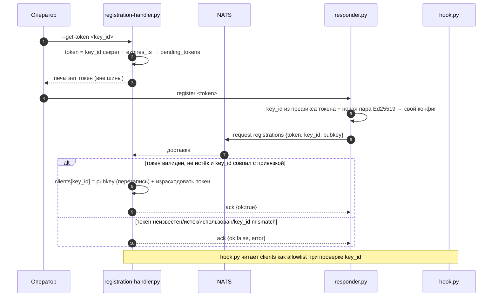
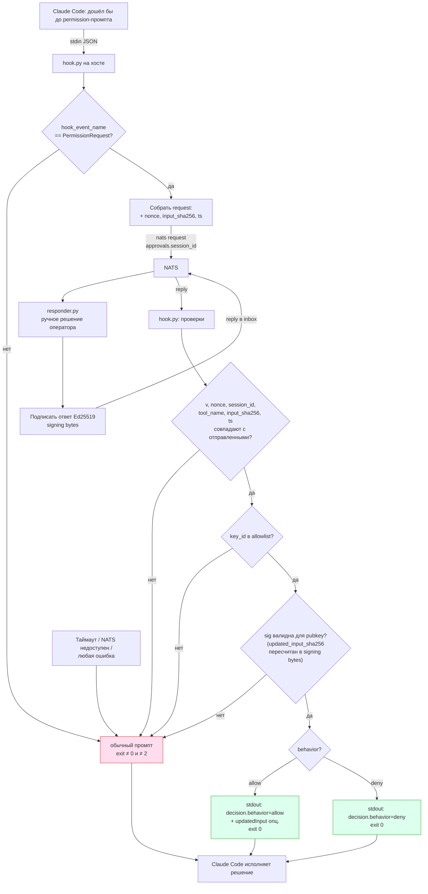
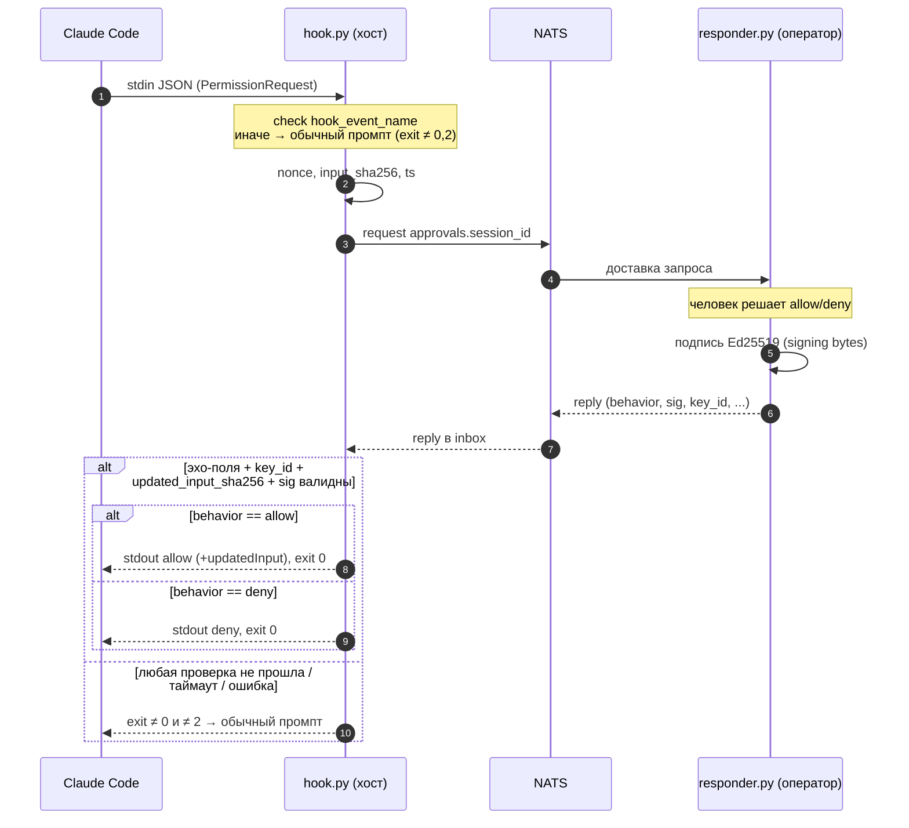

# Сlaude permission approver

Прикладная цель проекта — вынести подтверждение прав Claude Code за пределы терминала. Вместо интерактивного permission-промпта хук `PermissionRequest` отправляет запрос в NATS (request-reply), внешний ответчик-человек подписывает решение ключом Ed25519, а хук проверяет подпись и отдаёт Claude Code вердикт `allow`/`deny`. Доверенные ключи ответчиков заводятся через отдельный процесс регистрации по одноразовым токенам. Полный протокол, контракты сообщений и требования fail-safe описаны в разделах 6–7.

Локальная песочница для экспериментов с [NATS](https://nats.io/) на Docker Desktop под Windows. Инфраструктура поднимается одним `docker compose` (раздел 3): сам сервер NATS с включённым JetStream, веб-дашборд для наблюдения за шиной и контейнер `nats-box` с CLI `nats` для ручных проверок публикаций, стримов и подписок.

## 1. Правила репозитория

- **TDD.** Сначала тест, потом код. Цикл red → green → refactor: пишем падающий тест на поведение → минимальный код, чтобы он позеленел → рефакторинг под зелёными тестами. Новая функциональность и багфиксы приходят вместе с тестами; PR без тестов на изменённое поведение не мёржим. Тест-раннер — **pytest**, тесты лежат в `tests/`, файлы `test_*.py`.
- **Список используемых библиотек** (единственные одобренные):
  - **Runtime:** `nats-py` (клиент NATS), `cryptography` (Ed25519 — подпись/проверка).
  - **Dev/тесты:** `pytest`.
  - Стандартная библиотека Python — без ограничений.
  - **Где объявлены.** Единственный источник правды — `pyproject.toml`: runtime в `[project.dependencies]`, dev/тесты в `[dependency-groups].dev` (PEP 735). Версии залочены в `uv.lock` (коммитится). Проект — non-package (`[tool.uv] package = false`, без `[build-system]`): дистрибутив не собираем, editable-инсталла нет.
  - **Установка (uv):** `uv sync` (runtime + dev) или `uv sync --no-dev` (только runtime). Никаких `requirements*.txt` — их нет.
- **Нельзя тащить новые библиотеки без подтверждения.** Любая зависимость вне списка выше (включая транзитивные, которые тянут за собой заметный вес, и dev-инструменты) добавляется только после явного согласования с владельцем репозитория. Предпочтение — решить задачу стандартной библиотекой. Если новая зависимость действительно нужна — сначала спросить, затем добавить и обновить этот список.

## 2. Структура

- `nats/` — docker-compose с NATS-сервером, дашбордом и nats-box (CLI).
- `lib/` — переиспользуемые модули (stdlib + одобренные зависимости, без своих новых):
  - `lib/bus.py` — JSON request-reply поверх NATS (тонкая async-обёртка над `nats-py`). `connect()` (async-контекст-менеджер, отдаёт `Bus`, дренит на выходе; по умолчанию `nats://127.0.0.1:4222`); `Bus.request(subject, payload, timeout=)` (ошибки NATS → `RequestTimeout` / `NoResponders`); `Bus.reply(subject, handler, queue=)` (handler sync или async; `queue` — queue-group для нескольких responder'ов, см. §6). Используют обе стороны потока §7.
  - `lib/config.py` — версионированное атомарное JSON-хранилище конфигов (`handler-config.json` / `responder-config.json`, см. §6). `Config.load(path, default=)` (deep-copy дефолта если файла нет; несовпадение/отсутствие `v` → `ConfigVersionError`); `Config.save()` (атомарно: temp + fsync + `os.replace`, создаёт родительские каталоги, штампует `v`); dict-подобный доступ (`[]`, `get`, `setdefault`, `in`).
  - `lib/crypto.py` — Ed25519 (обёртка над `cryptography`): `generate_keypair()` / `KeyPair` (`.generate()`, `.from_private_b64()`, `.private_b64()`, `.public_b64()`, `.sign(bytes)`), `sign(private_b64, bytes)`, `verify(public_b64, bytes, sig_b64) -> bool`. Ключи и подписи — стандартный base64 (raw priv/pub 32 байта, подпись 64). Модуль протокол-агностичен: подписывает/проверяет сырые `bytes`, сборка «signing bytes» §7 — на вызывающем. `verify` fail-safe: любой некорректный вход → `False`, не бросает (под fail-safe хука §7).
- `approver/` — код подтверждения прав (NATS Request-Reply + Ed25519, см. §6/§7):
  - `approver/protocol.py` — общий контракт wire-формата (§7): `PROTOCOL_VERSION`, `canonical_json` (sort_keys, без пробелов), `canonical_sha256`, `signing_bytes(...)` (фиксированный порядок полей через `\n`, `reason` последним). Одна реализация на обе стороны — responder подписывает, hook перепроверяет.
  - `approver/responder.py` — ответчик-человек. `register <token>`: генерит новую пару Ed25519, регистрирует публичный ключ через `registrations` по одноразовому токену, сохраняет пару в `responder-config.json` **только при `ok:true`** (отказ не затирает рабочий конфиг). `serve`: подписка на `approvals.*` (queue-group `approvers`), консольный промпт оператору, подписанный ответ (§7). Чистые функции `parse_key_id` / `build_registration_request` / `build_reply` — тестируются без NATS. Запуск: `py approver/responder.py {register|serve}`.
  - `approver/registration_handler.py` (в §6 — `registration-handler.py`; подчёркивание, чтобы модуль импортировался) — владелец allowlist'а. `--get-token <key_id>`: чеканит одноразовый токен `<key_id>.<secret>` (TTL 15 мин), пишет в `pending_tokens`, печатает токен в stdout. Без флага — слушает `registrations`: находит токен, сверяет `key_id`/срок, пишет `clients[key_id]` (ротация), гасит токен (одноразовость, только при успехе). Чистые функции `handle_registration` / `add_pending_token` / `get_token` + `make_handler` (перечитывает конфиг с диска на каждое сообщение + `asyncio.Lock` на read-modify-write). Ошибки: `bad request|token unknown|key_id mismatch|expired`. Запуск: `py approver/registration_handler.py [--get-token <key_id>]`.
  - `approver/hook.py` — хук Claude Code `PermissionRequest` (см. §7). Читает payload из stdin, проверяет `hook_event_name`, шлёт `nats request approvals.<session_id>` (с nonce/`input_sha256`/ts), проверяет подписанный ответ против allowlist'а (`clients` из `handler-config.json`) и печатает `decision` в stdout. Чистые функции `build_request` / `verify_reply` / `decision_output` + `request_decision` (orchestration). **Fail-safe:** любая ошибка/невалидная подпись/несовпадение/чужой `key_id` → exit ≠0 и ≠2 (обычный промпт), решение только через exit-0 JSON, никогда не «тихий allow». Настройки через env: `AI_REMOTE_NATS`, `AI_REMOTE_HANDLER_CONFIG`, `AI_REMOTE_TIMEOUT` (по умолч. 60с). Подключение в `settings.json` — хук `PermissionRequest`, matcher `*`, команда `py <repo>\approver\hook.py`.
  - **Рантайм-конфиги с секретами** (`responder-config.json` — приватный ключ; `handler-config.json` — секреты токенов в `pending_tokens`) в git не коммитятся (см. `.gitignore`).
- `scripts/e2e-registration.cmd` — командный e2e регистрации (§6): чеканит токен → поднимает handler `--once` (сам выходит после первой успешной регистрации) → `responder register` (с ретраями до готовности) → сверяет `clients[key_id].pubkey` с `public_key` responder'а. Временные конфиги в `%TEMP%`, репозиторий не трогает. Требует NATS на localhost и лончер `py`. Exit 0 = PASS, 1 = FAIL. Запуск: `scripts\e2e-registration.cmd`.
- `tests/` — pytest-тесты (`test_*.py`), см. §1. `conftest.py`: маркер `requires_nats` (скипает интеграционные тесты, если NATS недоступен) и `run_async()` (гоняет async-тела через `asyncio.run` — `pytest-asyncio` не подключаем).
- `pyproject.toml` — метаданные проекта и зависимости (runtime + dev-группа); источник правды по зависимостям. В `[tool.pytest.ini_options]`: `pythonpath=["."]` (импорт `lib.*` в non-package проекте), `testpaths=["tests"]`, `--basetemp=.pytest_tmp` (дефолтный temp-root недоступен в этой песочнице).
- `uv.lock` — залоченные версии (uv), коммитится в репозиторий.
- `.gitignore` — `.venv/`, `__pycache__/`, `.pytest_cache/`, `.pytest_tmp/`, `.idea/`.

## 3. Инфраструктура (`nats/docker-compose.yml`)

Поднять: `cd nats && docker compose up -d`

| Сервис           | Контейнер        | Порты (host→container)          | Назначение                                                                |
|------------------|------------------|---------------------------------|---------------------------------------------------------------------------|
| `nats`           | `nats-server`    | 4222→4222, 8222→8222, 6222→6222 | клиент; HTTP-мониторинг (8222 — `/varz`, `/jsz`, `/connz`); кластеризация |
| `nats-dashboard` | `nats-dashboard` | 8080→**80**                     | Web UI (http://localhost:8080/)                                           |
| `nats-box`       | `nats-box`       | —                               | `nats` CLI (`docker exec -it nats-box sh`)                                |


## 4. NATS: ключевые понятия
- `-js` лишь **разрешает** JetStream, не включает персистентность глобально.
- Персистентность — точечная: через **stream**, который ловит заданные subjects (`nats stream add ORDERS --subjects "orders.*"`). Subjects без стрима работают как Core NATS (fire-and-forget).
- `nats pub` печатает «Published» = подтверждение отправки, НЕ доставки/сохранения.

## 5. Python (хост)
- Запускать через лончер **`py`** (Python 3.14.6): `py script.py`, `py -m pytest`, `py -c "..."`.
- Реальный интерпретатор, на который указывает `py`: `C:\Users\User\AppData\Local\Python\pythoncore-3.14-64\python.exe`.
  `C:\...\WindowsApps\python.exe` — это заглушка Microsoft Store, НЕ использовать.

## 6. Регистрация responder'а (bootstrap доверенных ключей)

Как публичный ключ ответчика попадает в allowlist, который проверяет `hook.py`. Ключи не прописываются руками — responder генерирует свою пару и регистрирует публичную половину по одноразовому токену. Регистрация — предварительный шаг: без доверенного ключа поток подтверждений (раздел 7) работать не будет.

**Роли и конфиги:**
- `registration-handler.py` — владелец allowlist'а. Хранит его в своём JSON-конфиге рядом со скриптом (`handler-config.json`); этот же конфиг читает `hook.py` при проверке `key_id`. Выдаёт одноразовые токены и слушает subject `registrations`.
- `responder.py` — хранит свой `key_id` и **приватный** ключ в собственном JSON-конфиге (`responder-config.json`). Приватный ключ шину не покидает. `key_id` не выбирается responder'ом — он приходит внутри токена (см. ниже).

`handler-config.json`:
```json
{
  "v": 1,
  "pending_tokens": [
    { "key_id": "approver-1", "token": "approver-1.<b64 32 байта>", "expires_ts": 1737346500 }
  ],
  "clients": {
    "approver-1": { "pubkey": "<b64 Ed25519 public>", "registered_ts": 1737345600 }
  }
}
```
- `clients` (map `key_id → {pubkey, …}`) и есть allowlist для `hook.py`.

`responder-config.json`:
```json
{
  "v": 1,
  "key_id": "approver-1",
  "private_key": "<b64 Ed25519 private>",
  "public_key": "<b64 Ed25519 public>"
}
```

**Токен привязан к `key_id`.** Формат токена — `<key_id>.<b64 32 случайных байта>`: слева читаемый `key_id`, справа секрет. `key_id` не может содержать `.` (первая точка — разделитель). Токен авторизует регистрацию **только** этого `key_id` — им нельзя занять или перехватить чужой слот.

**Поток:**
1. `registration-handler.py --get-token <key_id>` — генерит секрет (32 байта b64), собирает токен `<key_id>.<секрет>`, кладёт запись `{key_id, token, expires_ts}` в `pending_tokens` (`expires_ts` по умолчанию now+15 мин) и печатает токен в stdout. Токен передаётся оператору вне шины.
2. `responder.py register <token>` — парсит `key_id` из префикса токена, генерит новую пару Ed25519, сохраняет её (`key_id` + приватный + публичный) в свой конфиг и шлёт `nats request registrations` с сообщением (см. ниже).
3. `registration-handler` слушает `registrations`. По каждому сообщению: находит токен в `pending_tokens`, проверяет, что он не истёк **и что `key_id` из сообщения совпадает с `key_id`, к которому привязан токен** → записывает `clients[key_id] = {pubkey, registered_ts}`, **перезаписывая** ключ клиента с этим `key_id` (ротация) → удаляет токен из `pending_tokens` (одноразовость) → отвечает ack в reply-inbox. С этого момента `hook.py` доверяет новому ключу для этого `key_id`.

Request (`responder.py` → `registrations`):
```json
{
  "v": 1,
  "token": "approver-1.<b64 из --get-token>",
  "key_id": "approver-1",
  "pubkey": "<b64 Ed25519 public>",
  "ts": 1737346000
}
```
- `key_id` обязан совпадать с префиксом `token` — handler это сверяет (несовпадение → `ok:false`).

Reply (`registration-handler` → reply-inbox):
```json
{ "v": 1, "ok": true, "key_id": "approver-1" }
```
- При ошибке — `{ "v": 1, "ok": false, "error": "<token unknown|expired|already used|key_id mismatch|bad request>" }`. Токен считается израсходованным только при успехе.

**Несколько клиентов.** В `clients` может лежать несколько `key_id`. Но `approvals.<session_id>` — обычный subject: если параллельно поднято несколько responder'ов, запрос долетит до **всех**, и каждый сможет ответить (hook берёт первый валидный ответ). Поэтому правило: одновременно держать **один** responder, либо подписывать responder'ов на `approvals.*` через **queue group** (тогда каждое сообщение получает ровно один экземпляр). Subject `registrations` — fan-out, но токен одноразовый, так что дубли регистрации безопасны.

**Модель доверия токена.** Токен = авторизация регистрации, привязанная к своему `key_id`. Владелец валидного неистёкшего токена может зарегистрировать/ротировать ключ **только** этого `key_id` — занять или перехватить чужой слот нельзя. Ротация ключа того же `key_id` (перезапись `clients[key_id]`) осознанна. Токены короткоживущие, выдаются вне шины и не логируются. `key_id` секретом не является (виден в токене) — секрет только правая часть.



## 7. Планируемая фича: хук PermissionRequest → NATS Request-Reply (подписанный)

Замена интерактивного permission-промпта Claude Code на внешнее подтверждение через NATS.

- **Событие хука:** `PermissionRequest` (не `PreToolUse`). Срабатывает только когда Claude реально дошёл бы до промпта; авто-allow по правилам в шину не летит.
- **Матчер:** `*` (все инструменты).
- **Поток:** `hook.py` (на хосте) читает stdin JSON, **проверяет `hook_event_name == "PermissionRequest"`** (иначе payload не наш → выходим в обычный промпт) → шлёт `nats request approvals.<session_id>` с nonce → `responder.py` (ручной ввод человека) подписывает решение Ed25519 и отвечает в reply-inbox запроса → hook проверяет подпись → печатает в stdout `hookSpecificOutput.decision.behavior` (`allow`/`deny`). Отдельного `.decision`-subject нет: ответ идёт по каналу request-reply.
- **Подписываем всё содержимое ответа** — конкатенацию `v + session_id + nonce + tool_name + input_sha256 + behavior + updated_input_sha256 + ts + reason` (nonce = anti-replay; `input_sha256` = хеш `tool_input`, решение нельзя переиграть на другую команду; `updated_input_sha256` под подписью, иначе можно подменить то, что реально выполнится; `reason`/`v`/`ts` тоже под подписью). Точный формат — в разделе «Signing bytes» ниже.
- **Fail-safe:** любая ошибка (NATS недоступен, таймаут, плохая/отсутствующая подпись, чужой nonce/key_id) → exit ≠ 0 и ≠ 2 → падаем в **обычный промпт**. Никогда не «тихий allow». (Exit 2 — блокирующая ошибка: stdout игнорируется, stderr уходит Claude; для `PermissionRequest` это, вероятно, deny, но точная семантика в доках не зафиксирована — поэтому на ошибках его НЕ использовать, решение отдаём только через exit-0 JSON.)
- **Клиент:** `nats-py`; **криптография:** `cryptography` (Ed25519).

### 7.1 Диаграмма потока



### 7.2 Sequence diagram



Контракт хука `PermissionRequest`:
- stdin: `{ hook_event_name, session_id, prompt_id, transcript_path, tool_name, tool_input, permission_mode, cwd }` — хук обязан проверить `hook_event_name == "PermissionRequest"`. (`prompt_id` добавлен в Claude Code v2.1.196+; хуку не нужен, но приходит в payload.)
- stdout (exit 0): `{"hookSpecificOutput":{"hookEventName":"PermissionRequest","decision":{"behavior":"allow"|"deny","updatedInput"?:{…}}}}`
- exit codes: `0` — stdout парсится как JSON (JSON обрабатывается только на exit 0); `2` — блокирующая ошибка (stdout игнорируется, stderr уходит Claude; эффект зависит от события, для `PermissionRequest` — вероятно deny, но точная семантика в доках не зафиксирована); иное (в т.ч. `1`) — non-blocking error, обычный промпт. Решение allow/deny всегда отдаём через exit-0 JSON, а не через exit 2.

Контракт NATS-сообщений:

Subject запроса: `approvals.<session_id>`. Ответ — в reply-inbox (request-reply).

Request (`hook.py` → шина):
```json
{
  "v": 1,
  "session_id": "abc123",
  "tool_name": "Bash",
  "tool_input": { "command": "rm -rf build" },
  "input_sha256": "<hex sha256 каноничного JSON tool_input: sort_keys=True, separators=(',',':')>",
  "permission_mode": "default",
  "cwd": "E:\\projects\\ai-remote\\nats",
  "nonce": "<b64, 32 случайных байта>",
  "ts": 1737345600
}
```

Reply (`responder.py` → reply-inbox). Поля `v/session_id/tool_name/input_sha256/nonce/ts` — эхо из request; `behavior/reason/updated_input` — от ответчика:
```json
{
  "v": 1,
  "behavior": "allow",
  "reason": "approved by operator",
  "session_id": "abc123",
  "tool_name": "Bash",
  "input_sha256": "<эхо из request>",
  "nonce": "<эхо из request>",
  "ts": 1737345600,
  "updated_input": { "command": "npm ci" },
  "key_id": "approver-1",
  "sig": "<b64 Ed25519-подпись над signing bytes>"
}
```
- `updated_input` (опц., объект) — подменяет аргументы инструмента; если задан, hook печатает его в `decision.updatedInput`. В подпись входит как `updated_input_sha256` (см. ниже).
- Поле опционально и применяется только при `behavior == "allow"`. Если его нет — в подписи на месте `updated_input_sha256` пустая строка `""`.

**Signing bytes** (подписывает responder, проверяет hook) — сырая конкатенация полей в **фиксированном порядке** через разделитель `\n`, utf-8:
```
str(v) + "\n" + session_id + "\n" + nonce + "\n" + tool_name + "\n" + input_sha256 + "\n" + behavior + "\n" + updated_input_sha256 + "\n" + str(ts) + "\n" + reason
```
- `updated_input_sha256` = hex sha256 каноничного JSON `updated_input`, либо `""` если поля нет. Hook пересчитывает хеш из полученного `updated_input` и сверяет — как с `input_sha256`. Канонизация JSON для обоих хешей одинаковая: `json.dumps(..., sort_keys=True, separators=(',',':'))`, utf-8 → sha256.
- `reason` идёт **последним** намеренно: это единственное свободнотекстовое поле и в нём может встретиться `\n`; будучи хвостом строки, он остаётся однозначным. Во всех остальных полях перевода строки нет.

Порядок и разделитель менять нельзя — обе стороны собирают строку идентично.

Проверки в `hook.py` перед доверием ответу (любая непройденная → выход в обычный промпт):
- `v` совпадает с ожидаемой версией протокола;
- `nonce`, `session_id`, `tool_name`, `input_sha256`, `ts` совпадают с отправленными (anti-replay + привязка к команде);
- `key_id` есть в allowlist доверенных публичных ключей (allowlist наполняется через регистрацию — см. раздел 6 «Регистрация responder'а» выше; сам `key_id` в signing bytes не входит — он привязан к подписи косвенно: по нему выбирается публичный ключ, и подпись, сделанная другим ключом, проверку не пройдёт);
- если есть `updated_input` — hook пересчитывает `sha256(canonical(updated_input))` и подставляет его в signing bytes на место `updated_input_sha256` (отдельным полем этот хеш в ответе **не передаётся**, в отличие от `input_sha256`, который эхом приходит в reply). Согласованность обеспечивается самой проверкой `sig`: если responder подписал другой `updated_input_sha256`, подпись не сойдётся. Если поля нет — на его месте в signing bytes пустая строка (`""`);
- `sig` валидна для signing bytes соответствующим публичным ключом (после этого `behavior`/`reason`/`updated_input` можно доверять);
- `behavior ∈ {allow, deny}`; `updated_input` учитывается только при `allow`.

**Приватность:** `tool_input` уходит в шину как есть — для Bash это полная команда, для Write — содержимое файла. Subject `approvals.<session_id>` и доступ к NATS должны быть ограничены; не подключать недоверенных подписчиков.
