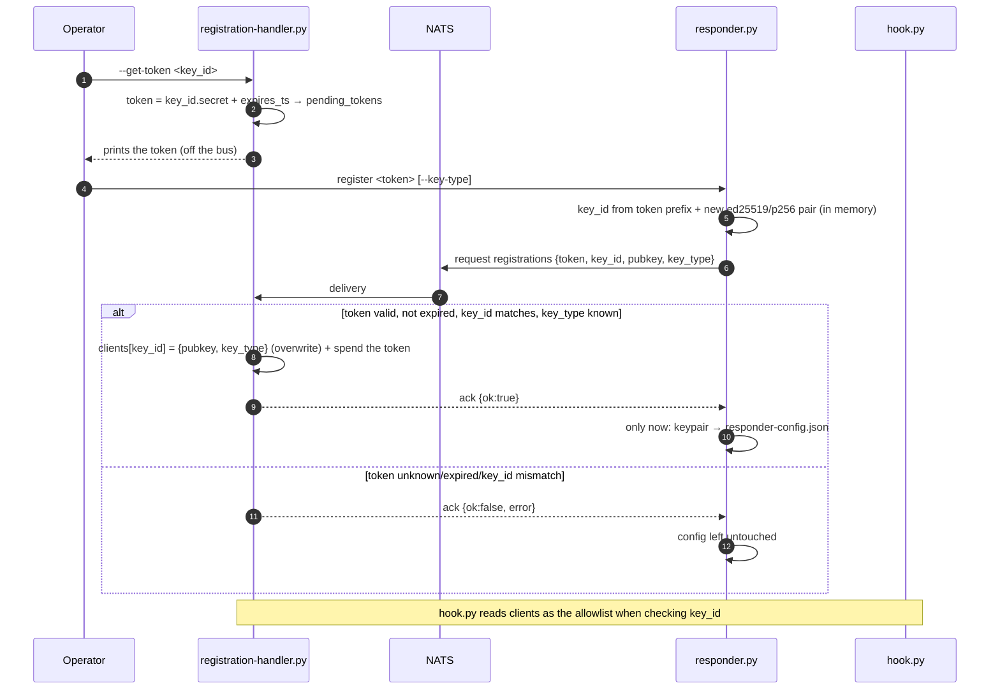
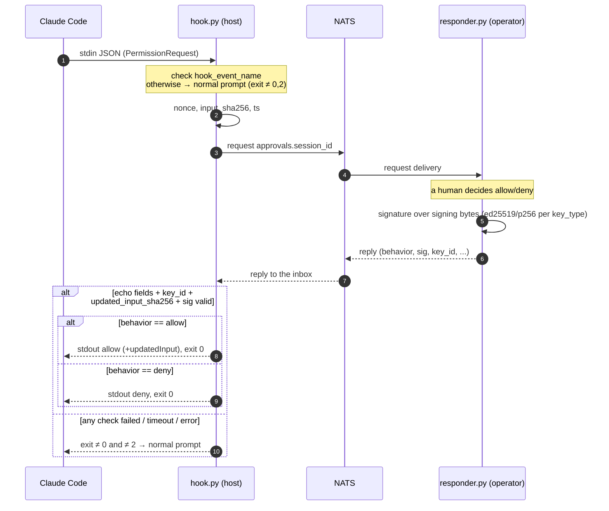

# Claude permission approver

The applied goal of the project is to move Claude Code's permission confirmation outside the terminal. Instead of the interactive permission prompt, the `PermissionRequest` hook sends a request into NATS (request-reply), an external human responder signs the decision with an Ed25519 key, and the hook verifies the signature and hands Claude Code an `allow`/`deny` verdict. Trusted responder keys are provisioned through a separate registration process using one-time tokens. The full protocol, message contracts, and fail-safe requirements are described in sections 6–7.

A local sandbox for experimenting with [NATS](https://nats.io/) on Docker Desktop under Windows. The infrastructure comes up with a single `docker compose` (section 3): the NATS server itself with JetStream enabled, a web dashboard to observe the bus, and a `nats-box` container with the `nats` CLI for manual checks of publishes, streams, and subscriptions.

## 1. Repository rules

- **TDD.** Test first, then code. The red → green → refactor cycle: write a failing test for the behavior → the minimal code to make it green → refactor under green tests. New functionality and bugfixes come together with tests; a PR without tests for the changed behavior is not merged. The test runner is **pytest**, tests live in `tests/`, files `test_*.py`.
- **List of libraries in use** (the only approved ones):
  - **Runtime:** `nats-py` (NATS client), `cryptography` (Ed25519 / ECDSA P-256 — sign/verify).
  - **Optional runtime:** `fido2` (YubiKey / CTAP2 / WebAuthn — the ARKG `previewSign` flow of §8). **Optional on purpose:** only `lib/yubikey.py`, `tools/yubikey_exec.py` and `approver/responder_yubikey.py` (§8.7) may need it — the **core approval path** (`hook.py` / `responder.py` / `registration_handler.py` / `protocol.py`) must never import it, so the §6/§7 flow keeps working on a bare `uv sync`. Declared in the `yubikey` extra, not in `[project.dependencies]`.
  - **Dev/tests:** `pytest`.
  - The Python standard library — no restrictions.
  - **Where they are declared.** The single source of truth is `pyproject.toml`: runtime in `[project.dependencies]`, optional runtime in `[project.optional-dependencies].yubikey`, dev/tests in `[dependency-groups].dev` (PEP 735). Versions are locked in `uv.lock` (committed). The project is non-package (`[tool.uv] package = false`, no `[build-system]`): we do not build a distribution, there is no editable install.
  - **Installation (uv):** `uv sync` (runtime + dev), `uv sync --no-dev` (runtime only), `uv sync --extra yubikey` (adds `fido2`). No `requirements*.txt` — they do not exist.
  - **Optional deps must degrade, not crash.** A module backed by an extra has to import cleanly when the extra is absent (lazy/guarded import + an `X_AVAILABLE` flag + a `require_X()` raising an actionable error), and its tests must skip rather than fail. `lib/yubikey.py` is the reference implementation of this pattern.
- **You may not pull in new libraries without confirmation.** Any dependency outside the list above (including transitive ones that drag in noticeable weight, and dev tools) is added only after explicit sign-off from the repository owner. The preference is to solve the task with the standard library. If a new dependency really is needed — ask first, then add it and update this list.

## 2. Structure

- `nats/` — docker-compose with the NATS server, dashboard, and nats-box (CLI).
- `lib/` — reusable modules (stdlib + approved dependencies, no new ones of their own). Has an `__init__.py` (as does `approver/`) so `import lib.bus` / `from approver import protocol` resolve; the scripts additionally prepend the repo root to `sys.path` so they also work when run directly by path:
  - `lib/bus.py` — JSON request-reply over NATS (a thin async wrapper over `nats-py`). `connect()` (async context manager, yields a `Bus`, drains on exit; defaults to `nats://127.0.0.1:4222`); `Bus.request(subject, payload, timeout=)` (NATS errors → `RequestTimeout` / `NoResponders`); `Bus.reply(subject, handler, queue=)` (handler sync or async; returning `None` publishes no reply; `queue` — queue group for multiple responders, see §6; a message that is not a JSON **object** is dropped with a one-line warning and never reaches `handler` — subjects are open, so a stray `nats pub`/`nats req "x"` must not surface as a `JSONDecodeError` traceback out of the subscription callback, and must not be answered); `Bus.publish(subject, payload)` (fire-and-forget); `Bus.flush()` (push buffered messages to the server — needed before draining, see `--once` below). Used by both sides of the §7 flow.
  - `lib/config.py` — versioned, atomic JSON config store (`handler-config.json` / `responder-config.json`, see §6). `Config.load(path, default=)` (deep-copies the default if the file is missing; **missing file and no `default` → `ConfigError`** — that is how `responder.py serve` fails fast on an unregistered key; a mismatched/absent `v` → `ConfigVersionError`); `Config.save()` (atomic: temp + fsync + `os.replace`, creates parent directories, stamps `v`); dict-like access (`[]`, `[]=`, `get`, `setdefault`, `in`, iteration).
  - `lib/yubikey.py` — YubiKey / ARKG helpers over the **optional** `fido2` extra (see §8). Pure, always available: `parse_firmware_version` / `FirmwareVersion` / `MIN_ARKG_FIRMWARE`, `supports_preview_sign`, `device_info_from_info` / `DeviceInfo`, `validate_ikm` / `validate_ctx`, `load_yubico_roots` / `load_yubico_intermediates`, `verify_certificate_chain`, `identify_yubico_certificate`. Pure too, and the bridge to `lib/crypto.py`: `p256_public_b64` (a derived key → the base64 compressed SEC1 point `key_type="p256"` verifies with — see §8.7). Needs `fido2`: `get_device_info` / `get_version`, `make_credential`, `parse_seed_public_key` / `seed_public_key`, `verify_attestation_object` / `verify_yubikey_attestation`, `sign_with_derived_key` / `verify_signature`, `enumerate_devices`, `console_user_interaction` (the shared console touch/PIN prompt, used by both front ends). Persistence (so `make_credential` and derivation can be separate processes): `result_to_dict` / `result_from_dict` / `save_result` / `load_result` (`RESULT_FORMAT_VERSION`). Errors: `YubiKeyError` ← `Fido2NotInstalled` / `NoAuthenticator` / `ExtensionUnsupported` / `AttestationError`. **Library only — no CLI**; the command line lives in `tools/yubikey_exec.py`.
  - `lib/yubico-fido-ca.pem` — the three Yubico **FIDO** attestation roots (U2F Root CA 457200631, FIDO Root CA 450203556, Attestation Root 1) from `developers.yubico.com/PKI`; the trust anchors `verify_yubikey_attestation` pins to. Their sha256 fingerprints are asserted in tests, so replacing this file fails the suite.
  - `lib/yubico-fido-intermediates.pem` — the five FIDO-relevant Yubico **intermediates** (FIDO Attestation A 1 / B 1 / B2 1, Attestation Intermediate A 1 / B 1) from `developers.yubico.com/PKI/yubico-intermediate.pem`; the PIV / OpenPGP / Secure Domain / YubiHSM entries of that bundle are deliberately left out. **Not trust anchors** — a YubiKey ships only its end-entity cert in `x5c` (confirmed on firmware 5.8.0: `x5c` length 1) while that cert sits two tiers below the root, so without these the chain cannot be pinned at all and `--attest` reports a false negative on a genuine key. Fingerprints asserted in tests, same as the roots file.
  - `lib/crypto.py` — signatures over `cryptography`, two schemes selected by a `key_type` tag: `"ed25519"` (default) and `"p256"` (ECDSA P-256 / secp256r1 with SHA-256). Constants `ED25519` / `P256` / `KEY_TYPES` / `DEFAULT_KEY_TYPE`. API: `generate_keypair(key_type=ED25519)` / `KeyPair` (`.generate(key_type)`, `.from_private_b64(b64, key_type)`, `.private_b64()`, `.public_b64()`, `.sign(bytes)`, attr `.key_type`), `sign(private_b64, bytes, key_type=ED25519)`, `verify(public_b64, bytes, sig_b64, key_type=ED25519) -> bool`. Keys/signatures are standard base64 — ed25519: priv/pub 32B, sig 64B, deterministic; p256: priv 32B scalar, pub 33B compressed point, sig DER (variable length), randomized. The `key_type` is **not** part of the signed bytes: it is pinned by the trusted allowlist entry (bound to `key_id`), so the verifier always uses the registered scheme, never one chosen by the reply. The module is protocol-agnostic: it signs/verifies raw `bytes`, assembling the §7 "signing bytes" is up to the caller. `verify` is fail-safe: any malformed input / unknown `key_type` → `False`, never raises (matching the hook's fail-safe, §7).
- `approver/` — the permission-approval code (NATS Request-Reply + Ed25519/ECDSA P-256, see §6/§7):
  - `approver/protocol.py` — the shared wire-format contract (§7): `PROTOCOL_VERSION`, `canonical_json` (sort_keys, no spaces), `canonical_sha256`, `signing_bytes(...)` (fixed field order joined by `\n`, `reason` last). One implementation for both sides — the responder signs, the hook re-verifies.
  - `approver/responder.py` — the human responder. `register <token> [--key-type ed25519|p256]`: generates a new key pair of the chosen scheme (default `ed25519`), registers the public key + `key_type` over `registrations` using a one-time token, saves the pair (with `key_type`) to `responder-config.json` **only on `ok:true`** (a rejection does not clobber a working config). `serve`: subscribes to `approvals.*` (queue group `approvers`), prompts the operator on the console (`prompt_operator` — a/d/s plus an optional free-text `reason`; the request display itself is `print_request`, reused by the YubiKey responder's own prompt), signs the reply with the config's `key_type` (§7). Pure functions `parse_key_id` / `build_registration_request` / `build_reply` — tested without NATS. Two seams shared with the YubiKey responder (§8.7): `build_signed_reply(request, *, behavior, key_id, sign, …)` assembles the §7 reply and delegates the signature to a `sign(bytes) -> b64` callable (`build_reply` is that with `crypto.sign`), and `make_approval_handler(*, key_id, sign, prompt, on_signed=None)` builds the `approvals.*` handler — prompt **and** signature run in a worker thread (both block on a human, and the event loop must stay free for NATS heartbeats), a signer that fails prints why and replies with nothing, so the hook falls back to the normal prompt, and `on_signed(reply)` (optional, called guarded just before the reply goes out) lets a front end echo what was signed. Run: `py approver/responder.py {register|serve}`.
  - `approver/responder_yubikey.py` — the same responder with the key on a **YubiKey** (§8.7): no private key on disk, one touch per decision. `register <token> [--credential FILE] [--ctx] [--ikm] [--rp-id] [--attest|--require-yubikey|--roots|--intermediates|--no-require-root]`: `makeCredential` on the device (one touch) or reuse a saved credential (no device at all), derive an ARKG key, register its public half as `key_type=p256`, write `responder-yubikey-config.json` **only on `ok:true`**. `serve`: re-derives offline at startup, then signs each decision on the key. Its own `prompt_operator` takes a single `a`/`d`/`s` keystroke and **asks for no `reason`** (the touch is the ceremony; `reason` still travels empty and signed) — it reuses `responder.print_request` for the display; `print_decision` / `signature_fingerprint` then echo the signed `behavior` plus the full `sha256` of the signature (wired as `on_signed=`, never raises). Pure/offline functions `config_from_derivation` / `derived_from_config` / `device_signer` (the `sign` callable `make_approval_handler` takes) — tested without hardware. Error `NotAYubiKey` (carries the `AttestationCheck`) → exit 2. Exit codes: `0` ok, `1` error, `2` `--require-yubikey` said no. Run: `py approver/responder_yubikey.py {register|serve}` (Windows: elevated, venv interpreter by path — see §8).
  - `approver/registration_handler.py` (in §6 — `registration-handler.py`; underscore so the module is importable) — the allowlist owner. `--get-token <key_id>`: mints a one-time token `<key_id>.<secret>` (TTL 15 min), writes it to `pending_tokens`, prints the token to stdout. Without the flag — listens on `registrations`: finds the token, checks `key_id`/expiry/`key_type`, writes `clients[key_id]` (with the pinned `key_type`; rotation), consumes the token (one-time, only on success). `--once` (serve mode): exit after the first **successful** registration (`flush()` first, so the ack is on the wire before draining) — used by the e2e scripts instead of a background process that must be killed. Pure functions `validate_key_id` / `add_pending_token` / `sweep_expired` (expired tokens are dropped on every mint) / `get_token` / `handle_registration` + `make_handler` (reloads the config from disk on every message + `asyncio.Lock` around the read-modify-write). Errors: `bad request|token unknown|key_id mismatch|expired`. Run: `py approver/registration_handler.py [--get-token <key_id>] [--once] [--config <path>] [--servers <url>] [--ttl <sec>]`.
  - `approver/hook.py` — the Claude Code `PermissionRequest` hook (see §7). Reads the payload from stdin, checks `hook_event_name`, sends `nats request approvals.<session_id>` (with nonce/`input_sha256`/ts), verifies the signed reply against the allowlist (`clients` from `handler-config.json`), and prints the `decision` to stdout. Pure functions `build_request` / `verify_reply` / `decision_output` + `allowlist_from_config` / `servers_from_config` / `timeout_from_config` + `request_decision` (orchestration). **Fail-safe:** any error / invalid signature / mismatch / untrusted `key_id` → exit ≠0 and ≠2 (the normal prompt); the decision is delivered only via exit-0 JSON, never a "silent allow". The NATS server(s) and the approval timeout (default 60s) are read from `handler-config.json` (`servers` / `timeout` keys); only the config-file location is external — env `AI_REMOTE_HANDLER_CONFIG` or `--config`. To activate it, wire it up **yourself** in Claude Code's `settings.json` (the repo ships no such hook entry — `.claude/settings.local.json` only holds `permissions`): a `PermissionRequest` hook, matcher `*`, command `py <repo>\approver\hook.py` (see the README for the exact snippet).
  - **Runtime configs with secrets** (`responder-config.json` — the private key; `handler-config.json` — token secrets in `pending_tokens`) are not committed to git (see `.gitignore`). `responder-yubikey-config.json` is git-ignored too, though it holds **no** private key (that never leaves the device) — it identifies the credential behind a registered key. Committed alongside them are `handler-config.example.json` (a usable starter: `servers`/`timeout` set, empty `clients`/`pending_tokens`), `responder-config.example.json` and `responder-yubikey-config.example.json` (format references — the real files are generated by the respective `register`).
- `approver-web/` — a third responder, as a web page (Next.js + Chakra UI + React Hook Form + Zod, Node toolchain — the only non-Python part of the repo). Same subjects, same allowlist, same signing bytes as §6/§7: the Next server holds the NATS connection and the browser drives it over SSE + `POST /api/decision`, so nothing in `approver/` or `nats/` changed for it. **Phase 1: decisions are not signed yet** — the reply carries `sig: ""`, `hook.py` rejects it and Claude Code falls back to its own prompt; signing is phase 2. Its own `approver-web/CLAUDE.md` holds the architecture, the transport contract, the canonical-JSON parity rule (Python's `ensure_ascii=True` vs `JSON.stringify`) and the phase-2 plan. Runs one `approvals.*` subscriber in the `approvers` queue group, so it competes with the Python responders — run one at a time.
- `tools/` — command-line utilities over `lib/` (has an `__init__.py` so they are importable / unit-testable):
  - `tools/yubikey_exec.py` — the **`yubikey-exec`** utility (§8.5). Subcommands `version` (no touch) / `make-credential` (touch; `--out` saves the result) / `derive` (no device — derives from a saved result) / `run` (both at once). The "is it a YubiKey?" check is **opt-in**: `--attest` reports it, `--require-yubikey` also makes a negative verdict exit 2. `--json` emits one document. Pure helpers `parse_ikm` / `device_report` / `credential_report` / `derived_report` / `attestation_report` are tested without hardware. Run: `py tools/yubikey_exec.py <cmd>`.
- `scripts/e2e-registration.cmd` — a command-file e2e of registration (§6): mints a token → brings up the handler with `--once` (it exits itself after the first successful registration) → `responder register` (with retries until ready) → checks `clients[key_id].pubkey` against the responder's `public_key`. Throwaway configs in `%TEMP%`, does not touch the repository. Requires NATS on localhost and the `py` launcher. Exit 0 = PASS, 1 = FAIL. Run: `scripts\e2e-registration.cmd`.
- `scripts/e2e-approval.cmd` — a command-file e2e of the approval loop (§7): registers a responder → starts real `responder.py serve` in the background (the operator's `allow` is fed from a redirected answers file instead of typed) → pipes a `PermissionRequest` into real `hook.py` (retries until the responder is subscribed) → verifies the hook emits a signed `allow` decision. Exercises the actual processes / stdin-stdout / exit codes, not just in-process calls. Throwaway configs in `%TEMP%`, does not touch the repository. Requires NATS on localhost and the `py` launcher. Exit 0 = PASS, 1 = FAIL. Run: `scripts\e2e-approval.cmd`.
- `scripts/yubikey-arkg.cmd` — a command-file run of the §8 hardware flow in **five steps**: `version` → `make-credential --out` (**first touch**) → `derive` → `sign --sig-out` (**second touch**) → `verify` (offline, no device). Not a self-checking test (a human finger is in the loop) — it drives the real `tools/yubikey_exec.py` and reports what the key returned. Args: `[--ctx LABEL] [--out FILE] [--attest] [--message STRING] [--ikm HEX] [--no-sign]`; `--no-sign` stops after step 3 (one touch, prints `[n/3]`).
  - **Steps 3–5 must address the same derived key**, so the script mints **one** ikm up front (`os.urandom(32)`, via the venv python) and passes `--ikm` to all three. Without that, `derive` and `sign` would each roll their own ikm and produce unrelated keys.
  - The ikm and the signature both travel **through files**, read back with `for /f`. Capturing them with `for /f "usebackq"` on a backquoted command does not work: cmd mangles the nested quotes and silently truncates `-c "import os;..."` at the first inner quote.
  - Step 4 verifies inline (the tool always does, while both halves are in hand); step 5 is the meaningful one — it re-derives the public key from the credential file alone, with no key attached.
  - **Must be launched from an already-elevated console** (`sudo cmd`, then the script) — it does not elevate itself; and because elevation drops `VIRTUAL_ENV` it calls `.venv\Scripts\python.exe` **by path** rather than trusting the `py` launcher, falling back to `py` only if the venv is missing.
  - The credential and signature files are kept (default in `%TEMP%`, paths printed at the end) so `derive`/`verify` can re-run later with the key unplugged. Exit 0 = all steps OK, 1 = a step failed (each failure prints its specific likely cause), 3 = signed but the signature does not verify — distinguished from a missed touch on purpose. Run: `scripts\yubikey-arkg.cmd`.
- `scripts/yubikey-approval.cmd` — the §8.7 flow end to end, in **six steps**: throwaway handler config + token → `yubikey-exec make-credential` (**first touch**) → `responder_yubikey register --credential` (no device) → `responder_yubikey serve` (offline re-derivation, own window) → `hook.py` fed a `PermissionRequest` (**second touch**) → check the printed decision. Real processes over real NATS; only the operator's `a`/`d` keystroke is scripted (redirected answers file, as in `e2e-approval.cmd`) — the touch cannot be. Args: `[--ctx LABEL] [--credential FILE] [--out FILE] [--rp-id ID] [--attest] [--require-yubikey] [--deny] [--timeout SEC]`. Exit 0 = PASS, 1 = FAIL, 2 = `--require-yubikey` said no.
  - **`make-credential` deliberately runs before `register`**: `register --credential FILE` needs no device, so the touch is spent once and a re-run (`--credential <kept file>`) costs none. The credential is kept in `%TEMP%` and its path printed; the throwaway configs are deleted.
  - The hook timeout goes into the **handler config** (`timeout`, default 120s here) — `hook.py` has no such flag, and 60s is tight when a human has to notice a blinking key. Step 3 also prints `clients[key_id]` so the `key_type=p256` + compressed-point allowlist entry is visible; a non-p256 entry fails the run.
  - Everything except the two touches is verifiable without hardware: point `--credential` at a credential built by `tests/test_yubikey_fido2.make_result` + `save_result` and steps 1–4 pass, with step 5 timing out at exactly the signature (that is how this script was tested).
  - **Keep this file CRLF.** With LF endings `cmd` resumed at the wrong offset after `goto :parse` and skipped whole `if` blocks, so a second option died as `unknown argument`. It is offset-dependent — the shorter LF scripts here happen to get away with it.
  - Like `yubikey-arkg.cmd` it must be started from an already-elevated console and calls `.venv\Scripts\python.exe` by path (elevation drops `VIRTUAL_ENV`). Needs NATS on localhost. Run: `scripts\yubikey-approval.cmd`.
- `tests/` — pytest tests (`test_*.py`), see §1. `conftest.py`: the `requires_nats` marker (skips integration tests when NATS is unreachable) and `run_async()` (drives async bodies via `asyncio.run` — we do not add `pytest-asyncio`). `test_yubikey.py` holds the YubiKey tests that need nothing external; `test_yubikey_fido2.py` guards the rest with `pytest.importorskip("fido2")` and fakes the hardware (synthetic ARKG seed key + throwaway attestation CA), so no YubiKey is required to run the suite. `test_responder_yubikey.py` covers §8.7 the same way — it imports `make_result` / `Chain` from `test_yubikey_fido2.py` rather than duplicating them, and stands in for the device with a P-256 pair whose private half it holds (see §8.4).
- `pyproject.toml` — project metadata and dependencies (runtime + dev group); the source of truth for dependencies. In `[tool.pytest.ini_options]`: `pythonpath=["."]` (importing `lib.*` in a non-package project), `testpaths=["tests"]`, `--basetemp=.pytest_tmp` (the default temp root is unavailable in this sandbox).
- `uv.lock` — locked versions (uv), committed to the repository.
- `.gitignore` — `__pycache__/` + `*.py[cod]`, `.venv/`, `.pytest_cache/`, `.pytest_tmp/`, `.idea/`, the secret-bearing runtime configs `approver/responder-config.json` / `approver/handler-config.json` / `approver/responder-yubikey-config.json` (their `*.example.json` siblings carry no secrets and **are** committed), and saved `yubikey-exec` credentials (`/cred.json`, `*-cred.json` — the filenames the §8.5 examples use).

## 3. Infrastructure (`nats/docker-compose.yml`)

Bring up: `cd nats && docker compose up -d`

| Service          | Container        | Ports (host→container)          | Purpose                                                                   |
|------------------|------------------|---------------------------------|---------------------------------------------------------------------------|
| `nats`           | `nats-server`    | 4222→4222, 8222→8222, 6222→6222 | client; HTTP monitoring (8222 — `/varz`, `/jsz`, `/connz`); clustering    |
| `nats-dashboard` | `nats-dashboard` | 8080→**80**                     | Web UI (http://localhost:8080/)                                           |
| `nats-box`       | `nats-box`       | —                               | `nats` CLI (`docker exec -it nats-box sh`)                                |

JetStream data lives on the named volume `nats_data` (mounted at `/data`, server started with `--store_dir=/data`), so streams survive `docker compose down`; `docker compose down -v` wipes them.


## 4. NATS: key concepts
- `-js` only **enables** JetStream, it does not turn on persistence globally.
- Persistence is targeted: via a **stream** that captures the given subjects (`nats stream add ORDERS --subjects "orders.*"`). Subjects without a stream behave like Core NATS (fire-and-forget).
- `nats pub` prints "Published" = confirmation of sending, NOT of delivery/storage.

## 5. Python (host)
- Run via the **`py`** launcher (Python 3.14.6): `py script.py`, `py -m pytest`, `py -c "..."`.
- The real interpreter that `py` points to: `C:\Users\User\AppData\Local\Python\pythoncore-3.14-64\python.exe`.
  `C:\...\WindowsApps\python.exe` is the Microsoft Store stub, do NOT use it.

## 6. Responder registration (bootstrapping trusted keys)

How the responder's public key gets into the allowlist that `hook.py` checks. Keys are not written by hand — the responder generates its own pair and registers the public half using a one-time token. Registration is a prerequisite step: without a trusted key the approval flow (section 7) will not work.

**Roles and configs:**
- `registration-handler.py` — the allowlist owner. Stores it in its own JSON config next to the script (`handler-config.json`); this same config is read by `hook.py` when checking `key_id`. Issues one-time tokens and listens on the `registrations` subject.
- `responder.py` — stores its `key_id` and **private** key in its own JSON config (`responder-config.json`). The private key never leaves for the bus. The `key_id` is not chosen by the responder — it comes inside the token (see below).
- `responder_yubikey.py` (§8.7) — **the primary responder** (`responder.py` is the software stand-in used by tests and hardware-free development); it registers through exactly this protocol with `key_type: p256`, except the key pair is derived from a YubiKey, so there is **no private key to store**: `responder-yubikey-config.json` keeps only what re-derives the public half. To the handler and to `hook.py` it is indistinguishable from a software P-256 responder — that is the design goal, and why neither needed changing.

`handler-config.json`:
```json
{
  "v": 1,
  "servers": "nats://127.0.0.1:4222",
  "timeout": 60,
  "pending_tokens": [
    { "key_id": "approver-1", "token": "approver-1.<b64 32 bytes>", "expires_ts": 1737346500 }
  ],
  "clients": {
    "approver-1": { "pubkey": "<b64 public>", "key_type": "ed25519", "registered_ts": 1737345600 }
  }
}
```
- `clients` (a map `key_id → {pubkey, key_type, …}`) is precisely the allowlist for `hook.py`. `key_type` (`ed25519`/`p256`) is the signature scheme pinned for this key at registration; an entry without it is treated as `ed25519` (backward compatible). The hook verifies with **this** scheme, never one chosen by the reply.
- `servers` / `timeout` (both optional) configure `hook.py`'s NATS connection and how long it waits for a human decision; absent/invalid values fall back to `nats://127.0.0.1:4222` / 60s. The registration handler preserves these keys across writes.

`responder-config.json`:
```json
{
  "v": 1,
  "key_id": "approver-1",
  "key_type": "ed25519",
  "private_key": "<b64 private>",
  "public_key": "<b64 public>"
}
```
- `key_type` (`ed25519`/`p256`) records the responder's own scheme so `serve` signs with it; absent → `ed25519`.

**The token is bound to a `key_id`.** The token format is `<key_id>.<b64 32 random bytes>`: a readable `key_id` on the left, the secret on the right. A `key_id` cannot contain `.` (the first dot is the separator). The token authorizes registration of **only** that `key_id` — it cannot be used to claim or hijack someone else's slot.

**Flow:**
1. `registration-handler.py --get-token <key_id>` — generates a secret (32 bytes b64), assembles the token `<key_id>.<secret>`, puts a record `{key_id, token, expires_ts}` into `pending_tokens` (`expires_ts` defaults to now+15 min), and prints the token to stdout. The token is handed to the operator off the bus.
2. `responder.py register <token> [--key-type ed25519|p256]` — parses `key_id` from the token prefix, generates a new pair of the chosen scheme (default `ed25519`), and sends `nats request registrations` with the message (see below). The pair (`key_id` + `key_type` + private + public) is written to `responder-config.json` **only after** the handler acks `ok:true` — the order matters: a rejected registration must not clobber a working config.
3. `registration-handler` listens on `registrations`. For each message: it finds the token in `pending_tokens`, checks that it has not expired, **that the `key_id` in the message matches the `key_id` the token is bound to**, and that `key_type` (if present) is a known scheme → writes `clients[key_id] = {pubkey, key_type, registered_ts}`, **overwriting** the client key with this `key_id` (rotation) → removes the token from `pending_tokens` (one-time use) → replies with an ack in the reply-inbox. From this moment `hook.py` trusts the new key for this `key_id`.

Request (`responder.py` → `registrations`):
```json
{
  "v": 1,
  "token": "approver-1.<b64 from --get-token>",
  "key_id": "approver-1",
  "pubkey": "<b64 public>",
  "key_type": "ed25519",
  "ts": 1737346000
}
```
- `key_id` must match the prefix of `token` — the handler verifies this (mismatch → `ok:false`).
- `key_type` (`ed25519`/`p256`) is optional; absent → `ed25519`. An unknown value is rejected as `bad request`. It is stored in `clients[key_id]` and pins the scheme the hook verifies with.

Reply (`registration-handler` → reply-inbox):
```json
{ "v": 1, "ok": true, "key_id": "approver-1" }
```
- On error — `{ "v": 1, "ok": false, "error": "<token unknown|expired|key_id mismatch|bad request>" }`. A token is considered spent only on success; a spent (or otherwise unrecognized) token comes back as `token unknown`.

**Multiple clients.** `clients` may hold several `key_id`s. But `approvals.<session_id>` is a regular subject: if several responders are running in parallel, the request reaches **all** of them, and each can reply (the hook takes the first valid reply). Hence the rule: keep **one** responder running at a time, or subscribe responders to `approvals.*` via a **queue group** (then each message goes to exactly one instance). The `registrations` subject is fan-out, but the token is one-time, so duplicate registrations are safe.

**Token trust model.** A token = authorization to register, bound to its `key_id`. The holder of a valid, unexpired token can register/rotate the key of **only** that `key_id` — claiming or hijacking someone else's slot is impossible. Rotating the key of the same `key_id` (overwriting `clients[key_id]`) is intentional. Tokens are short-lived, issued off the bus, and not logged. The `key_id` is not a secret (it is visible in the token) — only the right-hand part is the secret.


```mermaid
sequenceDiagram
    autonumber
    participant O as Operator
    participant RH as registration-handler.py
    participant N as NATS
    participant R as responder.py
    participant HK as hook.py

    O->>RH: --get-token <key_id>
    RH->>RH: token = key_id.secret + expires_ts → pending_tokens
    RH-->>O: prints the token (off the bus)
    O->>R: register <token> [--key-type]
    R->>R: key_id from token prefix + new ed25519/p256 pair (in memory)
    R->>N: request registrations {token, key_id, pubkey, key_type}
    N->>RH: delivery
    alt token valid, not expired, key_id matches, key_type known
        RH->>RH: clients[key_id] = {pubkey, key_type} (overwrite) + spend the token
        RH-->>R: ack {ok:true}
        R->>R: only now: keypair → responder-config.json
    else token unknown/expired/key_id mismatch
        RH-->>R: ack {ok:false, error}
        R->>R: config left untouched
    end
    Note over RH,HK: hook.py reads clients as the allowlist when checking key_id
```

## 7. Feature: PermissionRequest hook → NATS Request-Reply (signed)

Replacing Claude Code's interactive permission prompt with external confirmation over NATS.

- **Hook event:** `PermissionRequest` (not `PreToolUse`). It fires only when Claude would actually reach the prompt; a rule-based auto-allow does not go onto the bus.
- **Matcher:** `*` (all tools).
- **Flow:** `hook.py` (on the host) reads stdin JSON, **checks `hook_event_name == "PermissionRequest"`** (otherwise the payload is not ours → fall through to the normal prompt) → sends `nats request approvals.<session_id>` with a nonce → `responder.py` (manual human input) signs the decision (Ed25519 or ECDSA P-256, per its configured `key_type`) — or `responder_yubikey.py` (§8.7), which produces the identical reply with the signature made **inside** a YubiKey — and replies to the request's reply-inbox → the hook verifies the signature using the scheme pinned in the allowlist for that `key_id` → prints `hookSpecificOutput.decision.behavior` (`allow`/`deny`) to stdout. There is no separate `.decision` subject: the reply travels over the request-reply channel.
- **We sign the entire content of the reply** — the concatenation `v + session_id + nonce + tool_name + input_sha256 + behavior + updated_input_sha256 + ts + reason` (nonce = anti-replay; `input_sha256` = the hash of `tool_input`, so the decision cannot be replayed onto a different command; `updated_input_sha256` is under the signature, otherwise what actually gets executed could be swapped; `reason`/`v`/`ts` are under the signature too). The exact format is in the "Signing bytes" section below.
- **Fail-safe:** any error (NATS unavailable, timeout, a bad/absent signature, a foreign nonce/key_id) → exit ≠ 0 and ≠ 2 → fall through to the **normal prompt**. Never a "silent allow". (Exit 2 is a blocking error: stdout is ignored, stderr goes to Claude; for `PermissionRequest` this is probably deny, but the exact semantics are not pinned down in the docs — so do NOT use it on errors, the decision is delivered only via exit-0 JSON.)
- **Client:** `nats-py`; **cryptography:** `cryptography` (Ed25519 or ECDSA P-256, chosen per key via `key_type`).

### 7.1 Sequence diagram


```mermaid
sequenceDiagram
    autonumber
    participant CC as Claude Code
    participant H as hook.py (host)
    participant N as NATS
    participant R as responder.py (operator)

    CC->>H: stdin JSON (PermissionRequest)
    Note over H: check hook_event_name<br/>otherwise → normal prompt (exit ≠ 0,2)
    H->>H: nonce, input_sha256, ts
    H->>N: request approvals.session_id
    N->>R: request delivery
    Note over R: a human decides allow/deny
    R->>R: signature over signing bytes (ed25519/p256 per key_type)
    R-->>N: reply (behavior, sig, key_id, ...)
    N-->>H: reply to the inbox

    alt echo fields + key_id + updated_input_sha256 + sig valid
        alt behavior == allow
            H-->>CC: stdout allow (+updatedInput), exit 0
        else behavior == deny
            H-->>CC: stdout deny, exit 0
        end
    else any check failed / timeout / error
        H-->>CC: exit ≠ 0 and ≠ 2 → normal prompt
    end
```

`PermissionRequest` hook contract:
- stdin: `{ hook_event_name, session_id, prompt_id, transcript_path, tool_name, tool_input, permission_mode, cwd }` — the hook must check `hook_event_name == "PermissionRequest"`. (`prompt_id` was added in Claude Code v2.1.196+; the hook does not need it, but it arrives in the payload.)
- stdout (exit 0): `{"hookSpecificOutput":{"hookEventName":"PermissionRequest","decision":{"behavior":"allow"|"deny","updatedInput"?:{…}}}}`
- exit codes: `0` — stdout is parsed as JSON (JSON is processed only on exit 0); `2` — a blocking error (stdout is ignored, stderr goes to Claude; the effect depends on the event, for `PermissionRequest` — probably deny, but the exact semantics are not pinned down in the docs); anything else (including `1`) — a non-blocking error, the normal prompt. The allow/deny decision is always delivered via exit-0 JSON, not via exit 2.

NATS message contract:

Request subject: `approvals.<session_id>`. The reply goes to the reply-inbox (request-reply).

Request (`hook.py` → the bus):
```json
{
  "v": 1,
  "session_id": "abc123",
  "tool_name": "Bash",
  "tool_input": { "command": "rm -rf build" },
  "input_sha256": "<hex sha256 of canonical JSON of tool_input: sort_keys=True, separators=(',',':')>",
  "permission_mode": "default",
  "cwd": "E:\\projects\\ai-remote\\nats",
  "nonce": "<b64, 32 random bytes>",
  "ts": 1737345600
}
```

Reply (`responder.py` → reply-inbox). The fields `v/session_id/tool_name/input_sha256/nonce/ts` are echoed from the request; `behavior/reason/updated_input` come from the responder:
```json
{
  "v": 1,
  "behavior": "allow",
  "reason": "approved by operator",
  "session_id": "abc123",
  "tool_name": "Bash",
  "input_sha256": "<echo from request>",
  "nonce": "<echo from request>",
  "ts": 1737345600,
  "updated_input": { "command": "npm ci" },
  "key_id": "approver-1",
  "sig": "<b64 signature over the signing bytes; scheme per the key's key_type>"
}
```
- `updated_input` (optional, object) — overrides the tool arguments; if set, the hook prints it in `decision.updatedInput`. It enters the signature as `updated_input_sha256` (see below).
- The field is optional and applied only when `behavior == "allow"`. If it is absent — the signing bytes use an empty string `""` in the `updated_input_sha256` position.

**Signing bytes** (signed by the responder, verified by the hook) — a raw concatenation of the fields in a **fixed order** with the `\n` separator, utf-8:
```
str(v) + "\n" + session_id + "\n" + nonce + "\n" + tool_name + "\n" + input_sha256 + "\n" + behavior + "\n" + updated_input_sha256 + "\n" + str(ts) + "\n" + reason
```
- `updated_input_sha256` = hex sha256 of the canonical JSON of `updated_input`, or `""` if the field is absent. The hook recomputes the hash from the received `updated_input` and compares — just like with `input_sha256`. The JSON canonicalization for both hashes is the same: `json.dumps(..., sort_keys=True, separators=(',',':'))`, utf-8 → sha256.
- `reason` comes **last** on purpose: it is the only free-text field and may contain `\n`; being the tail of the string, it stays unambiguous. None of the other fields contain a newline.

The order and separator must not be changed — both sides assemble the string identically.

Checks in `hook.py` before trusting a reply (any that fails → fall through to the normal prompt):
- `v` matches the expected protocol version;
- `nonce`, `session_id`, `tool_name`, `input_sha256`, `ts` match what was sent (anti-replay + binding to the command);
- `key_id` is present in the allowlist of trusted public keys (the allowlist is populated through registration — see section 6 "Responder registration" above; `key_id` itself is not part of the signing bytes — it is bound to the signature indirectly: it selects the public key **and the `key_type`**, and a signature made by a different key or a different scheme will not pass verification). The allowlist entry's `key_type` (default `ed25519`) selects the verification scheme; an unknown `key_type` is a fail-safe reject. `key_type` is taken from the trusted allowlist, never from the reply — so a reply cannot downgrade or swap the algorithm;
- `reason` is a string (it defaults to `""` when absent). A non-string `reason` cannot be assembled into the signing bytes, so it is rejected before the signature check rather than raising;
- if `updated_input` is present — the hook recomputes `sha256(canonical(updated_input))` and substitutes it into the signing bytes in the `updated_input_sha256` position (this hash is **not** transmitted as a separate field in the reply, unlike `input_sha256`, which is echoed back in the reply). Consistency is guaranteed by the `sig` check itself: if the responder signed a different `updated_input_sha256`, the signature will not match. If the field is absent — an empty string (`""`) takes its place in the signing bytes;
- `sig` is valid for the signing bytes under the corresponding public key (after this `behavior`/`reason`/`updated_input` can be trusted);
- `behavior ∈ {allow, deny}`; `updated_input` is honored only on `allow`.

**Privacy:** `tool_input` goes onto the bus as-is — for Bash that is the full command, for Write the file contents. The `approvals.<session_id>` subject and access to NATS must be restricted; do not connect untrusted subscribers.

## 8. YubiKey / ARKG (`lib/yubikey.py`, optional `fido2` extra)

A library around a YubiKey's **ARKG** (Asynchronous Remote Key Generation) support, exposed through the CTAP2 `previewSign` extension. §8.1–§8.6 are the library and its CLI, usable on their own; **§8.7 wires it into the §6/§7 approval flow** as `approver/responder_yubikey.py`.

**Why ARKG.** The authenticator holds one *seed* key pair. Whoever has the seed **public** key can derive unlimited fresh public keys **offline** — mutually unlinkable, and unlinkable to the seed — by choosing a random `ikm` plus a purpose label `ctx`. Only the authenticator can produce the matching private key, and only when handed the `key_handle` that came out of the derivation. Hence step 2 below needs no hardware and no touch.

**Install:** `uv sync --extra yubikey`. **Hardware:** a YubiKey on firmware **5.8.0+** advertising `previewSign`.

**On Windows: everything here needs an administrator terminal.** Two separate reasons, both confirmed on this machine:

1. Windows hands FIDO authenticators to the WebAuthn API and denies raw HID access to unelevated processes, so `CtapHidDevice.list_devices()` returns an **empty list even with a key plugged in**. `get_device_info` / `get_version` / `yubikey-exec version` therefore fail with `NoAuthenticator` before any ARKG work starts. The message says so explicitly: `no_authenticator_hint` checks `IsUserAnAdmin()` and names elevation as the likely cause instead of asking "is it plugged in?".
2. Even where a client can be built, the native WebAuthn path silently drops the `previewSign` output; `make_credential` raises `ExtensionUnsupported` rather than returning a half-built result.

**Elevating loses the virtualenv.** `py` picks the project `.venv` only because `VIRTUAL_ENV` is set in the shell; `sudo` (and "Run as administrator") starts with a fresh environment, so `py` falls back to the global interpreter and the run dies with `ModuleNotFoundError: No module named 'cryptography'`. Under elevation, name the venv interpreter explicitly:

```
sudo E:\projects\ai-remote\.venv\Scripts\python.exe E:\projects\ai-remote\tools\yubikey_exec.py version
```

The same applies to elevated pytest runs (§8.6) — use `.venv\Scripts\python.exe -m pytest`, not `py -m pytest`.

**Console output stays ASCII** in printed strings (error messages, argparse help) — the Windows console codepage renders `—` as `?`. Docstrings and these docs keep normal typography.

### 8.1 The four entry points

| # | Call | Hardware? | Returns |
|---|------|-----------|---------|
| 0 | `get_version()` / `get_device_info()` | plugged in, no touch | `FirmwareVersion` / `DeviceInfo` (firmware, aaguid, extensions, `supports_preview_sign`, `meets_arkg_firmware`) |
| 1 | `make_credential(...)` | touch (maybe PIN) | `MakeCredentialResult` — `key_handle`, `seed_public_key_cbor`, `credential_id`, `aaguid`, `client_data_hash`, `attestation_object`, `seed_attestation_object` |
| 2 | `seed_public_key(result, ctx=..., ikm=None)` | **no** | `DerivedKey` — `derived_public_key` (+`_cbor`), `arkg_args` (+`_cbor`), `ikm`, `ctx`, `key_handle` |
| 3 | `verify_yubikey_attestation(result)` | **no** | `AttestationCheck` — `is_yubikey` plus `reasons` explaining a False |
| 4 | `sign_with_derived_key(result, derived, data=/digest=)` | second touch | raw signature `bytes` |
| 5 | `verify_signature(derived, sig, data=/digest=)` | **no** | `bool`, fail-safe |

- **Versions.** CTAP2 reports `firmwareVersion` packed as `major<<16 | minor<<8 | patch` (5.8.0 = `0x050800`). `parse_firmware_version` decodes it; `raw == 0` means the device did not report one → `is_known is False`. `FirmwareVersion` orders by major/minor/patch (`raw` is excluded from comparison), so `v >= MIN_ARKG_FIRMWARE` is the ARKG floor check.
- **`make_credential`** asks for `algorithms: [ESP256_SPLIT_ARKG_PLACEHOLDER]` under `previewSign.generateKey`, and defaults to `attestation="direct"` so step 3 has a certificate chain to check.
- **`seed_public_key`** is the offline half: it parses the seed key (must be an ARKG-P256 key, else `ExtensionUnsupported`) and returns the derived public key together with the COSE_Sign_Args (`{3: ESP256_SPLIT_ARKG_PLACEHOLDER, -1: key_handle_blob, -2: ctx}`) that the authenticator needs later. `ikm` defaults to 32 fresh random bytes and **must** be ≥ 32 bytes (`MIN_IKM_BYTES`) — the ARKG draft's 256-bit entropy recommendation is enforced, not suggested, because a predictable `ikm` destroys unlinkability. Same `(ikm, ctx)` reproduces the same key; either differing gives a different one.
- **Signing** (`sign_with_derived_key`) is a `getAssertion` with `previewSign.signByCredential[<cred>] = {keyHandle, tbs, additionalArgs: cbor(arkg_args)}` — a second touch. The device reconstructs the private half from `key_handle` + `arkg_args`; nothing secret is stored off-device. Verify with `verify_signature` against `derived_public_key`.

**The `tbs` hashing rule — easy to get wrong.** `tbs` is the **SHA-256 digest**, and the authenticator signs that digest **as-is** (it does not hash again). Meanwhile `ESP256.verify(message, sig)` hashes `message` internally. So:

| You have | `signing_digest(...)` | `verify_signature(...)` | Under the hood |
|----------|----------------------|-------------------------|----------------|
| the data | `data=msg` → `sha256(msg)` | `data=msg` | `ECDSA(SHA256)` |
| only its hash | `digest=h` (must be 32 B) | `digest=h` | `ECDSA(Prehashed(SHA256))` |

Both accept the *same* signature — a test asserts that agreement. Verifying a digest with plain `ECDSA(SHA256)` would hash it a second time and never match, which is why `verify_signature` rebuilds the EC point itself instead of calling `CoseKey.verify` (that one always hashes). `verify_signature` is fail-safe like `lib/crypto.verify`: malformed key/signature/input → `False`, never raises.

### 8.2 "Is it a YubiKey?"

`verify_yubikey_attestation` (thin wrapper over `verify_attestation_object`) requires **three** independent gates, all of which must pass for `is_yubikey`:

1. the attestation statement verifies over `authData || client_data_hash` — the device really holds the attestation private key;
2. the certificate chain pins to a Yubico root from `lib/yubico-fido-ca.pem` (`verify_certificate_chain`; override with `roots=`, or `require_root=False` for a dev key);
3. the attestation certificate names Yubico (`identify_yubico_certificate`).

By default it checks the **credential's** attestation object, which is defined to be signed over `authData || clientDataHash` — the reliable path. `use_seed_attestation=True` instead checks the separate attestation `previewSign` returns for the generated seed key. **On firmware 5.8.0 that object is `fmt: none` with an empty `att_stmt`** (checked on hardware 2026-07-30) — it carries no certificate at all, so it can never yield `is_yubikey: True` and the question of what it binds to is moot. The code degrades cleanly (`is_yubikey False` + a `reasons` entry saying the format carries no chain) rather than raising. Use the default; `--seed-attestation` is only worth revisiting if a later firmware starts returning a real attestation format.

- **Gate 2 needs the intermediates.** A YubiKey's `x5c` contains **only** the end-entity cert (hardware-confirmed: `x5c` length 1), but the real path is three hops — `Yubico FIDO EE Serial <n>` → `Yubico FIDO Attestation B2 1` → `Yubico Attestation Intermediate B 1` → `Yubico Attestation Root 1`. `verify_certificate_chain(chain, roots, intermediates=)` therefore walks upward, splicing in certs from `lib/yubico-fido-intermediates.pem` (the default for both `verify_attestation_object` and `verify_yubikey_attestation`; override with `intermediates=`, or the CLI's `--intermediates PEM`). Every spliced link has its signature verified exactly like a supplied one, and the top of the built path must still be issued by a member of `roots` — so **supplying an intermediate confers no trust by itself**; it widens the reachable *paths*, never the anchor set. A test asserts this (`test_intermediates_are_not_trust_anchors`). Without them the check returns a **false negative on a genuine current YubiKey**, which is how this was found.
- `chain` verification is deliberately **not** full RFC 5280 path validation (no revocation, no name constraints): it verifies each cert is directly issued by the next, bridges gaps from the intermediates pool, and requires the top to chain to a pinned root, which is what device attestation needs.
- `chain_length` in `AttestationCheck` reports what the **device** sent (so 1 on real hardware), not the length of the path that was built; `trusted_root_subject` is the signal that pinning succeeded.
- **AAGUIDs are not hardcoded.** `allowed_aaguids=` narrows to specific models if a caller wants that, but there is no baked-in list: Yubico ships new AAGUIDs with new hardware and treats the FIDO MDS as authoritative, so a bundled list would reject *future* YubiKeys. The chain check is the durable identity signal; the AAGUID is reported for information.
- A name check alone proves nothing — gate 3 exists for a readable `reasons` entry and to reject an obviously foreign authenticator early. Never use it without gate 2.

### 8.3 Reference example vs. this module

Yubico's [`example_arkg.py`](https://github.com/YubicoLabs/build-with-us/blob/main/quickstart/python/example_arkg.py) was the specification for this module, but it targets an **older `previewSign` snapshot**: there the generated key arrived as a dict with a websafe-base64 `"publicKey"`. In `fido2` 2.2.1 the output is a `_SignGeneratedKey` dataclass with raw `bytes` (`key_handle`, `public_key`) plus an already-parsed `attestation_object` — so `websafe_decode` must **not** be applied, and the seed key is `CoseKey.parse(cbor.decode(generated.public_key))`. This module speaks the 2.2.1 shape; `previewSign` is marked DRAFT/experimental upstream, so pin `fido2` and re-check this on upgrade.

### 8.4 Testing without hardware

`tests/test_yubikey_fido2.py` needs no YubiKey: the ARKG seed key is assembled synthetically from two P-256 pairs in exactly the COSE shape the authenticator returns (real derivation, real curve math), and attestation runs against a throwaway CA generated in the test. The `Chain` helper takes `intermediate_cns=` (ordered leaf-first) to build a **deep** root→intermediates→EE chain mirroring the real Yubico shape, with `x5c` carrying only the EE cert — the 1-deep default is what let the §8.2 false negative through, so anything touching chain pinning must be tested at both depths. Separately, `test_every_bundled_fido_attestation_ca_pins_to_a_bundled_root` checks the committed PEMs against each other: every `FIDO Attestation` CA in the intermediates bundle must reach a root in `yubico-fido-ca.pem`. That is the real regression guard and it needs no device and no captured attestation cert. `tests/test_yubikey_exec.py` covers the utility, including the whole `derive` subcommand (it needs no device by design). What *cannot* be covered this way: `make_credential` itself and a full sign/verify round-trip (`fido2` exposes only ARKG `derive_public_key` — the private half lives in the authenticator) — that is what §8.6 is for.

### 8.5 The `yubikey-exec` utility (`tools/yubikey_exec.py`)

```
py tools/yubikey_exec.py version                                   # no touch
py tools/yubikey_exec.py make-credential --out cred.json           # touch
py tools/yubikey_exec.py derive --in cred.json --ctx my-purpose    # no device
py tools/yubikey_exec.py run --ctx my-purpose --attest             # both, + the check
py tools/yubikey_exec.py sign --in cred.json --message "text"      # derive + sign + verify
py tools/yubikey_exec.py verify --in cred.json --ikm <hex> \
    --message "text" --signature <hex>                             # no device
```

- `version` prints firmware / AAGUID / CTAP versions / `previewSign` / `meets_arkg_firmware`.
- `make-credential --out FILE` writes the result as JSON (`save_result`) so `derive` can run **later, in another process, with the key unplugged** — that is the point of splitting them. The file holds no private key material (the ARKG private halves never leave the device) but it does identify the credential.
- `derive` is the offline half: `--ctx` labels the purpose, `--ikm <hex>` reproduces a specific derivation (otherwise 32 random bytes). It prints the derived public key (x/y + COSE CBOR) and the `arkg_args` (alg / key-handle blob / ctx + CBOR).
- `sign` derives (same `--ctx`/`--ikm` flags) then signs with the derived key and **verifies immediately** — a signature the derived public key cannot check is useless, and this is the only moment both halves are in hand. What gets signed is a mutually exclusive, required pair: `--message STRING` (UTF-8, hashed here) or `--digest <hex>` (a ready-made 32-byte SHA-256). Prints the signature hex; **note the `ikm` it prints** — you need it to verify later.
- `verify` is fully offline: it re-derives the public key from the saved credential plus `--ctx`/`--ikm` and checks `--signature <hex>`. `--ikm` is **required** here (a random one would produce a different key), and the error says so.
- `run` is `make-credential` followed by `derive`, plus signing when `--message`/`--digest` is given (optional there, unlike on `sign`).
- Exit code `3` = the signature did not verify. That is distinct from `1` (error) so a script can tell "the run broke" from "the key produced a bad signature".
- `--sig-out FILE` (on `sign`) writes the signature as one bare hex line, so a shell script can hand it to a later `verify` with a single `for /f`. Deliberately not JSON.
- `scripts\yubikey-arkg.cmd` wraps all five steps as a single command file for hardware runs, resolving the venv interpreter itself (see §2).
- **The YubiKey check is optional and off by default** on every subcommand that could do it: `--attest` runs and reports it, `--require-yubikey` additionally turns a negative verdict into exit 2. `--roots PEM` overrides the trust anchors, `--intermediates PEM` overrides the bridging CAs (default: the bundled Yubico intermediates — needed for pinning to succeed at all, see §8.2), `--no-require-root` drops chain pinning (dev keys), `--seed-attestation` checks the seed key's own attestation instead of the credential's (on 5.8.0 firmware that is `fmt: none` and always fails — see §8.2). On `derive`, the check is silently skipped when the saved credential carries no attestation object.
- Exit codes: `0` ok, `1` error (no key / no `fido2` / bad input — including a `--ikm` shorter than 32 bytes), `2` "not a YubiKey" while `--require-yubikey`, `3` signature did not verify.

### 8.6 Integration tests with a real key (`tests/test_yubikey_integration.py`)

Optional and skipped by default, in three independent tiers (markers in `tests/conftest.py`):

| Marker | Skips unless | Covers |
|--------|--------------|--------|
| `requires_yubikey` | a key is plugged in and `getInfo` works | enumeration, `get_version`, `DeviceInfo` coherence |
| `requires_preview_sign` | that key advertises `previewSign` | gate for everything ARKG |
| `requires_yubikey_touch` | `AI_REMOTE_YUBIKEY_TOUCH=1` | `make_credential`, real derivation, save/load, attestation, real sign/verify (data **and** digest paths), `yubikey-exec run` / `sign` → offline `verify`, and the §8.7 responder round trip: a real device signature accepted by `hook.verify_reply` |

The touch tier is env-gated **on purpose**: an unattended `py -m pytest` must never block waiting for a finger. The device probe itself (`_probe_yubikey` in `conftest.py`) needs no PIN and no touch, runs once at collection, and turns any failure into a skip reason rather than a collection error.

Run them (Windows: **administrator** terminal):

```powershell
$env:AI_REMOTE_YUBIKEY_TOUCH="1"; py -m pytest tests/test_yubikey_integration.py -v -s
```

`-s` is required, otherwise pytest captures the "touch your YubiKey now" prompt and the run looks hung. Most touch-tier tests share one module-scoped `live_credential` fixture, but each signature costs its own press, so a full pass asks for **several** — the prompts say which step is asking.

**What still cannot be tested without hardware:** a *positive* sign→verify round trip. `fido2` exposes only ARKG `derive_public_key`; the private half exists solely inside the authenticator, so no derived-key signature can be manufactured offline. The unit tests therefore cover `verify_signature` with a stand-in ESP256 pair whose private half we do hold (identical verification path), and assert the negative cases for real derived keys. The positive round trip lives in §8.6.

### 8.7 The YubiKey-backed responder (`approver/responder_yubikey.py`)

The §6/§7 flow with the responder's key **on the YubiKey**: no private key anywhere on the host, and every allow/deny costs a physical touch. Same subjects, same `handler-config.json` allowlist, same signing bytes — `hook.py`, `protocol.py` and `registration_handler.py` are untouched and know nothing about YubiKeys.

**Why nothing on the verifying side had to change.** An ARKG derived key *is* a P-256 key, and the authenticator signs ECDSA-P256 over SHA-256, DER-encoded — precisely `lib/crypto.py`'s `key_type="p256"` scheme (§7). The only missing piece was encoding: `previewSign` yields a COSE key (`x`/`y`), while `crypto.verify` wants the base64 **33-byte compressed SEC1 point**. `yubikey.p256_public_b64` converts one to the other (pure, no `fido2`), and that string is what registration publishes. So a YubiKey reply is verified by the same code path as a software one — and the same fail-safes apply.

The hashing chain has to line up exactly, and it does: `device_signer` calls `sign_with_derived_key(data=signing_bytes)`, which hashes to `tbs = sha256(signing_bytes)` and the device signs **that digest as-is** (§8.1); `crypto.verify(..., "p256")` runs `ECDSA(SHA256)` over `signing_bytes`, i.e. hashes once itself. One hash on each side — do not "help" by pre-hashing.

**Two seams in `responder.py`, no duplicated protocol code:** `build_signed_reply(..., sign=…)` (a `sign(bytes) -> b64` callable instead of a private key) and `make_approval_handler(key_id=, sign=, prompt=)`. The YubiKey responder supplies `device_signer(result, derived)` as that callable; everything about the reply's shape stays in one place.

`responder-yubikey-config.json`:
```json
{
  "v": 1,
  "key_id": "approver-yk",
  "key_type": "p256",
  "public_key": "<b64 33B compressed point — exactly what clients[key_id].pubkey gets>",
  "ctx": "ai-remote-approvals",
  "ikm": "<hex, 32 bytes>",
  "rp_id": "example.com",
  "credential": { "…": "result_to_dict() of the makeCredential result" }
}
```
- **No private key** — `credential` + `ctx` + `ikm` re-derive the *public* half offline, and the device rebuilds the private half from the key handle when it signs. Losing this file means re-registering; leaking it does not leak a signing key (but it does identify the credential, so it stays git-ignored).
- `rp_id` is persisted because a `getAssertion` must use the RP the credential was created for. A credential imported with `--credential` was not saved with its RP, so pass the matching `--rp-id`.
- `serve` re-derives at startup and **refuses to start** unless the result matches `public_key`. Otherwise an edited `ikm`/`ctx` would yield a responder that signs replies the hook always rejects — visible only as an unexplained fall-back to the interactive prompt.

**Flow.** `register <token>`: `makeCredential` on the device (**touch**) or `--credential FILE` to reuse one saved by `yubikey-exec make-credential --out` (**no device at all** — derivation is offline) → optional attestation check → derive with `ctx`/fresh `ikm` → publish the derived public key over `registrations` as `key_type=p256` → write the config **only on `ok:true`**. `serve`: re-derive (offline) → per request, prompt the operator, then `sign_with_derived_key` (**touch**) → reply.

**Its prompt asks for no `reason`.** `responder_yubikey.prompt_operator` shows the request through the shared `responder.print_request` and takes a single `a`/`d`/`s` keystroke — the decision already costs a physical touch, and a free-text question between the keystroke and the touch is one step too many. `reason` still goes on the wire (empty) and is still covered by the signature (§7). The software `responder.py` keeps its reason prompt.

**And it echoes the outcome.** Neither the keystroke nor the touch tells the operator what actually left the machine, so `print_decision` (the `on_signed=` callback of `make_approval_handler`, third seam) prints the `behavior` and the full `sha256` of the signature bytes (`signature_fingerprint`) right after the key signs:

```
allow / deny / skip? [a/d/s]: a
>>> touch your YubiKey to sign this decision <<<
  decision  : allow
  signature : sha256:7faff4db5669b2433dc98cd9f75df674ee998f265b21d1c8670c7a3e1dfda221
  sent to the hook
```

The whole digest, not a truncated one — the DER signature itself is longer (72 bytes) and unreadable, and half a hash cannot be compared against anything.

`on_signed` runs **guarded** in `responder.py` and `print_decision` never raises: reporting is a courtesy, and a broken console must not turn a signed decision into silence (which would send Claude Code back to its own prompt, §7).

| Step | Device? | Touch? |
|------|---------|--------|
| `register` (no `--credential`) | yes | one — `makeCredential` |
| `register --credential FILE` | no | none |
| `serve` startup / re-derivation | no | none |
| each allow / deny | yes | one |

- **The attestation check is opt-in**, as everywhere else (§8.5): `--attest` reports, `--require-yubikey` aborts before anything is published or persisted (exit 2, `NotAYubiKey` carrying the `AttestationCheck`). Recommended here — registration is the moment you pick the key you will trust. `--roots` / `--intermediates` / `--no-require-root` behave as in `yubikey-exec`.
- **`device_signer` self-verifies** each signature against the derived public key before it goes on the wire. A signature the registered key cannot check is useless, and this is the only place where the failure can be explained to the operator.
- **A missing touch is not a deny.** `make_approval_handler` turns any signing failure (unplugged key, timeout, `ExtensionUnsupported`) into *no reply*: the responder loop survives, the hook times out and Claude Code shows its own prompt. Never a silent allow (§7).
- Re-registering the same YubiKey yields an **unlinkable** new key (fresh `ikm`) and rotates `clients[key_id]`. Both responders share the `approvers` queue group, so run only one — with both up, each request reaches exactly one of them, arbitrarily.
- Windows: **administrator terminal** (else `previewSign` output is dropped), and elevation loses the venv, so call `.venv\Scripts\python.exe` by path (§8).
- `scripts\yubikey-approval.cmd` drives this whole flow against real hardware in one command file (six steps, two touches — see §2).
