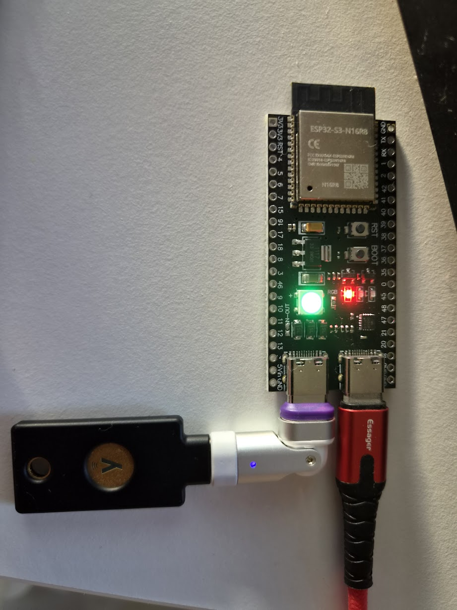
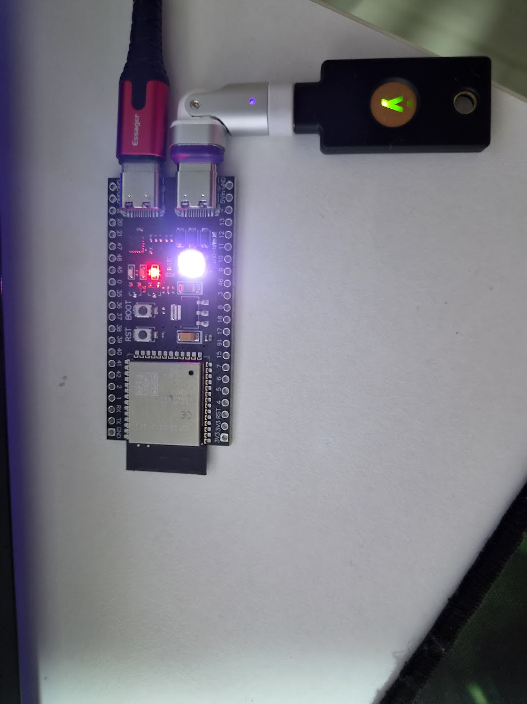
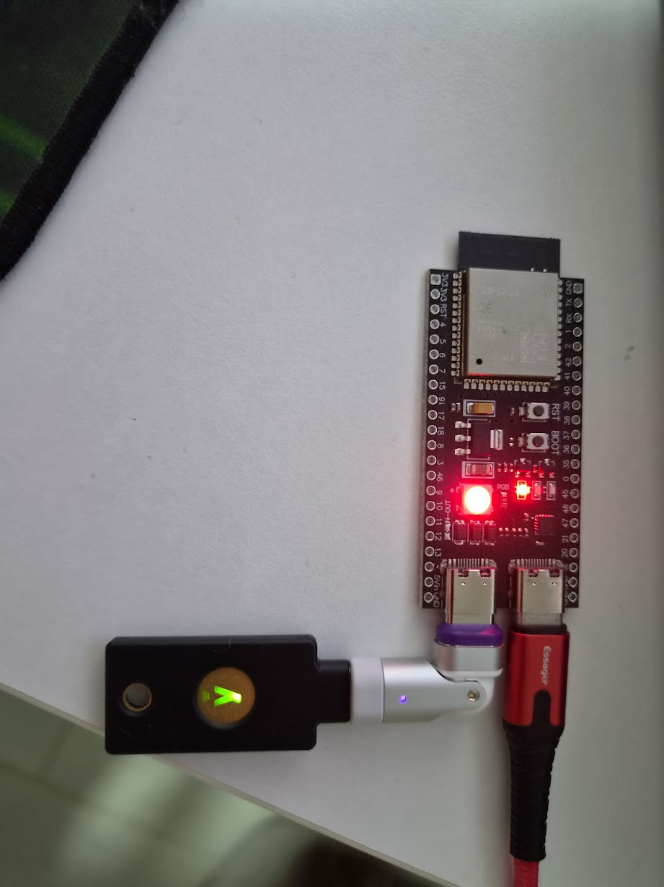

# approver-esp32-yubikey — the user manual

A bare board on the desk with a security key plugged into it. When Claude Code
wants permission to do something, the board's one light turns **white** and the
key's contact starts glowing. You put a finger on the key. That is the approval.



**The board cannot approve anything by itself, and neither can the key.** There is
no signing key anywhere on this board — a flash dump of it yields a Wi-Fi password
and nothing that can sign. The signature is made inside the security key, and it
will not make one until somebody touches it. The key on its own is no use either:
it has never heard of Claude Code, and the key it signs with only exists in
combination with this board. Both halves, or nothing.

That is the difference from the sibling device with a screen, where the second
factor is a fingertip on a piece of glass. Here it is a fingertip on a piece of
hardware that will not be argued with — not by the machine that asked for
permission, not by this board's own firmware, and not by anything on the network.

> This is the manual for **using** the device. Why it is built this way lives in
> the design documents — [`CLAUDE.md`](CLAUDE.md) is their map, and §10.2 there is
> the short version of where this device sits in the protocol. Every console
> command is in [`commands.md`](commands.md); flashing, ports and toolchain are in
> [`working-with-code.md`](working-with-code.md).

## Contents

- [What is on the board](#what-is-on-the-board)
- [Turning it on](#turning-it-on)
- [Approving something](#approving-something)
- [Saying no](#saying-no)
- [Walking away](#walking-away)
- [What the light means](#what-the-light-means)
- [Setting it up the first time](#setting-it-up-the-first-time)
- [Setting it up from a phone](#setting-it-up-from-a-phone)
- [When it will not approve anything](#when-it-will-not-approve-anything)
- [Living with it](#living-with-it)
- [Where the rest of it is](#where-the-rest-of-it-is)

## What is on the board

Four things matter and the rest is header pins.

**Two USB-C sockets, and they are not interchangeable.** This is the single most
important fact about the hardware, and it is silkscreened: the one marked
**USB-OTG** is the chip's own USB and it is a *host* — the security key goes there.
The other is a USB-to-serial bridge: it powers the board, carries the log and the
console, and is what you flash through. In the photograph above, the key is on the
left through a right-angle adapter and the red cable is on the right.

Two things follow, and both have cost somebody time:

* **a key in the wrong socket does nothing at all**, and no light will tell you.
  `key` on the console says `plugged nothing`;
* **the board must be powered through the UART socket** (or the 5 V pin). The OTG
  socket's 5 V comes from the board's own rail, so a board that is not powered has
  nothing to give a key.

**One light**, next to the pin marked 48. It is the entire user interface of this
device: there is no screen, no beeper and nothing else to compare it against. The
other small red lights near it belong to the board rather than to the firmware —
power, and the serial bridge's own activity — and none of them is software
controlled, so they mean nothing about what the device is doing.

**Two buttons**, `RST` and `BOOT`.

* **`RST`** restarts the board. Nothing is lost — the Wi-Fi settings, the
  registration and the key enrolment all live in flash.
* **`BOOT`** is how you say **no** to a request, and — held down while the board
  starts — how you put the settings back to the shipped defaults.

`BOOT` is also the chip's download strap, which is why holding it *through* a reset
does not open the restore window: nothing of ours runs at all in that case. Hold it
after the board is already coming up.

## Turning it on

Plug the cable into the socket marked UART. There is no switch.

The light walks through what it is waiting for, and each colour is a different
thing to fix:

1. **red, solid** — the firmware is starting. Under a second. A board that comes up
   *dark* has a hardware fault; a board that comes up red is running;
2. **yellow, flashing fast** — it wants a network. Storage, Wi-Fi, the internet
   check and the NATS bus are one colour on purpose: there is one thing to do about
   all of them, which is put the device on a network that has the bus on it;
3. **cyan, flashing fast** — no security key has been enrolled. See
   [setting it up](#setting-it-up-the-first-time);
4. **magenta, flashing** — enrolled, but the server does not know this device yet.
   It needs one registration token;
5. **green, breathing** — ready. Nothing to do, and able to do it.

Green is what the first photograph shows.

## Approving something

When a request arrives the light turns **white and flashes fast**, and the security
key's contact lights up because the board has just asked it for a signature.



**Touch the key.** The contact is the metal disc — on a YubiKey, the one with the
Y on it. A brief touch is enough. The light goes blue for a moment while the
signature is put on the bus, then flashes **green** once and settles back to
breathing.

What you approved is *this* request and nothing else: the signature covers the
session, the tool, a hash of its input and the verdict, so it cannot be lifted onto
a different request afterwards. The board never sees the private key.

You have about thirty seconds. Nothing bad happens if you miss it — see
[walking away](#walking-away).

## Saying no

**Tap `BOOT`.** The light turns **red** and the key's contact lights up again,
because a `deny` has to be signed too — this board cannot put its name to one any
more than it can to an approval.



**Then touch the key**, exactly as you would for an approval. The light flashes red
once and the answer goes out.

Two touches for a refusal is more awkward than the button on the device next door,
and it is the honest price of there being no key on this board: the only thing that
can sign anything is in your hand.

**If the light does not turn red, the tap did not register** — tap it again. That is
what the red is for: without it, the next thing anybody does is touch the key, and
the key would sign an *approval*.

## Walking away

**Doing nothing is a valid answer, and it is the safe one.** If you never touch the
key — after a tap on `BOOT` or without one — nothing at all is published. Claude
Code's own request times out and it asks in its own terminal instead, the way it
would if this device were unplugged.

That is deliberate: silence is not a refusal. A refusal is something a person did,
and this device will not invent one. The console counts the two apart — `request`
shows `nothing` for the decisions nobody made, separately from the ones somebody
denied.

The light goes back to green as soon as the device stops asking, not when the
request finally expires. If it is green, nobody is waiting for you.

## What the light means

The ones you will actually meet:

| | |
|---|---|
| **white, fast** | a request is waiting — **touch the key** |
| **red, flashing** | you tapped `BOOT`; touch the key to sign the refusal |
| blue, solid | signing, and it lasts milliseconds |
| green flash / red flash | the answer went out: allowed / denied |
| **green, breathing** | ready, and nothing is waiting |
| cyan, flashing fast | no key enrolled — `key enrol` |
| cyan, flashing slowly | enrolled, and no key in the socket. Plug it in |
| magenta | not registered — `register <token>` |
| yellow, fast | no storage, no Wi-Fi, no internet or no bus |
| red, solid | starting up (brief); red **flashing fast** is a fault |
| white, solid | you are holding `BOOT` and the settings are about to be restored |

**Which colour means what is compiled in and cannot be changed** — not from the
console, not from the settings file, not over the network. On a device whose only
output is one light, an operator who could recolour "denied" could build a device
that lies about what it did. The two brightness levels *are* adjustable.

`led test` on the console walks every colour, naming each one, without disturbing
what the device is actually doing.

## Setting it up the first time

You need the cable, a terminal on the serial port, a security key, and the
registration handler running on the machine that holds the allowlist.

**The key has to be one that supports the `previewSign` extension.** Ask it before
anything else:

```
key info
```

Two lines of that answer decide whether the key can be used here: `previewSign`
must say **yes**, and `pin` must say **not set** — this device has no way to enter a
PIN, so a key that insists on one cannot be used with it.

Then, in this order:

```
wifi join <ssid> <password>     the network that has the bus on it
nats url nats://<host>:4222     where the bus is
config save                     keep both across a reboot
key selftest                    the maths, on this chip. Needs no key plugged in
key enrol                       one touch. This is where the signing key comes from
register <key-id>.<token>        the one-time token the handler printed
```

**Enrolment comes before registration, and the order is not a style preference.**
What gets registered *is* the key the enrolment produced, so enrolling afterwards
makes the registration worthless — the device says `registered STALE` and refuses to
answer until a fresh token is minted. Tokens are one-time, so doing it in the wrong
order costs you a trip back to the handler.

`register` prints the handler's key that it has pinned. **Compare it once, by eye,
with what the handler printed when it started.** After that the device will refuse a
reply signed by anything else.

When it is done, the light breathes green.

## Setting it up from a phone

**Two of those lines can be done without the cable.** The device serves a small
web page — one column, big targets, meant for a phone held in one hand — and the
Wi-Fi network and the bus address can both be set on it.

It is off unless there is a network to serve on, and by default it comes up
**only while the device is being its own access point**: that is the state you are
in when the device cannot reach a network, which is exactly when you need a way in
and have no other.

So, with no cable:

1. wait for the light to go **yellow** and an access point called
   **`approver-yubikey`** to appear. The password is in the shipped settings —
   `approver-yubikey-ap` — and it is worth changing;
2. join it with a phone, and open **`http://192.168.4.1/`**;
3. **Wi-Fi** → pick your network from *See what is on the air*, type the password,
   **Apply and save**;
4. **Bus** → the address of the machine running the bus, **Apply and save**.

The device then joins your network, the light goes green or magenta, and **the page
goes away with the access point** — that is what the default means, and it is not a
fault. To have it on your own network too, type `web on` on the console followed by
`config save`; the address to open is then the one `web` prints.

If you ever lose the network again, the access point comes back on its own: the
device walks its list of remembered networks and raises its own after two full
passes with nothing answering. The page is there again with it.

**Three things the page cannot do**, and they are the point rather than omissions:

| | |
|---|---|
| **it cannot approve anything** | there is no button on it that produces a verdict, and there is no way to add one: the only path to an `allow` is a fingertip on the key. Somebody who reaches this page has reached your settings, not your approvals |
| **it cannot enrol or register** | those are the two steps that need a touch and a one-time token, and they stay on the console |
| **it cannot change what the light says, or how long a request waits for you** | those are settings a page could use to make the device quietly useless — a request that expires instantly, or a light too dim to notice. They are refused by name |

**Put a password on it.** Anyone on the same network can reach the page otherwise,
and the settings it can change include *which bus this device listens to*:

```
web login <user> <password>
config save
```

It is a lock, not encryption — the password crosses the network readable, so it is
protection against whoever finds the address rather than against whoever is
watching the wire.

## When it will not approve anything

Start with the light, then ask the console. `devstatus` prints every readout at
once, in the order in which one being wrong stops the next from working.

| What you see | What it is |
|---|---|
| **yellow, fast** | no network or no bus. `wifi` and `nats` say which. An SSID called `approver-yubikey` appearing is this device's fallback access point — there is nothing on it to talk to, so fix the network from the console |
| **cyan, fast** | nothing enrolled. `key enrol`, with a key in the OTG socket |
| **cyan, slow** | enrolled, and the socket is empty — or the key is in the *other* socket |
| **magenta** | not registered, or registered for a key you have since re-enrolled. `request` says which; the fix for both is a fresh token |
| **white for ages, then nothing** | the key was never touched. Nothing was published, which is the safe outcome |
| **the key's contact never lights** | the board never got as far as asking it. `key` shows whether anything is plugged in. `channel busy` in the log means the key is still holding a transaction from before a reset — **the device now waits that out by itself**, so the light stays white and the key starts asking as soon as the key lets go, up to about half a minute later. Unplugging the key and plugging it back in clears it at once, if you would rather not wait |
| **red, flashing fast** | a fault. `led` names it in words and `status` has the detail |
| **nothing happens at all, light green** | the request went to another responder. Several can share the queue, and each request reaches exactly one of them |

A request this device cannot make sense of is dropped, and it produces no reply
rather than a guess. If in doubt, the terminal you asked from is the authority: if
Claude Code is still waiting, nobody has answered.

## Living with it

**Leave the key plugged in or don't** — the device waits for one to appear while a
request is up, so plugging it in when the light goes white works fine. What it
cannot do is answer without it.

**Take the key with you and the device cannot approve anything.** That is a feature,
and it is the cleanest way to make this desk unable to say yes while you are not at
it.

**A reset costs nothing.** The settings, the registration and the enrolment are all
in flash.

**Re-enrolling costs a token.** `key forget now` and a fresh `key enrol` produce a
*different* signing key, which invalidates the registration by construction.

**The console cannot approve anything**, and neither can anything on the network.
There *is* a web page on this device — the one above, for settings — and neither it
nor any console command produces a verdict; the only route to an `allow` is a
fingertip on the key.

## Where the rest of it is

| | |
|---|---|
| the design, and why | [`CLAUDE.md`](CLAUDE.md) — the map. §10.10 is the list of rules that may not be softened |
| the security key, in detail | [`key.md`](key.md) — what it signs, how the key is derived, and the five checks an answer has to pass |
| the light, in full | [`led.md`](led.md) — all sixteen states and the reasoning |
| the page, in detail | [`web.md`](web.md) — what it serves, what it refuses, and what a password on it does and does not buy |
| every console command | [`commands.md`](commands.md) |
| the hardware | [`hardware.md`](hardware.md) — the board, the two sockets, and what is *not* on it |
| what actually works today | [`status.md`](status.md) — row by row, and the fastest-moving file here |
| building and flashing | [`working-with-code.md`](working-with-code.md) |
