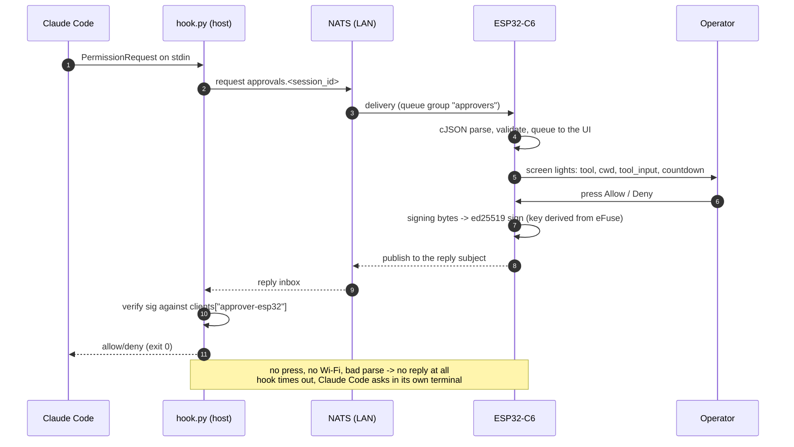

# approver-esp32 — the responder as a device (ESP32-C6 + AMOLED, ESP-IDF)

A fourth responder for the approval flow in
[`../approver/CLAUDE.md`](../approver/CLAUDE.md) §6/§7, alongside
`approver/responder.py` (software key), `approver/responder_yubikey.py` (key on a
YubiKey, the primary one) and [`approver-web/`](../approver-web/CLAUDE.md) (the
page). Same subjects, same `handler-config.json` allowlist, same signing bytes —
`hook.py`, `protocol.py` and `registration_handler.py` must not change for it,
and if they do, the design is wrong.

The difference is only the front end, again: instead of a console prompt or a
browser tab, the operator gets **a small object on the desk**. Most of the time
it is a clock; when Claude Code is working it can show what is left of the rate
limits; when a permission request arrives it lights up, shows the command, and
takes one press. Nothing to keep open, nothing sharing a window with the work
being approved — and nothing that can be answered by the machine being asked
about.

## The documents

These docs are section **10** of the project docs, split by subject because one
file had grown past the point where anybody could find anything in it. The
numbering is **global and stable** — [`../CLAUDE.md`](../CLAUDE.md) §2 has the
repository-wide map, and **a section keeps its number wherever it lives**:
`§10.14.3` is still `§10.14.3` now that it sits in another file. Which is what
makes the split cheap — the 92 source files that carry a `CLAUDE.md §10.8.2` in a
comment did not have to be touched, and are to be read as *§10.8.2 of these
documents*, with the table below saying which one to open. Project-wide rules —
TDD, the dependency allowlist — stay in that root file.

**This file carries what all the others assume, and nothing else**: what the
device is in the protocol (§10.2), the one decision that reaches outside this
folder (§10.3), and the rules that must not be softened (§10.10) — plus the status
summary below, which is the shortest honest answer to "what actually works" and
whose long form is [`status.md`](status.md).

| File | What it owns |
|------|--------------|
| [`hardware.md`](hardware.md) | **§10.1** the board and what the firmware may assume of it — including the two facts that shape boot order and the one the datasheet gets wrong; **§10.13** which parts have a job and which deliberately do not, with the IMU orientation table read off this board; **§10.14.3** the leased I²C bus and the three driver bugs it found |
| [`protocol.md`](protocol.md) | **§10.5** the NATS client and the subset of it this device uses; **§10.6** key custody, as designed and as shipped; **§10.7** registration, and the console it is driven from. The path a verdict travels, and the one place where being wrong is silent |
| [`firmware.md`](firmware.md) | **§10.9** Wi-Fi, the radio and the manager above it; **§10.14** the language, no heap, and the layer that comes first; **§10.15** where the configuration lives and the button that puts it back. What the device does for itself, none of which can approve anything |
| [`screens.md`](screens.md) | **§10.8** all seven screens and the boot splash: the navigation model, the clock, the limits — with §9.10's activity line under them — the request card, the settings list with its status pages and touch test, and the Wi-Fi screen |
| [`web.md`](web.md) | **§10.16** the configuration site served off the device's own filesystem — the pages, the whitelist, the write path, and what it costs |
| [`tests.md`](tests.md) | **§10.11** the three tiers — host, parity vectors, device — what each pins, and every mutation pass over them |
| [`build.md`](build.md) | **§10.4** the dependency set and the argument that got each entry signed off; **§10.12** the build, the ESP-IDF version question, the partition table, the LVGL preview, the panel screenshots, and the size numbers |
| [`commands.md`](commands.md) | every console command the device answers and what each one does. Design documents describe why; that one describes what you can type |
| [`status.md`](status.md) | the row-by-row state of every piece — what runs on the board, what is written and untried, what is still a design. No decisions in it, and the fastest-moving file here |
| [`working-with-code.md`](working-with-code.md) | the mechanics: where ESP-IDF is installed on this machine, how to get a shell in which `idf.py` exists, how to flash, how to talk to the port from a script, and how to photograph the panel |

## Status: a working responder, and every screen it was going to have

**The loop is closed.** A permission request published by `hook.py` reaches this
device on `approvals.*`, appears on the glass with the command whole, and a press
on the case is signed with a key bound to the chip and published into the
request's own reply subject — where `hook.verify_reply` calls it `trusted` and
Claude Code acts on it. Press nothing and nothing is sent, the hook times out, and
the question goes back to its own terminal (§10.10). Both halves are checked on
the board against the real handler and the real hook.

Under it: the whole of the hardware — the leased I²C bus and the chips on it, the
panel and the touch, the codec, the buttons, the settings file on SPIFFS, the
Wi-Fi radio with a manager above it, the clock and its SNTP half — a console on
the USB port with a command per piece of it ([`commands.md`](commands.md) is the
list), the bus, an Ed25519 identity (§10.6) and a registration (§10.7).

Above it, all seven of §10.8's screens, every one of them photographed on the
panel, and an eighth that is one level inside the seventh: the clock, the limits that come up on their own while a session is
spending — with one line under them saying what it is *doing*, off §9.10's `activity`
subject — the request card over both, the settings list — reached by a swipe up or
by holding `KEY` — and, behind it, the three status pages, the touch test with its
calibration, the Wi-Fi screen, and the list of what is on the air that it opens.
Nothing on that list says `soon` any more. It has seven rows now and five of them
fit the panel, so it scrolls: `config save` and `config reload` are on it, which is
what makes a setting picked with a finger survive a reboot without a cable
(§10.8.5).

**And there is a site to open on a phone** (§10.16): the front page with the
device's state and the buttons that go anywhere, the whole `devstatus` dump, a
restart that asks twice, and a 404. Read-only apart from that restart, which is the
only thing on it that changes the device at all.

What is **not** done, and [`status.md`](status.md) is row by row about it. **The Wi-Fi
screen is the reduced one the repository owner asked for rather than the one
§10.8.6 specified**: the mode, one record at a time and a name picked off the
air — read, stepped and chosen, but never typed. The keyboard that section
measures in millimetres does not exist, so a *password* still arrives over the
console, and that section says what is missing and why the two halves separate
where they do. And §10.6's key custody shipped as its *fallback* — the seed is in
unencrypted NVS rather than behind an eFuse, which is a decision with a cost that
section states in a table of its own.

The **row-by-row state of every piece** — what runs on the board, what is written
and untried, what is still a design — is [`status.md`](status.md), kept out of this
file because it is one long table and the fastest-moving thing in this folder.

Read §10.3 before anything else: it is the one part of this that changes
something outside this folder.

## 10. `approver-esp32/` — the firmware

### 10.2 What the device is in the protocol

A responder, indistinguishable from the software one to everything that verifies
it:

| | Value |
|---|---|
| `key_id` | `approver-esp32` (its own — **not** shared with another responder) |
| `key_type` | `ed25519` (§10.6 explains why, and what it costs) |
| Subscribes | `approvals.*`, queue group `approvers` |
| Registers over | `registrations`, §6, on the device (§10.7) |
| `reason` | always `""` — no keyboard, same call `responder_yubikey.py` makes (§8.7) |
| `updated_input` | **never sent** |

That last line is the reason this firmware is small. `updated_input` is the only
field a responder *originates*, and the only one that would force the device to
implement Python's canonical JSON (`sort_keys`, `separators`, `ensure_ascii`) and
hash it identically — the trap that cost `approver-web` a whole section of its
own docs. Without it the device **never hashes anything**: it echoes
`input_sha256` as the string it arrived as, puts `""` in the
`updated_input_sha256` position, and signs. Its entire crypto surface is
Ed25519 sign, Ed25519 verify, base64, and a random nonce.

The signing bytes are §7's, assembled with `\n` and nothing else:

```
str(v) "\n" session_id "\n" nonce "\n" tool_name "\n" input_sha256 "\n"
behavior "\n" "" "\n" str(ts) "\n" ""
```

- **Echo `ts` as an integer, and be careful how.** `str(ts)` must produce exactly
  what Python produced. Parse it into `int64_t` and print with `%lld` — never
  through a `double` and `%f`, and never re-derive it from the device's own
  clock. The same rule for `v`.
- `key_id` is not in the signing bytes; it selects the key **and the scheme** on
  the verifying side (§7). Nothing the device sends can choose an algorithm.

**This is written now, and it is `components/protocol/signing.cpp`** — one file,
`<cstdint>` and nothing else, host-tested against three messages
`approver/protocol.py` generated. Two things about the shape it took that this
section argued for and that were not obvious until there was code:

- **the two always-empty fields are not parameters.** `updated_input_sha256` and
  `reason` can only ever be empty for this device, and a field that can hold one
  value should not be an argument somebody could pass a different one to. They
  are positions between separators, and the tests assert their positions rather
  than their content — which is what catches somebody "tidying" an empty write
  away, and what makes the message end in a separator with nothing after it.
- **`str(ts)` is a digit loop rather than a format string, and it builds the
  number from the negative side.** The obvious version negates a negative and
  divides, which is undefined for `INT64_MIN` — there is no positive counterpart
  of it — and on a device that echoes somebody else's `ts` straight back into a
  signature, "it works for every value we have seen" is not the standard. It is
  also the structural form of this section's "never through a `double`": there is
  no float in the path to reach for.

And one rule the file keeps that this section did not think to ask for: **a
refusal writes nothing at all.** A missing field, a field over its bound, a
behaviour §7 has no word for, a buffer one byte short — each returns zero and
leaves the caller's buffer untouched, because a half-assembled message is the one
thing here that somebody could sign by ignoring a return value. `endpoint.h`
states the same rule about a bad URL, where the stakes are a connection rather
than a verdict.

**One responder at a time.** `approvals.*` with the `approvers` queue group means
each request reaches exactly one subscriber, arbitrarily. A device sitting on the
desk powered on all day *will* quietly take requests away from the YubiKey
responder and the page. That is the intended end state, but during development it
is the first confusing symptom — see §6 "Multiple clients".



### 10.3 The bus stops being a localhost bus

This is the part that reaches outside this folder, and it was decided before a
line of firmware: **the NATS server is shared on the home LAN — reachable from
the Wi-Fi the device is on, and from nowhere on the internet.** No TLS, no
credentials, for now. The rest of this section is what that buys and what it
costs, because the cost does not disappear by being accepted.

[`nats/CLAUDE.md`](../nats/CLAUDE.md) §4 used to say it plainly: the bus is
**unauthenticated, every subject on it is open**, and that was acceptable *only*
because it was bound to localhosлоt — `approvals.*` carries the whole `tool_input`,
which for Bash is the full command and for Write the file contents. That
sentence is now spent: the trust boundary moved from loopback to the router, and
§4 has been rewritten to say so rather than to keep promising loopback.

A device on Wi-Fi cannot honour that sentence. It has to reach `4222` across the
LAN, and `docker-compose.yml` publishes `4222:4222` — i.e. on every interface the
host has, not on loopback. So today the port is *already* open to the LAN and
nothing has needed it yet; this firmware is the first thing that would.

What that means, stated as consequences rather than a warning:

1. **Anyone on the LAN can read every permission request** — every command
   Claude Code asks about, in cleartext, plus `cwd` and the file contents of any
   `Write`. That is not a firmware problem to mitigate; it is a property of the
   bus once it is reachable.
2. **Anyone on the LAN can answer registration requests** and can publish junk
   onto `approvals.*`. The protocol already survives this (§6 replies are signed,
   §7 replies are verified) — which is exactly why it was built that way, and why
   this change is *possible* at all rather than fatal.
3. **A forged decision still cannot be minted**: the hook verifies against the
   allowlist, so the attack surface added is disclosure and denial of service,
   not authorisation.

The three ways out, and which one was taken:

| Option | What it costs |
|--------|---------------|
| **TLS + credentials on the NATS server** (a `tls {}` block, and user/pass or nkey auth) — the honest fix | editing `nats/docker-compose.yml` and a server config file; every existing client gains a URL/credential; the device needs the CA cert in flash and TLS on the socket — which `debsahu/espidf-nats` already speaks (§10.4), so the device side of this is now configuration rather than work |
| Firewall the host port to the device's address only | quick, hides nothing from anyone already on that LAN segment, and pins the device's IP |
| **Open on a trusted network** ← **chosen**: the home Wi-Fi, behind the router, nothing forwarded | free, and the flat is the trust boundary. Indefensible the moment that network is shared with people rather than with a household |

**What "trusted network" has to keep meaning**, or the decision quietly stops
holding — the conditions are listed once, in [`nats/CLAUDE.md`](../nats/CLAUDE.md)
§4, and they are: nothing port-forwarded to the host, `8222`/`8080` bound back to
loopback since no device needs them, and `4222` published on the LAN address
rather than on every interface — a VPN or overlay network joined later otherwise
carries this bus onto it silently.

Two things this does *not* change, and they are the reason it is survivable:
a decision still cannot be forged (§7 verification against the allowlist), and
the device's key still cannot be extracted (§10.6). What the LAN gains is
**reading** every permission request, and the ability to make noise on the
subjects. Both were true of anything on the machine already.

**TLS + auth stays the eventual fix**, and it is now cheap on the device side —
so it becomes a `nats/` change (§3/§4) whenever the network stops being a
household, not a firmware one.

### 10.10 Rules this firmware inherits (do not soften them)

- **No reply is the safe outcome.** No press, an expired card, a failed
  signature, a dropped socket, a panic — all end in silence, the hook times out,
  and Claude Code asks in its own terminal (§7). Never invent a verdict, never
  answer on a timer, and there is no "skip" button because skipping is not
  pressing anything.
- **Never a silent allow.** The only path to `allow` is a human press on a card
  that is on the screen.
- **Untrusted input, always.** Everything off `approvals.*` is attacker-shaped:
  a 4 MB payload, a `tool_name` with no terminator, a `cwd` full of control
  characters, missing fields, duplicate keys. Bound every buffer, validate before
  use, drop with one log line. A responder that reboots on a malformed message is
  a denial of service against the person trying to work.
- **`key_type` is pinned by the allowlist**, not by anything the device sends.
- **A hung UI must not answer stale requests.** If the reply-to's connection is
  gone or the card outlived its TTL, discard it rather than publishing into a
  dead inbox.
- **Failure is visible.** The status line's dot (§9.8) is the model: the operator
  must be able to distinguish "quiet because nothing is being asked" from
  "quiet because I am not connected".

