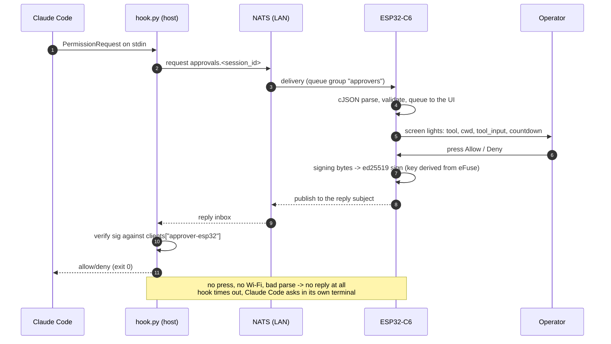

# approver-esp32 — the responder as a device (ESP32-C6 + AMOLED, ESP-IDF)

A fourth responder for the approval flow in
[`../approver/CLAUDE.md`](../approver/CLAUDE.md) §6/§7, alongside
`approver/responder.py` (software key), `approver/responder_yubikey.py` (key on a
YubiKey, the primary one) and [`approver-web/`](../approver-web/CLAUDE.md) (the
page). Same subjects, same `handler-config.json` allowlist, same signing bytes —
`hook.py`, `protocol.py` and `registration_handler.py` must not change for it,
and if they do, the design is wrong.

The difference is only the front end, again: instead of a console prompt or a
browser tab, the operator gets **a small object on the desk**. Most of the time
it is a clock; when Claude Code is working it can show what is left of the rate
limits; when a permission request arrives it lights up, shows the command, and
takes one press. Nothing to keep open, nothing sharing a window with the work
being approved — and nothing that can be answered by the machine being asked
about.

This file owns section **10** of the project docs. The numbering is global — see
[`../CLAUDE.md`](../CLAUDE.md) §2 for the map — and project-wide rules (TDD, the
dependency allowlist) stay in that root file. It has two companions, and
between them they carry what this file deliberately does not:

- [`working-with-code.md`](working-with-code.md) — **mechanics**: where ESP-IDF
  is installed on this machine, how to get a shell in which `idf.py` exists,
  how to flash, and how to talk to the port from a script;
- [`commands.md`](commands.md) — **the console reference**: every command the
  device answers and what each one does. Design documents describe why; that
  one describes what you can type.

## Status: a working responder, with three screens still to build

**The loop is closed.** A permission request published by `hook.py` reaches this
device on `approvals.*`, appears on the glass with the command whole, and a press
on the case is signed with a key bound to the chip and published into the
request's own reply subject — where `hook.verify_reply` calls it `trusted` and
Claude Code acts on it. Press nothing and nothing is sent, the hook times out, and
the question goes back to its own terminal (§10.10). Both halves are checked on
the board against the real handler and the real hook.

Under it: the whole of the hardware — the leased I²C bus and the chips on it, the
panel and the touch, the codec, the buttons, the settings file on SPIFFS, the
Wi-Fi radio with a manager above it, the clock and its SNTP half — a console on
the USB port with a command per piece of it ([`commands.md`](commands.md) is the
list), the bus, an Ed25519 identity (§10.6) and a registration (§10.7).

Above it, six of §10.8's seven screens: the clock, the limits that come up on
their own while a session is spending, the request card over both, the settings
list — reached by a swipe up or by holding `KEY` — and, behind it, the three
status pages and the touch test with its calibration.

What is **not** done, and the table below is row by row about it: the Wi-Fi
screen (§10.8.6), which is the one row on the settings list still drawn faint
with `soon` next to it; and §10.6's key custody shipped as its
*fallback* — the seed is in unencrypted NVS rather than behind an eFuse, which is
a decision with a cost that section states in a table of its own.

| Scope | State |
|-------|-------|
| The design below — the protocol roles (§10.2), key custody (§10.6), registration (§10.7), the screens (§10.8) | **mostly implemented now**, and the rows below say which parts. What is left as design-only is one screen (§10.8.6) and the eFuse half of §10.6 |
| The project skeleton — `CMakeLists.txt`, `main/main.cpp`, `sdkconfig.defaults`, `partitions.csv` (§10.12) | **generated and building** on ESP-IDF v6.0.2; two 2.5 MB OTA slots, ~10.9 MB `storage`, `nvs_keys` reserved |
| The pin map — `components/boards/board.h` (§10.1) | **written**, from Waveshare's own pinout sheet in `docs/`; logged at boot. Every driver below is *handed* its pins from here rather than including this file, which is §10.14.3's rule and what keeps the drivers testable on the host |
| SPIFFS mounted + the console — `components/storage`, `components/cli` (§10.7, §10.15) | **running on hardware**: flashed over COM4, and the console answers on the USB Serial/JTAG port — [`commands.md`](commands.md) is what it knows, and `devstatus` is all of it at once |
| The leased I²C bus — `components/i2cbus` (§10.14.3) | **written, running and under test**: lease, timeout-not-block, per-address device table, bus recovery — the last of which now takes the lease it used to skip. The fake §10.14.3 owed arrived as shadowed headers rather than as a backend interface, and that section says why |
| The buttons — `components/buttons` (§10.1, §10.15) | **running on hardware**: debounced BOOT / KEY / PWR, polled, with a blocking `HeldFor` for §10.15's KEY-at-boot. It is what found that GPIO18 reads `PWR` **inverted**. No consumer yet — the config restore is still unwritten |
| ES8311 codec + speaker — `components/audio` (§10.8.1, §10.13) | **playing on hardware**: the codec configured from its datasheet, an I²S transmit channel, uncompressed WAV streamed off SPIFFS. `poweron.wav` at boot, `alert.wav` on `play`. No microphone, no decoder |
| Settings — `components/config` (§10.15) | **read, written and surviving a reboot**: `config.json` parsed into a fixed struct at boot, `reload` / `save` / `restore` on the console, and the codec's volume is the first setting that round-trips |
| QMI8658C IMU — `components/imu` (§10.13) | **reading on hardware**: 0x6B, six axes, tilt and die temperature through `imu`. A diagnostic and nothing more — §10.13's rule that no gesture approves anything is unchanged |
| PCF85063 RTC — `components/rtc` (§10.8.2) | **running on hardware**: read, written and surviving a reboot; the system clock is adopted from it at boot, **in UTC** |
| SNTP — `components/timesync` (§10.8.2) | **running on hardware**: on this board the radio walked its list, joined at 6.3 s, held an address at 8.4 s and the clock was set from `pool.ntp.org` at **13.1 s** — the boot case and the internet-appears case being the same one, as designed. `date` and `date sync` on the console, the RTC written back each time. `sync_policy.h` includes `<cstdint>` and nothing else, the way the navigator and the Wi-Fi policy do, so the schedule, the flap guard and the backoff run under Unity. What no board has reached is the **six-hour** interval and the backoff — a device has to be up that long to prove them |
| Named time zones — `components/timezone` (§10.8.2) | **running on hardware**: 72 zones compiled in, `Europe/Kyiv` or plain `EET` rather than a POSIX rule, applied at boot from `config.json`. The clock stays UTC; a zone only changes what is printed and how a typed time is read |
| AXP2101 — `components/pmic`, brought up from `board::Init()` (§10.1, §10.13) | **configured and reading on hardware**: TS pin silenced, ADC channels, VBUS limit, rail voltages, charge currents — all cross-checked against the vendor's `pmicpower` component — plus `SetAldo2`/`SetAldo3` for the audio and panel rails. **And the power key, which used to be read and is now written** (§10.1): the press-on threshold, the press-off threshold and the long-press enable are `Config` fields that `Init` puts on the chip when what is there differs, because a driver that returns plausible numbers is not a driver that is configured — and here the failure is a button that no longer switches the board on. The write is masked so that it can never touch the soft power-off bit it shares a register with, which is a test |
| The panel and the touch — `components/display` (§10.1, §10.8) | **lit on hardware**: the CO5300 over QSPI with the vendor's init sequence, its reset driven as a PMIC rail through a callback, the CST9220 read under the I²C lease, and LVGL 9.4 on two 480×40 buffers. `display` on the console. The placeholder it used to carry is gone: what is on the glass now is the clock of §10.8.2, two rows below |
| The navigation state machine — `components/ui` (§10.8.1) | **wired to real input now**: which screen is up, the request card outranking everything, the bounded pending queue — and three ways to move between screens that all end at one function (a swipe through LVGL's own gesture, `KEY` held or tapped, and `screen` on the console). Its header includes `<cstdint>` and nothing else and its `CMakeLists.txt` has an empty `REQUIRES`, which together are what make it testable without a board. **One rule of it changed on the board** (§10.8.5): settings is reachable from the limits screen as well, because that screen arrives on its own and was otherwise a dead end |
| The panel's idle timer — `components/ui/idle_policy.*` (§10.8.1) | **running on hardware, and it replaced two settings that did nothing at all.** `dimSeconds` and `blankSeconds` were parsed, saved, printed and host-tested, and no code ever read them — so the panel never dimmed and never blanked, which on an AMOLED is §10.8.1's burn-in "outcome, not a risk" going unanswered. Three fields under new names now, so a `config.json` already on a device cannot bring a 30-second dim into firmware where it means something else: dim to 30 % after fifteen minutes, off after twenty-five — **and off only with the board standing on its USB edge, buttons up**, because a clock that blanks itself on a desk says nothing at a glance. On the board: dimmed to 20 % at a shortened six-second threshold and back to full on every wake, over and over; still `dimmed` fifteen seconds past a fifteen-second blank threshold while standing on the *card-slot* edge, which is that rule performed rather than argued; and the idle counter climbing straight through two `config set` commands, because typing over USB is not somebody looking at the glass. Everything wakes it — three buttons, a finger anywhere, the board being moved, a request card, a `status` document, a notice, `screen` on the console — and the finger that wakes it out of the blank is swallowed until it lifts, since the operator cannot see what is under it. 25 host tests, 14 of 14 mutations caught |
| The boot splash — `spiffs_image/splash.bin`, `components/display/rawimage` (§10.8) | **running on hardware**: white katakana, on the glass for two seconds before LVGL owns it. Generated on the host by `tools/make-splash.ps1`, streamed off SPIFFS as raw RGB565 with no decoder |
| The language and the layering (§10.14) — C++ except where C is forced, no dynamic memory, library layer before logic, the I²C bus leased | **decided, and what is written follows it**: every component below is C++, none of them contains a `new`, a `malloc`, a `std::vector` or a `std::function`, the tasks and their stacks are static, and nothing outside `components/i2cbus` touches `i2c_master_*`. What is still undemonstrated is the half that has no code: `main/` composing the logic rather than drawing a placeholder |
| The ESP-IDF dependency set (§10.4) — LVGL + `esp_lvgl_port`, the CO5300/CST9220 drivers, libsodium for Ed25519, `debsahu/espidf-nats` for the bus | **signed off** (root §1). The display half is **resolved and building**: LVGL 9.4.0, `esp_lvgl_port` 2.9.0, `esp_lcd_sh8601` 2.0.1, `waveshare/esp_lcd_touch_cst9217` 1.0.4 — two of which are not the names §10.4 guessed, see below. The **NATS client is resolved and running**: `debsahu/espidf-nats` 1.4.0, which drags `espressif/esp_websocket_client` 1.8.0 in behind it — a transitive component root §1 asks about, and the one thing on this list nobody signed off in advance. **libsodium is resolved and has signed on the board**: `espressif/libsodium` 1.0.22~1, no transitive component at all, and a signature that matches `lib/crypto.py` byte for byte — §10.4 has the numbers and §10.6 what the check settled. So the whole of §10.4's list is now resolved, and none of it is paper |
| The bus link — `components/nats` (§10.3, §10.5) | **connected on hardware**: the §10.5 wrapper as a class, the connect policy next to it, and a task that waits for a client link and keeps a socket open. Against the server at `192.168.11.70:4222` it connected, subscribed to `approvals.*` in the queue group `approvers`, took a request-shaped message with its reply-to subject, and published into that subject with the server confirming. `nats` on the console. **Nothing of §7 is on top of it** — no key, no signing, no card |
| The LVGL host preview (§10.12.1) | installed and rendering. It was written down here as the only part of this folder that ran; it is now the part that runs with no board, alongside the host tests |
| Screenshots of the real panel (§10.12.2) | **working**: `screenshot` on the console streams the frame out as base64 — the panel cannot be read back and a frame does not fit in RAM, so it is taken a rendered strip at a time and never assembled — and `tools/screenshot.py` writes the PNG with nothing outside the standard library. Verified by decoding the digits back out of the pixels and matching `clock` |
| Bus reachable from the device at all (§10.3) | **decided**: shared on the home LAN, no TLS, no auth — the router is the trust boundary |
| Firmware: the key and the signing bytes (§10.2, §10.6) — `components/crypto`, `components/protocol` | **written, and the key signs on the board**: the boot self-test passes both halves, the identity is derived and survives a reboot, `keys` is on the console, and a signature this board made verifies under `lib/crypto.py`. §7's signing bytes are assembled and host-tested against Python's own output (14 tests, 7 of 7 mutations caught). **On §10.6's fallback, not its design** — no eFuse key is burned, so the seed is in unencrypted NVS and that section's table has the row that says what it costs |
| Firmware: registration (§6, §10.7) — `components/registration`, `components/protocol` | **done, against the real handler**: `register <token>` on the console runs §6 verbatim — a nonce made after the radio is up, a private inbox, the handler's signature verified **before** a single field of the reply is read, and `registration.json` written only on a verified `ok:true`. On the board: registered, survived a reboot, refused a spent token, and **refused a perfectly valid `ok:true` signed by a handler it is not pinned to** — with the file unchanged every time. 25 host tests |
| Firmware: the loop (§7) — `components/responder`, `components/protocol` | **closed**: `approvals.*` in the queue group `approvers`, parsed, on the glass, and a press signed and published into the request's own reply subject. It subscribes only when it has a key, a registration **and** a connection, so a device that cannot answer never takes a request from a responder that can. On the board: a request built by `hook.build_request` arrived and showed the command whole. 19 host tests over the wire format |
| The screens — clock, limits, request, settings, status, touch, Wi-Fi (§10.8) | **six of seven running**: the clock face (§10.8.2), the limits (§10.8.3), the request card (§10.8.4), and the settings list, the status pages and the touch test of §10.8.5. The Wi-Fi screen is specified and not started, and is the one row on that list still saying `soon` |
| The request card — `components/ui/request_card.*` + `components/screens/request_screen.*` (§10.8.4) | **running on hardware**: §7's fields in a bounded queue of four, the tool and the command as the heaviest thing on the glass, a countdown that is the hook's rather than the device's, `+N waiting`, and a receipt afterwards that distinguishes a verdict from a card nobody answered. **Answered by the buttons** — `BOOT` allows, `PWR` denies and doubles as the way back to the clock — with §10.8.1's queued-touch guard in the shape a press has. Nothing on it is touchable, deliberately. The deciding half is `<cstdint>`-only and host-tested (23 tests, 16 of 16 mutations caught). **And now a bus behind it**: `components/responder` subscribes when it can actually answer, and `request test` is still there for when it cannot |
| The clock face — `components/ui/clock_face.*` + `components/screens` (§10.8.2) | **running on hardware**: 24-hour seven-segment digits filled by a travelling wave, three indicators to the left of them (radio, bus, battery), the date under them, and the whole face drifting ±30/±40 px because the panel is an AMOLED. `--:--` rather than a plausible midnight when no believable time has arrived. `clock` on the console prints what is on the glass and why — which is how the drift and the water are checked without a camera. The deciding half is `<cstdint>`-only and host-tested (35 tests, 16 of 16 mutations caught); the painting half is LVGL and is the only file in the firmware that draws anything. It carries §10.15's one-line notice as well, under the date and for thirty seconds |
| The Wi-Fi driver — `components/wifi` (§10.9) | **running on hardware**: two modes (access point, client), one network at a time, a latched link state, a disconnection reason turned into the three answers a person can act on, and a scan that works in both modes. It has **no opinions** — which network and when is the manager's, and that split is what makes the manager testable |
| The internet check — `components/wifimgr/reachability.*` (§10.9) | **running on hardware**: once a minute, while there is a client link, an ICMP echo to one of a few addresses from `config.json` (8.8.8.8, 1.1.1.1, 9.9.9.9 by default). Three states — `unknown` is the honest one — two failed rounds to say offline and one reply to come back. `wifi ping` and `wifi check` on the console. **It never decides anything**: a link with no internet is reported, never a reason to change networks |
| The Wi-Fi manager — `components/wifimgr` (§10.9) | **running on hardware, and tested on the host**: desired state (off / client / AP) against current, round-robin over the remembered networks with a growing capped backoff, sticky auth failures, and after N fruitless rounds a fallback access point that stays up for two minutes unless somebody attaches to it. `wifi` on the console. `wifi_policy.h` includes `<cstdint>` and nothing else, the way the navigator's does; the radio is lazily brought up, so a device with `wifi.active` false pays nothing for this existing. **It has joined a real network**, walked past one that refuses on the way, and come up on both DHCP and a fixed address — §10.9 has that run, and it is what makes the cycle, the fallback AP and the scan more than a proof against a network that does not exist. What no board has produced yet is a deliberate **auth failure**, which needs a network whose password is wrong on purpose |
| The limits screen (§10.8.3) — `components/ui/limits_view.*`, `components/screens/limits_screen.*`, `components/watcher` | **running on hardware, and every rule of it checked there**: it came up on its own when this repository's own status line published, went back to the clock 73 s after the last document, was dismissed by `PWR`, held that dismissal through ten more documents, dropped it when the stream stopped, and came back on the first document after. A subscription-less payload draws `7d --` with no fill at all, which is §9.7's "absent is absent" on the glass. **It arrives rather than being swiped to**, at the repository owner's request — that section says what changed and why `PWR` dismisses a burst rather than a message. The deciding half is `<cstdint>`-only and host-tested (21 tests, 10 of 11 mutations caught, and the eleventh has an answer) |
| The touch test and the calibration (§10.8.5) — `components/ui/touch_cal.*`, `components/screens/touch_screen.*` | **written, and the on-glass half is not confirmed by hand yet.** A crosshair follows the raw point with both coordinates on screen, `BOOT` runs four crosses, the fit is applied at once and `config save` keeps it. Every refusal has its own sentence and leaves the correction in use alone. **Nothing on that screen is touchable and swipes do not navigate away from it**, because a bad correction would otherwise take away the screen that fixes it — `KEY` on the screen and `touch reset` on the console are the two escape hatches. The deciding half is `<cstdint>`-only and host-tested (22 tests, 16 of 16 mutations caught, one of which found a guard that had made another one unreachable). The panel it corrects is a *capacitive* one, so what this fixes is an offset and, if the film is on the other way round, a mirror — never the axes, which are `board.h`'s |
| The power-off row (§10.8.5, §10.1) | **built, used once, and it led straight to §10.8.5's account of a board that would not come back** — which turned out to be the chip latched into the ROM's download boot rather than anything the row did, and which is cleared by holding `PWR` for six seconds and pressing it again. **Built, and the half that can be checked has been**: the row draws faint with `usb in` while the cable is connected, refuses a press before it arms, and the console's `screen` prints the same fact. Two presses when the cable is out, sharing the reboot row's arming flag — which belongs to the *selected* row, and that is a test. **The shutdown itself is unverified and cannot be from here**, exactly as §10.7 records for the console's `poweroff`: it needs the cable out, and with the cable out there is no console to watch it from |
| The settings list and the status pages (§10.8.5) — `components/ui/settings_menu.*`, `status_pages.h`, `components/screens/settings_screen.*`, `status_screen.*` | **running on hardware, and every input confirmed by hand**: a swipe up or `KEY` held two seconds opens a four-row list — Wi-Fi and the touch test drawn faint with `soon`, status, and reboot — and `BOOT` steps it, `KEY` presses it, a tap does both, `PWR` goes back. Behind it three status pages: power (battery, rails, die temperature, and why the chip is awake), system (why it last restarted, uptime, heap low-water, radio, address, bus) and motion (six axes, the magnitude and the die), turned by `BOOT` or a tap. **Reboot asks twice** and the arming expires on its own. The deciding half is `<cstdint>`-only and host-tested (18 tests, 16 of 16 mutations caught — one of which survived until the test for the *button* route round the list existed). `screen` on the console is what photographs a list otherwise reachable only by a gesture |
| The Wi-Fi screen (§10.8.6) | specified, not started — the manager underneath it is what exists |
| Where the configuration lives (§10.15) | **decided**: all of it in JSON on SPIFFS, nothing of ours in NVS — with the cost stated (SPIFFS cannot be encrypted at rest). `spiffs_image/config.json` + `config.init.json` are flashed, and `components/config` is what reads them |
| The `KEY`-at-boot config restore (§10.15) | **running on hardware, three times over**: `KEY` held through a boot put `config.init.json` back over `config.json` at 5,001 ms — before the parse, which is the whole point — left `registration.json` untouched and the device still registered, and said so in three places: a log line at the time, `config restored` under the clock, and a `boot` line `config` keeps printing for the rest of the uptime. The deciding half is host-tested (9 tests, 5 of 5 mutations caught). **The screen half is where the board earned its keep**: the console said the notice was up and the glass was empty, because the label hung outside its parent and `LV_OBJ_FLAG_OVERFLOW_VISIBLE` does not do what its name suggests — §10.15 has that finding |
| Host-tier tests (§10.11) — `host_test/` | **running**: 555 Unity tests over `ui` (the navigator, the clock face, the request card, the limits, the settings list and the panel's idle timer), `protocol` (§7's signing bytes, its wire format, §6's registration exchange and §9.7's status document), `i2cbus`, `pmic`, `rtc`, `imu`, `audio`, `config`, `buttons`, `timezone`, `speaker`, `wifimgr`, `timesync`, `nats` and the parity vectors, one command, no board. The drivers are compiled **unmodified** against a fake ESP-IDF (`host_test/fakes/`), which is §10.14.3's owed fake backend arriving in a different shape than that section specified, and which now covers I²S and a filesystem as well as the I²C wire. Built by MSVC rather than by ESP-IDF's `linux` target, which does not work on a Windows host — §10.11 records why |
| Protocol parity vectors (§10.11 tier 2) | **done, and it has two halves in two languages**: `tools/make_vectors.py` generates `host_test/vectors/parity_vectors.h` (six §7 decisions, six §6 replies) and `components/crypto/selftest_vector.h` (§10.6's Ed25519 vector) from `approver/protocol.py` and `lib/crypto.py` themselves; both are committed, so the build needs no Python. `test_vectors.cpp` runs the firmware's assemblers over them, and **`tests/test_esp32_vectors.py` is what stops them going stale** — it regenerates on every `pytest` run and fails if the committed files are not what today's Python produces. The three pasted literals this replaced are gone from `test_signing.cpp`, `test_registration.cpp` and `device_key.cpp`. Mutation-checked from both ends: a swapped field in `protocol.py` fails the guard, a dropped separator in `signing.cpp` fails the vectors |
| Device-tier tests (§10.11 tier 3) — `tests/test_esp32_device.py` | **written, and half of it has run against the board**: one press produces a reply `hook.verify_reply` calls trusted, and every tamper is asserted on that reply without a second press — the verdict flipped, each of §7's six echoed fields changed in turn, the `key_id` renamed, the signature removed. `scripts/esp32-approval.cmd` is the one command, and `AI_REMOTE_ESP32_DEVICE=1` is what stops an unattended `pytest` quietly testing the software responder instead. **§10.10's half is confirmed on hardware**: a card nobody pressed produced no reply at all in 20 s and the hook fell back. The pressed half needs a finger and has not been run since it was written |

Read §10.3 before anything else: it is the one part of this that changes
something outside this folder.

## 10. `approver-esp32/` — the firmware

### 10.1 The board — what the firmware may assume

**Waveshare ESP32-C6-Touch-AMOLED-2.16**
([product page](https://www.waveshare.com/esp32-c6-touch-amoled-2.16.htm),
[docs](https://docs.waveshare.com/ESP32-C6-Touch-AMOLED-2.16)):

| Part | What it is | Bus |
|------|------------|-----|
| ESP32-C6 | single RISC-V core @160 MHz, 512 KB HP SRAM + 16 KB LP SRAM, 16 MB flash, Wi-Fi 6 (2.4 GHz) / BLE 5 / 802.15.4 | — |
| CO5300 | 2.16″ AMOLED, 480×480, 16.7 M colours | QSPI |
| CST9220 | capacitive touch | I²C |
| QMI8658 | 6-axis IMU (accel + gyro) | I²C |
| PCF85063 | RTC, backed by the PMIC | I²C |
| AXP2101 | power management + charging (3.7 V Li-ion on MX1.25) | I²C |
| ES8311 + ES7210 | audio codec + echo-cancellation ADC, dual mic | I²C/I²S |
| BOOT / PWR / KEY | three buttons; `KEY` is the free one | GPIO |
| TF slot, USB-C, exposed I²C/UART pads | — | — |

**The GPIO map is not written here on purpose** — a pin number invented from
memory costs a bricked evening, and this document is not where numbers are
checked. It lives in exactly one place, **`components/boards/board.h`**, and
that file names its source: `docs/ESP32-C6-Touch-AMOLED-2.16-details-inter.jpg`,
Waveshare's own pinout sheet, kept in the repository so the numbers can be read
back against what they came from.

Two things it records that are not pins, and that shape boot order rather than
decorate it: **the panel's reset and the amplifier's enable are PMIC rails**
(ALDO3 and ALDO2), so the I²C bus and the AXP2101 driver have to be up before
the display can be brought up at all; and **the TF slot shares the panel's QSPI
wires** (only the chip select is its own), which is a second reason §10.13 gives
that slot no job.

**The `PWR` button is not the firmware's.** It is wired to the AXP2101's PWRON
pin (pressed = 0), and the chip acts on it whether or not any code is running.
Read off this board rather than off a datasheet — `power` prints all three:

| | This board |
|---|---|
| Power **on** | a short press: the threshold is **128 ms**, the shortest of the chip's four (128 ms / 512 ms / 1 s / 2 s, register `0x27` bits 1:0) — **or** plugging USB in, since VBUS insert is a power-on source in its own right, as is inserting a battery |
| Power **off** | a **6 s** long press (register `0x27` bits 3:2, of 4/6/8/10 s) — and it works only because `COMMON_CONFIG` (`0x10`) bit 2 is set. With that bit clear the chip measures the long press and does nothing. On this board it is set |
| Why it is awake | `PWRON_STATUS` (`0x20`), one bit per reason. A freshly cabled board reports `USB plugged in` |

**And the three rows above are written by `Init` now, not merely read.** The
driver used to print what it found in `0x27` and `COMMON_CONFIG` and call that
"how this board is configured"; `pmic::Config` carries them and `Axp2101::Init`
puts them there when what is on the chip differs. It is the same lesson this
section already draws about the TS pin and the charge currents — *a driver that
returns plausible numbers is not a driver that is configured* — and here the cost
of being wrong is the largest on the board: a chip holding a two-second press-on
threshold is a device whose button looks dead to anybody who presses it the way
a button is pressed, and one with `COMMON_CONFIG` bit 2 clear cannot be switched
off by its own button at all.

One rule inside that write, and it is the one worth stating twice: **configuring
the key must never write `COMMON_CONFIG` bit 0.** That bit is the soft power-off
and it shares a register with the long-press enable, so a read-modify-write that
preserved it would take the board down inside `Init` — a device that goes dark
every boot. The write clears it explicitly, `PowerOff` stays the only thing in
the driver that ever sets it, and both halves are tests.

Two consequences. **Power on and off are not features to implement** — they are
behaviour to avoid breaking, and GPIO18 exists so the firmware can *see* the
button, not so it can switch the board. And it is the same fact that makes
§10.7's `poweroff` refuse over USB: VBUS insert powers the chip on, so a soft
shutdown with the cable in is one the hardware immediately undoes.

**And GPIO18 sees it inverted, which the datasheet does not say and a board
does.** `PWR` at the PMIC is pressed = 0; at the ESP's pin it is the other way
round — GPIO18 rests at **0** (driven, not floating: it stays 0 with the
internal pull-up enabled) and goes high while the button is held. `BOOT` and
`KEY` are the ordinary way round, low when pressed. This was found by reading
the pin with the obvious polarity assumed and getting a button that was pressed
for the whole uptime, which is the argument for `buttons` (§10.7) existing at
all: a button driver that is never read back is a set of assumptions.

Where the rest comes from when it is needed — the TE line, backlight, the PMIC
and RTC interrupts, and the driver init sequences the sheet cannot carry:

- **The vendor's own examples**, which are the authority for this board:
  [`waveshareteam/ESP32-C6-Touch-AMOLED-2.16`, `02_Example/ESP-IDF-v5.5.3`](https://github.com/waveshareteam/ESP32-C6-Touch-AMOLED-2.16/tree/main/02_Example/ESP-IDF-v5.5.3).
  Note the folder name: the examples are built against **ESP-IDF v5.5.3**, which
  is the number §10.4 and §10.12 are arguing about.
- **`XPowersLib`, which that same repository vendors** — the register maps for
  the AXP2101 live there (`src/REG/AXP2101Constants.h`,
  `src/XPowersAXP2101.tpp`), and `components/pmic` cites them line by line
  rather than trusting anyone's memory. It is a source to read, not a
  dependency to add: nothing links against it.
- **`02_Example/ESP-IDF-v5.5.3/…/components/pmicpower`** — what the vendor
  actually *configures* on this board, which is a different question from what
  the registers mean. Reading it after the fact found four things missing from
  a driver that already worked: the TS pin left measuring (XPowersLib silences
  it inside `begin()`, and its own comment says the pin "will affect the
  charger"), the charge currents left at power-on defaults rather than this
  battery's 50/500/50 mA, the VBUS limit left below 2 A, and the rails never
  written to 3.3 V. **A driver that returns plausible numbers is not a driver
  that is configured** — the vendor's init sequence is worth diffing against
  even when nothing looks broken.
- The datasheets in `docs/` — CO5300, CST9220's family, AXP2101, PCF85063,
  QMI8658C, ES8311, and the C6 technical reference manual. I²C addresses are
  theirs, not `board.h`'s: they belong with each chip's driver (§10.14.2).

Anything taken from either goes into `board.h` with the source cited next to it,
never into a driver directly.

Two consequences that shape the firmware rather than decorate it:

- **No PSRAM, and no way to add it** — the ESP32-C6 has no external-RAM support
  at all. A full 480×480 framebuffer at 16 bpp is 480·480·2 = **460 800 bytes**
  against 512 KB of SRAM shared with lwIP, Wi-Fi and the TLS stack. So: LVGL
  draws into **partial buffers** (two of, say, 480×40 = 38.4 KB each), the panel
  is fed by DMA per flush, and "just render the whole screen" is not on the
  table. Any vendor demo that claims full double buffering on this chip is doing
  it with partial buffers too.
- **One core.** The UI, the NATS socket and the signature all live on the same
  CPU. Split them: an LVGL task (it owns the display and the touch), a bus task
  (socket, parse, reply), and a queue between them. A signature must never run
  inside an LVGL callback — the frame it stalls is the frame the operator is
  looking at.

### 10.2 What the device is in the protocol

A responder, indistinguishable from the software one to everything that verifies
it:

| | Value |
|---|---|
| `key_id` | `approver-esp32` (its own — **not** shared with another responder) |
| `key_type` | `ed25519` (§10.6 explains why, and what it costs) |
| Subscribes | `approvals.*`, queue group `approvers` |
| Registers over | `registrations`, §6, on the device (§10.7) |
| `reason` | always `""` — no keyboard, same call `responder_yubikey.py` makes (§8.7) |
| `updated_input` | **never sent** |

That last line is the reason this firmware is small. `updated_input` is the only
field a responder *originates*, and the only one that would force the device to
implement Python's canonical JSON (`sort_keys`, `separators`, `ensure_ascii`) and
hash it identically — the trap that cost `approver-web` a whole section of its
own docs. Without it the device **never hashes anything**: it echoes
`input_sha256` as the string it arrived as, puts `""` in the
`updated_input_sha256` position, and signs. Its entire crypto surface is
Ed25519 sign, Ed25519 verify, base64, and a random nonce.

The signing bytes are §7's, assembled with `\n` and nothing else:

```
str(v) "\n" session_id "\n" nonce "\n" tool_name "\n" input_sha256 "\n"
behavior "\n" "" "\n" str(ts) "\n" ""
```

- **Echo `ts` as an integer, and be careful how.** `str(ts)` must produce exactly
  what Python produced. Parse it into `int64_t` and print with `%lld` — never
  through a `double` and `%f`, and never re-derive it from the device's own
  clock. The same rule for `v`.
- `key_id` is not in the signing bytes; it selects the key **and the scheme** on
  the verifying side (§7). Nothing the device sends can choose an algorithm.

**This is written now, and it is `components/protocol/signing.cpp`** — one file,
`<cstdint>` and nothing else, host-tested against three messages
`approver/protocol.py` generated. Two things about the shape it took that this
section argued for and that were not obvious until there was code:

- **the two always-empty fields are not parameters.** `updated_input_sha256` and
  `reason` can only ever be empty for this device, and a field that can hold one
  value should not be an argument somebody could pass a different one to. They
  are positions between separators, and the tests assert their positions rather
  than their content — which is what catches somebody "tidying" an empty write
  away, and what makes the message end in a separator with nothing after it.
- **`str(ts)` is a digit loop rather than a format string, and it builds the
  number from the negative side.** The obvious version negates a negative and
  divides, which is undefined for `INT64_MIN` — there is no positive counterpart
  of it — and on a device that echoes somebody else's `ts` straight back into a
  signature, "it works for every value we have seen" is not the standard. It is
  also the structural form of this section's "never through a `double`": there is
  no float in the path to reach for.

And one rule the file keeps that this section did not think to ask for: **a
refusal writes nothing at all.** A missing field, a field over its bound, a
behaviour §7 has no word for, a buffer one byte short — each returns zero and
leaves the caller's buffer untouched, because a half-assembled message is the one
thing here that somebody could sign by ignoring a return value. `endpoint.h`
states the same rule about a bad URL, where the stakes are a connection rather
than a verdict.

**One responder at a time.** `approvals.*` with the `approvers` queue group means
each request reaches exactly one subscriber, arbitrarily. A device sitting on the
desk powered on all day *will* quietly take requests away from the YubiKey
responder and the page. That is the intended end state, but during development it
is the first confusing symptom — see §6 "Multiple clients".



### 10.3 The bus stops being a localhost bus

This is the part that reaches outside this folder, and it was decided before a
line of firmware: **the NATS server is shared on the home LAN — reachable from
the Wi-Fi the device is on, and from nowhere on the internet.** No TLS, no
credentials, for now. The rest of this section is what that buys and what it
costs, because the cost does not disappear by being accepted.

[`nats/CLAUDE.md`](../nats/CLAUDE.md) §4 used to say it plainly: the bus is
**unauthenticated, every subject on it is open**, and that was acceptable *only*
because it was bound to localhosлоt — `approvals.*` carries the whole `tool_input`,
which for Bash is the full command and for Write the file contents. That
sentence is now spent: the trust boundary moved from loopback to the router, and
§4 has been rewritten to say so rather than to keep promising loopback.

A device on Wi-Fi cannot honour that sentence. It has to reach `4222` across the
LAN, and `docker-compose.yml` publishes `4222:4222` — i.e. on every interface the
host has, not on loopback. So today the port is *already* open to the LAN and
nothing has needed it yet; this firmware is the first thing that would.

What that means, stated as consequences rather than a warning:

1. **Anyone on the LAN can read every permission request** — every command
   Claude Code asks about, in cleartext, plus `cwd` and the file contents of any
   `Write`. That is not a firmware problem to mitigate; it is a property of the
   bus once it is reachable.
2. **Anyone on the LAN can answer registration requests** and can publish junk
   onto `approvals.*`. The protocol already survives this (§6 replies are signed,
   §7 replies are verified) — which is exactly why it was built that way, and why
   this change is *possible* at all rather than fatal.
3. **A forged decision still cannot be minted**: the hook verifies against the
   allowlist, so the attack surface added is disclosure and denial of service,
   not authorisation.

The three ways out, and which one was taken:

| Option | What it costs |
|--------|---------------|
| **TLS + credentials on the NATS server** (a `tls {}` block, and user/pass or nkey auth) — the honest fix | editing `nats/docker-compose.yml` and a server config file; every existing client gains a URL/credential; the device needs the CA cert in flash and TLS on the socket — which `debsahu/espidf-nats` already speaks (§10.4), so the device side of this is now configuration rather than work |
| Firewall the host port to the device's address only | quick, hides nothing from anyone already on that LAN segment, and pins the device's IP |
| **Open on a trusted network** ← **chosen**: the home Wi-Fi, behind the router, nothing forwarded | free, and the flat is the trust boundary. Indefensible the moment that network is shared with people rather than with a household |

**What "trusted network" has to keep meaning**, or the decision quietly stops
holding — the conditions are listed once, in [`nats/CLAUDE.md`](../nats/CLAUDE.md)
§4, and they are: nothing port-forwarded to the host, `8222`/`8080` bound back to
loopback since no device needs them, and `4222` published on the LAN address
rather than on every interface — a VPN or overlay network joined later otherwise
carries this bus onto it silently.

Two things this does *not* change, and they are the reason it is survivable:
a decision still cannot be forged (§7 verification against the allowlist), and
the device's key still cannot be extracted (§10.6). What the LAN gains is
**reading** every permission request, and the ability to make noise on the
subjects. Both were true of anything on the machine already.

**TLS + auth stays the eventual fix**, and it is now cheap on the device side —
so it becomes a `nats/` change (§3/§4) whenever the network stops being a
household, not a firmware one.

### 10.4 Dependencies — the list, and what was signed off

Root §1 requires explicit sign-off for anything outside the approved list.
**The C side has it now**: LVGL + `esp_lvgl_port`, the CO5300/CST9220 drivers,
libsodium for Ed25519, and `debsahu/espidf-nats` for the bus — approved by the
repository owner as argued below, and recorded in root §1. The alternatives stay
in the tables because they are the fallbacks if one of these turns out not to
work, not because the choice is still open.

**ESP-IDF v5.5.x** — the version line Waveshare builds this board's examples
against; other versions are documented as possibly incompatible with the
display/touch drivers. The exact number is the vendor's to state, and it has
moved: the published examples now live in
[`02_Example/ESP-IDF-v5.5.3`](https://github.com/waveshareteam/ESP32-C6-Touch-AMOLED-2.16/tree/main/02_Example/ESP-IDF-v5.5.3),
so **v5.5.3** is what a pin should say, not the v5.5.2 this section carried
before. **What is installed on this machine is v6.0.2** — §10.12 is where that
conflict got settled, and [`working-with-code.md`](working-with-code.md) has the
paths.

**And it was settled against a pin, so the manifest deliberately does not carry
one.** `main/idf_component.yml` says `idf: ">=5.5"` — a floor, not the pin this
paragraph originally asked for — because §10.12 found that the version-sensitive
half builds on v6.0.2 and that nothing left in this project has a claim on
v5.5.3. What v5.5.3 still is: the version the vendor's examples are written
against, and therefore the one to reach for if a display or touch problem ever
looks like a framework problem. What holds the *rest* of the versions is
`dependencies.lock`, committed, and that is where the `uv.lock` comparison
actually lands.

In-tree, arriving with ESP-IDF itself and needing no new supply chain:

| Component | For |
|-----------|-----|
| `esp_wifi`, `lwip` | the network, BSD sockets |
| `mbedtls` | base64 (`mbedtls_base64_*`), and TLS on the socket if §10.3 goes that way |
| `json` (cJSON) — **not in-tree any more**, see below | parsing requests, building replies — and the config files of §10.15 |
| `spiffs` | the `storage` partition: `config.json`, `config.init.json`, `registration.json` (§10.15) |
| `nvs_flash` | **nothing of ours** (§10.15) — initialised because `esp_wifi` needs it for calibration and PHY data |
| `esp_hmac`, `efuse` | the key custody of §10.6 |
| `esp_console`, `esp_vfs_usb_serial_jtag` | the provisioning commands of §10.7 |
| `esp_lcd`, `driver` (I²C/SPI), `esp_timer`, `esp_event` | display transport, buses, the clock |

**cJSON left the framework, and that is the first thing v6.0.2 has actually
cost.** On the v5.5.3 this section pins it is the in-tree `json` component; on
the installed v6.0.2 it does not exist at all, and building against it means
`espressif/cjson` from the registry — which is what `main/idf_component.yml`
now declares (resolved: **1.7.19~2**, locked in the committed
`dependencies.lock`). The library is unchanged and was already signed off; only
its delivery is new. Two consequences worth recording: this is the project's
first managed dependency and therefore the first `dependencies.lock`, and it is
one more entry on the version ledger of §10.12 — on v5.5.3 the line would not
exist.

**And one host-side tool joined, which is not a dependency of anything.**
`ffmpeg` converts the sounds to the uncompressed WAV the firmware plays
(§10.8.1); it runs on this machine, nothing links against it, and the command
is in [`working-with-code.md`](working-with-code.md). The firmware deliberately
has **no decoder** — the argument is in `components/audio/speaker.h`.

New dependencies, all four approved:

| Approved | Why | The alternative it beat |
|----------|-----|-------------------------|
| `lvgl/lvgl` (v9) + `espressif/esp_lvgl_port` | five screens, a scrolling list of scan results and an on-screen keyboard (§10.8) — hand-drawing that against `esp_lcd` primitives is weeks of work to reach something worse | draw directly against `esp_lcd`: defensible for the request card alone, not for the Wi-Fi screen, which is where the keyboard lives |
| CO5300 panel driver + CST9220 touch driver | the two chips on this board; the vendor demo carries both | none — they are the hardware. Prefer an Espressif-registry component over a copied vendor tree; if the vendor's is the only one, vendor it into `components/` with its version recorded |

**Two of those four names do not exist, and what they resolved to is the record
that matters.** The approval stands — these are the same components in intent —
but a table that keeps naming things that cannot be installed is a table nobody
can act on:

| §10.4 said | It is | Why |
|---|---|---|
| "CO5300 panel driver" | **`espressif/esp_lcd_sh8601` 2.0.1~1** | there is no CO5300 component on the registry, and the vendor's own ESP-IDF example drives this board with the SH8601 driver. The two share the QSPI command set, and everything specific to this glass arrives as the init list in `components/display/panel.cpp` — copied from that example, because a panel init sequence is not something to derive from a datasheet and hope |
| "CST9220 touch driver" | **`waveshare/esp_lcd_touch_cst9217` 1.0.4** | the part number in the board's documentation is CST9220 and the driver Waveshare publishes for it is `cst9217`. Not a discrepancy to resolve — the driver prints `Chip Type: 0x9220` when it probes this board, so it knows perfectly well what it is talking to. It brings `espressif/esp_lcd_touch` with it, which is the interface `esp_lvgl_port` also speaks |

And one the vendor took differently, where §10.4's choice was kept: Waveshare's
example is built on **`espressif/esp_lvgl_adapter`**, which drags in `button`,
`knob`, `freetype`, `esp_lv_decoder` and `esp_lv_fs` — five transitive
components for a device with three buttons it polls itself and no fonts to load
at runtime. Root §1 asks about exactly that weight. `esp_lvgl_port` **2.9.0**
depends on nothing but LVGL, covers the same ground, and is what §10.4 approved.

**LVGL is 9.4.0**, which is not 9.5 — §10.12.1's rule that the host preview and
the firmware must be the same minor version is now a live constraint rather
than a note: the simulator ships 9.5. Note where that constraint is actually
held: `main/idf_component.yml` says `^9.3.0`, which a fresh resolve would float
to 9.5 the moment one is published; what pins 9.4.0 today is `dependencies.lock`.
That is the `uv.lock` model and it is the intended one, but it means a
`idf.py update-dependencies` is a decision about the preview as well as about the
firmware.

**Two transitive components arrive that this table has not named**, and root §1
asks about exactly those. Both are on the display side and neither is a question
of weight:

| Transitive | Version | From | What it is |
|---|---|---|---|
| `espressif/esp_lcd_touch` | 1.2.1 | `waveshare/esp_lcd_touch_cst9217` | the common touch interface, named in the row above; this is the version it resolved to, and 1,437 bytes of flash next to the driver's own 2,343 |
| `espressif/cmake_utilities` | 0.5.3 | `espressif/esp_lcd_sh8601` | build-system helpers — CMake functions the panel driver's own `CMakeLists` calls. **No code of it reaches the firmware**: `idf.py size-components` has no line for it, the same way it has none for the WebSocket client, and for a stronger reason — there is nothing in it to link |

The third transitive component is `espressif/esp_websocket_client`, which is a
different kind of answer and has the section below to itself.

**And the whole display half resolved and built on ESP-IDF v6.0.2**, which is
the first real evidence in the v5.5.3-versus-v6.0.2 argument of §10.12 — see
there for what it does and does not settle.
| **an Ed25519 implementation** — `libsodium` (Espressif publishes it as a managed component) | mbedTLS has **no EdDSA**: it cannot sign or verify Ed25519 at all. §6's server key is Ed25519 *by fixed protocol* (`protocol.SERVER_KEY_TYPE`), so verify is not optional | switch the device's own key to `key_type: p256` (mbedTLS ECDSA, already a first-class scheme in §7 — the YubiKey and the browser both use it) — **but the registration reply still needs Ed25519 verify**, so this removes signing from libsodium's job, not libsodium |
| **a NATS client** — `debsahu/espidf-nats` (ESP Component Registry, `^1.4.0`, MIT, header-only C++, ESP-IDF 4.4–6.0) | the §10.5 subset without writing and debugging a socket state machine; and it brings TLS 1.2/1.3 with server-cert validation, mTLS and SNI, which is exactly what §10.3 needs and the one part of a hand-written client that would *not* have been ~300 lines | writing it ourselves, and the two options below |

**libsodium resolved to `espressif/libsodium` 1.0.22~1, and it is the cheapest
entry on this list to have signed off.** It brings **no transitive component at
all** — its manifest names `idf >=4.2` and nothing else — which is worth stating
next to the NATS client below, where the same question got the opposite answer.
Two things it did cost, both measured rather than assumed:

- **It is not in-tree here, which is cJSON's story a second time.** §10.4
  approved it as a managed component, and on the v5.5.x this section pins it is
  *also* an in-tree `libsodium`; on the installed v6.0.2 the in-tree copy is
  gone and the registry one is the only one. Same library, same sign-off, new
  delivery — and one more line on the version ledger of §10.12.
- **134,225 bytes when something references it, and nothing does yet.** With the
  §10.6 call surface linked — `sodium_init`, `crypto_sign_seed_keypair`,
  `crypto_sign_detached`, `crypto_sign_verify_detached` — `idf.py
  size-components` puts `libespressif__libsodium.a` at 134,225 bytes (133,022 of
  flash, 1,203 of DIRAM) and the app at 1,780,864 against the 2.5 MB slot. With
  the probe removed it has no line at all, exactly like the WebSocket client:
  built, never linked, and the app back at 1,646,640. So the number above is
  what §10.6 will spend, banked now rather than discovered then.

The Kconfig that goes with it is `CONFIG_LIBSODIUM_USE_MBEDTLS_SHA`, and §10.6
is where the argument for checking it lives; `sdkconfig.defaults` carries the
answer and what it saves.

**The NATS client is the interesting decision.** For Rust, §9.4 concluded that
reimplementing the protocol to avoid `async-nats` "would be far worse than
depending on it" — because an official client existed. For ESP-IDF there is no
official one, and the choice went to a third-party component anyway:

| Option | Assessment |
|--------|------------|
| **`debsahu/espidf-nats`** ← **chosen** | Header-only C++ on the registry, MIT, `idf.py add-dependency "debsahu/espidf-nats^1.4.0"`. Two hard requirements checked before choosing: `sub_internal` takes a `queue` argument, so the `approvers` group of §6 is expressible, and the message type carries `reply` — the reply-to subject §7 answers into. TLS and exponential-backoff reconnect come with it |
| Write it: ~300 lines over a socket | The subset is genuinely tiny (§10.5) and every failure mode would have been ours to shape. Rejected: the tiny part is the plaintext path, and §10.3's TLS is the part that is not tiny. Stays the fallback if the component becomes a problem — §10.5 remains a complete specification of what to write |
| `daed/nats-client` | The earlier port of `arduino-nats` the chosen one descends from; smaller, less maintained |
| `nats.io`'s official C client (`nats.c`) | Written for POSIX servers; pulls threads and an event loop and assumes desktop-sized memory. Not a realistic target here |

**Resolved: 1.4.0, and it brought something nobody signed off.** The component
is on the registry as described and the two hard requirements checked before
choosing it are true of the code as well as of the docs — `subscribe` takes a
queue group and `nats_msg_t` carries `reply`. What was not visible from the
registry page is its manifest: it requires **`espressif/esp_websocket_client`
unconditionally** (resolved 1.8.0, in `dependencies.lock`), which is exactly
the transitive component root §1 says is a new question for the owner. It is
raised here rather than buried:

- **nothing in this firmware can reach the WebSocket transport.** `nats_bus.h`
  is the whole call surface and it has no way to name a transport, and
  `endpoint.h` refuses `ws://` and `wss://` outright so that a URL cannot ask
  for one either;
- **it costs nothing in flash.** `idf.py size-components` has no line for
  `libespressif__esp_websocket_client.a` at all — the archive is built and
  never linked, because no symbol in it is referenced. The whole `nats`
  component, the header-only client instantiated inside it included, is
  **36,438 bytes** — 25,773 of them flash text and most of the rest the task's
  8 KB stack (§10.5 says what bought that);
- **it is compiled out, and the way that has to be done is a contradiction
  inside the dependency.** Because the component is always present, its
  CMakeLists puts `-DCONFIG_ESP_WEBSOCKET_CLIENT_ENABLE=1` on the command line
  of everything that includes it — but the matching `REQUIRES` never reaches
  ESP-IDF's requirement pass (it is computed from `BUILD_COMPONENTS`, which is
  not populated when that pass runs), so the *include directory* does not
  propagate. A define saying the transport is there and an include path saying
  it is not: the build fails on `#include <esp_websocket_client.h>`.
  `nats_bus.cpp` `#undef`s the macro before including the library, which lets
  the header's own `__has_include` fallback decide correctly. §10.4's "Kconfig-
  off what can be turned off" is that line.

**What the component brings that this device must never use.** JetStream,
KV, object store, NKey/JWT auth, WebSocket transport and message headers are all
in it; the responder uses `connect`, `subscribe` (with a queue group),
`publish`, `flush` and nothing else. The rule is §10.13's, applied to a
dependency: on the board, unused is not the same as absent — Kconfig-off what
can be turned off, keep `CONFIG_ESP_WEBSOCKET_CLIENT_ENABLE` unset, and record
what it costs with `idf.py size-components` (§10.12) rather than assuming it is
free. **It is C++**, which §10.14.1 turns from a problem into a non-issue — the
firmware is C++ as well, so it is included directly; the only wrapper around it
is the §10.5 contract, and that one exists to keep the call surface small, not
to cross a language boundary.

The rest of root §1's rule now applies to these four: each goes in
`main/idf_component.yml` with a version, they are locked in `dependencies.lock`
(committed), and **the exact versions land in these tables when the first build
resolves them** — "LVGL v9" is the approval, `9.3.0` is the record. Anything
beyond this list is a new question for the owner, including a transitive
component one of them drags in.

### 10.5 The NATS client — the subset that is actually needed

The client is `debsahu/espidf-nats` (§10.4), so this section stopped being an
implementation plan and became two things instead: **the contract the wrapper
has to expose** — nothing outside this list is called, and anything the
component cannot do is a blocking finding, not a detail — and **the complete
specification of what to write** if the component ever has to be dropped. The
wire protocol is line-based text; this device speaks four verbs and listens for
three, which is why either way stays small.

Sends:

- `CONNECT {…}` — no credentials, per §10.3; `user`/`pass` or `auth_token` only if that bus ever gains auth. **What actually goes on the wire is the library's, not ours, and it is not what this line used to claim** — see below
- `SUB approvals.* approvers 1` — the queue group is not optional (§6)
- `SUB status 3` — read-only, **no queue group** (§10.8.3): a broadcast current value is meant to reach every subscriber, and joining a group would mean taking it from the other watchers
- `SUB <inbox> 2` — one private inbox for the registration reply, `_INBOX.<32 random hex>`
- `PUB <reply-subject> <n>\r\n<payload>\r\n` — a decision, and the registration request
- `PONG` — in answer to every `PING`

Receives: `INFO {…}` (once, at connect — read it, don't parse it into a model),
`PING`, `MSG <subject> <sid> [reply-to] <n>\r\n<payload>\r\n`, and `-ERR <why>`
(log it and reconnect; a `-ERR` is the server telling you the connection is over).

Everything the request-reply pattern needs is in that `MSG` line: **the
`reply-to` field is the inbox to `PUB` the decision into.** There is no
correlation to invent and no state to keep beyond "which reply subject belongs to
the card on screen".

**The `CONNECT` line above was written from this specification and the wire
disagrees with it**, which is worth the paragraph because the correction is not
only pedantic. `debsahu/espidf-nats` builds the handshake itself and sends
`verbose`, `pedantic`, `lang`, `version`, `protocol`, `headers` and
`no_responders` — and **no `name` field at all**. The server confirms it: this
device shows up in `/connz` as `name: null, lang: "espidf", version: "1.4.0"`.

Two things follow, and the second is the one that costs something:

- `"headers":true` and `"no_responders":true` are advertised on every connect,
  which is the client saying it *can* take those, not this firmware using them.
  §10.4's rule that unused is not absent applies as written: nothing here sends
  or reads a header.
- **the responder is anonymous on the bus.** §10.2 gives it a `key_id` precisely
  so that it can be told apart, and `/connz` is where an operator looks when two
  clients are on one subject and only one of them is answering — so "which of
  these is the device" is a question the bus cannot currently answer, and it will
  matter the first time the YubiKey responder and this device are both up (§6's
  "Multiple clients"). It is not fixable from here: `NATS_CLIENT_LANG` and
  `NATS_CLIENT_VERSION` are unguarded `#define`s in the component's `config.h`
  rather than `#ifndef`-wrapped like its `NATS_CONF_*` knobs, and there is no
  name field in the `CONNECT` builder to fill in. So it is a patch upstream or a
  vendored fork, both of which cost more than the problem does today — recorded
  here rather than fixed, and the fallback is that the IP identifies it.

Behaviour that is not about the protocol but about this repo's rules. With a
third-party client these stop being things to implement and become things to
**verify** — by test, against the component, before trusting it (§10.11's host
tier cannot reach them, so they belong to the device tier):

- **`PUB` is not delivery.** §4: "Published" means sent. On a one-shot exchange
  (registration) wait for the reply before believing anything; on a decision,
  the reply *is* the delivery — but do not tear down the socket the instant
  after writing it. `flush` in the other clients exists for exactly this reason
  (§6, §9.7).
- **Junk on an open subject must not crash anything** — the rule `lib/bus.py`
  and `approver-web` both state. A payload that is not JSON, an object missing
  fields, a `MSG` with no `reply-to`, a length that does not match the bytes
  that follow: drop it, one log line, keep the socket. On a device the stakes
  are higher than a traceback — an unhandled parse is a reboot loop. The
  frame-level half of this is the component's parser now, not ours, which is
  exactly why something has to fire a lying length at it on purpose.

  **Half of that has now been fired at it, and the size half is what found
  something.** Against the real server: an empty payload, a payload that is not
  JSON, one full of control characters (the `ESC` becomes a dot, so a payload
  cannot drive the operator's terminal), 300 bytes against the 240-byte preview,
  and 64 KB — all delivered, socket kept, no reboot, uptime continuous. Then, at
  128 KB, 256 KB, 512 KB and a full 1 MB, every time the same three lines:
  `Failed to allocate read buffer for N bytes`, the library **drops the socket**,
  and `link_policy` reconnects 2 s later and the library restores the
  subscription. Never a panic, and the heap low-water never moved — the
  allocation refuses rather than succeeding and squeezing everything else, which
  is the good half of this.

  The bad half is that a drop is a denial of service by another route: `history`
  counted one drop per oversized message, exactly, so a loop of 1 MB publishes on
  `approvals.*` keeps this responder reconnecting and a real request never
  arrives — §10.10's scenario, reached without a malformed frame and without
  crashing anything. **It is bounded at the server**: `nats/docker-compose.yml`
  runs with `--max_payload=65536`, so the publisher is refused instead of the
  device, and `nats/CLAUDE.md` §3 carries what that costs (a `Write` over 64 KB
  can no longer be approved, and falls back to §7's timeout). Bounding it on the
  device is not possible from here — the library allocates off the `MSG` header
  before any of our code is reached.

  What is still unfired is the frame-level half proper: a length that lies about
  the bytes that follow, a truncated header, a server that stops mid-payload.
  Those need something pretending to be a NATS server rather than a real one, and
  they remain owed.

  And one number worth keeping: the 64 KB message that **succeeded** took the heap
  low-water mark from 89,480 to **23,068** free. That is §10.14.1's "number that
  says whether the device is safe", and 23 KB is what an attacker-chosen payload
  size can currently take it to before the server bound above existed. It is also
  the argument for measuring that section's worst case — a request arriving during
  a Wi-Fi scan with the codec running — before trusting the margin.
- **Bound every read.** A truncated `MSG` header, a server that stops mid-payload
  and a `PING` that never comes must all end in a socket timeout and a
  reconnect, not a blocked task and a watchdog panic.
- **Reconnect with backoff, and say so on screen** (§10.8): the dot in
  `statusline` (§9.8) is the precedent — the operator has to be able to tell "no
  requests are arriving" from "nothing is asking".

#### What is written, and the four decisions inside it

`components/nats`, in the shape §10.9 established next door — a driver with no
opinions, a policy with nothing but opinions, and a task where the two meet:

| File | What it is |
|---|---|
| `endpoint.h/.cpp` | one string from `config.json` into a host and a port. `<cstdint>`/`<cstddef>` only, so it runs under Unity |
| `link_policy.h/.cpp` | **when** to have a connection. `<cstdint>` and nothing else — the fifth file in this firmware to manage that, after `ui/navigator.h`, `wifi_policy.h`, `reachability.h` and `sync_policy.h` |
| `nats_bus.h/.cpp` | **`class nats::Bus`** — this section's list of verbs over `debsahu/espidf-nats`, and the only file that includes it |
| `nats_link.h/.cpp` | the task: reads the address, watches `wifimgr`, keeps a snapshot for the console |

**What the board has actually done**, against the server on the LAN: connected,
subscribed to `approvals.*` in the queue group `approvers`, received a
request-shaped payload with its reply-to subject, published a decision-shaped
one into that subject, and had the server confirm the flush. Both directions of
§7's exchange, with nothing of §7 in them.

Four things are decisions rather than plumbing:

- **The client lives in a static arena, and that is what a `new` would have
  bought.** The library takes its endpoint at construction and offers no way to
  change it, so pointing the device elsewhere means destroying the object and
  building another one. Placement new into `alignas(NATS) uint8_t[sizeof(NATS)]`
  keeps §10.14.1's rule (no heap of ours) and costs one thing worth stating:
  exactly one `Bus` can be open at a time, and a second one asking is refused
  with `ESP_ERR_NO_MEM` rather than served. That singularity is also what makes
  the library's context-free callback usable — the trampoline finds the open
  `Bus` through a file static, which is legitimate only because there is one.
- **Two of the library's own opinions are switched off.** Its reconnect backoff,
  because `link_policy.h` is the half that can be tested and two things
  deciding when to reconnect is one too many; and its offline message buffer,
  because a responder whose decision is delivered when the socket comes back is
  answering a request that timed out minutes ago (§10.10).
- **A network releases it, not an internet.** §10.9's rule is "only `ONLINE`
  releases the bus task", and on this device that means a client link with an
  address: the server is on the LAN (§10.3), so `wifimgr`'s ping verdict about
  8.8.8.8 has no vote, and a router with its uplink down is a perfectly good
  place to approve a command. This is the one place the bus and the clock read
  the same manager and want different answers from it (§10.8.2).
- **Two locks, because one of them can block for five seconds.** `wire_lock`
  guards the client's *lifetime* and is held by anything that publishes through
  it; `state_lock` guards the policy and the snapshot and is never held across
  anything that waits. One lock for both would mean `nats` hanging for the
  length of a connect attempt just to print a status line.

**Three things only the board could have said**, all fixed, and the shape they
share is the §10.9 one: each was invisible on the host and obvious the first
time real hardware met a real server.

- **A 4 KB task stack panicked the moment a server answered** —
  `Guru Meditation Error: Core 0 panic'ed (Stack protection fault)`, in task
  `nats`, immediately after the `INFO`. It is the library's frame:
  `send_connect()` declares two `char[NATS_MAX_CREDENTIAL_LEN * 2 + 1]` buffers
  to escape a username and a password, 4 KB reserved in one function whether or
  not the branch runs, on a device that sends no credentials at all. 8 KB now,
  and `nats` prints the low-water mark so the number is measured rather than
  guessed: **2,852 bytes never used** after a connect, a subscribe and a
  publish — 4 KB was never going to be enough, and 8 KB has a real margin.
- **A restart asked for mid-attempt was remembered forever.** `nats url` typed
  while the task was inside a five-second connect set a flag that only the
  teardown branch clears — and that branch is only reached while something is
  up. The attempt failed, the flag stayed, and the next connection that
  *worked* was dropped on its first tick. A pending restart is now consumed
  from idle as well, where it means "try now" — which is also what an operator
  who has just changed the address wants.
- **The status line printed the address the device was leaving.** The snapshot
  is written by the task, and the task was blocked in that same connect, so a
  `nats` typed straight after `nats url` showed the old server under a config
  line naming the new one. What was *asked for* is read live now; only what is
  *happening* waits for the task to notice. The log line had the mirror-image
  bug — it named the configured address for an attempt against the previous
  one, which is a line that sends somebody hunting the wrong fault.

### 10.6 Key custody — the part worth doing properly

The repository has a pattern by now, and it is not "a private key in a config
file": the YubiKey responder keeps the key in hardware (§8.7), the web responder
keeps it non-extractable in the browser's key store. The device should hold to
that standard, and the ESP32-C6 has the hardware for it.

**The proposal: derive the Ed25519 seed from an eFuse key through the HMAC
peripheral.** ESP32-C6 can hold a key in one of eFuse blocks 4–9 with a *purpose*
that makes it usable **only** by the HMAC peripheral and unreadable by software
([HMAC docs](https://docs.espressif.com/projects/esp-idf/en/stable/esp32c6/api-reference/peripherals/hmac.html)).
So:

```
seed  = esp_hmac_calculate(HMAC_KEY0, "ai-remote-approver-esp32-v1")   // 32 bytes
pair  = crypto_sign_seed_keypair(seed)                                  // ed25519
```

- The private key exists only in RAM, for as long as the firmware runs, and is
  **not in flash at all** — a dumped flash image yields the public key and
  nothing else.
- It is reproducible across reboots, so registration survives a restart with
  nothing secret persisted.
- It is bound to the chip: the same firmware on another board is a different
  responder, which is the correct behaviour (that board is not this key).
- The label in the HMAC message is the domain separator. Change it and you have
  rotated the key deliberately — which then requires re-registration (§6), the
  same felt cost the server-key rotation has.

The fallback, if the eFuse route stalls: generate once and store in **encrypted
NVS** with flash encryption enabled. Strictly worse (the key is in flash,
protected by a key that is also on the chip) but still not a plaintext file, and
honest as a first milestone as long as this doc says which one shipped.

#### Which one shipped: the fallback, and it is not even the encrypted version

**Both routes are written and the fallback is what is running**, at the
repository owner's decision, because burning an eFuse key is a one-way operation
on the only board there is and the eFuse route can be switched to later at no
cost in code. `components/crypto/device_key.h` is where the two live; the
firmware tries the fuse first at every boot and falls back, so **the day a key is
burned the device picks it up with no new firmware.**

What the fallback actually does, and the two places it is worse than the
paragraph above:

- **the seed is 32 random bytes in NVS**, generated once, in the `approver`
  namespace. §10.15 says nothing of ours goes in NVS and this is now its one
  exception, argued there: a seed is not a setting — it must not be restored by
  §10.15's button, must not appear in `cat config.json`, and must not be edited
  by hand.
- **it is not encrypted, because nothing here can be.** NVS encryption needs
  flash encryption, which needs the same one-way eFuse operation this decision
  postponed, so `esptool read_flash` gives up the signing key. That is the honest
  statement of it: this device's private key is currently no better protected than
  its Wi-Fi password, and the property §10.6 was written to buy is the one thing
  not yet bought.

Three decisions inside it that are not obvious:

- **the randomness is real, without waiting for the radio.** §10.7's rule — the
  RNG is only a true source with the RF subsystem up — applies to a *seed* far
  more than to a nonce, and `crypto::Init` runs long before Wi-Fi. So the SAR-ADC
  entropy source is switched on around the one 32-byte read that needs it, which
  is what `bootloader_random_enable` documents for exactly this case. It also
  fixes where in the boot this can run: before anything touches the ADC or the
  radio, which `main.cpp` states where it calls it.
- **a seed that cannot be stored is refused, not used.** A device whose identity
  changed on every boot would register successfully and then be rejected forever
  afterwards — and the operator would be debugging the handler. `kNoSeed` is a
  device that says it cannot sign, which is §10.10's end of the trade.
- **the fuse wins, and it takes the identity with it.** A board running on a
  stored seed that then has a key burned into it is a *different responder* and
  needs a new token (§6). The firmware deletes the stale seed when that happens
  and says so, because the whole cost of the fallback is a private key sitting in
  flash and there is no reason to keep paying it once the fuse works.

| Responder | Where the private key lives | Can the host forge a decision? |
|-----------|------------------------------|-------------------------------|
| `responder.py` | `responder-config.json` on disk | yes, trivially |
| `responder_yubikey.py` | inside the YubiKey | no |
| `approver-web` | non-extractable `CryptoKey` in IndexedDB | no |
| **this**, as designed | RAM only, derived from an eFuse key per boot | no — and there is no file to steal |
| **this**, as shipped | a seed in **unencrypted** NVS, the key derived from it per boot | **yes**, given a flash dump — the row this section exists to eliminate, and the one `espefuse.py burn-key` closes |

That last row is why `keys` prints the source every time it is asked rather than
mentioning it once in a boot log: a key in flash and a key that cannot be read at
all are the same device from the outside.

**A boot self-test, because a miscompiled crypto library is silent.** ESP-IDF's
libsodium has a Kconfig switch for using mbedTLS's SHA-512 underneath, and that
seam has historically produced *valid-looking but wrong* `crypto_sign` output
([esp-idf#1044](https://github.com/espressif/esp-idf/issues/1044)). A wrong
signature here is indistinguishable, from the operator's side, from a working
device: the hook simply rejects every reply and Claude Code keeps asking in its
own terminal. So at boot, sign a **fixed test vector with a fixed test key** and
compare against bytes generated by `lib/crypto.py`; refuse to subscribe if it
does not match, and say so on the screen. Ed25519 is deterministic, which is
what makes this check possible at all.

**That seam has now been fired at, before any of §10.6 was written, and it is
clean — which changes what the self-test is for rather than removing it.** A
throwaway probe in `main.cpp` ran the four calls this section needs against a
vector generated by `lib/crypto.py` (the seed `00 01 … 1f`, and the message
`ai-remote approver-esp32 libsodium self-test v1`), on ESP-IDF v6.0.2 and this
board, **both ways**: with `CONFIG_LIBSODIUM_USE_MBEDTLS_SHA` set and clear, the
derived public key matches, the signature matches byte for byte, and the verify
of Python's own signature succeeds. The historical bug is not present here. So
the switch stays at its default `y` — 10,780 bytes of flash cheaper, and
`libmbedtls.a` is byte-identical either way because mbedTLS is linked for
`esp-tls` regardless — and `sdkconfig.defaults` carries the reasoning where a
menuconfig session will trip over it.

The self-test stays, for the reason it was written down: this measured one
build of one library on one day, and the failure it guards against is a *silent*
one. What it no longer has to be is a first contact with an unknown.

**And the probe found something this section will need, which is the point of
having run it.** The first version panicked — `Guru Meditation Error: Core 0
panic'ed (Stack protection fault)` in task `main`, inside `crypto_sign`. Signing
uses **4,112 bytes of stack** (measured as a high-water mark against a 16 KB
task; 4,128 with the mbedTLS SHA wrapper), and the main task's is 3,584. So the
key derivation and the signature of §10.6 do not run wherever it is convenient:
they need a task sized for them, which is §10.5's lesson about the 4 KB NATS
stack arriving a second time and from a different direction. It is also the
second argument, after §10.8.1's, for the signature never running inside an LVGL
callback.

**And the self-test as written is two checks rather than one**, because the
section above only asked for half of the question. `library` is what §10.6
specifies: a fixed key signs a fixed message and the bytes are compared against
`lib/crypto.py`'s — in both directions, since a library that signs correctly and
verifies nothing would pass a one-way test, plus a signature with one flipped bit
that it has to *reject*. `this key` is the other half, and nothing above asked
for it: the library being right says nothing about the key **this** device
derived, and a keypair whose public and private halves do not correspond signs
perfectly happily and verifies against nothing at all. It signs a labelled
constant with the real key and checks it against the real public key.

Two things about that second check. It prints the message, the signature and the
public key, so the check can be **finished on the host** — pasting them into
`lib/crypto.py`'s verify is what actually proved this board's derived key against
the Python side, and `working-with-code.md` has the line. And it is deliberately
**not a signing oracle**: the message is a constant with no argument, and it
begins with a letter where §7's signing bytes begin with the version digits and a
`\n`, so nothing it prints can be rearranged into a verdict. §10.10's "the only
path to allow is a human press" survives it existing, which is the reason the
console is allowed to have it.

### 10.7 Registration on the device (§6, without a keyboard)

The token is `<key_id>.<b64 32 bytes>` — around 50 characters, minted on the host
by `py approver/registration_handler.py --get-token approver-esp32`. Typing that
on a 2.16″ touchscreen is a bad joke, so registration is driven over **USB**,
through `esp_console` on the USB Serial/JTAG port:

**All four commands this section owes exist now.** `register <token>` runs the
exchange below, `keys` prints the identity and the pinned handler key, `forget`
drops the registration — and `bus <url>` is **`nats url <url>`**, alongside a status readout and the `sub` / `pub` pair that made
the bus visible on the wire, and it grew subcommands for the same reason `wifi`
did. **The ones that exist are listed, with what each
of them does, in [`commands.md`](commands.md)**, and that file is the reference
rather than this one: a list of commands in a design document is a list that
goes stale the first time somebody adds a subcommand and updates the code.

What stays here is why the console is shaped this way. How to *reach* it —
which serial command opens the port, and what it fights with for it — is in
[`working-with-code.md`](working-with-code.md).

**The Wi-Fi half of the owed list exists now, spelled with verbs**: `wifi join
<ssid> [password]` rather than the bare `wifi <ssid> <password>` this section
first sketched, because `wifi` had to grow a status readout and subcommands,
and a bare pair of words that is sometimes an SSID and sometimes a subcommand
is a parser with a trap in it. §10.9 has the rest.

`status` is the answer to "is this the build I think it is, in the slot I think
it is" — the question every other command will be debugged through. `cat` is
how §10.15's files are read back off a device without a reflash, and it was the
first thing to prove the SPIFFS image had actually landed.

**`devstatus` is all of them at once, and it is composed rather than written.**
It calls `status`, `power`, `buttons`, `imu`, `audio`, `display`, `date`, `wifi`
and `nats` in turn instead of printing its own version of each — a second copy of
the `power` readout would drift from the first the day somebody adds a field to
one of them, which is the drift the four-places rule above exists to prevent.

Two things fall out of that. **Every section header is the name of a command**,
so the dump doubles as a map — something odd under `== power`, type `power` to
look at it alone — and keeping that rule true is why `audio` now exists as a
command: it was the one section with nothing behind it, and adding the command
was better than documenting an exception. And the headers are not decoration:
run together the sections share label names (`die temp` is the PMIC's and the
IMU's, `system` is a voltage in one section and a clock in the next), and a
wall of aligned lines with no marks in it is a wall nobody reads twice.

It prints **state, not settings**. `config` is the other half of that pair and
answers what the device was *told* to do; this answers what it is doing.

It is ESP-IDF's `esp_console` REPL, not a hand-written line reader: history,
editing, argument splitting and `help` come with the component §10.4 already
approved. The house firmware of §10.14.4 writes its own — worth knowing when
comparing the two, and not worth copying when the in-tree one is already a
dependency.

#### Two rules for anything this console prints

**Every command and every subcommand goes in the help, in the same change that
adds it** — and in [`commands.md`](commands.md) with it. A command nobody can
find does not exist, and `help` is the only place anybody looks. For this
console that means four things and they are easy to get out of step — three of
them already did, with `wifi ping` and `wifi check` reaching the usage text and
never the registered hint, so a reader who ran `help` concluded the commands
were not there:

- the `.help` string in the `kCommands` table, which is the one line `help`
  prints per command;
- the `.hint` string next to it — the argument summary on the same line. It has
  to stay short enough to read in a column, so it names the **verbs**;
- the command's own `usage` text, which names the **forms**. Print it from one
  function, reached both by an explicit `<command> help` and by anything
  unrecognised: finding out what a command takes should not require typing
  something wrong first, and two copies of a usage block drift;
- **[`commands.md`](commands.md)**, which is the only one of the four with room
  to say what a command is *for* — that `display brightness` prints the live
  value next to the stored one, that `poweroff` refuses over USB, that `wifi
  scan` works with the radio off. A hint has twelve words; this has as many as
  it needs.

**No section numbers in anything the operator sees.** `§10.9` is how this
repository talks to itself; on a console it is a reference to a document the
person reading has probably never opened. Every `printf`, every `ESP_LOG` and
every `.help` string says the thing itself — "the reset is the ALDO3 rail",
not "(§10.1)". In the **code comments** the citations stay exactly as they are:
that is where they earn their keep.

`cat` reads through a **fixed 4 KB buffer** (§10.14.1 — nothing here allocates),
and a file too big for it is refused *with its size* rather than truncated into
something that reads as complete. `ls` lists into a fixed sixteen-entry array
and says "and more" when it fills, for the same reason: a bounded listing that
looks complete is worse than a short one that admits it. That is the rule
§10.15 states for parsing the config, arrived at from the other direction.

`ls` also has nothing to recurse into — **SPIFFS is flat**, so its output is the
whole filesystem rather than one level of it, and it prints two totals rather
than one: the bytes in the files it listed, and the bytes the partition itself
reports used. They never match, and that gap is the filesystem's own overhead
made visible. The percentage is beside them because neither absolute answers "is
this filling up" at a glance against an 11 MB partition. What is in the image
today reads as about six per cent, and nearly all of it is `splash.bin` and the
two sounds rather than anything the device wrote — which is the shape to expect
rather than a number to check: `spiffs_image/` is where that figure moves.

**`imu` prints a magnitude, and that line is the point of the command.** Six
plausible-looking numbers say nothing on their own: a range bit that did not
take, or a burst read that returned one register six times, both produce a
steady, believable table. At rest the acceleration vector must be 1 g, so
`magnitude 0.964 g (1.000 at rest)` is the single line that says the other six
mean something — and it is what caught the two real traps in this chip
(§10.1's inverted addresses, and CTRL1's address auto-increment being **off** by
default). The sign convention is the other thing worth stating once: an
accelerometer at rest reads +1 g along the axis pointing *up*, so the axis
gravity acts along is the negation of the dominant reading. Getting that
backwards is invisible on a desk and exactly wrong the moment the board is
turned over.

**The up-arrow, and why it needs asking for.** `esp_console` already keeps the
last 32 lines and adds every one typed, so history costs nothing — but the line
editor that reaches it is switched off on this port. `linenoiseProbe()` runs
once, while the REPL is being created, and asks the terminal to identify
itself; on USB Serial/JTAG the host opens the port seconds later, so nobody
answers, and dumb mode is latched for the session no matter who attaches
afterwards. **Turning it on at boot instead was tried and is worse than the
problem**: with dumb mode off, linenoise asks for the cursor position before
every prompt and *blocks* reading the reply, so a port driven by something that
does not speak escape sequences — the pyserial snippet in
[`working-with-code.md`](working-with-code.md), for one — goes silent until the
board is reset. Measured on this board, not feared in the abstract. Hence
`term`: the probe re-run when there is somebody there to answer it, bounded at
500 ms, and `term smart` / `term dumb` when the answer is wrong.

**`buttons` prints two answers per button — the debounced state and the raw
pin — because they disagree exactly when something is wrong.** A pin held low
by a fault reads pressed in both, for the whole uptime, which is how a broken
button tells itself apart from an idle one; it is also how §10.1's inverted
`PWR` was found. `buttons watch` is the other half: it blocks the REPL for a
bounded number of seconds (default 10, capped at 120 — a watch that outlives
the operator's attention is a console that looks hung) and prints each edge
with the duration of the press it ended. A run that shows several 30 ms presses
where one finger went down is a debounce window that is too short.

**`poweroff` refuses while USB is connected, and that is a driver rule rather
than a console one** — `Axp2101::PowerOff()` reads the VBUS bits and returns
`ESP_ERR_INVALID_STATE` without writing anything, under the same lease it would
have written through (§10.14.3). VBUS powers this chip back on, so a shutdown
with the cable in is one the hardware undoes: what the operator would see is
not a device switching off but a device rebooting, which on a desk object reads
as a crash. Saying "unplug it first" is the true answer; performing a power-off
that does not happen is not. The console adds a confirmation word (`poweroff
now`) for the same reason §10.8.5 makes its destructive entries two-step.

**`reboot` is next to it and takes no confirmation word, which is the same
argument reaching the opposite answer.** Two-stepping a destructive action is
worth it when the console cannot undo what it did — `poweroff` succeeds by
ending with a finger on a button — and a reboot undoes itself in a few seconds,
so a second word there would be friction on the most ordinary debugging action
there is. What it costs is *said* instead: `config set` writes to memory and
`config save` reaches the filesystem (§10.15), so a reboot is exactly where
unsaved edits go, and the command prints that before it goes.

Two details that are the hardware rather than the code. The line has to be
flushed **and given a moment** before `esp_restart`, because the console is the
C6's own USB Serial/JTAG and the port goes down with the chip — restarting on
the next statement takes the message with it, and what the operator sees is a
console that died rather than one that answered. And nothing is quiesced first
on purpose: a `config.json` write interrupted mid-reboot is the power cut
§10.15 already recovers from at boot, so there is nothing here worth waiting
for that is not already handled.

**The refusal is tested on hardware; the shutdown itself is not, and cannot be
from here** — it needs the cable out, and with the cable out there is no console
to watch it from. That half waits for a battery-powered session.

The exchange itself is §6 verbatim, and the order of operations is the part that
must not be "simplified":

1. Generate a fresh 32-byte `nonce`. **After Wi-Fi is up** — the ESP32's RNG is
   only a true random source with the radio enabled; before that it is a PRNG,
   and a predictable nonce gives up the replay protection the nonce exists for.
2. `PUB registrations` with `{v, token, key_id, pubkey, key_type: "ed25519",
   nonce, ts}` and wait on the private inbox.
3. **Verify the handler's Ed25519 signature over the reply before reading
   `ok`** — `registration_reply_signing_bytes`, context string included; check
   the `nonce` echo; if a `server_key` is already pinned, require it to be
   exactly that one. This is `responder.verify_server_reply` in C, and it is not
   optional: an unsigned `{"ok":false,"error":"expired"}` from anyone on the bus
   would otherwise send the operator hunting a problem that does not exist.
4. Only on a verified `ok:true`: write `key_id` and the pinned `server_key` to
   `registration.json` (§10.15). A rejection changes nothing — the same ordering
   all three existing responders use.

##### What is written, and the four decisions inside it

The split is §10.14.2's, and here it is load-bearing rather than tidy:
`components/protocol` holds the bytes **and the order they are checked in**, with
cJSON and nothing else; `components/registration` holds the socket, the file and
the random number.

| File | What it is |
|---|---|
| `protocol/registration.h/.cpp` | the request JSON, `registration_reply_signing_bytes`, and `ParseRegistrationReply` — every check above, in order. cJSON only, so all of it is host-tested (§10.11) |
| `registration/registrar.h/.cpp` | the exchange: the nonce, the inbox, the wait, and `registration.json` |

**What the board has actually done**, against the real handler on the LAN:
registered, printed a handler key matching the one the handler printed at
startup, written the file, survived a reboot with it, refused the same token a
second time (`the handler refused: token unknown` — a *signed* rejection,
verified against the now-pinned key before it was believed), and refused a
perfectly valid `ok:true` from a second handler with a key of its own. The file
was unchanged after every one of those.

Four things are decisions rather than plumbing:

- **The verifier is an argument, so the ordering is not the caller's
  discipline.** Step 3 above is the whole point of this exchange, and a parse
  function that handed back the fields and left the checking to whoever called it
  would make that rule a convention. So `ParseRegistrationReply` takes the
  signature check as a plain function pointer (§10.14.1 — no `std::function`) and
  calls it at the one place it belongs: there is no way to get a field out
  without it having run and said yes. It takes base64 strings rather than bytes
  because decoding is libsodium's, and that keeps the crypto library out of a
  component §10.11 wants to compile with a bare host compiler — where the test's
  verifier **records the message it was handed**, which turns "these are §6's
  signing bytes" into an assertion.
- **The pin is checked before the signature, not after.** A valid signature by a
  key this device does not already trust is not a bad signature; it is somebody
  taking over the slot, and calling it `kBadSignature` would name the wrong
  problem to whoever is reading the console. It is its own status with its own
  sentence.
- **The nonce is made after the bus is connected**, which is how §10.7's "after
  Wi-Fi is up" becomes something the code enforces rather than something the
  order of statements happens to satisfy: a connection implies a client link
  implies the radio, and the radio is what makes the RNG a true source instead of
  a PRNG. `Register` refuses without one anyway.
- **The argument is checked before the world.** A mistyped token is wrong
  whatever the network is doing and costs nothing to detect, so it is refused
  before the bus is consulted. That is the other way round from how it was first
  written, and the board is what showed it: a token with no dot in it was
  answered with a complaint about the bus.

And two smaller ones. A `ts` beyond 2^53 is **refused** rather than read, because
cJSON parses every number into a `double` and a rounded timestamp reproduces
different signing bytes — a signature that stops verifying with nothing to point
at. And a `registration.json` whose `server_key` is not exactly 44 characters is
treated as no registration at all: a device that came up pinned to a truncated
key would refuse every future registration with "signed by a different key",
which is a sentence that sends somebody hunting an attacker who is not there.

**The atomic write moved to `storage` to make this possible** (§10.15). There are
two files that must not half-happen now, and a second copy of the SPIFFS
remove-then-rename dance would be the copy that drifts — so
`storage::WriteFileAtomically` and `storage::RecoverInterruptedWrite` take a path,
`config.cpp` calls them, and they live in `storage/file_ops.cpp`, which has no
ESP-IDF in it and is therefore the sequence the host tests exercise rather than a
model of one.

**Trust on first use, and the screen is what closes it.** The first registration
has nothing to compare the handler's key against, so show it: the device displays
`handler key <b64>` and the handler prints `server key (ed25519): <b64>` on
stderr at startup. Two strings, compared by eye, once. `approver-web` does the
same thing in its register panel.

`ts` for the request comes from the RTC (PCF85063) or SNTP — and if neither has
been set, from `0`: the handler does not check the request's `ts`, and inventing
a plausible-looking wrong one is worse than an obviously unset one.

### 10.8 The screens

Seven now, and two of them are not navigated to — one arrives with a message and
one arrives with the numbers:

| # | Screen | Reached by | Exists to |
|---|--------|-----------|-----------|
| 10.8.2 | **Clock** — home | the screen it returns to from everywhere | be the thing on the desk for 99 % of its life, and admit in one glyph whether it could answer a request right now |
| 10.8.3 | **Limits** | swipe left/right from the clock | the §9.7 `status` document: which model is answering and how much of the 5h / 7d windows is spent — present only while a Claude Code session is actually publishing |
| 10.8.4 | **Request** | **a message on `approvals.*`** | the one screen the device exists for |
| 10.8.5 | **Settings** | a swipe up, or `KEY` held two seconds — from the clock **and from the limits**, which arrive on their own | a short list of places to go: Wi-Fi, the status pages, the touch test, and reboot |
| 10.8.5 | **Status** | from Settings | three pages of what the board is doing — power, system, motion — for the questions a console answers and a desk object cannot |
| 10.8.5 | **Touch** | from Settings | show where the finger is, and correct it — the one screen that has to work while the thing it tests does not |
| 10.8.6 | **Wi-Fi settings** | from Settings | scan, pick, type a password, forget a network (the machinery is §10.9) |

None of them needs a board to be drawn: §10.12.1 renders LVGL on the host and
returns a picture — with the caveats stated there about what a picture proves.

**And one picture that is not a screen: the boot splash.** White katakana,
Matrix-fashion, on the glass from the moment the panel is up until LVGL takes
it over. It is deliberately *not* an LVGL screen and not in the table above —
it exists in the window before LVGL owns anything, which is also the only
window in which the panel is up and there is nothing to show.

- **The boot sound plays under it, and that is what decides how long it is
  up.** `Speaker::PlayWav` blocks for the length of the file, the picture needs
  no CPU to stay on the glass, so the three seconds the chime costs are three
  seconds of splash rather than three seconds after it. The two used to
  stack — a device that lit up silently and then beeped at a clock — and
  unstacking them made the boot 1.7 s shorter as a side effect. The `2000` in
  `main.cpp` is a floor for a device with no codec, not a duration.
- **It is a file, not code**: `spiffs_image/splash.bin`, generated on the host
  by `tools/make-splash.ps1` and flashed with the SPIFFS image. Raw RGB565 in
  the panel's byte order, no header, no decoder — `components/display/rawimage.h`
  argues it, and the argument is `speaker.h`'s about WAV, applied to pixels.
  460 800 bytes of an 11 MB partition.
- The generator is **Windows PowerShell 5.1** rather than Python, and that is
  the dependency ledger rather than a preference: rasterising a glyph needs a
  font engine, `System.Drawing` is in the box on every Windows machine, and
  every other route meant a new entry on root §1's list.

#### 10.8.1 The model — priority, not a stack

Navigation is a small explicit state machine, not "whatever LVGL screen was
loaded last", because two of the transitions are not the operator's:

- **The request overlay outranks everything.** It appears over any screen —
  mid-scroll, mid-password, mid-anything — and while it is up, navigation is
  gone: no swipe, no gear, no back. There is nothing to reach that is more
  urgent than the card, and a device where a stray swipe can hide a pending
  request is a device that will silently time one out.
- **It is not modal in the other direction either.** The card cannot be
  *dismissed*, only answered or expired. There is no ✕, because a ✕ would be a
  third verdict that §7 does not have.
- What was underneath is restored exactly when the card goes: the settings
  screen keeps its scroll position and any half-typed password. Losing a
  password to an arriving request is how an operator learns to resent the
  device.
- **Everything else is quiet.** No screen may steal focus for a readout: fresh
  limits, a Wi-Fi reconnect and a finished registration all change what a screen
  *shows*, never which screen is up. `approver-web` states the same rule about
  its plaque, for the same reason.

**One LVGL task owns the display.** LVGL is not thread-safe: every widget touch
happens in the UI task, and the bus task hands work across a queue (or takes
`lvgl_port_lock()` and gets out fast). A signature, a socket read and a JSON
parse never run inside an LVGL callback — §10.1 already says why, and this is
where it becomes a code rule rather than an observation.

**Shared across all five:**

- **A link indicator, always visible.** The dot from `statusline` (§9.8) is the
  precedent: the operator must be able to tell "nothing is being asked" from "I
  am not connected". Three states, not two — bus up / bus down / not registered
  — because a connected device with no key is just as unable to answer, and
  looks identical from the outside otherwise.
- **AMOLED: black is free, static is expensive.** An unlit pixel costs no power
  and no lifetime, so these screens are mostly black by design rather than by
  taste. Anything permanent (the clock, the dot) shifts by a few pixels on a
  slow timer, brightness drops on an idle timeout and the panel blanks after
  it — waking on touch, and unconditionally on a request. Burn-in on a device
  showing one layout for months is an outcome, not a risk.

  **Both halves of that sentence are true now, and for a long time neither
  was.** `dimSeconds` and `blankSeconds` were in `config.json`, were parsed into
  `config::Data`, were written back by `config save`, were printed by `config`,
  had three host tests each — and were **read by nothing at all**. The panel
  never dimmed and never blanked. That is the finding §10.15 records about the
  brightness arriving a second time on the two fields next to it, and it is the
  worse instance of it: a brightness that does nothing is a number somebody
  notices, and a dim that does nothing is a promise about the life of the glass.

  So the two are gone, replaced by three under **new names** — `dimAfterSeconds`,
  `dimPercent`, `sleepAfterSeconds` — because a `config.json` already on a device
  would otherwise carry a 30-second dim into firmware where 30 seconds means
  something else. `ui/idle_policy.h` is where the decisions live and
  `screens.cpp` is what tells the panel; the shipped numbers are the repository
  owner's: **dim to 30 % after fifteen minutes, off after twenty-five.**

  Three rules that are not the obvious ones:

  - **dimming is unconditional and the blank is not.** The panel only goes off
    with the board standing on its USB edge, buttons up — one of §10.13's six
    measured positions, and the one nobody reads a clock in. This device's whole
    value is that a glance at the desk says the loop is alive (§10.8.2), and a
    black square says nothing; so lying flat it dims and stops there, however
    long it is left. That was checked on the board rather than reasoned about:
    fifteen seconds past a fifteen-second threshold, standing on the *card-slot*
    edge, and it stayed dimmed.
  - **a `status` document is activity**, which is the operator's own definition —
    "nobody presses anything and no messages arrive". §9.7 publishes on every
    render, so the screen stays lit for as long as a Claude Code session is
    spending and gives up a quarter of an hour after it stops. Visible in the
    log of the run above: the panel came back to full brightness every few
    seconds without anybody touching it, which is this repository's own status
    line arriving.
  - **`config set` is not activity.** It is typed over USB, which is not
    somebody looking at the glass — so a `dim` shortened on a screen that has
    already been idle ten minutes takes effect at once instead of starting the
    wait again. Also confirmed on the board: the idle counter climbed straight
    through two console commands.

  And one hazard that needed its own answer: **the finger that wakes the panel
  from the blank must not also press what is under it.** With the display off
  the operator cannot see what they are touching, and the worst thing under it is
  the reboot row of §10.8.5. `display::SwallowTouch` is a latch in LVGL's own
  read callback — it counts the press, so the device wakes, and reports a release
  to LVGL until the finger lifts. It is armed by the blank and never by the dim,
  because a dimmed screen is one the operator can still read.
- **The queued touch.** A card appears while a finger is already on its way
  down, and on a 480×480 panel Allow may be exactly where the operator was about
  to tap. Ignore presses for the first ~300 ms of any newly presented card, and
  discard any touch whose press began before it appeared. A console prompt and a
  browser tab get this guard for free; a desk object does not.
- **The alert.** There is a codec and a speaker here: one short sound on a new
  request. `approver-web`'s "The new-request alert" applies — never chirp for a
  card that was already there.

  **Written, and it needed a task of its own.** This section originally said "no
  asset" and `screens.h` originally said the chirp was the caller's job; both are
  now the other way round, for one reason: `Speaker::PlayWav` blocks for the
  length of the file, and `alert.wav` is about three and a half seconds. There is
  no task in this firmware that can afford that — the screen task would miss the
  press it exists to see, the bus task would stop reading the socket, and the
  responder task would hold up the signature. That was an argument against playing
  it *on any of those tasks*, not against playing it. So it has 4 KB and a
  semaphore, and the worst a stalled chirp can do is delay the next chirp.

  It lives in `screens::Inject` rather than in whoever raised the card, which is
  the reversal that matters: a card going up is a property of the card, so a
  request off the bus and a `request test` make the same noise and neither caller
  has to remember. The semaphore is **binary**, so four cards arriving together
  are one sound rather than four — which is this section's "never chirp for a card
  that was already there", from the other end.

#### 10.8.2 Clock — the home screen

Big time, small everything else, and it must not lie about the one thing the
device is for. On it: the time, the date, the link indicator, `key_id` when
registered, and a gear.

- **Time comes from SNTP, is kept by the PCF85063, and survives a reboot.** The
  RTC is the source at boot (instant, offline); SNTP corrects it once the network
  is up and writes the corrected value back. A device that has never had either
  shows `--:--`, not `00:00` — a plausible wrong time is worse than an obviously
  unset one, the same call §10.7 makes about `ts`.

  **Both halves exist now.** `components/rtc` and `board::Init()` adopt the RTC
  into the system clock at boot; the console reads and writes it with `date`
  (§10.7); the zones below are there and the RTC holds UTC rather than whatever
  was typed. And `components/timesync` is the network half — the split below
  says how it is shaped and what it refuses to do.

  The chip makes the `--:--` rule cheap rather than a convention to remember:
  the **OS flag** in its seconds register says the oscillator stopped or never
  started, and `Pcf85063::Read` reports that as `valid = false` instead of
  handing back a number. A read that succeeds and a time that can be trusted
  are separate answers. Two details that follow from the datasheet and are
  worth not rediscovering: the seven counters are read and written in **one**
  burst (a read freezes them, so a burst cannot catch a carry — two accesses
  can, and would mix minutes from one moment with hours from the next), and a
  write stops the clock around itself for the same reason. Writing seconds is
  also what clears OS, so a successful `date set` is what makes the clock
  trustworthy again.
- **This is where the repo finally has to know about timezones.** §9.1 avoided
  them by printing countdowns; a clock cannot.

  **The clock is UTC, and a zone is presentation.** The RTC holds UTC, `time_t`
  is UTC, and every conversion happens at the edge where a time is shown or
  typed. That invariant is what makes changing zones free: nothing stored
  moves, so `config set tz Asia/Tokyo` changes one line of `date` and no data
  at all. It is also what `board::AdoptClock` had wrong at first — it read the
  RTC with `mktime`, which treats the counters as *local*, and was therefore
  correct only while the zone was UTC. It uses `timegm` now.

  **Named zones, from a table compiled into the firmware.** libc understands
  POSIX `TZ` strings and nothing else, and ESP-IDF ships no IANA database (v6
  checked, not assumed) — so `components/timezone` maps `Europe/Kyiv` to
  `EET-2EEST,M3.5.0/3,M10.5.0/4`. The EU's three zone families are in there
  under their own names as well (`WET`, `CET`, `EET`), because "I am on Eastern
  European Time" is how some operators know where they are; they sit first in
  the table, which is also what makes the reverse lookup name a shared rule
  after its family instead of after whichever city was listed first. And
  `config.json` keeps **both**: `time.zone`
  is what a person reads, `time.posix` is what libc is given. That pair is the
  house firmware's shape (§10.14.4, its `TimeUtil`), and it is what lets a zone
  whose transitions moved be corrected on the device — write `posix` — without
  waiting for a firmware whose table knows the new dates. A raw POSIX rule is
  accepted anywhere a name is, and is stored as `Custom`; what is refused is a
  string that is neither, because libc reads a misspelled zone as UTC and says
  nothing.

  **That last promise was not being kept, and the host tests are what
  noticed.** `LooksLikePosix` rejected any string containing a `/`, on the
  reasoning that a zone name has one and a rule does not — which is wrong
  about most of this table, because a transition *time* is written `M3.5.0/3`.
  So `EET-2EEST,M3.5.0/3,M10.5.0/4` was refused as "not a POSIX rule", and the
  escape hatch above did not exist for exactly the zones most likely to need
  it. The test that found it asked the question nobody had: do the table's own
  rules pass the check the console gates on? The real distinction is where the
  slash sits — in a rule every one of them follows a digit, in a name they
  separate letters.

  Two costs, stated rather than discovered later: the table is **curated**, so
  a missing zone means typing a rule; and transition rules **change**, so a
  country that moves its dates needs the table edited and the firmware
  reflashed. Neither is fixable without shipping tzdata, which is hundreds of
  kilobytes for a device with one clock face. Not a lookup by IP either.

  The console side: `date` prints RTC and system in UTC and the same instant
  local; `date set <date> <time>` reads **local** time (what is on the wall)
  and stores UTC; `date set utc …` is the escape hatch for when the zone is
  wrong and the clock still has to be right; `config zones [filter]` lists what
  the table knows.
- **A clock that cannot approve says so on the clock.** Unregistered, or the
  boot self-test (§10.6) failed, or no bus — it is on this screen, in words, not
  buried in settings. The device's whole value is that a glance at the desk tells
  you the loop is alive.

##### SNTP — when the clock asks, and when it does not

The RTC is right across a power cut and cannot be *accurate*: it is a watch
crystal, it drifts, and nothing on this board can say by how much. So when
there is a network the device asks a server, sets the system clock and writes
the answer back to the chip — which is what makes the *next* boot start from a
good number rather than from a drifted one.

**Three moments, and they are one rule.** At boot, whenever the internet comes
back, and every `time.syncHours` after that. There is no separate boot case in
the code because there does not need to be: a device that has never synced is
*due*, and "due plus an internet" is the whole trigger. `components/timesync`
is the same split as §10.9's — `sync_policy.h` includes `<cstdint>` and nothing
else and holds every decision (host-tested, §10.11); `timesync.cpp` resolves a
name and waits on a packet, and has none.

- **It reads `wifimgr` rather than asking the network itself** — the seam
  §10.9 said this would hang off. What it needs is narrower than that section's
  three states, though, and the mapping is the interesting part: a client link
  with an address and an internet state that is **not `kOffline`** is enough to
  try. `kUnknown` counts as yes, deliberately — the check being switched off is
  not a statement that there is no internet, and an operator who turned the
  ping off would otherwise have quietly lost the clock as well. An SNTP
  exchange is its own reachability test.
- **A link that flaps is not four reasons to sync.** Coming back after a week
  off the air is; coming back four times in a minute is not, and the guard is a
  minimum gap between *successful* syncs (five minutes) rather than a debounce
  on the link. Inside it, a reconnection changes nothing at all — not even the
  schedule.
- **A failure retries far sooner than the interval, growing and capped** — six
  hours is the gap between good answers, not a penalty for a server that was
  busy. A minute, doubling, to fifteen. Without the cap a device with no route
  to any NTP server would ask sixty times an hour forever; without the growth
  it would do the same at a constant rate.
- **The exchange is bounded** (§10.5's rule about somebody else's wait): fifteen
  seconds for a DNS lookup and an answer, and the client is deinitialised on
  every path — it keeps a socket and a semaphore, and refuses a second `init`
  over a live one, so leaking it once would mean never syncing again.
- **An answer outside 2024..2099 is refused and counted as a failure.**
  §10.8.2's rule about an obviously unset clock beating a plausible wrong one,
  applied to an answer rather than to a chip — and 2099 is the RTC's own limit,
  since it stores two digits and no century.
- **No server named is off, and so is `syncHours: 0`.** Two spellings of "there
  is nothing to ask", not two switches that can disagree — and the compiled-in
  default for the server is **empty**, alone among the string fields, because
  it names somebody else's machine. A device syncing against a host the
  operator never wrote down is the mistake `internet.targets` already refuses;
  a device retrying a server that is not there is an error line every interval
  for the life of the board. The shipped `config.init.json` names
  `pool.ntp.org`, so a device that can read its filesystem does sync.
- **Nothing about this is persisted, and that is a decision.** "When did it
  last sync" lives in RAM: writing a timestamp to `config.json` every six hours
  would be flash wear for a fact the next boot re-establishes in seconds
  anyway, since a fresh device is due the moment it has an internet. What
  *does* survive a reboot is the corrected time itself, in the RTC — which is
  the point of writing it there.
- **`date` says where the time came from**, which a clock face cannot: the
  server, when it last worked, how far it moved the clock, and when the next
  one is due. `date sync` asks now and waits for the answer.

  Two details of that readout, both of which started out wrong. The last sync
  is printed **whether or not syncing is still on** — it is a fact about the
  time on screen rather than about the schedule, and switching the schedule off
  is exactly when it becomes the only thing that says where that time came
  from. And it is printed **in the configured zone**, like the `local` line
  above it: the device keeps UTC and a zone is presentation, and "when did it
  last sync" is a question people ask in wall-clock time.

**And the step is the number worth having, which is why getting it wrong
mattered.** A device corrected by several seconds every time has an RTC to be
suspicious of, and nothing else on this board would ever say so. The first
version computed it as `after - before` around the exchange — and `time()` runs
normally during the seconds spent resolving a name and waiting for a packet, so
it reported the correction *plus the duration*. The board said so immediately:
**`+5 s` twenty-six seconds after a sync that had already set the clock**,
which is a drift rate no crystal has. `esp_timer_get_time()` is monotonic and
no `settimeofday` touches it, so subtracting the elapsed time leaves the
correction alone; the same two syncs then read `+0 s`. Rounded rather than
truncated, or a 4.6-second exchange counted as 4 leaves 0.6 s of itself in the
answer — which is how a device with a perfect clock came to report `+1 s`.

  A **boot** sync showing `+1` or `+2` is expected and not drift: the RTC holds
  whole seconds, so adopting it at boot loses the fraction and always lands
  *behind* the true time. Systematically positive, and about a second of it is
  arithmetic rather than the crystal.

##### What is written, and the five decisions inside it

The split is §10.9's again, and this is the third component pair to take it —
which is what makes the first screen in this firmware mostly a host-tested file:

| File | What it is |
|---|---|
| `components/ui/clock_face.h/.cpp` | **`ui::ClockFace`** — every decision on this screen, and `<cstdint>` and nothing else. The sixth subject in this firmware to manage that, after the navigator, the Wi-Fi policy, the internet check, the sync schedule and the bus link |
| `components/screens/clock_screen.h/.cpp` | the pixels: two custom-drawn objects, two labels, and a palette. No decisions |
| `components/screens/screens.h/.cpp` | the task that reads the world at 10 Hz, runs the face, and applies the answer under a bounded LVGL lock. The counterpart of `wifimgr::Init` and `nats::Init`, and where the other four screens will join |

**What the board has actually done**: come up with the panel at the brightness
`config.json` asked for, shown `14:12` in green seven-segment digits with the
water flowing through them, moved from `-21,-33` to `-18,-30` over three and a
half seconds, reported the radio off as hollow bars, the bus as red — there is a
`nats.url` and no network — and a full battery on a cable, in 1,128 bytes of a
4 KB stack with **no** frame given up waiting for the display, and a heap that
drifted 150 bytes in half a minute.

Five things are decisions rather than plumbing:

- **The digits are drawn as seven segments, not typed.** LVGL's built-in fonts
  stop at Montserrat 48 and a clock on a 480×480 panel wants three times that;
  the alternatives were generating a font — tens of kilobytes of flash and
  `lv_font_conv`, a new host-side tool under root §1 — or shapes. Shapes won on
  the dependency ledger and then paid a second time: §10.8.2's `--:--` is not a
  missing glyph in this scheme, it is the middle segment on its own, and an
  **unlit segment is not drawn at all** rather than shown as a ghost, because a
  ghost is a permanently lit pixel on a panel that charges for those.
- **The water is two interfering waves, and the interesting part is that it has
  a floor.** One travelling wave is a wipe; two at different wavelengths going
  opposite ways is water. The ramp it drives never reaches either end of the
  scale — the top because a pure `0x00FF00` is what wears an AMOLED subpixel out
  and is harsher to look at across a dark room, and the bottom because a trough
  at zero breaks the digits into floating bands the eye reads as a fault. The
  first version had no floor and looked exactly like that.
- **The drift is a walk the model owns, not a modulo of the clock.** `now_ms %
  period` would be one line shorter and would jump by most of the box once every
  ~49 days when the millisecond counter wrapped, on a device whose whole job is
  to sit on a desk being looked at. So the cycle is accumulated from elapsed
  time, every period divides it exactly — `static_assert`ed — and the two axes
  are at 3:5 so the path is a lattice of diagonals rather than a line it
  retraces. The cost is stated: it **repeats** every sixteen minutes, which is
  the trade taken for having no discontinuity at all.
- **Each indicator has a state that is not a fault, and that is the whole design
  of the three of them.** No `nats.url` is a hollow ring rather than a red one;
  no battery is a shell with a bolt in it and the word `USB` rather than an empty
  gauge; a radio switched off is hollow bars rather than a warning. §10.9 made
  the same call about `unknown` being the honest answer, and a screen that spells
  "nothing was asked of me" the same way as "I am broken" is a screen nobody
  reads twice. The bus dot's green-with-a-hole — something arrived inside two
  minutes — uses §10.8.3's staleness threshold rather than a new one.
- **The load is split so that the water costs what the water costs.** The digits
  are one draw target and the indicators are another, so a shimmer at 10 Hz
  repaints 318×146 and not the battery; the PMIC is read once every two seconds
  and **from the task, never from an LVGL callback** (§10.8.1), with a failed
  lease leaving the last reading standing rather than blinking the icon out; and
  the whole face is one object, so the drift is one `lv_obj_set_pos` and nothing
  below it knows the panel is an AMOLED.

What is **not** here, and is not an omission: the navigator (`ui/navigator.h`) is
not wired to anything, because four of the five screens it can name do not exist
and a swipe that reaches a blank screen is worse than a swipe that does nothing.
`key_id` and the gear of §10.8.2's list are the same story — there is no
registration to name and nothing to open.

#### 10.8.3 Limits — the `status` document, when there is one

A port of `approver-web`'s "model and limits plaque" onto the panel: the model
name, `effort.level`, the `5h` and `7d` gauges with countdowns, `ctx`, and the
`cwd` the session is in.

**It arrives rather than being navigated to**, which is the one rule below that
did not survive contact with the repository owner, and the change is the whole
character of the screen. The table above still lists it under "swipe left/right
from the clock" and the navigator still honours that; nothing depends on it. What
actually happens:

| | |
|---|---|
| a `status` document lands | the screen comes up — unless a request card is up, which outranks it (§10.8.1), or the operator is in settings, which arriving numbers must not take them out of |
| a minute with no document | back to the clock |
| `PWR` | back to the clock now |

Why it is better than the swipe on this device: §9.7 publishes on **every render**
of the status line, so documents arrive every few seconds while Claude Code is
working and stop dead when it is idle. The minute is what turns that into "the
screen follows the work" — a desk object that shows what the session is spending
while there is a session, and a clock the rest of the time. On a device where
three of five screens do not exist, it is also the only way anybody was going to
reach this one.

**And one place the instruction could not be taken literally.** "Back on `PWR`
until the next document" would be undone within seconds, because the next document
is seconds away. So a dismissal lasts until the stream goes **quiet**: the screen
stays away until the minute expires and something arrives after that. `PWR`
therefore means "not for this burst", which is the only reading in which the
button does anything at all. `ui/limits_view.h` carries that argument next to the
code.

- **It is a second subscription on the connection that is already open, it is
  never answered, and the request path must not read it.** Same test
  `approver-web` states: deleting this screen must leave a working responder. No
  queue group (§10.5) — a broadcast current value is meant to reach everyone.
- **"Connected" means a document arrived recently, and nothing more.** §9.7
  publishes a current value with no stream: an idle session simply stops
  publishing and there is nothing to catch up on. So the screen shows the
  document's **age**, marks it `stale` past ~2 minutes (`approver-web`'s
  threshold — keep them equal) instead of dropping the numbers, and says "no
  session" only when it has never had one or the last is long dead. A stale
  percentage is still the best available answer as long as it does not claim to
  be current.
- **The traffic light is §9.2's, not a new one.** A rate-limit window is green to
  50 % spent and yellow to 80 %; the context window green to 20 % and yellow to
  45 %. Three implementations of these two scales now exist (`render.rs`,
  `statusline.ts`, this) — each pins them in a test, and they must not drift into
  each other.
- **The countdown depends on whose clock is trustworthy.** The document carries
  both `resets_at` and the publisher's own resolution (`resets_in`,
  `resets_in_text`) precisely for a subscriber that cannot trust its clock. So:
  before SNTP has synced, display the published text and age it by the time since
  arrival; after, recompute from `resets_at` like the plaque does. `countdown()`
  is a port of `render.rs::countdown` and is tested against the same cases —
  `1h59m`, `<1m`, `now`.
- **One subject, every session.** Every Claude Code session on the machine
  publishes to `status`, so this is whichever rendered last, not necessarily the
  session whose request is on the card. Hence the `cwd` line — without it the
  screen reads as belonging to the request.
- Junk is dropped and the last good document stays: a payload that is not JSON,
  or is missing `ts`/`line`, or carries a percentage that is not a number → one
  log line, previous document kept. Percentages are clamped 0–100 a second time
  here, because a bar drawn from someone else's `130` overflows its track.

##### What is written, and the four decisions inside it

The split is the same one for the fourth time, and by now it is the shape of this
firmware rather than a choice made per screen:

| File | What it is |
|---|---|
| `protocol/status.h/.cpp` | §9.7's document into fields. cJSON only, host-tested |
| `ui/limits_view.h/.cpp` | **`ui::LimitsView`** — the two scales, the countdown, when the screen comes and goes. `<cstdint>` and the navigator, so all of it is host-tested |
| `screens/limits_screen.h/.cpp` | three bars, a model and an age. No decisions |
| `components/watcher` | the subscription. A component of its own, and the next paragraph is why |

**What the board has actually done**, and it is the whole of this screen's
behaviour rather than a sample of it: come up on its own when this repository's
own status line published, shown `Opus 5 (1M context) · high` over three gauges —
61 % and 76 % in yellow, 72 % of the context window in red, which is §9.2's two
scales disagreeing exactly as they should — and gone back to the clock 73 seconds
after the last document, keeping the numbers for `limits` to print.

Then the button, in the three steps that are the only way to tell this rule from
the literal one: `PWR` put it back on the clock and the readout said `dismissed
until the stream goes quiet`; ten further documents arrived and it stayed on the
clock; eighty seconds of silence cleared the flag — the note disappeared and the
readout said `the stream has stopped` — and the very next document brought the
screen back. A dismissal that lasted one message would have failed the second
step, and one that never expired would have failed the third.

And one payload worth having photographed: a document with `five_hour` and no
`seven_day`, which is what §9.7 publishes for an API key rather than a
subscription. `7d` draws as `--` over an empty track with **no fill at all**,
distinguishable at a glance from a window at 0 % — which is the difference that
paragraph is about. The `5h` countdown read `now` in the same frame, because that
reset was already in the past: `render.rs`'s own rule, reached by a device that
had never heard of it.

Four things are decisions rather than plumbing:

- **The subscription is its own component, because §10.8.3 states a test rather
  than a preference**: deleting the limits screen must leave a working responder.
  `components/watcher` and `components/responder` cannot name each other —
  neither is on the other's `REQUIRES` line — so that is something you can
  perform. The one thread between them is a scheduling favour: `watcher` has no
  task, because it has nothing to do between deliveries, and the responder's tick
  calls `Maintain()` so a reconnect is noticed. A second task ticking twice a
  second to watch a boolean would be 3 KB of stack for nothing.
- **It subscribes with no queue group, and as soon as there is a socket.** No
  group because a broadcast current value is meant to reach every subscriber and
  joining one would take it from `approver-web` (§10.5). No key and no
  registration because *reading* needs neither — a device that cannot approve
  anything still shows what the session is spending.
- **Junk keeps the last good document**, which is the opposite of the approval
  path and the reason the parser assembles into a local and copies out at the end.
  There is something worth keeping here; a bad `approvals.*` message has nothing
  behind it. For the same reason a field that is too long is **truncated** rather
  than refused — the one place in this firmware where that is the right way round,
  and §10.8.4 is the contrast: a shortened command is one somebody approves by
  reflex, a shortened model name is a readout that is slightly less specific.
- **The countdown comes from whichever clock is trustworthy.** After SNTP it is
  computed from `resets_at`; before, it is what the publisher resolved, aged by
  the time since it arrived — which is why `resets_in` travels on the wire at all
  (§9.7). A device whose clock is wrong by hours would otherwise print a countdown
  wrong by hours with nothing to say it was.

And the number this screen exists to be honest about: **its age**, in seconds,
under everything else. §9.7 is a current value with no stream behind it, so these
numbers are as true as they are recent and nothing else here would say so.

**One later change, and it came with a measurement worth keeping.** The gauge
labels and the countdowns shipped at 14 point, which is a size for something you
lean in to read — wrong for an object looked at from across a room, and the
repository owner said so. They are 28 now, and the countdowns are right-aligned
against the bar's own margin rather than placed, because that field's width
changes with its value: `now` is three characters and `23h59m` is six, and at 28
point that is sixty pixels of drift.

The percentage went to 48 with them and came back. `sdkconfig.defaults` *enables*
Montserrat 48 for the clock, but §10.8.2's digits are seven drawn segments and
never reference the font — so the linker had been dropping it, and the first line
to name it cost **97,280 bytes of flash**, measured either side. §10.8.2 refused a
generated font on exactly that ground ("tens of kilobytes of flash"), and paying
nearly a hundred for one size step would be that decision reversed for a smaller
reason. So the hierarchy is carried by colour and by the bar instead — the
percentage is the bright thing in its row, the label and the countdown are faint,
and the coloured length underneath is what the eye reads the magnitude from. The
app came back to within 32 bytes of where it started.

The general fact, which is not obvious and will catch somebody else: **a font
being enabled in `sdkconfig` costs nothing until something references it.** Three
are enabled here and two were being linked.

#### 10.8.4 Request — the screen the device exists for

`tool_name`, `cwd`, the `tool_input` as the heaviest thing on the panel, a
countdown, and two buttons.

**The decision-surface rules from [`approver-web`](../approver-web/CLAUDE.md)
"Look and feel" constraint 1 carry over unchanged, and they matter more here**,
because this is a gadget and gadgets invite reflex taps:

- Allow and Deny are the **same size and weight**, told apart by label and
  position as well as by colour; neither is the quiet one you dismiss.
- The `tool_input` outweighs both buttons. If the command does not fit it
  **scrolls** — it is never truncated into something that reads as harmless, and
  a card whose command has not been fully seen is exactly the card people approve
  by reflex.
- A prettier screen that makes Allow easier to hit is a worse screen.

- **The countdown is the hook's, not the device's.** It must be ≥ the `timeout`
  in `handler-config.json`, and reaching zero means the card disappears with **no
  reply** — the §7 fail-safe, not a deny.
- **More than one request can be pending.** `approver-web` lists them; a 480×480
  panel shows one card at a time with `+2 waiting`, oldest first. Answering one
  brings the next up instantly — which is precisely when the 300 ms guard of
  §10.8.1 earns its place.
- **Then it says what it sent.** `behavior` plus a short fingerprint of the
  signature, for a beat, before returning to whatever was underneath — neither
  the press nor the signature tells the operator what actually left the device.
  `responder_yubikey.print_decision` (§8.7) exists for exactly this reason.

##### What is written, and the six decisions inside it

The split is the same one for the third time — `ui::RequestCard` decides and
`screens::RequestScreen` paints — and here it earns the most, because every rule
on this screen is a rule about not approving something by accident:

| File | What it is |
|---|---|
| `components/ui/request_card.h/.cpp` | **`ui::RequestCard`** — §7's fields in a bounded queue, the press guard, the countdown, the receipt. Includes `<cstdint>`, `<cstddef>` and the navigator, and nothing else, so all of it is host-tested (§10.11) |
| `components/screens/request_screen.h/.cpp` | the overlay: two plates, a scrollable command, a countdown. No decisions |

**What the board has actually done**: shown a `Bash` card with the command as the
heaviest thing on the glass and a countdown running down from the request's own
TTL, taken two more behind it and said `+2 waiting`, aged the queued ones out
while the first was up, expired the first and shown `TIMED OUT / Bash / nobody
answered - nothing was sent`, then let the clock back. Screenshots of each, taken
with §10.12.2, are what checked the layout.

Six things are decisions rather than plumbing:

- **The verdict is two physical buttons, and nothing on the screen is
  touchable.** `BOOT` allows, `PWR` denies. That is stricter than §10.8.4 asks
  for — it specifies on-screen buttons — and it is stricter in the useful
  direction: a stray finger on a 480×480 panel cannot approve anything at all.
  The plates are labels naming the buttons, built by **one function for both** so
  that "the same size and weight" survives somebody editing one of them. The one
  thing touch still does is drag a long command into view, which decides nothing.
- **`PWR` doubles as the way back to the clock, and that is a risk taken with
  eyes open.** It is the button people press to *get out* of a screen, so muscle
  memory will occasionally deny a request somebody meant to read. It is the safe
  direction to be wrong in (§10.10: never a silent allow) — a denied request is
  one the operator can ask for again, and an allowed one is not. Two consequences
  are written into the code: while a card is up that button is **a verdict and
  nothing else** — a press the guard throws away must not fall through to
  navigating, or the guard becomes a way to leave the screen instead of a way to
  protect it — and holding it six seconds still powers the board off, which is
  the AXP2101's own behaviour (§10.1) and not something this firmware
  participates in.
- **§10.8.1's queued touch became one comparison.** A press is taken only if it
  *began* at least 300 ms after the card was presented. That single signed
  subtraction refuses both halves of the rule — a finger already down when the
  card arrived gives a negative difference, and a card that has only just
  appeared gives a small one — and it applies again from scratch to the next card
  in the queue, which is exactly the moment §10.8.4 says the guard earns its
  place. The buttons are read as **edges**, so a finger resting on the allow
  button cannot approve a stream of arrivals either.
- **A payload that does not fit is refused, never truncated.** §10.8.4 forbids
  shortening a command into something that reads as harmless, so `kToolInputSize`
  is a limit with a stated cost rather than a cut: 2 KB holds any `Bash` command
  and does **not** hold a large `Write`, and such a request produces no card and
  no reply, which puts the question back in Claude Code's own terminal. The same
  door refuses a request with no reply subject and one with no tool name — a card
  nobody could answer, and a card that asks about nothing.
- **`Tick` can make a card disappear and can never answer one**, which is the
  single most load-bearing assertion in the host suite: two minutes of ticking a
  one-minute card produces an expiry and no verdict. And an expiry reads as a
  **timeout**, in amber, not as a deny in red: the hook has already fallen back
  to its own prompt, and an operator told "denied" would believe they had
  answered something they never saw.
- **There is a bus behind it now, and the shape of how it got there is the
  point.** This section used to say the opposite — that subscribing would take
  real requests away from responders that can sign one — and the condition that
  made it true is now a condition in the code: `components/responder` subscribes
  only when it has a key, a registration **and** a connection, so a device that
  cannot answer is never on the subject. `request test` is still there for when it
  is not.

  What did **not** change is anything in this component. `screens.cpp` gained a
  hook where `Decided()` used to log, and it still has no key, no subject and no
  signature in it — which is what §10.14.2 asks for and what makes "delete the
  responder and the card still works" true. The receipt line moved outside for the
  same reason: only the thing that publishes knows whether anything did, so
  `SetReceiptNote` is set from there and reads `allow sent, sig <8 characters>`
  instead of `decided, not sent - no key yet`.

Two things only the board could have said, both fixed, and both found by putting
a screenshot (§10.12.2) next to `request`:

- **`+N waiting` never appeared.** The queue count was refreshed only when the
  *card* changed, and a second request arriving does not change the card — so a
  queue that grew under one said nothing. It has its own comparison now.
- **A card nobody answered read `decided, not sent`.** The caller's note was
  printed under every outcome, including a timeout, where nothing was decided at
  all. The model had it right and the words did not, which is the failure mode a
  receipt is supposed to prevent.

And one number that came from measuring rather than reasoning: a `ui::Request` is
2.3 KB of §7 fields, and two of them as locals in the button poll took the screen
task's free stack from 2,944 bytes to **1,088**. They are static now — which
§10.14.1 would have asked for anyway; the measurement is what made it urgent.

##### The loop, closed — `components/responder`

`approvals.*` in, a signed decision out, and everything under it already worked
on its own. What this component is, is *when*:

| File | What it is |
|---|---|
| `protocol/approval.h/.cpp` | the JSON either side of the signature: what a request is, and what a reply has to echo. cJSON only, host-tested (§10.11) |
| `responder/responder.h/.cpp` | the subscription, the queue between the press and the signature, and the counters `request` prints |

**What the board has actually done**: taken a request built by `hook.build_request`
off the bus, shown the command whole, and — on a press — signed it and published
into the request's own reply subject, with `tools/test_request.py` reporting
`TRUSTED — Claude Code would allow this` from `hook.verify_reply` against the real
allowlist. And the other end of the same rule: a request nobody answered produced
no reply at all, and the hook fell back to its own prompt (§10.10).

Four things are decisions rather than plumbing:

- **It subscribes only when it could actually answer.** §6's queue group means
  each request reaches exactly one responder, so a device on the subject without
  a key or a registration would take requests away from the YubiKey responder and
  answer them with silence — which is worse than not being there, because the
  operator sees a request that simply never gets decided. Key, registration and
  connection, or it is not subscribed, and `request` names which of the three is
  missing. A reconnect drops the subscription with the client, so "subscribed" is
  tracked against the connection it was made on rather than believed.
- **Nothing is signed on the task that saw the press.** The screen task has 4 KB
  of stack in total and `crypto_sign` wants 4,112 bytes of it — but the real
  reason is §10.8.1's: a screen task that stalls cannot see the next press. So a
  decision is copied into one of two static slots and this component's own task
  does the work. Two slots because a press is a human and signing is ten
  milliseconds; over capacity is a drop, counted, and §10.10's fail-safe.
- **A decision that missed its moment is dropped rather than sent.** If the socket
  went and came back between the press and the publish, the inbox the reply would
  go into no longer exists, and publishing into it is worse than silence — it
  looks like an answer to a question nobody is waiting for. The connection
  generation is recorded at the press and checked at the publish.
- **The verdict reaches this component through a hook, not a call.** `screens`
  knows nothing about keys, subjects or the bus, and the dependency runs one way:
  the responder registers itself as where a verdict goes. Deleting it leaves a
  device that shows cards and lets them time out, which is the test §10.8.3 states
  for the limits screen applied here.

**And one bug the board found that no host test could have.** The counters and
the receipt were written *after* `nats::Flush`, and on the first real exchange the
reply reached the hook — verified, trusted, acted on — while `request` still said
`sent 0` and the glass still said nothing had left, **for minutes**. `Flush` waits
on a mutex the library holds across its own socket reads, so it stalls far longer
than the two seconds it is asked for, and everything after it stalled with it.

The fix is the ordering, and §4 had already drawn the line: published means the
bytes are gone, and for a decision that *is* the delivery — the hook is inside a
request-reply and has the answer the moment the server does. So the counters and
the receipt are true as soon as `Publish` returns, and the flush is confirmation
afterwards, worth a log line if it does not come. A readout that lags the thing it
describes is worse than no readout: it was the reason a working loop looked broken
for half an hour.

#### 10.8.5 Settings, and the status pages behind it

One list, no cleverness — and **the list is the repository owner's rather than
this section's**, which is worth saying plainly because it replaced a longer one
that had been sitting here unbuilt:

| Entry | What it is | State |
|-------|------------|-------|
| Wi-Fi | → §10.8.6 | on the list, **not built** — the only row left |
| Status | three pages of what the board is doing, below | **built** |
| Touch test | a crosshair that follows the finger, and a four-cross calibration behind it | **built** |
| *(a few more, later)* | the owner's words: "пока непонятно, потом чтото добавим" | **deliberately not drawn** |
| | the last two are the rows that *do* something rather than opening something, and they are last in that order on purpose: the further down, the harder to undo | |
| Reboot | restarts the device | **built** |
| Power off | switches it off at the PMIC | **built**, and **refused while the cable is in** — see below |

What changed against the previous list, and why each one:

- **the settings that were here are gone from it.** Bus, display, time, key and
  registration, restore, factory reset — all of them are `config set`, `nats
  url`, `date`, `keys` and `config restore` on the console today, and a screen
  for each is a screen with a keyboard problem attached. The list the owner
  asked for is a list of *places*, and the settings screens can be added to it
  one at a time when there is something to type them with;
- **status is new and is the one the owner spelled out**: the Wi-Fi mode right
  now, the battery and its voltage, why the chip is powered at all, why the
  firmware last restarted, the temperatures and the accelerometer — "в общем что
  поместится, может несколько экранов". It is three pages;
- **an entry with nothing behind it is still drawn**, faint, with `soon` on the
  right, and pressing it says so. Hiding them would make the list lie about what
  this device is going to be, and §10.9's rule that `unknown` is the honest state
  is the same rule;
- **the placeholder rows are not drawn at all**, which is the owner's
  instruction and also the right call: a row that says nothing and does nothing
  is worse than a short list.

##### Getting in, and the one rule that had to change

Three ways, and the third is the reason the second exists:

| | |
|---|---|
| a **swipe up** | §10.8.5's own gesture, unchanged |
| **`KEY` held two seconds** | the free button (§10.1), and the way in when the glass is not being touched. It fires **while the finger is still down** — the operator is holding a button with no feedback but the screen, and a device that waits for the release is a device somebody keeps holding, wondering |
| the console's `screen` | not for the operator: it is what lets a screenshot be taken of a list that is otherwise reached only by a gesture (§10.12.2) |

**And settings is now reachable from the limits screen, which this document
previously forbade.** The old rule was "one way in is one place to look": the
gear is on the clock, so settings opened from the clock and from nowhere else,
and `navigator.cpp` refused a swipe up from the limits. That held while the
limits were something the operator *swiped to* — and §10.8.3 then made them a
screen that **arrives**, every few seconds, for as long as a Claude Code session
is spending. So a device left on the desk while the work happens is a device
parked on the one screen with no way into settings, and the gesture that opens
them does nothing.

Found by trying to reach the list on a board that was watching this repository's
own status line. It is the same action reaching the same place, so it is not a
second way in; what changed is that the first one stopped being reachable.

##### Reboot and power off ask twice, and the console does not

§10.7 argues that the console's `reboot` needs no confirmation: a reboot undoes
itself in seconds, and a second word there would be friction on the most ordinary
debugging action there is. The screen reaches the opposite answer from the same
premise, and the difference is who is asking:

- on a console somebody **typed a word**. On a 480×480 panel a stray finger is an
  ordinary event, and this row is at the bottom of a list people scroll with
  their thumb;
- §10.8.5's older list already made its destructive entries two-step, and this is
  the one that survived from it;
- so the first press **arms** — the row turns amber and says `press again` — and
  the second one goes. The arming **expires on its own** after five seconds,
  because an armed reboot left sitting on the glass is the stray finger with
  extra steps, and moving the selection off the row clears it, or the arming
  would be a delay rather than a confirmation.

**Power off is the same machine and one rule more**, and it is the rule §10.1
already made the console keep: **VBUS is a power-on source for this chip**, so a
shutdown with the cable in is one the hardware immediately undoes — and what the
operator sees is not a device switching off but a device rebooting, which on a
thing that sits on a desk reads as a crash. `Axp2101::PowerOff` refuses and
writes nothing; the row does the honest half of that:

- it says **`usb in`** and draws itself faint, *before* anybody presses it. The
  cable is on the row rather than in a refusal, which is the same call §10.9
  makes about `unknown` being a state and not a fault;
- a press on it while blocked is **refused before it arms**, not after. Arming a
  row that cannot fire would ask the operator to confirm something the hardware
  is going to refuse anyway — and worse, unplugging the cable at that moment
  would leave a device one stray press from switching off;
- the two destructive rows share one arming flag, and that flag belongs to the
  **selected** row: arming the reboot and stepping onto power off leaves the
  second one two presses away, not one. That is a test, because sharing a flag is
  exactly how it would not be.

There is a third way to switch this board off and no code of ours is in it:
holding `PWR` for six seconds is the AXP2101's own behaviour (§10.1). Worth
knowing when this row refuses.

All of that is `ui/settings_menu.h`, which includes `<cstdint>` and nothing else
and is where §10.11 can reach it: every way of getting a single press to reach a
restart is a test.

##### The status pages

Three, and each answers a different question rather than a third of one:

| Page | What is on it |
|------|---------------|
| **power** | the battery and its voltage, whether it is charging, VBUS in and its voltage, the system rail, ALDO2 and ALDO3 with their states, the PMIC die temperature — and **why the board is awake**, which is the chip's own answer (§10.1) and not something the firmware participates in |
| **system** | why the firmware last restarted (`esp_reset_reason`), uptime, free heap and the **low-water mark** rather than the current free heap (§10.14.1), the firmware version, the Wi-Fi state with its SSID, signal and channel, the address, and whether the bus is connected |
| **motion** | the three acceleration axes, the **magnitude** — the one line that says the other three mean anything, since at rest it must be 1 g (§10.7) — **the position in words** (`card-slot edge down`, `flat, screen up`), the three gyroscope axes, and the IMU die temperature |

Rules it keeps:

- **pages rather than one scrolling wall**, at the owner's suggestion. A
  scrollable list on this device means a finger dragging over numbers that are
  being repainted underneath it, and a screen whose content moves while it is
  being read is a screen nobody trusts. A page is a whole thought, and `BOOT`
  or a tap on the body steps to the next one;
- **the page travels with the numbers.** The rows are gathered outside the LVGL
  lock — one of them is an I²C read (§10.8.1) — and the page can turn between
  the gathering and the painting. A title taken from the pager at paint time
  would name a page whose numbers are not on the glass yet, which is a readout
  lying for a tenth of a second about the one thing it is for;
- **it reads the IMU and that changes nothing about §10.13.** No gesture ever
  approves anything, and the way that stays true is that nothing on the approval
  path can see it: this is a readout, in the same class as `imu` on the console;
- **a label has about eight characters of room**, measured on the glass rather
  than computed — and the column is clipped, so a ninth is a cut-off word rather
  than two words drawn on top of each other. `magnitude` was the ninth, and what
  was on the panel was the label and the number sharing pixels. It is `total`
  now.

##### The board that would not come back, and what it actually was

A `power off` from the settings screen was followed by a board that appeared not
to switch on: dark panel, silent console. It is worth writing down in full,
because almost every step of the diagnosis pointed somewhere else and the answer
is a state no code of ours can reach.

What was true:

| Observation | What it ruled out |
|---|---|
| the USB device enumerated — `VID_303A PID_1001`, this board's MAC | the chip had power, so the PMIC had not left its rails off |
| `esptool` talked to it, and **without resetting it first** (`--before no-reset`) | it was sitting in the ROM, not running the app |
| the console answered nothing, at any baud, after any wait | the app was not running, rather than running quietly |
| the `BOOT` button was not held, and the app image was intact | the two ordinary causes of a download boot |

The ROM said it plainly, once there was a way to read it:

```
rst:0x15 (USB_UART_HPSYS), boot:0x15 (DOWNLOAD(USB/UART0/SDIO_FEI_REO))
waiting for download
```

**The chip was latched into download boot**, and every reset available over USB
lands as `USB_UART_HPSYS` — which does not clear the latch. `esptool --after
hard-reset` does not, and `--after watchdog-reset` answers *"Watchdog hard reset
is not supported on ESP32-C6"* and falls back to the one that does not work. Only
a **power-on reset** clears it.

**The way out is the button, and it is the AXP2101's own behaviour**: hold `PWR`
for six seconds — the chip switches the board off — then press it briefly. That
is a genuine power-on reset for the C6, the latch is gone, and the app boots.
Which is also the shortest possible answer to "the device will not turn on": *hold
it, then press it.*

Two things that follow, and neither is the fix that was asked for:

- **reading the port is not free on this chip.** `serial.Serial("COM4")` asserts
  DTR and RTS when it opens, and on the C6's native USB Serial/JTAG those two
  line states are how a host asks for reset and download boot — so the obvious
  way to open the port is a request to enter the ROM downloader. Every script in
  [`working-with-code.md`](working-with-code.md) sets them **before** `open()` for
  this reason, and the one place that did it the other way round is what made a
  latched board look like a permanently latched board;
- **and a hardware reset drops the USB device**, so a boot log cannot be captured
  on a handle opened before it. Catching one means reopening the port in a loop
  until it comes back — which is how the two ROM lines above were finally read,
  after three wrong theories.

**What the power key had to do with it: nothing, and the hardening is right
anyway.** The registers were checked on the board afterwards and held exactly
what §10.1 says they should — 128 ms on, 6 s off, long press enabled — so nothing
had drifted. But the driver was *trusting* that, and the day it is not true is a
day the button stops working with no way to tell why. `Init` writes them now, and
says so when what it found was different.


##### The touch test and the calibration

**The first question is whether a capacitive panel needs calibrating at all, and
the honest answer shaped everything below.** The CST9220 reports in its own
native grid, and that grid is 480×480 — the driver prints it at boot, the same
numbers as the glass. There is no gain to trim the way a resistive screen needs.
What there *is*:

| | |
|---|---|
| **the axes** — `swap_xy`, `mirror_x`, `mirror_y` | compiled in from the vendor's example and not derivable from anything (§10.1). If a revision lays the film down differently they are simply wrong, and **a calibration is the wrong place to fix that**: `board.h` is. The `touch` command prints them next to the correction for exactly this reason |
| **a small offset** | where the film sits over the glass. Real, usually a few pixels, and the thing this actually corrects |
| **anything else** | no. So it is one affine per axis and not a mesh: four numbers, two of which are almost always 1.0 |

A negative scale is allowed, and that is deliberate rather than an accident of
the arithmetic: it undoes a mirrored axis. The plausibility check therefore
bounds the **magnitude** and not the sign.

###### The rule the whole design hangs off

**A calibration must not be able to lock the operator out.** The screen it is
made on is touched, so a correction that lands every press in the wrong place
would take away the way to fix it. Three answers, and all three are needed:

- **a fit that is not believable is refused**, with a reason, and the one in use
  is kept. Each refusal is its own value because each is its own sentence: "the
  presses were all in one place" and "that would push a corner off the glass" are
  different problems, and one `false` would send somebody hunting the wrong one;
- **nothing on that screen is touchable.** Not one widget, not even the way out.
  `BOOT` starts a calibration, `KEY` puts the correction back to none, `PWR`
  leaves — the glass is for showing where the finger is, never for pressing;
- **and `touch reset` on the console** is the second escape hatch, which works
  with the panel unplugged.

The navigator refuses swipes on that screen for the same reason, and there it is
a safety property rather than a preference: this is the screen that tests the
thing a swipe is made of, so a gesture that navigated would take a device with a
bad correction *off* the one screen that can fix it, by accident, while a finger
is being dragged across it.

###### How it runs

`BOOT`, then four crosses — one per corner, inset 64 px — and a press on each.
Then:

- **the point is taken on release, at where the finger last was.** A press is
  what the operator can still adjust; a release is what they meant. Taking it on
  the way down records the first frame of a finger still landing;
- **a press shorter than 80 ms or longer than four seconds is not a point.** The
  panel reports a stray point now and then, and one of them landing in a
  calibration is a correction built out of noise; a long press drifts, and what
  would be recorded is wherever it ended up;
- **four points, least squares, not two subtractions.** Four is the smallest
  number that over-determines two parameters per axis, and that is the whole
  reason for it: a finger that slipped on one cross then costs a few pixels
  everywhere instead of deciding the answer;
- **the fit is applied at once and written by nobody.** `config save` is what
  reaches the filesystem, the way it is for every other setting (§10.15) — so a
  calibration that turns out worse than the one before it is undone by a reboot;
- **`PWR` part-way through changes nothing at all.**

###### Two guards, and why they had to be pulled apart

The fit refuses a set whose presses did not spread out, and separately refuses a
fit that would stretch the screen. They started as one number and a mutation
found it: the span guard was written as "the raw span is at least half the
target span", which **is** the statement "the scale is at most two" — so it fired
first every time, and the plausibility check below it was unreachable code that
looked like a safety net.

They are an eighth and a factor of two now, and each has its own job: the first
says the presses were not spread out enough to mean anything, the second says the
line through them is a stretch nobody wants. The lower half of the scale bound is
still unreachable — a scale below 0.5 needs the raw points to span more than
twice the crosses, and they come off a controller whose grid is the panel — and
it is kept anyway, one comparison, so that the check is not a statement about
today's geometry.

###### What is written

| File | What it is |
|---|---|
| `ui/touch_cal.h/.cpp` | **`ui::TouchCalibration`** (the affine), `FitTouch` (the least squares and every refusal) and **`ui::TouchFlow`** (the sequence). `<cstdint>` and nothing else — 22 tests, 16 of 16 mutations caught |
| `display/touch.cpp` | where the correction is applied: `Read` returns screen coordinates, `ReadRaw` returns the controller's |
| `screens/touch_screen.h/.cpp` | the crosshair, the crosses and three lines of readout. Nothing clickable |
| `components/config` | four numbers in `config.json`, clamped on the way in because that file is edited by hand |

**One dependency edge this added, and it points the other way from every other
one in `components/display`**: that component now `REQUIRES ui`. The argument is
on its `CMakeLists.txt` — `ui` has an *empty* `REQUIRES` and is a leaf of pure
arithmetic, so a driver depending on it depends on a formula rather than on the
product. The rule that keeps §10.14.2 true is narrower than the dependency: **no
file in `display` may include a `ui` header that knows what an approval is.**

And one thing the console deliberately cannot do: **calibrate.** Four crosses
need four fingers in four places, and there is no honest way to send that down a
serial port. `screen touch` opens the screen; the presses are the operator's.

##### What is written, and the five decisions inside it

The split is the one every screen here takes, and this is the fifth pair:

| File | What it is |
|---|---|
| `ui/settings_menu.h/.cpp` | **`ui::SettingsMenu`** — the rows, which have something behind them, the arming, and whether a power-off could actually happen. `<cstdint>` and nothing else: the cable is a `bool` handed in, because this layer has never heard of a PMIC |
| `ui/status_pages.h` | **`ui::StatusPager`** — three pages and a wrap. Embarrassingly small, and in `ui` for the reason the rest is |
| `screens/settings_screen.h/.cpp` | four plates, a title that is also the way out, and a tap recorded rather than acted on |
| `screens/status_screen.h/.cpp` | a title, a page counter and nine label/value rows |
| `screens/screens.cpp` | where the three inputs meet: a gesture, a button and the console all end at one `Apply(ui::Nav)` |

**What the board has actually done**: the list on the glass with `soon` on the
two rows that have nothing behind them, all three status pages photographed —
`100%, 4.18 V` and `USB plugged in` on one, `usb` and `-36 dBm, ch 1` on the
next, `-1.012 g` on the third with the board stood on its card-slot edge, which
is §10.13's own table read back off the panel — and every input confirmed by
hand: `KEY` held, the swipe, `BOOT` stepping the list and the pages, a tap on a
row, `PWR` back, and the reboot row asking twice.

Five things are decisions rather than plumbing:

- **the three ways in are one function.** A gesture, a button and a console
  command all end at `Apply(ui::Nav)`, so the navigator is moved from exactly one
  place and the card still outranks all three (§10.8.1). The console's route
  cannot press a row, which keeps `reboot` something only a finger can reach —
  §10.7's rule of one route per surface, and the console already has its own;
- **a tap is recorded, never acted on.** The LVGL event callback writes a byte
  and the screen task is what moves anything, because §10.8.1 keeps decisions off
  the LVGL task for the same reason it keeps signatures off it — and one of these
  decisions ends in `esp_restart`. The handoff needs no lock: both sides run
  under the display lock, the callback because `lv_timer_handler` holds it while
  it dispatches;
- **the request card now swallows touch.** It is a full-screen opaque object and
  it was not clickable, so LVGL hit-tested straight through it — which mattered
  for the first time the moment there was a clickable row underneath. §10.8.4
  says nothing on that card is touchable; a finger reaching a settings row behind
  it is the same rule broken from the other side. There is no handler on it: a
  press lands there and stops;
- **the same button means yes and next**, and it cannot mean both at once: with a
  card up `BOOT` is a verdict and navigation is gone, and with no card it steps
  the list. The branch is the card's, not the screen's, which is what keeps the
  §10.8.4 guard the only thing between a press and a verdict;
- **`screens::Navigate` waits for the task to take each move.** There is one slot
  and callers chain — reaching the status pages is "up, then open" — so a second
  call that overwrote the first before the task saw it would silently perform
  only the last one. Found on the board: `screen status` from the limits screen
  did nothing at all, twice, and the readout printed afterwards was the honest
  answer to a question nobody had asked.

**What it costs**: `libui.a` and `libscreens.a` grew by the two screens, and the
number worth watching is the heap rather than the flash — with the radio up, the
bus connected and both new screens built, `status` reports **38,300 free and
29,720 lowest ever**, against 93,632 free on the same board with the radio off
and these screens absent. Most of that difference is Wi-Fi's ~41 KB (§10.9);
about 14 KB of it is these two screens' widgets. The screen task's own stack went
from 2,936 free to **2,672**, which is the `StatusFacts` local, and is still a
margin.

#### 10.8.6 Wi-Fi settings — the screen

The front of §10.9: a list of what was found, sorted by signal, each with a lock
glyph and RSSI; the remembered ones marked; tap to join, long-press to forget.
A password goes in through the LVGL keyboard, with a show/hide toggle — a
mistyped WPA key and an out-of-range AP look identical otherwise. `Other…`
takes a hidden SSID by hand.

Rules the screen has to keep because of what it is:

- **The password is a secret from the moment it is typed.** It goes into
  `config.json` (§10.15) — which is *not* encrypted, and §10.15 owns that
  trade — so the handling rules are the part that has to hold: never logged,
  never in a console dump, never in a crash trace.
- **Scanning while connected costs the connection a beat** — the radio has to
  leave the channel. Do not scan on a timer, only when this screen is open; and
  a request arriving mid-scan still preempts it (§10.8.1).
- Joining is not blocking: the screen shows the state machine's state
  (`connecting… / wrong password / no such network / connected`) rather than
  freezing on a spinner with no way back.

### 10.9 Wi-Fi — the manager behind that screen

Everything else in this repository runs on a machine somebody already logged
into. This device has to get onto a network by itself, keep itself there, and
behave sanely when it cannot — and none of that may involve a laptop.

**Two components, and the split is the design.** `components/wifi` is the
radio: join this network, be an access point, what is the link doing, what is
on the air. `components/wifimgr` is everything that decides *which* and *when*.
The driver has no opinions and the policy has nothing but opinions — and the
reason to draw the line there is §10.11: `wifi_policy.h` includes `<cstdint>`
and nothing else, exactly as `ui/navigator.h` does, so the whole of the
behaviour below runs under Unity on the host with no board and no fake. The
half that cannot be tested that way is the half with no decisions in it.

**Desired and current are two different facts, and both are on show.** The
operator asks for **off**, **client** or **AP**; what is happening on the way
there is `client "point1" connecting`, `temporary AP "approver-esp32"`,
`client "point3" connected`. A readout that showed only the first would make a
device that is trying look like a device that is broken, and one that showed
only the second would lose the question the device is answering.

**A state machine, owned by one task, driven by polling the driver:**

```
NO_CREDENTIALS ──join──► CONNECTING ──got IP──► ONLINE ──disconnect──► RETRYING
      ▲                      │                                             │
      └──── forget ──────────┴────── auth fail / not found ────────────────┘
```

and, wrapped around it, the loop a device with no keyboard actually needs:

```
        ┌──────────────── each remembered network in turn ───────────────┐
        │   net 1 ──fail──► net 2 ──fail──► … ──fail──► (round over)     │
        └───────────────────────┬───────────────────────────────────────┘
              round < rounds_before_ap │ backoff, growing and capped
                                       ▼
                         ┌── round == rounds_before_ap ──┐
                         ▼                               │
                  temporary access point  ──nobody came in 2 min──┘
                         │
                    somebody attached → the clock stops
```

- **Round-robin, then be findable.** `rounds` full passes over the list (§10.9's
  "2-3", `config.json`), and then the device stops being a client and *becomes*
  an access point so that somebody can reach it and tell it about a network that
  exists. If nobody turns up inside `apWindowSeconds`, it goes back to trying.
  Forever, and never in a tight loop.
- **A station attached holds the window open.** They are the entire reason it
  exists; a device that dropped the operator's phone mid-form to go and retry a
  network that was not there is a device nobody can configure. When the last one
  leaves the two minutes start again from the beginning rather than resuming —
  somebody who joined at 1:59 must not leave the next person four seconds.
- **The window expiring clears the sticky auth failures**, because that window
  was the chance somebody had to fix a password. Without that, a device with one
  wrong password would be unfixable by the very mechanism built to fix it.
- **An exhausted list does not wait out its rounds.** Every network refusing the
  password, or no networks at all, sends the access point up at once: a device
  sulking in silence for a minute when it could be findable is a device nobody
  can rescue.
- **An attempt that is never answered times out** (15 s). An AP that associates
  and then never finishes — a captive portal, a marginal link — would otherwise
  mean the device never reaches its second network.
- **A drop while online is not a refusal**, and goes back through the gap rather
  than straight into a reconnect. A link that worked and then dropped with a
  handshake error is a link that lost its AP, not a password that is wrong;
  marking it sticky would strike a working network off the list, and
  reconnecting instantly would turn an AP that is kicking us into a loop running
  as fast as the radio can associate.
- **`mode: "ap"` and the fallback AP are the same access point for different
  reasons**, and they are two states rather than one: the first is an answer,
  the second is a symptom, and a screen that spelled them the same way would be
  lying about whether anything is wrong.

- `NO_CREDENTIALS` is a first-class state, not an error: fresh from the flasher,
  the clock still runs and the Wi-Fi screen is what the device asks for.
- `RETRYING` backs off — a few seconds, then tens, capped at a minute or so —
  and **never becomes a tight loop**. A device retrying a dead AP ten times a
  second is a device that heats up, drains a battery and floods the log.
- An **auth failure is sticky and is reported**, not retried forever. Wrong
  password and "the AP is out of range" are different problems and the screen
  must not spell them the same way (`WIFI_EVENT_STA_DISCONNECTED` carries a
  reason code — use it).
- Only `ONLINE` releases the bus task. The NATS client waits on "got IP", and on
  the way down it tears the socket rather than letting it hang on a dead route.

**Storage.** Credentials live in `config.json` (§10.15), not in the driver's own
store: set `esp_wifi_set_storage(WIFI_STORAGE_RAM)` so there is exactly one
record of what this device knows, in one place, and one restore that clears it.
§10.15 states what that costs — SPIFFS cannot be encrypted, so the WPA key is
readable from a flash dump. Remember a small number of networks (four is
plenty), try last-successful first — a desk device that moves between a home and
an office is the entire use case; roaming between dozens is not.

**What the radio can and cannot do**, because these are support questions, not
bugs:

- ESP32-C6 is **2.4 GHz only**, and this is hardware rather than a setting: the
  part has one radio. ESP-IDF marks a dual-band chip with `SOC_WIFI_SUPPORT_5G`
  — defined for the ESP32-C5, absent for the C6 (`soc/esp32c6/include/soc/
  soc_caps.h`, read rather than assumed), so there is no band mode to select
  and no 5 GHz channel bitmap to fill in. A 5 GHz-only SSID is not missing from
  the scan; it is inaudible.

  Two places say so rather than one, because "why can't it see my network" is
  the support question this section exists to pre-empt: every `wifi scan`
  prints it, and `wifi_radio.cpp` carries a `#error` under
  `SOC_WIFI_SUPPORT_5G` so that a port to a part which *does* have the band
  fails the build instead of quietly scanning half of it.
- WPA2 and WPA3-SAE personal, open networks, hidden SSIDs by manual entry.
  **WPA2-Enterprise and captive-portal networks are out of scope** — a device
  that cannot show a login page cannot join a network that demands one, and a
  hotel Wi-Fi is not where this thing approves `rm -rf`.
- A weak signal is not a failure state. Show RSSI and let the operator decide;
  reconnect logic must not treat a marginal link as a reason to forget anything.

**Why the screen and not `wifi_provisioning`.** ESP-IDF ships SoftAP/BLE
provisioning with a phone app on the other end, and it is the right answer for a
headless sensor. This board has a 480×480 touchscreen: pulling a phone, an app
and a second radio into onboarding would be more moving parts to reach a worse
result. The cost is honest — typing a 30-character WPA key on a touchscreen is
unpleasant, exactly once per network — and it is the reason the keyboard gets a
show-password toggle instead of a policy against showing it.

**The registration token still comes over USB** (§10.7). It is ~50 characters of
base64 that must be transcribed exactly, it is minted on the host anyway, and a
typo in it fails in a way that looks like a protocol problem. Wi-Fi is typed once
and confirmed by the device joining; a token is pasted once and confirmed by the
handler's signature.

#### What is written, and the four decisions inside it

`components/wifi` (the radio) and `components/wifimgr` (the policy and the task
that drives it), plus `wifi` on the console (§10.7) and the settings below in
`config.json`.

**What the board has actually done**, flashed and driven from the console
against the shipped `YOUR_SSID` — a network that by construction does not
exist: brought the radio up on demand, tried the network, been told `reason
201` and reported it as *no such network*, waited out a backoff it printed as
`next attempt in 3805 ms`, spent its two rounds, put `approver-esp32` on the
air with a DHCP server on 192.168.4.1 and a 120-second window counting down,
scanned eight neighbours while doing it, switched to a permanent AP and back to
off — and, from a cold `state off / radio not started`, answered `wifi scan`
with eight networks and went back to off without anything else being typed. A
fixed address is set, refused when it is not one (`010.0.0.42`, `10.0.0.300`),
saved, reloaded and visible in `cat config.json`.

**And then it joined one.** Given a real SSID and password it walked the list —
`YOUR_SSID` refused as `reason 201`, the second network associated — and came
up on DHCP; a fixed address set on that network took at `STA_CONNECTED` in
**69 ms** against DHCP's two seconds, and turning it off put the DHCP client
back with a real lease rather than a leftover address. The internet check
answered `online` on the first round, went `unknown` then `offline` over two
rounds against an address in TEST-NET-1 that answers nothing, and came back to
`online` on the first reply after the real targets were restored.

What is still device-tier and unreached: the auth-failure classification, which
needs a network whose password is deliberately wrong.

Two things only the board could have said, both now fixed:

- **`wifi scan` printed "joining 'YOUR_SSID'" five times for one join.** The
  manager retries an action the radio refused while a scan holds it — correct,
  and the log line was on the wrong side of that refusal. It is emitted after
  the call is taken now, so a retry is silent.
- **`state temporary ap 'YOUR_SSID' … round 3 of 2`.** Both halves were true
  internally — the network index is the last one tried and the round is
  incremented before it is compared — and both are nonsense on a screen. The
  network clause is now printed only in the states that are about a network,
  and the round is clamped to its own total.

Four things in the driver are decisions rather than plumbing:

- **The access point is `APSTA`, not `AP`.** The station interface stays up and
  unconnected so that a scan works while the fallback AP is the only thing
  running — which is precisely the moment somebody needs to pick a network. In
  plain `WIFI_MODE_AP` that scan is not possible at all.
- **A disconnection this firmware asked for is not a failure.** Tearing an
  association down to start another one produces a `STA_DISCONNECTED` of our
  own, and counting it would fail the *new* attempt before it began. A
  suppression counter, incremented before every deliberate disconnect, is the
  subtlest thing in the file.
- **`kFailed` is latched** until the next `Start…`, so a poller that looks a
  moment too late still sees the edge. That is what lets the manager be a poll
  loop rather than a queue.
- **The station's authmode threshold stays at `WIFI_AUTH_OPEN`**, which is not a
  security decision: it is the *minimum* an AP may offer, and raising it to WPA2
  makes an open café network and a WPA3-only router both vanish. What protects
  the link is the AP's own security, never our floor.

And one in the manager: **the radio is brought up lazily.** The shipped
`config.json` has `wifi.active` false, and a device configured with the radio
off should pay nothing for this component existing. The static cost that is
always paid is 1.5 KB of scan buffer and a 4 KB task stack — `idf.py
size-components` puts `libwifi.a` at 6,260 bytes and `libwifimgr.a` at 9,457
(5,098 and 7,379 when this was first written — §10.12 says why these are a
snapshot), against the framework's ~415 KB of flash for `net80211` + `pp` +
`lwip` that
arrive the first time any of it is linked.

**What laziness is saving is 41 KB of RAM, and off gives it back.** Bring-up is
in two halves for exactly that reason:

| | Cost | Given back? |
|---|---|---|
| once ever — NVS, `esp_netif`, the default event loop, our handlers on it | ~10 KB | no |
| per bring-up — the default netifs and `esp_wifi_init` | ~41 KB | **yes, on `Stop`** |

Measured with `status` at a steady state well after boot: **170,524** bytes free
having never touched the radio, ~**160,000** once it has been used and switched
off, **119,256** with a client running, 116,336 low-water. Twenty-six on/off
cycles on the board return it every time and drift a few hundred bytes in
*both* directions — the allocator, not a leak.

The split exists because the two halves have different lifetimes and one of
them **cannot** be repeated: `esp_netif_create_default_wifi_sta()` may not be
called twice for the same interface, so the netifs are created in `EnsureStack`
and destroyed in `ReleaseStack` rather than living forever, while the event
handlers — which are attached to the loop, not to the driver — are registered
once and survive the stack going up and down underneath them.

**A correction worth recording, because the first number written here was
wrong.** This section originally claimed 130 KB, from a `status` taken two
seconds after boot against one taken after the radio came up. That first
reading is *before LVGL takes its 64 KB pool* — the splash and the boot chime
mean LVGL starts about five seconds in — so it was comparing two different
moments and charging the difference to Wi-Fi. Same-instant measurements are
above. A heap number without the point in the boot it was taken at is not a
measurement, which is the lesson rather than the arithmetic.

**`wifi scan` works with the radio off**, which is the shape the operator
needs: "what is out there" is the question you have *before* the device is
anywhere. The driver brings the station interface up, scans, and puts it back
exactly as it found it. **No access point is raised to do it, hidden or
otherwise** — hidden means the SSID field in the beacon is blank, not that the
AP is silent, so it would still beacon, still hold a channel and still start a
DHCP server, all to make possible something a station does on its own. What is
on the air during a scan is probe requests and nothing else.

**The settings, in `config.json` (§10.15):**

| Field | What it is |
|---|---|
| `wifi.active` | the one switch that means radio-down. False is off whatever `mode` says — two fields that can disagree is one bug report nobody can read |
| `wifi.mode` | `"client"` or `"ap"`. **Anything else is refused and the default kept**, not guessed: the same call §10.8.2 makes about a misspelled zone |
| `wifi.rounds` | full passes before the fallback AP. `0` behaves as 1 rather than as "never try" — the round is counted before it is compared, so every network gets one attempt whatever this says |
| `wifi.apWindowSeconds` | how long that AP stays up with nobody on it |
| `wifi.ap.{ssid,password,channel}` | the access point this device raises. **Whether it is protected is the config's answer, not the firmware's** — see below |
| `wifi.networks[]` | up to four ssid/password pairs — each with an optional `ip` block, below |

The timings that are **not** in the file — the connect timeout, the gap between
attempts, the backoff and its cap — are the shape of this section rather than a
preference. A device whose connect timeout is operator-settable is a device with
one more way to be configured into never working.

**The device's own access point can be protected, and `wifi.ap.password`
decides — it is a setting, not a property of the firmware.** Three cases, and
the third is the one worth having a rule for:

| `wifi.ap.password` | What goes on the air |
|---|---|
| empty | an **open** network |
| eight characters or more | **WPA2**, and the console says `wpa2` rather than `open` where it prints the fallback AP |
| one to seven | **refused** by the driver, and the AP does not come up |

That last row is deliberate and is a driver rule rather than a config one:
WPA2 will not take a passphrase shorter than eight, and the tempting failure
mode — accept it and raise an open network instead — is an access point
somebody believes is protected. Refusing is the honest answer, and `wifi`
showing `open` next to a password that was set is the symptom to look for.

**The two shipped files disagree about this on purpose, and the consequence is
worth knowing before it surprises somebody**: `config.json` raises a WPA2 AP
and `config.init.json` — the factory defaults — leaves it open, so a **restore
(§10.15, or holding `KEY` at boot) opens the access point**. Neither is more
correct than the other. A key committed to this repository is a key everyone
with the repository has, so it is a lock against a casual neighbour rather than
a secret; and while that AP still serves nothing and stays up two minutes at a
time, an open one is not much of an exposure either. When §10.8.6 gives it a
screen to serve — and a WPA key typed into it — this is the line to revisit,
and the two files should stop disagreeing at the same time.

#### Is there an internet through it?

**Associated is not online, and the device needs both facts.** A router with no
uplink, a captive portal, a guest network that only allows port 80 — from the
station's side every one of them looks like a healthy connection. So: while
there is a client link, ping one of a few addresses once a minute and see.

```json
"internet": { "check": true, "intervalSeconds": 60, "timeoutMs": 2000,
              "failures": 2, "targets": ["8.8.8.8", "1.1.1.1", "9.9.9.9"] }
```

**A list rather than an address**, because plenty of usable networks drop ICMP
to one operator or another and one blocked host must not read as an outage.
Three anycast resolvers is the shipped default; `wifi check <address>…`
replaces them and `wifi check off` stops asking. A target that is not an IPv4
address is **refused, including a hostname** — there is no resolver in an ICMP
echo, so `google.com` there would be a check that can never pass, which reads
as an outage that never ends.

The rules, all of them in `reachability.h` and all host-tested:

- **Three states, and the third is the honest one.** `unknown` is what "no
  link", "checking is off" and "the first round has not answered yet" all mean.
  A device reporting offline because it had not looked would be lying with a
  straight face, and `LinkDown` therefore goes back to `unknown` rather than to
  `offline` — no link is a fact the Wi-Fi state already shows, and putting two
  red marks on a screen for one problem is how a screen stops being read.
- **A round is the whole list.** A target that does not answer is followed by
  the next one *immediately*, not next minute: three addresses would otherwise
  take three minutes to conclude anything. Only when every one of them ignores
  us is the round a failure.
- **Going offline is slow, coming back is instant.** Two consecutive failed
  rounds before the word "offline" — one lost round is a lost packet, a roaming
  beacon, a busy router — and exactly one reply to be online again. The
  asymmetry is the design: an outage that has ended is over, and making the
  operator wait two more minutes to be told so is making them reboot the device
  instead.
- **The address that answered goes first next time**, the same idea the network
  policy applies to last-successful, and for the same reason: without it every
  round opens with a host this particular network drops.
- **It does not feed back into which network to join.** A link that carries no
  traffic is a fact to report, never a reason to drop it and try the next one —
  that would turn one dead uplink into a device cycling through its networks
  forever, and the operator would see a device that cannot connect rather than
  a router that needs restarting.

The ICMP itself is `esp_ping` in the manager and is four lines: one echo per
probe, a session created and deleted around each one (the library cannot
retarget a live session, and once a minute is nowhere near often enough for the
task churn to matter), plus **our own deadline on top of its timeout** — §10.5's
rule about bounding every read, applied to somebody else's task, because a
session that never calls back would otherwise freeze the check for good.

**One bug the board reported immediately, and the shape of it is worth
keeping**: `wifi check 8.8.8.8` tore down a working connection and walked the
network list from the top again. The setter called `wifimgr::Apply()`, which
reconfigures the *network policy* — and reconfiguring a policy restarts it, by
design, because the network list may have changed under it. The ping list is
not the network list. `ApplyInternetCheck()` exists now and touches only the
probes; `Apply()` is for the settings that really do invalidate a connection.
The `E ping_sock: send error=0` in the same log was the consequence rather than
a second fault — a probe leaving as the interface went down.

The general rule that came out of it: **a settings call that reconnects is a
settings call people stop making**, so each one should reach for the narrowest
thing that has actually changed.

**This is the seam SNTP hangs off, and it is taken now** (§10.8.2).
`components/timesync` reads `Snapshot::internet` rather than growing a second
probe of its own — with one wrinkle worth recording here, where the states are
defined: it treats `kUnknown` as **permission to try**, not as a refusal. Only
`kOffline` stops it. The check being switched off is not a statement that there
is no internet, and a device whose operator turned the ping off must not
quietly lose its clock as well.

#### A fixed address, per network

DHCP unless a network says otherwise, and the "otherwise" hangs off the network
rather than off the device:

```json
{ "ssid": "office", "password": "…",
  "ip": { "static": true, "address": "10.0.0.42", "netmask": "255.255.255.0",
          "gateway": "10.0.0.1", "dns1": "10.0.0.1", "dns2": "" } }
```

**Per network is the half of the house firmware's shape worth copying**
(§10.14.4 — its `WifiCredentials::StaticIP` sits in exactly the same place). A
desk object that moves between a home that hands out addresses and an office
that hands out nothing needs one of each, and a single device-wide setting
would make the two mutually exclusive. `wifi static <n> <address> <netmask>
<gateway> [dns1] [dns2]` sets one from the console and `wifi static <n> off`
puts that network back on DHCP, both memory-only until `config save`, like
every other setter (§10.15).

Where it does **not** follow the house:

- **The address is parsed, not just checked for being non-empty.** Theirs
  validates by testing the five strings against `""`; empty is not how an
  address is usually wrong — `192.168.1.` and `10.0.0.300` are. `ParseIpv4` is
  strict about all of it and **refuses a leading zero** rather than picking one
  of its two meanings: `010` is ten to the person who typed it and eight to
  `inet_aton`, and a device quietly on 8.1.1.1 is an evening nobody gets back.
- **The DNS entries are optional.** Theirs requires both before it will call a
  static config valid. A LAN with no resolver is ordinary, and §10.3's bus is
  reached by address rather than by name.
- **Three fields or none, and the SSID survives either way.** A static block
  that is enabled but missing an address, a netmask or a gateway falls back to
  DHCP with one log line naming the field. Refusing the whole entry would lose
  a working network over a typo in an optional field; honouring half of it
  would give an interface with an address and no route, which looks connected
  and reaches nothing.
- **The driver is handed a copy, not a pointer.** Theirs keeps an `IPConfig*`
  into the config object and dereferences it from an event handler; here the
  console can edit the network list between an association starting and the
  event arriving, so `StartClient` takes the binary form by value.
- **The DHCP client is put back.** The netif outlives one association, so a
  network with a fixed address leaves the client stopped for whatever is joined
  next. Theirs destroys and recreates the netif per connect and never meets
  this; here `ApplyAddressing` starts the client again when the network being
  joined has no address of its own. Without it, static-then-DHCP is an
  interface that never asks for an address and a device stuck at "connecting"
  with nothing to show for it.

Two things that are the same because they are simply right: the address goes on
at **`WIFI_EVENT_STA_CONNECTED`** — associated, and before the DHCP client has
got anywhere — and the order is stop asking, then say what the answer is.
`esp_netif_set_ip_info` on an interface that is already up raises
`IP_EVENT_STA_GOT_IP` itself, so the link reaches `kConnected` through the one
path that also serves DHCP; that looks like an omission in the code and is not.

Text in the file, binary at the driver, and `config::ParseIpv4` between them —
in the config layer for the reason `tz::Lookup` is there: turning what the file
says into what the hardware takes is the file's job, and it keeps both halves
testable without a board. What `cat config.json` and the console show is the
string that was typed, never a number somebody re-rendered.

### 10.10 Rules this firmware inherits (do not soften them)

- **No reply is the safe outcome.** No press, an expired card, a failed
  signature, a dropped socket, a panic — all end in silence, the hook times out,
  and Claude Code asks in its own terminal (§7). Never invent a verdict, never
  answer on a timer, and there is no "skip" button because skipping is not
  pressing anything.
- **Never a silent allow.** The only path to `allow` is a human press on a card
  that is on the screen.
- **Untrusted input, always.** Everything off `approvals.*` is attacker-shaped:
  a 4 MB payload, a `tool_name` with no terminator, a `cwd` full of control
  characters, missing fields, duplicate keys. Bound every buffer, validate before
  use, drop with one log line. A responder that reboots on a malformed message is
  a denial of service against the person trying to work.
- **`key_type` is pinned by the allowlist**, not by anything the device sends.
- **A hung UI must not answer stale requests.** If the reply-to's connection is
  gone or the card outlived its TTL, discard it rather than publishing into a
  dead inbox.
- **Failure is visible.** The status line's dot (§9.8) is the model: the operator
  must be able to distinguish "quiet because nothing is being asked" from
  "quiet because I am not connected".

### 10.11 Tests

Root §1's TDD rule applies here as it does to pytest, Rust and the Node half.
Three tiers, and the first one is where nearly everything belongs:

1. **Host tier — no board.** The pure logic runs under Unity on the development
   machine: the signing-bytes
   assembly, the reply builder, payload validation (not JSON, fields missing,
   values out of range, a `MSG` with no reply-to), the base64 helpers, the
   `int64` `ts` round-trip, and the config files of §10.15 with every field
   missing.
   The frame-level parser is no longer ours — it moved into
   `debsahu/espidf-nats` with §10.4's decision, so firing truncated and
   oversized frames at it is a device-tier job (§10.5). The **I²C lease** of
   §10.14.3 lands here instead, against its fake backend: contention between two
   holders, an acquire that times out, a recovery after a stuck slave — the
   library layer has no protocol in it (§10.14.2), which is exactly what makes
   it runnable on the host. This is the tier that has to be comprehensive,
   because it is the one that runs on every change.

   **It is not built by ESP-IDF, and that is a finding rather than a
   shortcut.** This section used to open with "ESP-IDF builds for the `linux`
   target", and the target *is* offered by the install here
   (`idf.py --preview --list-targets` lists it) — it just does not work on a
   Windows host: `set-target linux` picks esp-clang and then tries to link a
   Windows PE against `kernel32`/`user32` with `ld.lld`, ending in `unable to
   find library -lkernel32`. Measured, not assumed.

   So `host_test/` is a plain CMake project built by the host compiler, and it
   keeps the two things that matter. It is **Unity**, taken out of the ESP-IDF
   checkout rather than vendored, so these tests move to the `linux` target
   unchanged the day it works; and it needs **nothing installed** — MSVC is
   already here for §10.12.1's LVGL preview, CMake and Ninja ship with
   ESP-IDF. One command, in [`working-with-code.md`](working-with-code.md).

   **What is under it today is the navigator, the three screens' arithmetic, all
   of §6 and §7's wire format, four of the five chips on the I²C bus, the
   settings file, the buttons, the zone table, the speaker, the Wi-Fi policy,
   the internet check, the clock's sync schedule, the bus link and the panel's
   idle timer** — 555 tests, and the last row of the table is tier 2 living in
   the same binary:

   | Subject | What is pinned |
   |---|---|
   | `components/ui` | every transition of §10.8's table; swipes that must *not* navigate on the settings and Wi-Fi screens; the settings screen being reachable from the clock **and from the limits, and from nowhere deeper** — §10.8.5 says what changed and what found it — and the Wi-Fi screen and the status pages only from settings, each backing out one level rather than to the clock; a request preempting all four screens without moving any of them; navigation vanishing entirely while the card is up; the screen underneath surviving both an answer and an expiry; the pending queue refusing a fifth arrival. Its `CMakeLists.txt` has an empty `REQUIRES`, which is not an omission — a navigator that included LVGL would be a navigator that needs a board |
   | `components/ui` (the clock face) | §10.8.2's rules, and the sixth subject in this firmware that needs no fake. **The time**: an unset clock showing dashes rather than a plausible `00:00`, a year outside the RTC's own 2024..2099 refused at each end, the digits being 24-hour with their leading zeros, and a wall clock out of range showing dashes rather than rendering an hour of 74. **The three indicators**: a connected link never showing *no* bars, because an empty icon reads as "not connected"; the connecting animation never being blank; an access point and a switched-off radio both lighting none; no server configured being a shape rather than a red light; the two-minute traffic window opening on a delivery, closing on time, surviving the ~49-day wrap, **not** opening on the first reading of a counter that was already non-zero, and **not** opening on a counter that went backwards — which is a reconnect (§10.5) rather than a message; traffic never showing through a dropped link; and a battery percentage clamped, with negative meaning "nothing to ask" rather than empty. **The panel's own two**: the drift staying inside its box, reaching all four corners of it, never standing still, and being continuous across the millisecond wrap — the last of which is the only test that catches a cycle read as `now_ms % period`; and the water bounded away from both ends of the scale, travelling with the phase, varying down the face, and free of hard edges. Plus `Wave` interpolating rather than reading its 64-entry table flat, which is here because the mutation pass showed that breaking it was invisible through `Shimmer`. **And §10.15's notice**: shown when there is one, gone at its window to the millisecond either side of the boundary, and — the test that had to be strengthened before it tested anything — still right across the ~49-day wrap on **both** sides of it, since a window written `now < since + window` passes every check taken after the counter wraps and fails only in the moments just before |
   | `components/ui` (the request card) | §10.8.4's rules, and the ones where a test is worth the most. **What a card is allowed to be**: every refusal is its own case — a queue that is full, a field with no terminator in it (all seven, in one loop, so a field added later cannot skip the check), a request with no reply subject, one with no tool name — because a refused card is §10.10's fail-safe and a *shown* card is a question put to a human. **The queue**: the oldest is the one on screen, the bound is asserted equal to the navigator's, and room freed is room usable. **The press guard**: a press inside the first 300 ms is thrown away, a press that *began* before the card appeared is thrown away by the same comparison, the next card in the queue gets its own guard from scratch, and pressing nothing decides nothing. **The outcomes**: a press hands back the whole request the reply will have to echo; a card that timed out reads as a timeout and not as a deny; a request that waited past its own life is dropped without ever being shown; a missing TTL falls back to one that expires rather than to forever; the countdown floors at zero; and the ~49-day wrap lands inside a card's life. **The receipt**: it fades on its own, it is skipped when another card is waiting, and an arriving request outranks it. Plus the assertion the whole file is built around — **no amount of ticking produces a verdict** |
   | `components/ui` (the settings list) | §10.8.5's rules, and nearly all of the value is in one row: **the two destructive rows are armed before they fire**, and every way of getting a single press to reach a restart or a shutdown is a case here — including the ones the second row added: a power-off refused while the cable is in and refused *before* it arms, an arming that belongs to the selected row rather than to the list, and the two rows being last and in the order of how hard they are to undo — the first press arming rather than going, the second one inside the window going, the arming expiring and the next press arming again, walking off the row clearing it *by either route* (a tap and the button take different paths, and only one of them was covered until a mutation said so), re-selecting the row that is already selected **not** clearing it — which is what makes a tap-tap work, since a touch reports both the selection and the press — leaving the screen clearing it, and the window measured across the ~49-day wrap on both sides of it. Then the list itself: it opens at the top, reboot is asserted to be the **last** row, the walk wraps and does **not** skip the rows with nothing behind them, a tap past the end selects nothing rather than clamping to an end it did not aim at, and a row with nothing behind it answers `kNotBuilt` rather than navigating. Plus the pager: three pages, wrapping, and back to the first when the screen is reopened |
   | `components/ui` (the touch correction) | §10.8.5's, and the suite is mostly **refusals** — because a correction that is merely wrong is one the operator can see and redo, while one that is *badly* wrong takes away the screen it was made on. Every refusal is its own case and every one of them is asserted to leave the caller's calibration byte for byte as it was: an incomplete set, four presses in one place, a stretch nobody could want, a fit that would push a corner off the glass — and that they do not share a sentence, since "you tapped the same place four times" and "your screen is mounted sideways" send somebody in different directions. Then the arithmetic: identity changes nothing, a shift is recovered *and undone*, one bad tap out of four moves the answer by a few pixels rather than deciding it — which is why it is a least squares — a mirrored panel fits to a negative scale, and a corrected point is **clamped onto the panel**, because a point off the edge is one LVGL hit-tests against nothing. And the flow: the test mode records no points at all, a press too short or too long is not one, a fifth is ignored rather than overwriting a fourth, the result fades on its own across the ~49-day wrap, and abandoning a calibration leaves the one in use alone |
   | `components/ui` (the panel's idle timer) | §10.8.1's, and the twelfth subject in this firmware that needs no fake. **The two thresholds**: a dim at its own millisecond and not one before, reported as an edge rather than a level — the caller sends a QSPI command on every `true` — anything at all putting it straight back to the configured brightness, the wait measured from the last thing that happened rather than from the last time the screen was lit, and zero disabling either wait, which is an answer rather than a missing value. **The blank, which is the half with a condition on it**: it never happens lying flat however long the device is left, it happens standing on the USB edge, laying the board down while it is dark brings the screen back, and a hand-edited file whose sleep is shorter than its dim still switches the panel off — the stronger of the two statements winning rather than whichever is checked first. **And the two readings §10.13 says to measure rather than derive**: every one of that section's six positions, with the card-slot edge given as the numbers actually read off this board; a device on a corner or in a hand being *no* position at all, since the blank needs a statement and not the absence of one; a stand that leans back still counting; the noise of a board at rest not being movement, against the 0.02 g the magnitude really wanders; and a rotation about gravity being movement, which is what makes the check the whole vector rather than an axis at a time. **And the table itself, since it grew a second reader**: every one of the six positions naming itself, nothing dominant answering `kUnknown`, `StandingButtonsUp` asserted to be a *reading* of that table rather than a second opinion about it — the blank and the status page cannot disagree about which way up the board is — and every name short enough for the status page's value column, a bound this layer cannot see and which was **measured on the glass**: the first 21-character name was photographed and its rightmost lit pixel was column 479 of 479. Plus the pair that is about the console: a shorter wait typed in applying without an activity, and configuring **not** counting as one — and both waits measured across the ~49-day wrap, which for this subject is not a hypothetical, since reaching it means nobody touched the thing |
   | `components/buttons` (short and long) | §10.8.5's `KEY`: a press released early is short; one held to the threshold reports **long while the finger is still down**, which is the decision the class exists for; it reports it **once**, and the release afterwards says nothing — without which one press would open settings and immediately activate whatever row it landed on; the next press starts over; a button nobody is touching reports nothing at all; and the hold is measured across the ~49-day wrap |
   | `components/protocol` | §7's signing bytes (§10.2), and the suite with the least room to be approximately right — every other test here protects a behaviour somebody would notice going wrong, this one protects an exact byte string whose failure is invisible from the device's side. The complete messages have **moved to tier 2's generated vectors** in the row below, which is where they should have been: they used to be three literals pasted into this file, and a pasted literal is the one kind of expectation nobody can check for staleness. What is left here is the shape independently of the content — the two always-empty fields keeping their *positions*, which is what makes the message end in a separator and is the easiest thing to lose while tidying; exactly eight separators whatever the fields hold; and every refusal writing **nothing**, because a half-assembled buffer here is something a caller could sign. And the integers on their own, `INT64_MIN` included: the value with no positive counterpart, which the obvious negate-and-divide loop gets wrong and which is the reason `AppendInt` accumulates downwards |
   | `components/protocol` (the registration exchange) | §6/§10.7's, and the suite is mostly about **one rule**: the handler's signature is checked before any field of the reply is read. That is testable at all because the verifier comes in as an argument — the one used here *records the message it was handed*, so "these are `registration_reply_signing_bytes`" is an assertion rather than a reading of the code, and every rejection that happens *before* the signature uses a verifier that fails the test if it runs. Then each refusal as its own case, because each has its own sentence on a console: not an object, another protocol version, an `ok` that is a string rather than a bool, no handler key, a **pin mismatch** (which is not a bad signature and must not be spelled as one), a nonce that answers a different request, no timestamp, a `ts` past 2^53 that cJSON would silently round, a field longer than the device will hold, and a signature that is not one. Plus the two that are about agreeing with Python rather than refusing anything: the signing bytes byte for byte, and an absent optional field signing as `""` — because the handler omits `error` on success and the other side signs it as empty |
   | `components/protocol` (the wire format) | §7's JSON, and the fixture is **`hook.py`'s own output** rather than something written to match the parser — a request invented here would pass for a parser that agrees with this file and with nothing else. The parse: every field where §7 says, `tool_input` rendered **whole** rather than reached into (§10.8.4 forbids showing part of what is being asked for), and no TTL arriving so the card's own default is what expires one. Then every refusal as its own case, because this is the one subject anybody on the LAN can publish to: not an object, another version, a missing field one at a time, a field longer than the card holds, a `tool_input` too big to show whole — the refusal with a stated cost — a `ts` that cannot be echoed exactly, and no reply subject at all. Each of them asserted to leave the caller's card **untouched**, because the card in that struct belongs to a request somebody is still reading. The reply: the six fields `hook.py::verify_reply` compares one by one, an empty `reason`, and **no `updated_input`** — whose absence is what keeps `updated_input_sha256` empty in the signed bytes |
   | `components/ui` + `components/protocol` (the limits) | §9.2, §9.7 and §10.8.3, and the fixture is §9.7's own example document. **The two traffic-light scales**, both boundaries of each, and the assertion §10.8.3 asks for by name — that they cannot drift into each other, checked at every percentage from 0 to 100 rather than at a sample. `countdown()` against `render.rs`'s own cases, a reset in the past reading `now` rather than underflowing. **Absent is absent**: a document with no `rate_limits` is ordinary, and one window without the other is read. `ts` as the only required field, junk keeping the last good document, a percentage clamped and *rounded*, and a field too long **truncated** rather than refused — the one place in this firmware where that is right, and the test says so. Then the arrival rules: a document raises the screen, the minute is checked at both sides of its boundary and across the ~49-day wrap, a stream that keeps arriving keeps the screen, and a dismissal survives ten more documents but not the silence after them |
   | `components/i2cbus` | §10.14.3's three: contention, an acquire that **times out rather than blocks** (asserted as the tick count it asked for, which is why the fake mutex never sleeps), and a recovery that clocks SCL nine times and drops the device handles with the old bus. Plus the device table's per-device clock, its reopen-on-speed-change, and its refusal when full. And **the non-recursive mutex, from both sides**: `AddDevice` called while a lease is held is refused rather than granted — the trap `es8311.h` records — and `Recover`, which used to skip the lease entirely, now waits for it and tears nothing down if it cannot have it |
   | `components/pmic` (the power key) | §10.1's, and the newest of them: `Init` **writes** the press-on and press-off thresholds and the long-press enable when the chip holds something else, leaves them alone when it does not — the vendor's rail guard applied to a second register — and keeps the bits of `0x27` that are not its own. Then the one this suite exists for: **configuring the key never writes `COMMON_CONFIG` bit 0**, which is the soft power-off it shares a register with, so a read-modify-write that preserved it would take the board down inside `Init`; and a bit found already set at boot is *cleared*, because leaving it would arm the next write of that register. Plus the whole thing being a `Config` field, so a board wanting a longer press does not need this driver edited |
   | `components/pmic` | the 13-bit battery field against the 14-bit ones — the width that gives a *plausible* wrong voltage when wrong; the TS-pin silencing and the ADC read-modify-write; VBUS needing both status bits; `PowerOff` refusing over USB **and writing nothing**; `Read` being one snapshot rather than a dozen moments; and the two halves of the vendor's rail guard — a rail already at 3.3 V is not rewritten (DCDC1 supplies the C6, so a pointless write is a risk with no upside) and one at the wrong voltage is, with the bits above the field kept |
   | `components/rtc` | BCD both ways; the seven counters in one burst; the OS flag making a *successful* read untrustworthy, and being masked out of the seconds it shares a register with; the clock stopped and restarted around a write — including after a write that failed; and the century this chip does not have, so 2100 and 1999 are refused before the bus is touched while 2099 goes through |
   | `components/imu` | 0x6B, the inverse of the habit — and a *stranger* answering there not stopping the search at 0x6A, which is a different problem from silence and only one of them is a reason to give up; CTRL1's auto-increment, without which fourteen bytes are TEMP_L fourteen times; the range actually changing the scale; signed counts; tilt |
   | `components/audio` | the volume mapping where 0 is silence rather than full scale; clamping; the codec coming up muted; rates refused rather than approximated, and askable *without* the chip (`RateSupported`, which is what the speaker needs before it stops the channel); a codec that never identified refusing to be set rather than writing to I²C address 0x00 — and the two lease rules of §10.14.3 that this suite **found broken here and in the IMU**: a bounded number of leases across a configuration sequence, and zero milliseconds slept while holding the bus |
   | `components/config` | every test §10.15 asks for, and the one it spends the most words on: **the write that is not allowed to half-happen**. All three post-crash states are exercised — a leftover temp dropped, a temp with no `config.json` finished into place, and a clean save leaving nothing behind — against a filesystem where `rename()` refuses to replace, exactly as SPIFFS does. Plus: the **committed** `spiffs_image/` files parsed rather than a fixture, so an edit that breaks them fails here instead of on a flash; the password placeholder still being `CHANGEME`; a missing, truncated, non-JSON or oversized file all ending in a restore; `Reload` deliberately **not** restoring; `registration.json` untouched by one; unknown fields lost on the next write; a named zone filling in its POSIX rule; a string too long for its field refused rather than truncated (and the network it belonged to dropped with it); a negative number clamped rather than wrapped into a `uint8_t`; and **valid JSON that is not an object** — `[]`, `42`, `"hello"` — restored rather than read as an object with no fields in it. And §10.15's button, without a button: `RestoreAtBoot(false)` leaving the file **byte-identical** — nothing read and nothing written, which is the whole of "released early, nothing happens"; `RestoreAtBoot(true)` making `config.json` equal to `config.init.json` and the boot that follows reading it; the registration untouched by one; a missing defaults file and an unmounted partition each reported as a failure that **changed nothing**, because destroying a working config to report a missing default one is the worst of both; and the two outcomes not sharing a sentence |
   | `components/buttons` | the debounce, which is the only part of this with logic to get wrong: a window that starts when the level is *first seen*, a bounce shorter than it swallowed, a spike that settles back reporting nothing, and the millisecond counter wrapping at ~49 days being a subtraction rather than a special case. Above it: `active_low` per button, because §10.1 found `PWR` wired the other way round; `Init` adopting a button that is **already down**, which is §10.15's whole scenario; `Init` refusing a table with no rows or an unfilled `GPIO_NUM_NC` pin; and `HeldFor` reaching five seconds through a poll loop, giving up the moment it is released, and costing nothing on the boots where nobody is holding anything |
   | `components/timezone` | the table checked against itself — every name looks itself up, every rule passes `LooksLikePosix`, no name does, and an index past the end answers row 0 rather than reading past the array — plus the aliases people actually type (`Europe/Kiev`, `Asia/Calcutta`), a shared rule named after its family rather than after a city, and the one that matters most: **an unknown zone answering `nullptr` rather than a guess**, because §10.8.2's named failure is libc silently reading a misspelling as UTC |
   | `components/audio` (speaker) | mostly the RIFF parser, which is where the value is: a `LIST` chunk between `fmt ` and `data` walked past, an odd-sized chunk padded the way RIFF requires, a 40-byte `WAVE_FORMAT_EXTENSIBLE` header stepped over, compressed-but-in-a-.wav named apart from not-a-WAV, and three claims a file is not allowed to make about itself — a `fmt ` chunk too short to hold a format, a `data` chunk with nothing in it, and a chunk length that runs off the end of the file. Then what reaches the wire — the fake channel **captures the bytes**, so "it streamed the audio and not the header" is known rather than guessed; stereo and 8-bit refused without ever unmuting; a truncated `data` chunk played as far as the file goes; the codec muted again after a failed write; a rate change stopping the channel, retuning both halves, and starting it — and **a rate the codec cannot clock refused before the channel is stopped**, with the next file still playing afterwards, which is the bug that section below is about |

   | `components/wifimgr` (the internet check) | §10.9's second state machine, and the same shape as the first — `<cstdint>` and nothing else, so no fake: `unknown` for "no link", "switched off" and "not asked yet" alike; a round moving to the next target at once rather than next minute; two failed rounds to say offline and **one reply to come back**, asserted in both directions because a symmetric rule would be a different design; a dropped link going to `unknown` rather than `offline`; a late answer arriving after the link went being ignored; the target that answered going first next round; and the minute counted across the ~49-day wrap |
   | `components/timesync` | §10.8.2's schedule, and the fourth file in this firmware whose subject includes `<cstdint>` and nothing else: a device that has never synced being **due**, which is what makes "at boot" and "when the internet appears" one rule; nothing asked without an internet, and nothing asked twice at once; a link flapping four times inside the guard producing **no** syncs while the same link returning after a longer gap produces one at once; `date sync` overruling the guard but **not** the off switch; the retry being far shorter than the interval and the backoff both growing and capped, because either half alone is satisfied by a constant; a success clearing what was learned about a failing server; a stray result rescheduling nothing; `Configure` keeping a sync that really did happen; and the ~49-day wrap landing inside an interval |
   | `components/nats` | §10.5's two halves, and the fifth subject in this firmware that needs no fake. **Where**: the four spellings of an address that are accepted, and each refusal as its own case — a port that is not 1..65535, `ws://` / `wss://` / `tls://`, a path, credentials, a bracketed IPv6 literal, surrounding space, a host too long for the field — plus the one that turned out to be a real gap, that **nothing at all is written on a refusal**, host as well as port. **When**: nothing connected without a network; one attempt outstanding at a time; the backoff both growing and capped; a drop being neither a refusal nor an instant retry; a lost network and a switch-off both tearing the socket down and only the first coming back by itself; a changed address dropping what is up; `ConnectNow` beating the backoff but not the off switch; a result nobody asked for ignored; and the ~49-day wrap landing inside a backoff |
   | `components/config` (the clock) | `syncHours` read, round-tripped and **0 kept as off rather than floored** — the opposite call to `internet.intervalSeconds` next to it, and the difference is the point: a probe list with no interval is a flood, a clock told never to sync has said something. Plus the one the owner asked for: **no `sntp` in the file, and an empty one, both leave nothing to ask** rather than falling back to a compiled-in host |
   | `components/wifimgr` | every rule §10.9 states, and it needs **no fake at all** — the policy includes `<cstdint>` and nothing else, so this suite is the navigator's shape rather than the drivers': the round-robin and where a round begins; the backoff asserted as *both* growing and capped, because either alone is satisfied by a constant; the fallback AP after the configured rounds, held open by an attached station and restarted from the beginning when the last one leaves — and **not** held open by the manager's own "nobody is attached" report, which arrives on every pass and would otherwise mean an AP that never expires; the window's expiry clearing the sticky auth failures, since that window was the chance to fix them; an exhausted list going straight to the AP rather than waiting out its rounds; a drop while online being neither an auth failure nor an instant reconnect; the connect timeout; `SetDesired` being idempotent, because the manager re-asserts it five times a second; and the ~49-day millisecond wrap landing inside a delay |
   | `host_test/vectors` (tier 2) | the parity vectors, run against the assemblers that have to reproduce them: every §7 decision and every §6 reply, byte for byte, against what `approver/protocol.py` produced. Plus the assertions a generated fixture needs to be worth anything — that there **are** vectors (a suite iterating an empty array passes), that a renamed one answers null rather than being silently substituted, and that the two extreme timestamps and the non-ASCII field are still among them. The bound vector doubles as the check that `kSigningBytesMax` holds the largest message §7 can produce |

   The fake platform is `host_test/fakes/` — an ESP-IDF-shaped set of headers
   with a register-file I²C device behind them. It models the shape all five
   chips are (a write moves the cursor, a read takes from it), knows nothing
   about any particular one, and can be told to NACK, to fail the *n*th
   transfer, or to hand the bus to another task. §10.14.3 records why it is
   headers rather than the interface that section originally specified.

   **Every one of these was mutation-checked rather than trusted**: break the
   rule, watch the test that covers it fail, put it back. **Twenty by the end of
   the pass described here**, and the number is the length of the list that
   follows rather than a running total for the suite — the three passes recorded
   further down (the clock's schedule, the Wi-Fi policy, the bus link) add
   twenty-six more, and nobody should be keeping a tally honest across four
   paragraphs. The twenty: the card-outranks-navigation rule, the lease
   timeout, `Recover`'s handle drop, the battery field width, `PowerOff`'s
   refusal, the RTC's OS flag, and `config`'s three: the boot-time recovery,
   the restore-on-bad-file, and the atomic write; plus `Init` adopting a held
   button, `active_low` being per button, and the zone lookup refusing to
   guess. The last eight are the ones the pass below added: the speaker's
   rate check and its rollback, the short `fmt ` chunk, the empty `data`
   chunk, `config`'s object check, `Recover`'s lease, `AddDevice`'s lease,
   and the codec's `present_` guard.

   Four more needed no mutation, because they failed on the real code the
   first time they ran: §10.14.3 has two, §10.8.2 the third, and §10.8.1 the
   fourth.

   **The clock's schedule added six**, all caught, and they are the six rules
   §10.8.2 spends its words on: the flap guard removed (a link bouncing then
   syncs per bounce), the backoff made constant, the backoff's cap removed,
   `Configure` forgetting a sync that happened (a shorter interval typed into
   the console would then re-sync at once, which is how a settings command
   becomes a way to hammer a server), a result nobody asked for being
   accepted, and the wrap-safe deadline comparison replaced with `now >= at`
   — that last one caught by the ~49-day test and nothing else.

   **The Wi-Fi policy added nine mutations and, more usefully, two
   survivors** — and §10.11's rule held: a mutation that survives is a
   question about the code, not a gap in the tests.

   - **`max(1, rounds_before_ap)` was guarding nothing.** Removing it changed
     no test *and no behaviour*, because the round is incremented before it is
     compared: `rounds: 0` was already a full pass over the list. The helper
     was deleted and the invariant written down where the comparison happens,
     which is worth more than a function that looked like it was defending
     something.
   - **"Try last-successful first" had no test at all.** It survived because
     the drop-while-online path sets the network directly and never goes
     through `RestartClient` — so the only caller of the rule was `wifi mode
     off` followed by `wifi mode client`, which nothing exercised. That is now
     a test.

   A third mutation would not compile, for the reason this section already
   records: `/W4 /WX` makes the code a mutation orphans into an error, so
   short-circuiting a branch has to leave nothing unreachable behind it.

   **The clock face added fourteen, all caught, and one of them only after the
   test was rewritten.** Thirteen went the ordinary way: the dashes, both ends
   of the believable-year range, a weak signal lighting no bars, the traffic
   baseline, the backwards counter, the two-minute window, traffic showing
   through a dropped link, the cycle read off the absolute millisecond counter,
   the water's floor, the drift collapsed onto one diagonal, the drift standing
   still, and a connecting animation showing nothing.

   The fourteenth is the useful one. Reading the sine table **flat** instead of
   interpolating it survived — and it survived because the smoothness test's
   threshold was loose enough to admit both: the difference between the two is
   about three units of intensity out of 255, which is invisible through
   `Shimmer` and would have been invisible on the glass. §10.11's rule says a
   survivor is a question about the code, and the answer was that the property
   needed pinning one level down: `Wave` is public now, and the test counts how
   many distinct values it takes over its 256 angles — 64 entries read flat
   cannot produce more than 64, and interpolation produces most of the scale.
   The claim in the code and the assertion in the test are the same claim now.

   **The request card added sixteen, all caught, and two of them only after
   something was fixed.** The fourteen ordinary ones: a full queue taking a fifth
   card, the field-length check skipped, a card with nowhere to answer shown, a
   card with no tool shown, the guard set to zero, the guard made unsigned so it
   could not see a finger that was already down, a timeout recorded as a deny, a
   timeout counted as an answer, queued cards never aged, a missing TTL meaning
   forever, the deadline compared unsigned, the next card inheriting the last
   one's guard, an arrival not outranking a receipt, and the decision handed back
   without the request it is about.

   The other two are about the harness rather than the code, and both are worth
   knowing before somebody repeats them. `Reached` lives in the **header**, so
   the mutation aimed at the `.cpp` found no pattern — a mutation that reports
   "not found" is not a survivor and must not be counted as one. And the
   "a receipt must not sit in front of the next card" mutation made `Front()`
   return null, which the tests **dereferenced**: the suite died with no output at
   all, which the harness classified as a build error. The mutation was caught
   either way; the fix is a helper that answers `<no card>` instead of crashing,
   so the failure now names the rule that broke. A suite that dies without saying
   which test it was is a suite that costs an hour the next time.

   **The signing bytes added seven, all caught, and no survivors** — which is
   unusual enough here to be worth a sentence about why. Every rule in that
   file is a rule about an exact byte, so each mutation has a test whose whole
   job is that byte: the empty `updated_input_sha256` dropped, the trailing
   separator dropped, `AppendInt` negating first instead of accumulating
   downwards (caught only by `INT64_MIN`), the behaviour allowlist bypassed, a
   too-small buffer truncated into rather than refused, a missing field read as
   an empty one, and the length bound off by one. The last of those is the one
   that needed the *test* fixing first: it originally pushed a 255-character
   string at a 63-character field, which an off-by-one bound refuses just as
   happily as a correct one. Exactly at the bound and exactly one over is the
   only pair that says anything.

   **The limits added eleven, ten caught, and the survivor is the useful one.**
   The ten: the quiet window off by a tick, a dismissal never cleared when the
   stream stops, a dismissal cleared by every arrival, the context gauge given the
   window's scale, the sub-minute countdown boundary moved, the countdown always
   taken from the publisher, a gauge with no reset given one anyway, a percentage
   left unclamped, a percentage truncated rather than rounded, and a document with
   no `ts` accepted.

   The survivor is **writing straight into the caller's document instead of into a
   local**, and the answer is that today it cannot matter: `ts` is the only
   required field and it is read first, so after that line nothing can fail and
   there is no input that gets half-written and then refused. The local is defence
   for the day a second required field is added below it. Kept, at about 300 bytes
   of stack, and the reasoning is now in `status.cpp` next to the line — because
   the alternative is somebody rediscovering the same survivor in a year and
   deleting the protection.

   One of the eleven was also a lesson about the ritual rather than the code: the
   first version of the dismissal mutation *inserted* a dead `if (false)` in front
   of the real clear rather than removing it, and duly "survived". A mutation that
   does not change behaviour is not a survivor; it is a mutation that was not
   written yet.

   **The boot restore added five, all caught, and the two that did not go
   straight through are the two lessons this ritual keeps re-teaching.** The
   three ordinary ones: a failed restore reported as a success, a failure that
   writes the defaults over the settings anyway, and the notice that never
   expires. The other two:

   - **"ignore the button and restore on every boot" would not compile.**
     `if (false)` orphans the parameter and `/W4 /WX` turns that into an error —
     the same trap §10.11 already records twice. `if (!key_held && false)` keeps
     consuming what it stops using, and then it is caught by the test that says a
     boot with nobody holding anything leaves the file byte-identical.
   - **"the window is not wrap-safe" survived, and the test was what was
     wrong.** Writing it `now < since + window` instead of `now - since <
     window` passes every check taken *after* the counter has wrapped, because
     the sum wraps with it; it fails only in the moments just before, where `now`
     is enormous and the sum is small. The original test picked its instants on
     the far side of the wrap and never asked the question. Both sides now, and
     the mutation fails as it should — which is §10.11's usual finding arriving
     from its less usual direction: a survivor that is a question about the test.

   **The touch correction added sixteen, all caught in the end, and two of them
   are the useful kind — a survivor that was a question about the code and one
   that was a question about the test.** The fourteen ordinary ones: a corrected
   point left unclamped, a refused fit written out anyway, an incomplete set
   fitted, a corner pushed off the glass accepted, the scale check reading the
   sign as well as the size, the four crosses put in one corner, a press of any
   length taken as a point, a fifth press overwriting a fourth, the test mode
   recording points, the result never fading, the result window written the
   non-wrap-safe way, giving up keeping the points collected so far, and the
   touch test opening from anywhere or being swiped away from.

   The two that mattered:

   - **the scale check was unreachable, and a surviving mutation is what said
     so.** The span guard was written as "the raw span is at least half the
     target span", which *is* the statement "the scale is at most two" — so it
     fired first every time and the plausibility check below it was dead code
     that looked like a safety net. Pulled apart into an eighth and a factor of
     two, each now decides something the other cannot;
   - **and the test for the span guard could not tell it was gone.** Squeeze the
     four presses hard enough and the fit overflows an `int16_t` scale and is
     refused by the arithmetic instead — the right outcome and the wrong test,
     because it passes with the guard deleted. The divisor is chosen now, and
     the test says why.

   **The power-off row added five, all caught**: a shutdown happening with the
   cable in, a blocked press arming the row anyway, power off firing on one
   press, only the reboot counting as destructive, and the arming surviving a
   step between the two destructive rows. Nothing surprising, which is what a
   second instance of a machine that already has tests should look like — and
   the sixth mutation was written by the compiler rather than by hand: adding the
   row made the settings list 526 pixels tall on a 480-pixel panel, and
   `settings_screen.h`'s `static_assert` refused the build. A layout constant is
   the one kind of mistake that looks fine in every test and shows up only on the
   glass.

   **The settings list added sixteen, all caught in the end, and the interesting
   part is that three of them were badly written the first time.** The thirteen
   that went straight through: one press on reboot restarting, a tap on the armed
   row disarming it, the arming never expiring, the arming window written the
   non-wrap-safe way, coming back into settings keeping it, a tap past the end
   clamping instead of being ignored, an unbuilt row navigating anyway, the pages
   not wrapping, the status keeping its last page when reopened, a swipe
   navigating away from the status, the limits screen losing its way into
   settings again, a long press waiting for the release, and a long press also
   reporting a short one on the way out.

   The three that had to be rewritten are the ritual's own failure modes, and
   two of them this document already names:

   - **"the arming never expires" would not compile.** Removing the window
     orphans `now_ms`, and `/W4 /WX` turns that into an error — the trap §10.11
     records three times now. A mutation has to keep consuming what it stops
     using;
   - **"the status opens from anywhere" changed nothing.** It added a transition
     from the status screen *to* the status screen, which is not a behaviour. A
     mutation that does not change behaviour is not a survivor; it is a mutation
     that was not written yet. The real one — the clock opening the status
     directly — is caught at once;
   - **and one was a real survivor, which is the useful kind.** "Walking off the
     reboot row leaves it armed" survived a correctly-written mutation, because
     the test that covered it went through `Select` — the *tap* route — and the
     button route goes through `Next` and never calls `Select`. So arming the
     row, pressing `BOOT` four times to come back round to it, and pressing `KEY`
     would have restarted the device on what the operator reads as a first press.
     §10.11's rule is that a survivor is a question about the code; here the
     answer was that the code was right and the test was aimed at the wrong door.

   **The wire format added nine, all caught, and none of them interesting** —
   which is itself worth one line: a request with nowhere to answer shown anyway,
   any version accepted, a missing field read as empty, the tool input rendered
   with whitespace, a `ts` too large to echo accepted, the reply's nonce not
   echoed, any behaviour reaching the wire, an `updated_input` added, and the card
   written into before the message was known to be good. Nine rules, nine tests,
   no survivors and no surprises. A file that is nothing but field layouts is the
   one place where that is the expected outcome rather than a suspicious one.

   **The idle timer added fourteen, all caught, and no survivors** — which for
   this subject is what it should look like, because every rule in the file is a
   comparison and each has a test whose whole job is that comparison: the dim
   never firing, the dim off by a millisecond, zero no longer disabling either
   wait, the blank ignoring which way up the board is, the dim checked before the
   blank (so a hand-edited file with the shorter sleep would only dim), the state
   change made a level instead of an edge, the dim level left unclamped, the
   elapsed time computed the non-wrap-safe way, standing up decided without the
   sign, any axis being allowed to name a position, no axis having to dominate,
   movement checked an axis at a time, and the noise floor removed.

   Two of them are worth naming for what they would cost on the desk rather than
   in a test. **The sign** is §10.13's warning made concrete: with `y > 0.0f`
   replaced by `true`, a board lying flat on its back blanks itself, and the only
   symptom is a clock that keeps going dark. And **the noise floor** removed makes
   every rest-state jitter a movement, so nothing ever dims at all — a feature
   that silently does not happen, which is the class of bug this whole section
   exists for.

   **The registration exchange added nine, all caught, and one of them had to
   fix the test before it could be run.** The nine: the pin never firing, the
   fields copied out before the signature is checked, a truthy `ok` taken for a
   boolean one, the nonce echo not compared, the exact-integer bound on `ts`
   dropped, an absent optional field treated as a failure, the `ok` flag signed
   as `1`/`0` rather than `true`/`false`, a token split at the last dot instead
   of the first, and a field longer than its buffer truncated rather than
   refused.

   Two would not compile at first, which is `/W4 /WX` doing its job — removing
   the pin check orphans its parameter — and the fix is the one this section
   already records: a mutation has to keep consuming what it stops using, so the
   check stays and its condition is made never to fire.

   **And the `ts` one is the useful run.** The test written for it asserted that
   2^53+1 is refused *and* that 2^53 is accepted, and it failed on the untouched
   code — correctly, because the two parse to the **same `double`** and are
   indistinguishable from that point on. No rule can take one and refuse the
   other. So the bound became exclusive: below 2^53 every integer is its own
   value, at it ambiguity starts, and both are refused. Which also settled
   whether the bound is redundant next to the truncate-and-compare round trip
   below it — it is not, because the round trip compares the double with itself
   and cannot see a value that was rounded before it ever arrived. A test that
   was wrong is what established what the code should do, which is the opposite
   of this section's usual direction and worth the paragraph.

   **The bus link added eleven, one survivor, and a warning about the ritual
   itself.** Ten were caught — the backoff's growth and its cap taken away
   separately, an instant retry after a drop, the teardown that a lost network
   and a switch-off each ask for, a result accepted without being asked for, a
   stale restart kept, `Reached` written as `now >= at`, another scheme
   stripped instead of refused, and a port with trailing junk taken. The
   survivor was **writing the host before the port had been agreed**, and it
   survived for the ordinary reason: `AssertRefused` checked that the port had
   not moved and said nothing about the host, so half an endpoint could be
   overwritten by a URL that was rejected. The assertion now covers both
   fields, which is the test being wrong rather than the code — the other
   direction from §10.11's usual finding.

   And the warning, because it wasted twenty minutes and will do it again:
   **a mutation harness has to touch the file it restores.** Ninja goes by
   mtime, and a restore that puts back an *older* timestamp than the object
   built from the mutated source leaves that object in the binary. The symptom
   is a suite that fails a test nobody has touched — here the ~49-day wrap
   test, still linked against `now >= at` three mutations after that one was
   reverted. Every result above was re-taken with an `os.utime` after the
   restore; the first run's failure counts were inflated by exactly this.

   **Four bugs came out of the pass that asked "what else can a caller do?"**,
   and the shape they share is worth more than any of them individually:
   each is a **decision taken after something had already been changed**,
   where the fix is to decide first and touch nothing until then. §10.7 states
   that rule for `poweroff` and §10.8.2 for a bad date; these are the places
   it had not been applied.

   - **A WAV at a rate the codec cannot clock left the speaker dead until a
     reboot.** `Reconfigure` stopped the I²S channel, retuned it, and only
     then asked the codec — which refuses anything outside its five rates. The
     channel stayed stopped, and the *next* file matched `sample_rate_` and
     skipped the reconfigure entirely, so every playback after it failed. A
     22 050 Hz alert sound is a plausible thing to drop into
     `spiffs_image/`. It asks first now, and rolls the clock back if the
     retune fails partway.
   - **`Bus::Recover` skipped the lease.** It removes every device handle and
     deletes the driver — the most destructive thing in that class — while
     another task could be mid-transfer with a handle it had already been
     given. One core with preemption makes that a use-after-free rather than a
     race that usually works. It takes the lease now (§10.14.3), waits longer
     than an ordinary acquire because the holder it is waiting on is the stuck
     one, and tears nothing down if it cannot have it.
   - **A `config.json` containing valid JSON that is not an object read as an
     empty config.** `[]`, `42` and `"hello"` all parse; every field lookup
     then answers null, so the device came up on the defaults, said nothing,
     and left the file to do the same next boot. §10.15's restore is for
     exactly this.
   - **The codec's setters checked for a bus and not for a chip.** After a
     failed `Init`, `address_` is still 0, so `SetVolume` went out to I²C
     address 0x00 — the general-call address — and took a slot in the bus's
     fixed device table for a chip that is not there.

   And two the WAV parser was handing back rather than refusing: a `fmt `
   chunk shorter than sixteen bytes, which left `bits` reading 0 out of a
   zeroed buffer and presented it as a format the file had stated; and a
   `data` chunk of zero length, which "played" by unmuting, waiting out the
   drain and muting again — a click for nothing.

   **One mutation survived, and that was the useful one.** Hard-coding the WAV
   parser's `data_offset` to the canonical 44 changed nothing — because
   `PlayWav` never read it, and streamed from wherever the parser happened to
   leave the file. Correct, and correct by accident: the coupling was invisible
   and would break the first time the parser looked ahead. `PlayWav` seeks to
   the offset now, and the mutation fails as it should. A mutation that
   survives is not a gap in the tests; it is a question about the code.

   One of those mutations would not compile, which is worth knowing before
   somebody spends ten minutes on it: `/W4 /WX` turns a now-unused variable
   into an error, so a mutation has to keep consuming what it stops using.

   Two things the host build costs, both recorded because they will look
   arbitrary later. It needs **`managed_components/`** — the config tests use
   the real cJSON, which `idf.py build` fetches and git does not carry, so a
   fresh checkout builds the firmware once first. And a handful of POSIX names
   MSVC spells differently (`setenv`, `localtime_r`, `timegm`, `strcasecmp`)
   are supplied by a force-included header rather than by an `#ifdef _WIN32` in
   the firmware: the sources under test are the ones that ship, and that rule
   is worth more than the tidiness of not having the header.

   Three things the screens add to it, all of them logic rather than pixels, and
   two of the three are now in the table above: **the navigation state machine**
   (a request preempts every screen; it cannot be dismissed; what was underneath
   comes back with its state — §10.8.1) and **the Wi-Fi state machine** (backoff
   bounded, auth failure sticky and distinct from "not found", `forget` returning
   to `NO_CREDENTIALS` — §10.9) both are, and the clock face joined them. What is
   still owed is **the limits screen's arithmetic**: `countdown()` against
   `render.rs`'s cases, the staleness threshold, and the §9.2 gauge scales pinned
   exactly as `render.rs` and `statusline.ts` pin them, including the assertion
   that the two scales cannot drift into each other. Note the one the clock face
   already shares with that screen: its two-minute traffic window is §10.8.3's
   staleness threshold, and the two must not drift apart either.
2. **Cross-language parity vectors**, mirroring what `approver-web` does with
   `protocol.test.ts`: fixtures generated by the Python implementation itself and
   compiled into the host tests, so "does the device still speak §7?" is a
   question a test answers. Never hand-typed from this document.

   **This exists now, and the shape it took is not the one this section
   sketched.** The sketch was a fixture file; what it needed to be was a fixture
   file *plus a test on the other side of the repository*, and the second half is
   the whole reason the tier is worth having.

   | Piece | Where |
   |---|---|
   | the generator | `tools/make_vectors.py`, run under the venv (`lib/crypto.py` needs `cryptography`) |
   | §7's decisions and §6's replies | `host_test/vectors/parity_vectors.h` — generated, **committed** |
   | §10.6's Ed25519 vector | `components/crypto/selftest_vector.h` — generated, committed, and included by `device_key.cpp` |
   | the device reproducing them | `host_test/test_vectors.cpp` |
   | **the vectors still being current** | `tests/test_esp32_vectors.py`, in the pytest suite |

   - **Committed, the way `dependencies.lock` is.** A fresh checkout builds and
     runs the host tests with no Python step at all; the generator is something
     you run when `protocol.py` changes, not something the build depends on.
   - **A fixture without a staleness check is a pasted literal with extra
     steps**, and that is what this file previously had in three places. Change
     `signing_bytes` and a compiled-in expectation goes on passing against
     yesterday's layout forever — while the device signs bytes the hook does not
     recompute, every reply is rejected, and from the desk that is
     indistinguishable from a responder that is not answering. Nothing logs it.
     So the pytest guard regenerates both headers into memory on every run and
     compares whole files: a vector that quietly stopped being generated fails
     too, which a field-by-field check would not catch.
   - **What is in them.** Six decisions: a realistic `Bash` allow, a deny with a
     negative `ts`, `INT64_MAX` and `INT64_MIN` — the two values a `double`
     cannot carry — every field at its declared bound with both integers at their
     widest, and a `session_id` that is **not ASCII**, because `approvals.*` is
     open on the LAN (§10.3) and the device copies bytes while Python encodes
     utf-8. Six replies: an acceptance, a signed rejection, an anonymous one, a
     maximum `ts`, every field at its bound, and an `error` with a separator
     inside it — the vector that makes "`error` is last because it is free text"
     load-bearing rather than decorative.
   - **The counts are asserted.** A suite that iterates an empty array passes, so
     a truncated header or an include that resolved elsewhere has to fail rather
     than report a green run over nothing.
   - **Mutation-checked from both ends**, which is the only way to know a
     two-language check is wired up: swapping `session_id` and `nonce` in
     `protocol.py` fails the pytest guard (and `--check` names the stale file);
     dropping the trailing separator in `signing.cpp` fails
     `test_every_decision_vector_is_reproduced` with the vector's name in the
     message.
   - And one rule that came from the generator rather than from the tests:
     `INT64_MIN` and `INT32_MIN` **cannot be emitted as digits**. C++ reads
     `-9223372036854775808` as unary minus on a constant that does not fit, which
     under `/W4 /WX` is an error and inside a braced initialiser is ill-formed
     outright. The generator knows to write `INT64_MIN`, and that is the kind of
     thing a hand-pasted literal never taught anybody.
3. **Device tier — opt-in, like §8.6's touch tests.** A board, a real bus, and a
   real `hook.py`: the acceptance test is a device-signed reply that
   `hook.verify_reply` returns `trusted=True` for, plus the same reply with
   `behavior` flipped being rejected.

   **This exists now** — `tests/test_esp32_device.py`, reached by
   `scripts/esp32-approval.cmd`. It is the acceptance test for this whole folder,
   and the argument for it is that everything else here can be green while the
   object on the desk is useless: the host tier compiles the firmware's logic
   without the firmware, tier 2 checks byte strings without a signature, and
   neither has ever seen the key bound to this chip.

   - **Two interactions, and the second is the one no host test can reach.**
     Press `ALLOW` on the card; then press *nothing* for twenty seconds, which is
     §10.10 — no press must mean no reply at all, not a deny and not a "skipped".
     A `RequestTimeout` is the pass.
   - **Every tamper is free.** Once one genuinely signed reply exists, the
     verdict flipped, each of §7's six echoed fields changed in turn, the
     `key_id` renamed to another allowlist entry and to none, and the signature
     removed are all in-process assertions. That is why two presses buy nine
     tests.
   - **`AI_REMOTE_ESP32_DEVICE=1`, and the gate is not a probe.** The YubiKey
     tier can ask whether a key is plugged in; there is no read-only way to ask
     whether this board is answering — the only probe is a request, which raises
     a card. Worse, §6's queue group means that with the board off and
     `responder.py serve` up, this suite would pass beautifully against the
     software key. Hence the env var, and hence asserting `key_id`, which is not
     a formality here: it is what says who answered.
   - **What has actually run**: the fail-safe half, against this board, on the
     bus — a card nobody pressed produced no reply in 20 s. The pressed half
     needs a finger.

### 10.12 Build and flash (Windows)

**The commands are in [`working-with-code.md`](working-with-code.md)** —
`set-target` / `build` / `flash monitor`, and before them the thing that is not
obvious: `idf.py` does not exist until a shell is activated, and on this machine
that is a PowerShell profile rather than the `.cmd` this section once implied
(`idf.py` is a PowerShell *function*, so no child process and no `cmd.exe` sees
it). That is machine-local mechanics — the same kind of thing root §5 records
for the `py` launcher, given its own file because there is a page of it and none
of it is a decision. What belongs here is what the commands cannot say.

The first of those is a decision waiting to be taken:

**The installed version is v6.0.2, and §10.4 pins v5.5.3.** That is an open
conflict, not an oversight: v5.5.3 is what Waveshare's published examples are
built against (display and touch drivers are the parts documented as version-
sensitive), and `debsahu/espidf-nats` advertises 4.4–6.0, which v6.0.2 is
already past the top of. `eim` installs versions side by side and `eim select`
switches between them, so the resolution is a decision — install v5.5.3
alongside and build against it, or re-argue the pin against v6.0.x with the
vendor drivers in hand — to be taken at the first real build, and recorded in
§10.4 when it is.

**The version-sensitive half is now built, and it built on v6.0.2.** The
panel, the touch and LVGL — the exact three things this paragraph said would
decide it — resolve, compile and run on the installed version: `esp_lcd_sh8601`
2.0.1 declares `idf >=5.3`, `esp_lvgl_port` 2.9.0 declares `>=5.2`, and the
CST9217 driver `>=4.4.2`. So **v5.5.3 is no longer worth installing for this
reason**, and the pin in §10.4 should be read as "the version the vendor's
examples are written against" rather than as a requirement.

Two things it cost, both recorded rather than worked around: the `dc_gpio_num`
and SPI-host fields of the `esp_lcd` config are stricter about types in v6 than
the v5.5.3 example is written for, and `esp_lcd_touch_get_coordinates` is
deprecated there in favour of `esp_lcd_touch_get_data`. Neither is a reason to
go back a version; both are the reason a copied vendor file does not compile
unchanged.

**And so did the bus half.** `debsahu/espidf-nats` 1.4.0 advertises ESP-IDF
4.4–6.0 and was therefore the remaining candidate to reopen the version
argument; it resolves, compiles and connects on v6.0.2. What it needed was one
`#undef` for a WebSocket contradiction that is the component's own rather than
the version's (§10.4). So libsodium was the last unmeasured entry on §10.4's
list, and nothing left in this project has a claim on v5.5.3.

**And libsodium closed it, on the same version.** `espressif/libsodium` 1.0.22~1
compiles for RISC-V, links, and produces a signature that matches `lib/crypto.py`
byte for byte on this chip — §10.6 has what that settled and §10.4 what it
costs. **Every entry on §10.4's list is now resolved and measured**, which is
the thing this section has been asking for since the first build.

The numbers §10.12 asks for, taken with `idf.py size-components`: the whole
`nats` component, header-only client included, is **36,438 bytes** (25,773 of
them flash text, and 10,665 of DIRAM that is mostly the task's 8 KB stack), and
`espressif__esp_websocket_client` has no line at all — built, never linked. The
app is **1,646,640 bytes** against a 2.5 MB slot.

**`espressif__libsodium` has left that second category**, which is what §10.6
arriving means: **134,901 bytes** (133,694 of flash, 1,207 of DIRAM) with the key
custody linked against it, and the app at **1,788,928** of the 2.5 MB slot.
Measured under `CONFIG_LIBSODIUM_USE_MBEDTLS_SHA=y`; `n` costs about 10 KB more,
and §10.6 says why that is the more interesting half of the comparison.

And the two components on top of it, which are the §10.14.2 split showing up in
the size report a second time: `libcrypto.a` — the eFuse route, the fallback, the
self-test and the base64 — is **2,650 bytes** (2,502 of flash, 148 of DIRAM, of
which 144 is the key material itself: 32 bytes of public key, 64 of private, and
the 45-character base64 nobody wants to recompute). `libprotocol.a` had **no line at all**
when that was written — §7's signing bytes were host-tested and referenced by
nothing — and §6 and §7 collected it: it is **7,600 bytes**, every one of them
flash and **none of them RAM**, which is what a component made of nothing but
field layouts looks like. Next to it `libregistration.a` is 3,747, `libcrypto.a`
2,732, and `libresponder.a` **25,091** — of which 20,180 is DIRAM, and almost all
of that is two things the design asked for out loud: a 12 KB task stack sized to
hold a signature, and two 2.3 KB slots for decisions waiting to be signed.

Worth reading as a group rather than as five numbers. **Everything that decides —
the identity, the exchange, the wire format — is 14,079 bytes of flash and 148 of
RAM.** What costs is *holding* things: the responder's stack and slots, and
`libscreens.a`'s 23,942 of DIRAM for the card queue. And underneath all of it,
134,901 for the library that does one primitive. The protocol was never the
expensive part; the buffers §10.8.4 refuses to truncate are.

And the two screens of §10.8.2 and §10.8.4, because they are the first data point
for what three more of them cost: `libscreens.a` is **30,372 bytes** (10,770 of
flash and 19,602 of DIRAM) and `libui.a` — the navigator, the whole of the clock
face's arithmetic including its sine table, and the request card's queue *logic* —
is **2,648 bytes**, all of it flash.

Two things in that pair are worth reading rather than skimming. The **ratio** is
the §10.14.2 split showing up in the size report: the half with every decision in
it is the cheap half, twelve times over. And `libscreens.a`'s DIRAM is where the
card actually costs something — 16,990 of `.bss` and 2,612 of `.data` against the
clock's 4,432 — because a queue of four requests with §7's fields in them is about
9 KB, the request handed back to a verdict is another 2.3, and the screen's label
buffers are 2.3 more. That is the price of §10.8.4's "never truncated": the
buffers are big enough that a real command fits, and a payload that does not fit
is refused rather than cut.

**These figures are a snapshot and drift with every commit**, which is worth
saying once rather than re-taking them silently: the three recorded before this
pass (`nats` 32,218, `libwifi.a` 5,098, `libwifimgr.a` 7,379) were all short by
the time anybody read them back, and the one that had barely moved was the app
total. The point of recording them is the *shape* — a header-only client that
costs 25 KB of text and no WebSocket transport at all, a radio whose flash cost
is the framework's and not ours — and a number that disagrees with this
paragraph by a few per cent is the paragraph being old, not a regression.

The targets this install has support for are `esp32`,
`esp32c6`, `esp32p4` and `esp32s3`, so `set-target esp32c6` is not the blocker.

The project those commands run in is **generated** — `create-project` plus a
`create-component` per piece of the library layer, not a copy of another board's
tree (§10.14.4 says what is taken from the house firmware instead).

Notes that will otherwise be rediscovered the hard way:

- **The port is the USB Serial/JTAG device**, and it is the same port
  `esp_console` serves the §10.7 commands on — the monitor and a manual `register`
  cannot both hold it.
- **16 MB of flash, and a partition table that says so.** The default table
  assumes 2 MB or 4 MB; LVGL plus Wi-Fi plus TLS will not fit it. `partitions.csv`
  is the custom one and it is **written**: `nvs`, `nvs_keys` (reserved and empty,
  §10.15), `otadata`, two 2.5 MB OTA slots and ~10.9 MB of `storage`, which
  carries the SPIFFS image built from `spiffs_image/`. Changing an offset after a
  device is registered means reflashing it, which is why the table was settled
  before any of it was needed.
- **Flash encryption and Secure Boot are what make §10.6's fallback meaningful**
  and they are one-way operations on real hardware. Read Espressif's docs
  before burning anything, and keep a development board that has not been
  through it.
- `idf.py size-components` is how you find out what the dependency decisions of
  §10.4 actually cost; record the numbers when they are taken.

#### 10.12.1 The LVGL preview — screens before there is a board

`lvgl-mcp-server` ([jaklys/Lvgl-mcp-esp32](https://github.com/jaklys/Lvgl-mcp-esp32),
npm, v2.0.0) is an MCP server that compiles an LVGL snippet against a headless
desktop build of LVGL and hands back a PNG plus a JSON widget tree —
`lvgl_render`, `lvgl_render_full`, `lvgl_inspect`, `lvgl_set_resolution`. It is
how the five screens of §10.8 get drawn and argued about while §10.13's build
order still has the request card at step 1. **A host-side design tool, not a
dependency**: nothing in `main/` links against it, and it does not enter §10.4's
list.

It is registered project-wide in [`../.mcp.json`](../.mcp.json) — project scope,
so Claude Code asks to approve it once per machine (`/mcp`). Three entries there
are deliberate and will look arbitrary later — a global install rather than
`npx`, a hand-set `VCVARSALL_PATH`, a borrowed ninja — and the reason for each,
along with the silent postinstall failure that leaves the package without its
simulator, is in [`working-with-code.md`](working-with-code.md). None of it is a
decision about the firmware; all of it is why a render fails on this box.

Two rules about believing what it shows:

- **Set 480×480 first** (`lvgl_set_resolution`, or the per-call `width`/
  `height`) — the default is 800×480, and a layout designed at the wrong size is
  worse than no preview at all.
- **It proves the layout and nothing else.** The simulator has a desktop's RAM,
  no CO5300 and no CST9220: it says nothing about the partial buffers of §10.1,
  flush timing, the colour path or touch. A card that looks right here can still
  be too heavy for 512 KB. And the preview only stays honest while the
  simulator's LVGL and the firmware's are the same minor version (it ships 9.5)
  — when §10.4's LVGL gets pinned, pin it against this one.

#### 10.12.2 A screenshot of the real panel — the other half of that

The preview above renders a screen with no board. This is the opposite and it
closes the gap the preview cannot: **what the glass is actually showing**,
returned as a PNG. Between them, a layout can be argued about before it exists
and checked after it does.

The reason it is not simply `lv_snapshot_take` is §10.1 twice over: QSPI to the
CO5300 is **write-only**, so the panel cannot be read back, and a 480×480 frame
at 16 bpp is 460,800 bytes against 512 KB of SRAM shared with lwIP, Wi-Fi and
LVGL's own pool, with no PSRAM and no way to add it. There is nowhere to put a
frame, so the frame is never assembled.

**So it is streamed through the one place the pixels already pass in pieces.**
LVGL renders a partial buffer at a time; `display::Capture` hooks
`LV_EVENT_FLUSH_START`, which fires with the area about to be written and — via
`lv_display_get_buf_active` — the buffer it was rendered into. Each piece is
base64-encoded straight to the console and forgotten. The memory this costs is a
720-byte staging buffer and the line it encodes into.

Four things that are decisions rather than plumbing:

- **The hook works because of an ordering in `lv_refr.c`**, and that is worth
  writing down rather than rediscovering: LVGL swaps its two buffers *after* the
  flush callback returns, so during the event the active buffer and the one being
  flushed are the same one. And `flushing_last` is set *before* the callback, so
  `lv_display_flush_is_last` is what says the frame is complete — a fact to read
  rather than a row count to add up and get wrong.
- **The pixels are LVGL-native little-endian**, not the big-endian this glass
  wants: `esp_lvgl_port` swaps in place inside its own flush callback, which is
  after the event. Nothing to work around, and it is the order a host decoder
  wants anyway — but a byte order that depends on *where* in the path you look is
  exactly the thing to state once.
- **It stalls the display for as long as the transfer takes**, a few seconds,
  from inside the LVGL task. That is what §10.8.1 forbids and it is deliberate:
  somebody typed the command, and the alternative is a screenshot that does not
  exist. It shows up honestly in `clock`, whose count of frames given up for the
  display goes up by a handful each time.
- **Pieces carry their own rectangle**, so the decoder places them rather than
  concatenating. A full-screen invalidate does produce full-width bands in
  order, so concatenation would work today — and would break silently the first
  time it did not.

The host half is **`tools/screenshot.py`**, and it writes the PNG with `zlib`
and `struct` rather than an image library: root §1 keeps a short list and this
was not worth a conversation. `--from` decodes a capture taken any other way,
which is also how the decoder is tested with no board — a synthetic capture with
a known picture in it makes a shear, a byte-order slip and an upside-down frame
all visible.

**And the way to know the picture is the screen** rather than a plausible image:
`clock` next to it. It prints the digits, the drift and every indicator, so the
two are independent answers — and since the drift is what places the geometry, a
capture whose *pixels decode* to the time `clock` reported is a capture in the
right place as well. Done on this board: `15:50` off the console and `15:50` read
back out of the segment boxes of the PNG, at a drift of `+10,-8`.

[`working-with-code.md`](working-with-code.md) has the one command;
[`commands.md`](commands.md) has the wire format.

### 10.13 Not in scope, but decided

- **Build it in this order** — after the library layer of §10.14, which comes
  before all of it. The screens themselves are not equally load-bearing.
  **The clock was built out of turn**, at the repository owner's request, and it
  is worth saying so rather than quietly renumbering: it is step 3 below and it
  arrived before step 1. What that bought was the AMOLED question — the drift and
  the dimness — answered in code on the panel that has the problem, rather than
  answered for the first time under the one screen that must not be got wrong.
  The **request screen** then followed, and step 1 is now **done**: the bus is
  open, the card is on the glass, the device is registered and a press is signed
  and published — `hook.verify_reply` says `trusted` for what comes off it. What
  none of that moved is the order for the rest, and step 2 is what is next:
  1. bus + registration + the **request** screen (§10.8.4) — the loop closes here,
     and until it does the rest is decoration;
  2. **Wi-Fi** (§10.9) and its screen — until then, credentials compiled in or set
     over the console;
  3. **clock** (§10.8.2) and **settings** (§10.8.5);
  4. **limits** (§10.8.3) — last, because it is the only screen whose removal
     leaves everything else working, which is also the test that it stayed a
     readout.

  **Step 4 was built third**, at the repository owner's request and for the same
  reason step 3 was: the order above is about which screens are load-bearing, and
  the owner is entitled to want the desk object to show something. What it did not
  cost is the property that put it last — `components/watcher` and
  `components/responder` cannot name each other, so "delete the limits screen and
  the responder still works" is something you can perform rather than believe.
- **No authentication on the device.** Whoever can reach the screen can approve
  and have it signed — the key is bound to the chip, not to a person. Identical to
  `approver-web`'s position, and acceptable for the same reason (a single-operator
  tool on a desk) until it isn't.
- **Battery and sleep are a later question.** Light sleep with a socket open, or
  waking on Wi-Fi, changes the "is it connected" story (§10.8.1) and should not
  be designed around before the wired-and-plugged version works. Note what it
  collides with: a screen that blanks is fine, a *radio* that sleeps means
  requests arrive late or not at all — and a responder that is asleep is a
  responder that times out.
- **Of the rest of the board, three parts have a job and the others do not.**
  The PCF85063 keeps the clock (§10.8.2), the AXP2101 reports charge, and the
  codec plays the one chirp (§10.8.1). The IMU, the microphones and the TF slot
  do not: they are on the board, which is not a reason to use them. In
  particular, **no gesture ever approves anything** — a wrist-flick verdict is
  precisely the reflex §10.8.4 is built to prevent.

  **The IMU has a driver anyway, and that changes nothing above.**
  `components/imu` and the `imu` command exist so the chip can be read from the
  console — the same class of thing `power` and `date` are, and the only way to
  find out that a part of the board is alive. **It has a second reader now**, the
  status page of §10.8.5, and that changes nothing here: it is the same readout
  on glass instead of on a console, and the rule it has to keep is the one below.
  Nothing in the approval path may read it; a tilt is not a press. What reading it established, which the
  datasheet could not: this board's QMI8658C answers at **0x6B** (SA0 pulled
  down — and note the addresses are the inverse of the habit, 0x6A being the
  floating one) with revision 0x7c, and two of its three axes are now tied to
  the case — by putting the board in a known position and reading it, which is
  the only way this is ever known:

  | The board is | Gravity reads | So |
  |---|---|---|
  | flat on the desk, screen up | along **+Z** | +Z points out of the back; the screen faces −Z |
  | stood on its USB connector, buttons up | along **−Y** | +Y points at the button edge, −Y at the connector |
  | stood on its card slot, speaker up | along **+X** | +X points at the card-slot edge, −X at the speaker |

  Right-handed, and every row of it was read off the board in a known position
  rather than taken from a drawing — which is the only way the *sign* is ever
  right. **That table is code now**, in `ui/idle_policy.h`, with three readers:
  the console's tilt line, the motion status page of §10.8.5, and the panel's
  blank (§10.8.1), which asks it one question — is this the USB edge. It moved
  there the moment the second reader existed, because two copies of six
  positions is two chances to get a sign wrong on the one subject that can only
  be established by putting the board in each position and reading it.

  **And there is no magnetometer on this board, which is a question worth
  answering once**: the QMI8658C is a six-axis part, `docs/` holds no
  magnetometer datasheet, and the schematic's complete net list — 127 labels —
  has nothing of the kind on it, the sensor lines being exactly `QMI_INT1/2`,
  `RTC_INT`, `TP_INT` and `AXP_IRQ`. So there is no heading to display and no
  compass to add; the position line above is what an orientation readout can
  honestly be. The chip's register map has room for magnetometer data, which is
  where the expectation comes from — it is filled by an external magnetometer
  wired to the chip, and there is none here. Half of the work in `imu` is that sign: an accelerometer at rest reads
  +1 g along the axis pointing **up**, so the axis gravity acts along is the
  negation of the dominant reading, and getting it backwards is invisible until
  the thing is turned over.

  Numbers worth writing down before someone calls them a bug: the acceleration
  magnitude at rest reads **0.964 g** flat, **1.062 g** on the USB edge, **1.018
  g** on the card edge and **0.980 g** on the speaker edge, against 1.000 every
  time, and the gyroscope sits at about **−3 dps on X** while perfectly still.

  **The two interrupt lines do nothing, and finding out why produced the one
  fact the datasheet does not carry.** §6.1 says INT1 is general purpose (a
  ~4 ms chip-ready pulse after reset, the CTRL9 handshake, wake-on-motion) and
  INT2 means data-ready — *pulsed* at the output rate rather than held, because
  this driver leaves `syncSmpl` clear in CTRL7. Both read a steady low on this
  board, and not for want of anything to report: **CTRL1 bits 4 and 3 are the
  INT1 and INT2 pin enables**, which rev 0.9 calls reserved while its own
  revision history says it "updated the INT1/INT2 enable bit in CTRL1". Setting
  them starts INT2 pulsing and clearing them stops it — measured, both ways.

  Two things came out of that experiment. INT1 stays low **even enabled**, which
  is correct: nothing in this firmware runs a CTRL9 command, wake-on-motion or a
  motion engine, so there is nothing to raise it. And the pulse rate came out at
  ~225 Hz against a configured ODR of `0101` — which is the datasheet's **6DOF**
  column, 235 Hz, not the 250 Hz of its accelerometer-only one. Note 13 of
  Table 26 says the rate is derived from the gyroscope when both sensors are on;
  this is that note, confirmed on the board.

  The enables stay **off**, as a `Config` flag rather than an omission: toggling
  a pin a couple of hundred times a second for a line nobody polls is current
  spent on nothing. The pins are configured as inputs with a pull-down so that
  "the chip is not driving this" and "the pin is floating" do not read the same,
  and `imu` counts edges over 20 ms rather than sampling a level — the datasheet
  is explicit that the INT2 pulse width depends on the ODR and that a level
  read is not to be trusted.

  **X was read in both directions, and that pair separates offset from scale**
  — which no single reading can. Card-slot down gives −1.016 g, speaker down
  gives +0.978: half their difference is the sensitivity, **0.997 g**, and half
  their sum is the bias, **−0.019 g**. So the ±8 g range and the LSB-per-g
  conversion are right to 0.3 %, and every deviation above is zero offset of the
  ordinary uncalibrated kind. Doing the same for Y and Z means turning the board
  over twice more; nobody has needed it, because — per the rule above — nothing
  uses the IMU.

### 10.14 How it is written — the language, and the layer that comes first

#### 10.14.1 C++, C only where forced, and no heap

**The firmware is C++.** C is not the default and not the fallback of habit; it
is what a specific spot forces. The places that force it are few and knowable:
anything that must present a C ABI to ESP-IDF or to a C component, `extern "C"`
entry points (`app_main`, event and ISR handlers registered with IDF), and
headers meant to be included from C. Everything else — the drivers of §10.14.2,
the bus task, the screens' glue, the protocol assembly of §10.2 — is C++.

This is also what makes §10.4's dependencies fit rather than fight:
`debsahu/espidf-nats` is header-only **C++** and now needs no wrapper for
language reasons; LVGL, libsodium and IDF itself are C with `extern "C"` in
their own headers, which is all that is needed to call them.

The dialect is the embedded one, and the constraints are not stylistic:

- **No exceptions, no RTTI** — off by default in ESP-IDF and staying off.
  Errors are return values (`esp_err_t` at the IDF boundary, a small result type
  above it), which is also what §10.10's "no reply is the safe outcome" needs:
  every failure path has to be a value someone decided about, not a stack unwind.
- **No dynamic memory** — the rule below, and the one that shapes the most code.
- **RAII is the point, not decoration.** A lease that releases itself on every
  return path (§10.14.3), a lock that cannot be forgotten, a socket that closes
  when its owner dies. This is most of why the language is worth having here —
  and note that RAII here manages *ownership of a resource*, never a lifetime of
  memory.
- Compile-time over run-time where it is free: `constexpr` sizes, `enum class`
  for states (the machines of §10.8.1 and §10.9), `static_assert` on the wire
  constants of §10.2.

**No heap: everything is allocated statically and lives forever.** 512 KB of
SRAM shared with lwIP, Wi-Fi and TLS, and no way to add PSRAM (§10.1) — so our
code has no `new`, no `delete`, no `malloc`, and — with the one named exception
below — nothing that grows. Objects are constructed once, at file or class
scope, and stay for the life of the device. Almost nothing has an allocation
failure to handle because almost nothing allocates, and a device meant to sit on
a desk for months does not accumulate fragmentation.

What that means in practice, including the parts that are not obvious:

- **No `std::vector`, no `std::function`.** `char[N]` with an explicit length,
  fixed arrays, spans over them, and plain function pointers with a
  `void* user_data` — which is the shape LVGL and IDF callbacks want anyway. And
  **no fixed-container library**: pulling in `etl` or similar would be a new
  dependency under root §1, and a handful of small containers written here is
  cheaper than that conversation.
- **`std::string` is allowed where it earns it** — the one named exception, and
  it is a real one: `debsahu/espidf-nats` is a C++ API, and text that arrives as
  a `std::string` is not worth copying into a `char[N]` to satisfy a rule. Use
  it, knowing what it does: libstdc++ keeps up to **15 characters inline** and
  goes to the heap past that, and every append can reallocate. So —
  - fine in setup and one-shot paths: parsing a config, the registration
    exchange (§10.7), console commands, building a URL;
  - **not** in an ISR, not in the LVGL frame path, and not as the long-lived
    home of something a fixed buffer already holds — a `tool_input` bounded by
    §10.10 belongs in the buffer that bounds it;
  - pass `const std::string&` or `std::string_view`, never by value, and
    `reserve()` once if it will grow;
  - "objects live forever" is unchanged by this: a static object holding a
    `std::string` still takes its buffer from the heap the first time it grows.
    The low-water heap mark below is what tells you whether that mattered.
- **FreeRTOS objects are static too** — `xTaskCreateStatic`, `StaticQueue_t`,
  `StaticSemaphore_t`, with the stacks and storage as arrays. The dynamic
  variants take from the heap, which is the thing we are trying not to depend
  on.
- **Constructors run before `app_main` and before any driver exists.** A static
  object whose constructor touches I²C, NVS or the network is a boot crash with
  a stack trace that names the wrong thing. Two phases: a trivial constructor,
  then an `init()` that may fail and returns a value. And because the relative
  order of static constructors across translation units is undefined, the
  `init()` calls are made from `app_main` in an order that is written down.
- **One composition root owns everything, and it is what makes "static" work.**
  A single object, reached through a function-local static
  (`static Root instance; return instance;`), holding every subsystem **by
  value** as a member and handing out references. That gives all of it at once:
  no allocation, lifetimes equal to the device's, construction in member
  declaration order — deterministic, and *inside* `app_main` rather than before
  it, because the first `getInstance()` is the thing that builds it. The
  static-init-order problem is not mitigated; it stops existing.
- **Fixed capacity makes "full" a state that must be designed**, not an error to
  report later. The pending-request queue of §10.8.4 ("+2 waiting") is N slots;
  request payloads have a maximum size, which §10.10 requires regardless because
  the input is untrusted. Over capacity → drop with one log line and no reply,
  which is already the fail-safe (§10.10), never a reallocation.
- **The libraries still allocate, and that is the part to watch.** lwIP, the
  Wi-Fi stack, mbedTLS, libsodium and `debsahu/espidf-nats` all use the heap;
  this rule binds our code, not theirs. What our code owes them is headroom:
  don't hold large buffers they will need, and treat
  `heap_caps_get_minimum_free_size()` — the low-water mark, not the current
  free heap — as the number that says whether the device is safe. §10.8.5's
  About screen shows free heap; it should show that one.
- **LVGL is the one exception, and it is bounded on purpose.** LVGL objects come
  from its own pool, sized once in `lv_conf.h`. So: build every screen at boot
  and keep it, never create and delete widgets per navigation — which is what
  §10.8.1 already requires when it says what was underneath comes back with its
  scroll position and its half-typed password intact. A screen that is rebuilt
  is a screen that lost its state and touched the allocator to do it.
- **The numbers are recorded, not assumed.** `idf.py size-components` (§10.12)
  for static footprint, and the low-water heap mark under load — a request
  arriving during a Wi-Fi scan with the codec running is the worst case worth
  measuring.

#### 10.14.2 The library layer comes first, and knows nothing about approvals

Two layers, built in this order, and the order is the design:

1. **The library layer** — the board and the outside world as small,
   self-contained services: the I²C bus (below) and the chips on it (touch, RTC,
   PMIC, codec), the display transport, the JSON-backed settings of §10.15,
   Wi-Fi (§10.9), the NATS link (§10.5), crypto (§10.6). Each one is usable, and
   testable, without
   the rest.
2. **The logic** — the §7 flow, the screens of §10.8, registration (§10.7).

**Nothing in the library layer may know what an approval is.** No `key_id`, no
`behavior`, no `tool_input` below the line: the I²C driver does not know that a
touch will become a verdict. This is the same split the Python half already
has — `lib/` versus `approver/` in root §2 — and it is what lets the host tier
of §10.11 be the comprehensive one: a layer with no protocol in it is a layer
that runs under Unity on the `linux` target with a fake backend underneath.

#### 10.14.3 The I²C bus is shared, so it is leased

Five of the board's chips hang off one I²C bus (§10.1): CST9220 touch, PCF85063
RTC, AXP2101 PMIC, QMI8658 IMU, and the ES8311/ES7210 codecs. Several tasks want
them at once — LVGL polls touch every frame, a slow timer reads the clock and
the charge, the codec gets configured for a chirp — on **one core** and one set
of wires. So there is exactly one owner of the bus, and everything else borrows
it:

**acquire → work → release.** Nobody calls `i2c_master_*` outside this library;
every driver takes a lease first. In C++ that lease is a scope guard, so
"release" is not a line anyone can forget to write (§10.14.1).

- **A lease exists to make a *sequence* atomic**, not a single transfer. One
  transaction needs no help; a read-modify-write on the PMIC, or a touch
  controller's register-select followed by a burst read, must not have another
  task's transfer land in the middle. That is the whole reason this is a lease
  and not a wrapper. **The alternative has been tried and its cost is visible**:
  the house firmware of §10.14.4 takes its lock *inside each method*, so a
  single read is safe and a sequence is not — and the API grew a
  `EEPROMMultiblockWrite` whose only reason to exist is to hold several
  transfers together under one lock. Per-call locking does not remove the
  problem; it moves each instance of it inside the bus class, one bespoke method
  at a time. A lease lets the device driver compose the sequence from outside,
  and the bus keeps four operations.
- **Acquire with a timeout, and a failure is a logged skip — never a block.**
  A wedged codec must not freeze touch, and a task waiting forever on a bus is a
  watchdog panic with a confusing name. The caller decides what a miss means:
  for the clock, use the last value; for touch, drop the frame's read.
- **Hold it briefly.** Nothing sleeps, retries a network, or draws while holding
  the bus. A lease held across an LVGL flush is a bug even when it works.
- **Recovery belongs to the owner — and takes the lease like everything else.**
  A slave holding SDA low is a known I²C failure with a known fix (clock out
  until it lets go, then re-init); it is handled once, in the bus, with a
  bounded number of attempts and one log line — not five times in five
  drivers. It is also the most destructive thing in the class: it removes
  every device handle and deletes the driver, so running it beside another
  task's transfer hands that task a handle that has been freed. It skipped the
  acquire at first, and on one core with preemption that is a use-after-free
  rather than a race that usually works. Now it waits — longer than an
  ordinary acquire, because the holder it is waiting on is by definition the
  stuck one — and if the bus does not come free it tears nothing down and says
  so. Which makes it the second thing on this bus that **must not be called
  from inside a lease**: the mutex is not recursive, and `AddDevice` is the
  first.
- **The speed is per device, and this reverses what this section used to say.**
  The old rule was one clock for the wire, the minimum the slowest chip
  tolerates — which is the right rule for the legacy driver, where the clock is
  a property of the port. `driver/i2c_master.h` puts `scl_speed_hz` in the
  **device** config, so a slow chip costs only its own transfers. The vendor's
  driver for this board proves the case: it opens the AXP2101 at 100 kHz while
  nothing else has to come down with it. So: the bus has a default (400 kHz),
  a driver declares its own with `Bus::AddDevice(address, hz)` if it needs to,
  and the owner is still the only one who opens a device. What has not changed
  is that a driver does not get to reconfigure *the bus* — the thing it may
  pick is its own line rate.
- **It is fake-able, and that is a requirement.** The backend is an interface
  with two implementations: the IDF driver, and a host-side fake that records
  transfers and can be told to time out or NACK. Without it, the lease
  semantics — contention, timeout, recovery — are only testable on hardware,
  and §10.11 says that tier is the opt-in one.
- **Use the new driver** (`driver/i2c_master.h`, bus and device handles), not
  the legacy `driver/i2c.h` the older house code is written against — it is
  deprecated on IDF 5.x, and the handle-per-device model is what a lease wants
  anyway.

**What is written, and what of this section is not.** `components/i2cbus` has
the lease as a scope guard, the timeout-that-skips, the per-address device table
(fixed at eight slots — five chips are on the wire), and `Recover()` clocking
SCL nine times with the bus torn down and rebuilt around it. `components/pmic`
is its first user and demonstrates the point: the ADC-enable read-modify-write
and the whole status read each happen under **one** lease, so the numbers are a
snapshot rather than five values from five moments.

The pins are **arguments to `Bus::Init`**, not an include of `board.h` — the
library layer knows about wires, not about which board they are on (§10.14.2),
and `components/boards` is what puts the two together.

**The touch controller is where this rule was nearly lost, and the save is
worth recording.** `esp_lcd_touch` opens its own I²C device on the bus handle
and talks to it directly; it has never heard of the lease and cannot be taught.
The short path is to hand its handle to `lvgl_port_add_touch` and let the LVGL
port poll it — which puts an I²C transfer in the LVGL task that no lease
covers, so a read-modify-write on the PMIC could be split by a touch read.
That is the exact failure this section exists to prevent, arriving through a
third-party component rather than through our own code.

So the port's touch integration is **not** used. `display::Touch::Read` polls
the controller itself, holding the lease across the call, and LVGL gets a
pointer input device whose read callback is that function — twenty lines, and
the vendor's transfers land inside a critical section it knows nothing about.
`i2cbus::Bus::Handle()` exists for this and says so: it hands out the bus
handle, not permission to skip the lease. A lease it could not get is a dropped
frame's read and a counter the `display` command prints, never a block — this
section already named touch as the case where that is the right answer.

**The fake exists now, and it is not the interface this section asked for.**
The requirement was "an interface with two implementations: the IDF driver, and
a host-side fake". What was built instead shadows ESP-IDF's *headers* on the
host include path (`host_test/fakes/`), so `i2c_bus.cpp` compiles unmodified
and the file under test is the file that ships. One fact decided it: **the
lease's mutex is a FreeRTOS object and is not behind any bus backend**, so a
`Backend` interface would have needed the FreeRTOS shims anyway and then added
a vtable on every transfer on top of them. The property this section wanted —
contention, timeout and recovery testable without hardware — is delivered
either way; this way costs no production code.

What it bought beyond the bus is the argument for it: every driver on this
board includes exactly `i2c_bus.h`, `esp_err.h`, `esp_log.h` and FreeRTOS, so
the same shims made the PMIC, the RTC, the IMU and the codec testable at no
extra cost. §10.11 lists what is covered.

**And it found three things, all now fixed.** None was visible on hardware,
which is the point of the tier existing at all — the board worked either way.

- **`Es8311` took the lease per call.** Its private helpers each did their own
  `Acquire()`, so a two-dozen-register init was two dozen separate leases:
  precisely the per-call locking this section argues against and quotes the
  house firmware for. They take a `i2cbus::Lease &` now and the public methods
  own one acquire each. Note the trap that shape carries: `Init` may not call
  its own `SetVolume`/`Mute`, because the bus mutex is **not recursive** — the
  `Apply…` helpers exist for exactly that, and the header says so.
- **Both `Es8311` and `Qmi8658` slept while holding the bus** — 20 ms and 15 ms
  respectively, waiting out a chip's reset. This section's other rule ("nothing
  sleeps, retries a network, or draws while holding the bus") had no way to be
  checked before: on a board it simply works, at the cost of a dropped touch
  read and a skipped clock tick nobody would ever trace back. Both drivers now
  cut the sequence exactly at the wait, so a lease is either side of it and
  never across it.
- **`Bus::Recover` did not take the lease at all** — the rule above, broken by
  the one function with the most to lose from it. Found by asking the question
  the other two tests had already taught: what does this look like when
  somebody else is holding the bus? It waits now, and refuses rather than
  tearing down.

The fake counts milliseconds slept with the mutex held, which is what makes the
second one an assertion rather than a code-review habit. The first is asserted
as a lease *count* — not "exactly one", because a driver that must let go
around a wait legitimately takes more than one, and a bound is the honest form
of the rule. The third is asserted the way §10.14.3's timeout rule already
is — as the tick count the acquire asked for — because a fake mutex that never
blocks is the only place "it waited, and bounded" is a visible fact.

#### 10.14.4 The house precedent — what is borrowed, and what is not

None of the above was invented here. The **house firmware** — a working C++
ESP-IDF product written by the same author, outside this repository, for a
different chip (esp32, 4 MB, an IDF 4.1-era manifest) — is where these
conventions come from, and the reason several decisions above are shaped the way
they are. Following that house style is deliberate: a second style in the same
pair of hands costs more than it buys. It is not a dependency and nothing here
reads from it; where a detail below cites "their" code, it is describing a
pattern, not a file to copy.

**Borrowed:**

- **The composition root** (§10.14.1) — their `MainFactory`, a `getInstance()`
  singleton holding every subsystem by value. This is the pattern, not just an
  example of it.
- **Class conventions**: copy constructor and assignment `= delete`d on anything
  that owns a resource, an `Init(...)` returning success kept separate from the
  constructor, and getters returning references.
- **Two levels for a bus**: one class owning the bus, one above it owning the
  devices and their "is it there" flags — §10.14.3's shape, their
  `I2CMaster`/`I2CHardware`.
- **Build shape**: a custom `partitions.csv` with `CONFIG_PARTITION_TABLE_CUSTOM`,
  the C++ standard set through `component_compile_options`, exceptions and RTTI
  off (they already are, in both projects), third-party trees vendored into
  `components/`, and `dependencies.lock` committed.

**Not borrowed, and each for a stated reason:**

- **Their flat `main/` with ~38 `.cpp` files side by side.** It has no seam
  between the board and the product, which is exactly the seam §10.14.2 requires
  and §10.11's host tier is built on. Our library layer lives in `components/`
  and `main/` stays thin.
- **`"*"` version ranges in `idf_component.yml`.** §10.4 pins.
- **`xTaskCreate`** — ours is `xTaskCreateStatic` with the stack as an array
  (§10.14.1).
- **The legacy I²C driver**, per §10.14.3 above.
- **A committed `sdkconfig`.** It is generated and target-specific; we commit
  `sdkconfig.defaults` and let the real one be produced by
  `idf.py set-target esp32c6`. Their `sdkconfig.ci` — a second configuration
  kept for CI — is worth remembering when there is CI.

**And the skeleton is generated, not copied.** `idf.py create-project`, then
`set-target esp32c6`, then `idf.py create-component` per library-layer piece.
What that produces is four files; adapting another chip's tree, with its
`sdkconfig` and its IDF 4.x assumptions, is more work than typing them and ends
somewhere less honest.

### 10.15 The configuration lives in JSON, and one button puts it back

**Everything this device is configured with is a JSON file in the `storage`
partition. NVS holds nothing of ours.** That is the decision; the rest of this
section is what it buys, what it costs, and the button that undoes it.

The files, built from `spiffs_image/` and flashed with the project (§10.12):

| File | Written by | Holds |
|------|-----------|-------|
| `config.json` | the firmware, whenever a setting changes | everything the operator can set: Wi-Fi networks **and their passwords**, the NATS URL, the `TZ` string and SNTP server, display timeouts, and the speaker's volume |
| `registration.json` | §10.7, once, on a verified `ok:true` | the registered `key_id` and the pinned handler `server_key` |
| `config.init.json` | **nobody, ever** | the factory defaults, and the only thing a restore has to copy from |

This is the house pattern of §10.14.4 — their `config.json` /
`defaultconfig.json` — with the defaults renamed to say what they are. Shipping
defaults *as a file* rather than as a `constexpr` struct is what makes a restore
one copy instead of a serializer that has to stay in step with the parser, and
it means the defaults can be read off a flashed device without a build.

**Why two written files rather than one.** The split is by *lifetime*, not by
secrecy: `config.json` is what the button restores, and `registration.json` is
what it must not touch. A device that comes back on default settings is a
minute's work; a device that comes back unregistered needs a new token minted on
the host and typed over USB (§6, §10.7). Same format, same filesystem, same
parser — one file is simply out of the blast radius.

#### What this gives up, stated plainly

The earlier draft of this section put Wi-Fi passwords and the pinned key in
**encrypted NVS**. That is now gone, and the honest accounting is:

- **SPIFFS cannot be encrypted at rest — at all.** ESP-IDF's flash encryption is
  implemented for FATFS and LittleFS; NVS has its own scheme; SPIFFS has
  neither. So the WPA password in `config.json` is readable by anyone who can
  run `esptool read_flash` against the `storage` partition. There is no
  Kconfig switch that fixes this.
- **What was given up is smaller than it sounds.** NVS is only encrypted when
  flash encryption is enabled and `nvs_keys` is populated — a one-way eFuse
  operation nobody has performed here (§10.12). Until that day, NVS and SPIFFS
  are equally readable, so the plan was promising a property it did not have.
  Trading a future property for one file, one parser and one restore is a
  defensible trade; pretending nothing was traded is not.
- **If encryption at rest is ever required, the filesystem changes, not the
  format.** `storage` becomes `fat` in `partitions.csv` with the `encrypted`
  flag, `spiffs_create_partition_image` becomes `fatfs_create_partition_image`,
  and the JSON is untouched. Doing it now would cost nothing; doing it after the
  first `config.json` ships costs a reflash of the partition. Worth deciding at
  the same time as the §10.12 encryption question rather than separately.

**What is still in no file, and this is the one that matters.** The device's
Ed25519 *private key* is derived per boot from an eFuse key through the HMAC
peripheral and exists only in RAM (§10.6). Nothing in this section changes that.
So a dumped flash yields the network password and the device's public identity —
it does **not** yield the ability to sign a decision. The property §10.10 and §7
depend on is intact; what is exposed is the same class of thing that a stolen
device exposes anyway, and §10.13 already accepted that boundary when it decided
there is no authentication on the device.

#### The `nvs` partitions, and the one namespace of ours that is in them

`nvs` stays in `partitions.csv` and is still initialised at boot: `esp_wifi`
requires `nvs_flash_init` for its own calibration and PHY data. `nvs_keys` stays
**reserved and empty** — 4 KB, and deleting it would shift every offset after it,
which is a reflash of a device that has already been registered.

**And the thing this section said "could still" put a namespace there has
happened**, which is why the heading changed: §10.6's fallback shipped, so there
is now exactly one namespace of ours in `nvs` — `approver`, holding a single
32-byte blob, the Ed25519 seed. The rule this breaks was "nothing of ours in
NVS", and the exception is argued rather than quietly taken:

- **it is not a setting, and every property of `config.json` is wrong for it.**
  §10.15's button must not restore it, `cat config.json` must not print it, and
  nobody should be able to edit it by hand. A separate store is the cheapest way
  to get all three, and it is the same argument that keeps `registration.json`
  out of `config.json` — the split is by lifetime, and a key's lifetime is not a
  setting's.
- **`nvs_keys` is still empty, and that is the disappointing half.** The whole
  point of putting a key in NVS rather than in a file was that NVS *can* be
  encrypted — but only with flash encryption burned, which is the one-way
  operation §10.12 has nobody performing yet. So the seed sits in plaintext, and
  until that changes it is exactly as readable as the WPA password two paragraphs
  up. §10.6's table has the row that says so.
- **so `nvs_keys` is now reserved for something specific rather than for
  something hypothetical**: populating it is what makes this namespace encrypted,
  and that is one decision — with the FATFS question above — rather than three.

#### The button

**`KEY`** — §10.1's free one, and the only one that is free.

- **Sampled early in boot, before the config is read.** The failure this button
  exists for is a config that stops the device booting; a restore that runs
  after the parse cannot rescue that. A GPIO read with no dependencies: before
  the filesystem, before the panel, before Wi-Fi.
- **Held ≥ 5 s → `config.init.json` is copied over `config.json`**, and boot
  continues on the defaults. Released early, nothing happens — there is no
  feedback that early in boot to make a partial press meaningful, which is the
  argument for a long threshold rather than a short one.
- **`registration.json` is not touched**, so the device comes back on default
  settings and still registered. Dropping the registration is `forget`, and
  wiping both is `Factory reset` (§10.8.5) — two screen entries, both two-step,
  because both cost a token.
- **Say it happened.** The panel is not up that early, so: one log line at the
  time, and the screen states `config restored` as soon as there is a screen. A
  restore the operator cannot confirm is a restore they will do twice.

  Two things that only settled once it was on the glass. The line is under the
  date **for thirty seconds** and then goes — it was a minute, then five, and on
  the desk it read as a line that would not go away; the operator held a button
  through the boot and is looking at the device, so the window only has to
  outlast the glance. And what outlasts it is the console: `config` prints a
  `boot` line for the whole uptime, which is the same fact after the boot log has
  scrolled away and the screen has gone back to being a clock.
- **The copy is not allowed to half-happen.** Write `config.json.new`, then
  rename over `config.json`. A power cut mid-restore that leaves a truncated
  config would break exactly the recovery path being used. Every runtime write
  of `config.json` goes the same way, for the same reason.

  **SPIFFS does not implement that plan, and the difference is now handled
  rather than assumed.** `rename()` onto an existing name fails with EIO
  (errno 5) — measured on this board, and the first `play volume` refused to
  save because of it. SPIFFS renames only onto a free name, so the write is:
  temp file → `remove` the old → `rename`. That leaves a real window in which
  `config.json` is gone and a *complete* `config.json.new` is not yet called
  anything, so `config::Init` closes it before reading: both files present
  means the temp is a leftover and is dropped; only the temp present means the
  crash landed in the window and finishing the rename is the recovery — never
  restoring the defaults, which would throw away a good config to fix a naming
  problem.
- **The same restore is reachable from Settings** (§10.8.5), where there is a
  screen to confirm on and the blind five seconds are not needed.

##### What is written, and the four decisions inside it

`config::RestoreAtBoot` in `components/config`, `board::InitButtons` next to it,
and three lines in `main.cpp` between `storage::Init()` and `config::Init()` —
which is the whole feature, because the button and the file both already existed
and what was missing was the moment between them.

**What the board has actually done**, three boots in a row: `KEY` held through
the reset, the restore logged at **5,001 ms** after the buttons came up,
`config.json` down from 992 bytes to the defaults' 824, the settings back to
`UTC` / radio off / no networks / 80 % — and `registration.json` still 133 bytes
with the same pinned handler key and the same registration date. Then `config
restored` on the glass under the date, and `config` on the console printing
`boot config restored (KEY was held)` for the rest of the uptime.

Four things are decisions rather than plumbing:

- **The button is not `config`'s to read**, which is why `RestoreAtBoot` takes a
  bool. A layer that knows about a file and its fields has never heard of a GPIO
  (§10.14.2), and `main` is where the two meet — the same place the codec's
  volume is applied. What that buys is the host tier: the whole of this is nine
  tests against a real filesystem, with no board and no fake button.
- **`board::InitButtons` exists because of the ordering**, not because the
  buttons wanted splitting. `board::Init()` cannot run this early — it brings up
  the I²C bus, and the panel's reset is a PMIC rail — so the one piece of this
  board that depends on nothing needed its own entry point. It is idempotent, and
  the guard is not tidiness: a second `Init` re-adopts the debounce state and
  would lose the press being held *right now*, which is the only press this
  feature is about.
- **A failure changes nothing on the filesystem, and that is a third outcome
  rather than a shade of one.** No `config.init.json`, or no mounted partition,
  and the settings that are there stay exactly where they are — destroying a
  working config to report a missing default file is the worst of both. So
  `RestoreOutcome` has three values and `BootRestoreText` two sentences, and the
  test that says they are different sentences is the one that keeps them so.
- **It is said in three places and they have three lifetimes.** The log line is
  the only record at the moment it happens, because there is no panel yet; the
  screen carries it for thirty seconds, which is the glance; `config` answers for
  the whole uptime, which is the boot log after it has scrolled away. §10.15 asks
  for the first two — the third is what makes "a restore the operator cannot
  confirm is a restore they will do twice" true an hour later as well.

And one thing only the board could have said. The console reported the notice was
up and the glass was empty: the label sat below its parent's box on the strength
of `LV_OBJ_FLAG_OVERFLOW_VISIBLE`, and that flag grows the parent's clip box by
`lv_obj_get_ext_draw_size(parent)` — **zero** unless a shadow or an outline
enlarged it, so a child entirely outside is clipped away. The flag makes an
overhang visible; it does not make a box bigger. The face now has two heights,
one to centre the clock on and one to contain the notice, and `clock_screen.h`
carries the finding.

#### Reading and writing it

- A `config.json` that is missing, oversized or unparseable is **restored
  automatically** from `config.init.json`, one log line, boot continues. Same
  call §10.10 makes about the bus: bad input is recovered from, never a reboot
  loop. A missing `config.init.json` is a *build* error — it ships in the
  image — not a runtime state to design around.
- A missing `registration.json` is not an error at all: it is the unregistered
  state, which §10.8.2 already requires the clock to announce.
- Parsing is cJSON into a fixed struct (§10.14.1: no heap in our code, one-shot
  setup paths may use what the libraries allocate). Cap the file size before
  parsing. **Unknown fields are ignored and lost on the next write** — a config
  written by a newer firmware does not survive a downgrade, which is the honest
  behaviour of a fixed struct and worth knowing before it surprises someone.
- **A password is a secret from the moment it is typed**, and the file being
  readable does not relax that: never logged, never in a console dump, never in
  a crash trace, and the §10.8.6 show/hide toggle stays a deliberate operator
  action.
- **What is committed carries placeholders.** `spiffs_image/config.json` is in
  git and now *is* the real store, which makes the temptation to leave a working
  WPA key in it much stronger than before. `CHANGEME` is what belongs there; a
  real key committed once is a real key in the history. **`nats.url` is the one
  deliberate exception** — a real address, committed, and argued below rather
  than left to look like an oversight.

#### What is written, and the shape the files now have

`components/config` is the component: `Init` at boot, `Reload`, `Save`,
`Restore`, and a `Data` struct the rest of the firmware reads fields off. It
replaced the placeholder schema the two files were carrying — an AP-mode Wi-Fi
block and a `WEB` section, both inherited from the house firmware of §10.14.4
and belonging to a device this one is not. What is in them now is what this
firmware has or is specified to have: the Wi-Fi block (§10.9 —
`active`, `mode`, `rounds`, `apWindowSeconds`, `ap.{ssid,password,channel}` and
`networks[]`, four of them; that section's table says what each is for),
`nats.url` (§10.3), `time.zone` / `time.posix` / `time.sntp` /
`time.syncHours` (§10.8.2), the display's brightness and the two idle
thresholds of §10.8.1 — `dimAfterSeconds`, `dimPercent`, `sleepAfterSeconds`,
which replaced a `dimSeconds` and a `blankSeconds` that nothing read —
`audio.volume` and
the `touch` block — the four numbers of §10.8.5's correction, **clamped on the
way in as well as refused at the fit**, because this file can be edited by hand
and a scale of 30000 typed into it is a screen nobody can press.

**`time.sntp` is the one string with no compiled-in default**, and §10.8.2 says
why: it names somebody else's machine, so an absent one means "do not sync"
rather than "sync against whatever this firmware was built believing". Empty
and absent are the same answer, and `time.syncHours: 0` is the third spelling
of it.

**`nats.url` is the string that goes the other way, and it deserves saying out
loud because it is committed twice over.** `config.init.json`, `config.json` and
`config::FillDefaults` all name `nats://192.168.11.70:4222` — this LAN's server,
in git, and in the binary. That is deliberate on the same reasoning that leaves
`sntp` empty, reaching the opposite answer: an NTP host is a stranger's machine
and the bus is the operator's own, so a restored device that connects beats one
that has to be told over USB where its bus is. What it costs is honest and
small — a private address is not a secret (§10.3 already put the bus on the LAN),
but it *is* a fact about one household baked into the defaults, so a second
device on a different network needs `nats url` and a `config save` rather than
just a flash. If this project ever ships to a second bus, the compiled-in default
is the line to empty, and "no server" already means "off" (§10.5) so nothing else
has to change.

`internet.targets` is the third field that names machines and it lands in neither
camp, which is what makes the pair above a judgement rather than a rule:
8.8.8.8 / 1.1.1.1 / 9.9.9.9 are strangers and they *do* have compiled-in
defaults, because an ICMP echo tells them nothing and there are three of them
precisely so that none is depended on. The question each of the three answers is
the same one — what does this device do to somebody else's machine, and what
breaks if that machine is not there — and it comes out differently for a clock,
a bus and a ping.

**An access-point block is back, and it is not the one that was deleted.** The
house firmware's was a device whose *normal* mode was to serve a web UI over
its own AP; this one is §10.9's fallback — up for two minutes at a time when
nothing else worked, so that a device on a desk with a wrong password is still
reachable. Same shape in the file, opposite reason for existing, and worth
knowing before somebody reads the two paragraphs as contradicting each other.

The server's address is `nats.url` rather than `bus.url` for the reason the
name suggests: there is one bus here and it is NATS, so an address reads as an
address instead of as an abstraction with a single implementation.

**Editing and persisting are two commands, deliberately.** `config set <field>
<value>` writes the field and nothing else — the settable ones are `volume`,
`brightness`, `dim`, `blank`, `nats`, `tz`, `sntp`, `sync` and `wifi`, and every one of
them says "in memory only" when it succeeds; `config save` is what reaches the
filesystem. A console where each keystroke lands in flash is a console that
wears the partition out during an experiment, and `config reload` is then the
cheap undo for anything not saved. The Wi-Fi networks are the exception and are
not settable this way: they are a list of ssid/password pairs, and a list needs
add and remove rather than assignment — `wifi join <ssid> [password]` and
`wifi forget <ssid>` are those two verbs (§10.9), and they follow the same rule
to the letter: memory only, and `config save` writes. §10.8.6's screen is the
same pair of verbs with a keyboard in front of them.

**Four of them are applied as they are set** — `volume`, so the next `play` is
audibly the number just typed; `tz`, because the point of a zone is what `date`
prints; and `sync` and `sntp`, which reach the clock's sync task and *only*
that task. Which is the §10.9 lesson written down as a habit rather than as a
story about `wifi check`: reach for the narrowest thing that actually changed.
Being applied is not being saved — all four still say "in memory only", and
`config save` is still what writes.

`play volume <n>` is the same setter reached by a shorter name — it calls the
same function, so there is one behaviour rather than two commands differing in
whether they touch the filesystem. It did save, briefly; that was the
inconsistency this rule replaced.

**The volume is the first setting that round-trips**, and it is worth having as
the proof of the whole path: `play volume 45` writes the field and the file,
the codec follows immediately, and after a hard reset the boot sound comes back
at 45 % because `main` applies `config.audio.volume` to the codec. `play` with
no arguments uses the *file's* volume rather than whatever the codec was last
set to — the file is the record of what the operator chose.

**The brightness is the second, and for a while it only looked like one.** The
field was there, `config set brightness` wrote it, `config save` put it in the
file — and `main` never handed it to the panel, which came up at whatever
`Panel::Init` left it at. A setting that survives a reboot and changes nothing
is worse than one that is missing: there is nothing for the operator to doubt.
It is applied now, before the splash, so the first thing on the glass is
already at the brightness that was asked for.

**What found it is the reading form of `display brightness`** — and that is the
argument for every `[0..100]` in §10.7 being optional rather than required.
The panel's live value and the stored one are two numbers; the read prints them
side by side (`brightness 100% (config says 80%)`), and nothing else on this
device does. The command had required its argument, so the documented spelling
was an error — and the usage text it printed then said `<0..100>`, so the
console and the docs disagreed about which of them was wrong. Fixed in the
direction the docs had it, because `play volume` was already that shape and one
of the two had to be the rule.

Where that application happens is deliberate: `main` reads the config and sets
the codec, because `config` knows nothing about a codec and `board` knows
nothing about a file (§10.14.2). It is also why boot order changed — storage
and the settings on it now come up **before** the hardware they configure.

#### Tests (§10.11, host tier — none of this needs a board)

**The button included**, which is the part that sounds as though it needs one and
does not: `RestoreAtBoot` takes whether it was held rather than reading it, so
"released early, nothing happens" is a test that the file came out byte-identical
rather than a thing somebody has to go and hold. Nine of them, five mutations,
and §10.11 has what the two awkward ones taught.

Defaults parse; every field missing; a truncated file and a non-JSON file both
ending in a restore; a restore leaving `registration.json` untouched; `forget`
removing it; and `config.json` and `config.init.json` having the same shape —
the last one is the test that catches the two drifting apart, and the Wi-Fi
block of §10.9 was added to it as the newest half of the file and therefore the
likeliest to be put in one file and forgotten in the other.

Four came with that block: the settings read back as written; an unknown
`wifi.mode` keeping the default rather than being guessed at; the access point
surviving a `Save`/`Reload` round trip; and **a `config.json` of `{}` still
leaving an SSID to raise** — the fallback AP is what rescues a device that
cannot reach a network, so it must not itself depend on the file being complete.

Nine more came with the fixed address of §10.9, and the parser is where most of
the value is: the dotted quad with the **first octet in the low byte** (get
that backwards and you have a plausible address on a network nobody is on), a
leading zero refused rather than read as octal, trailing junk and an octet over
255 refused, DNS optional, a broken static block falling back to DHCP **with
the SSID kept**, a bad DNS entry costing only that entry, the whole thing
round-tripping through `Save`/`Reload`, and a network on DHCP writing no `ip`
block at all. All seven mutations of that logic were caught.

Three more that came out of asking what an *edited* file can contain, since
this one is meant to be edited by hand:

- **valid JSON that is not an object** — `[]`, `42`, `"hello"` — is restored
  rather than read as an object with no fields in it. That was a real hole:
  every lookup answered null, the device came up on the defaults saying
  nothing, and the file stayed to do it again next boot;
- a string longer than its field is **refused, not truncated** (`CopyString`
  says why: a half-length SSID fails to connect and gives no hint which half
  is being used), and a network whose SSID was refused is dropped rather than
  kept with an empty one;
- a negative number is **clamped, not wrapped** — without the clamp `-5`
  reaches `uint8_t` as 251 and `-1` reaches `uint16_t` as 65535, which is a
  brightness and a blank timeout that both look deliberate.

