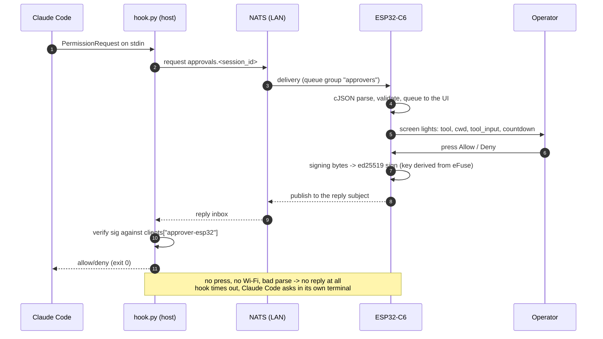

# approver-esp32 — the responder as a device (ESP32-C6 + AMOLED, ESP-IDF)

A fourth responder for the approval flow in
[`../approver/CLAUDE.md`](../approver/CLAUDE.md) §6/§7, alongside
`approver/responder.py` (software key), `approver/responder_yubikey.py` (key on a
YubiKey, the primary one) and [`approver-web/`](../approver-web/CLAUDE.md) (the
page). Same subjects, same `handler-config.json` allowlist, same signing bytes —
`hook.py`, `protocol.py` and `registration_handler.py` must not change for it,
and if they do, the design is wrong.

The difference is only the front end, again: instead of a console prompt or a
browser tab, the operator gets **a small object on the desk**. Most of the time
it is a clock; when Claude Code is working it can show what is left of the rate
limits; when a permission request arrives it lights up, shows the command, and
takes one press. Nothing to keep open, nothing sharing a window with the work
being approved — and nothing that can be answered by the machine being asked
about.

This file owns section **10** of the project docs. The numbering is global — see
[`../CLAUDE.md`](../CLAUDE.md) §2 for the map — and project-wide rules (TDD, the
dependency allowlist) stay in that root file. It has two companions, and
between them they carry what this file deliberately does not:

- [`working-with-code.md`](working-with-code.md) — **mechanics**: where ESP-IDF
  is installed on this machine, how to get a shell in which `idf.py` exists,
  how to flash, and how to talk to the port from a script;
- [`commands.md`](commands.md) — **the console reference**: every command the
  device answers and what each one does. Design documents describe why; that
  one describes what you can type.

## Status: a skeleton that builds, and a plan above it

**The library layer of §10.14.2 is written and running on the board; the
protocol above it is not.** What exists is the whole of the hardware — the
leased I²C bus and the chips on it, the panel and the touch, the codec, the
buttons, the settings file on SPIFFS, the Wi-Fi radio with a manager above it,
the clock and its SNTP half — a console on the USB port with a command per piece
of it ([`commands.md`](commands.md) is the list), and a socket open to the NATS
server on the LAN. What does not exist is anything §6 or §7 would recognise: no
key, no signature, no request card, and no screen but the placeholder `main.cpp`
draws. The table below is row by row about which is which, and the rows that
still need the repository owner's sign-off say so.

| Scope | State |
|-------|-------|
| The design below — the protocol roles (§10.2), key custody (§10.6), registration (§10.7), the screens (§10.8) | **written, unimplemented**. The dependency set and the tests used to be counted here and have rows of their own now, because neither is paper any more |
| The project skeleton — `CMakeLists.txt`, `main/main.cpp`, `sdkconfig.defaults`, `partitions.csv` (§10.12) | **generated and building** on ESP-IDF v6.0.2; two 2.5 MB OTA slots, ~10.9 MB `storage`, `nvs_keys` reserved |
| The pin map — `components/boards/board.h` (§10.1) | **written**, from Waveshare's own pinout sheet in `docs/`; logged at boot. Every driver below is *handed* its pins from here rather than including this file, which is §10.14.3's rule and what keeps the drivers testable on the host |
| SPIFFS mounted + the console — `components/storage`, `components/cli` (§10.7, §10.15) | **running on hardware**: flashed over COM4, and the console answers on the USB Serial/JTAG port — [`commands.md`](commands.md) is what it knows, and `devstatus` is all of it at once |
| The leased I²C bus — `components/i2cbus` (§10.14.3) | **written, running and under test**: lease, timeout-not-block, per-address device table, bus recovery — the last of which now takes the lease it used to skip. The fake §10.14.3 owed arrived as shadowed headers rather than as a backend interface, and that section says why |
| The buttons — `components/buttons` (§10.1, §10.15) | **running on hardware**: debounced BOOT / KEY / PWR, polled, with a blocking `HeldFor` for §10.15's KEY-at-boot. It is what found that GPIO18 reads `PWR` **inverted**. No consumer yet — the config restore is still unwritten |
| ES8311 codec + speaker — `components/audio` (§10.8.1, §10.13) | **playing on hardware**: the codec configured from its datasheet, an I²S transmit channel, uncompressed WAV streamed off SPIFFS. `poweron.wav` at boot, `alert.wav` on `play`. No microphone, no decoder |
| Settings — `components/config` (§10.15) | **read, written and surviving a reboot**: `config.json` parsed into a fixed struct at boot, `reload` / `save` / `restore` on the console, and the codec's volume is the first setting that round-trips |
| QMI8658C IMU — `components/imu` (§10.13) | **reading on hardware**: 0x6B, six axes, tilt and die temperature through `imu`. A diagnostic and nothing more — §10.13's rule that no gesture approves anything is unchanged |
| PCF85063 RTC — `components/rtc` (§10.8.2) | **running on hardware**: read, written and surviving a reboot; the system clock is adopted from it at boot, **in UTC** |
| SNTP — `components/timesync` (§10.8.2) | **running on hardware**: on this board the radio walked its list, joined at 6.3 s, held an address at 8.4 s and the clock was set from `pool.ntp.org` at **13.1 s** — the boot case and the internet-appears case being the same one, as designed. `date` and `date sync` on the console, the RTC written back each time. `sync_policy.h` includes `<cstdint>` and nothing else, the way the navigator and the Wi-Fi policy do, so the schedule, the flap guard and the backoff run under Unity. What no board has reached is the **six-hour** interval and the backoff — a device has to be up that long to prove them |
| Named time zones — `components/timezone` (§10.8.2) | **running on hardware**: 72 zones compiled in, `Europe/Kyiv` or plain `EET` rather than a POSIX rule, applied at boot from `config.json`. The clock stays UTC; a zone only changes what is printed and how a typed time is read |
| AXP2101 — `components/pmic`, brought up from `board::Init()` (§10.1, §10.13) | **configured and reading on hardware**: TS pin silenced, ADC channels, VBUS limit, rail voltages, charge currents — all cross-checked against the vendor's `pmicpower` component — plus `SetAldo2`/`SetAldo3` for the audio and panel rails |
| The panel and the touch — `components/display` (§10.1, §10.8) | **lit on hardware**: the CO5300 over QSPI with the vendor's init sequence, its reset driven as a PMIC rail through a callback, the CST9220 read under the I²C lease, and LVGL 9.4 on two 480×40 buffers. `display` on the console. No screens yet — §10.8's five are the next thing, and what is on the panel today is a placeholder that says so |
| The navigation state machine — `components/ui` (§10.8.1) | **written and tested on the host**: which screen is up, the request card outranking everything, the bounded pending queue. Its header includes `<cstdint>` and nothing else and its `CMakeLists.txt` has an empty `REQUIRES`, which together are what make it testable without a board |
| The boot splash — `spiffs_image/splash.bin`, `components/display/rawimage` (§10.8) | **running on hardware**: white katakana, on the glass for two seconds before LVGL owns it. Generated on the host by `tools/make-splash.ps1`, streamed off SPIFFS as raw RGB565 with no decoder |
| The language and the layering (§10.14) — C++ except where C is forced, no dynamic memory, library layer before logic, the I²C bus leased | **decided, and what is written follows it**: every component below is C++, none of them contains a `new`, a `malloc`, a `std::vector` or a `std::function`, the tasks and their stacks are static, and nothing outside `components/i2cbus` touches `i2c_master_*`. What is still undemonstrated is the half that has no code: `main/` composing the logic rather than drawing a placeholder |
| The ESP-IDF dependency set (§10.4) — LVGL + `esp_lvgl_port`, the CO5300/CST9220 drivers, libsodium for Ed25519, `debsahu/espidf-nats` for the bus | **signed off** (root §1). The display half is **resolved and building**: LVGL 9.4.0, `esp_lvgl_port` 2.9.0, `esp_lcd_sh8601` 2.0.1, `waveshare/esp_lcd_touch_cst9217` 1.0.4 — two of which are not the names §10.4 guessed, see below. The **NATS client is resolved and running**: `debsahu/espidf-nats` 1.4.0, which drags `espressif/esp_websocket_client` 1.8.0 in behind it — a transitive component root §1 asks about, and the one thing on this list nobody signed off in advance. libsodium is still unresolved |
| The bus link — `components/nats` (§10.3, §10.5) | **connected on hardware**: the §10.5 wrapper as a class, the connect policy next to it, and a task that waits for a client link and keeps a socket open. Against the server at `192.168.11.70:4222` it connected, subscribed to `approvals.*` in the queue group `approvers`, took a request-shaped message with its reply-to subject, and published into that subject with the server confirming. `nats` on the console. **Nothing of §7 is on top of it** — no key, no signing, no card |
| The LVGL host preview (§10.12.1) | installed and rendering. It was written down here as the only part of this folder that ran; it is now the part that runs with no board, alongside the host tests |
| Bus reachable from the device at all (§10.3) | **decided**: shared on the home LAN, no TLS, no auth — the router is the trust boundary |
| Firmware: registration, signing | not started — the bus underneath them is what exists |
| The five screens — clock, limits, request, settings, Wi-Fi (§10.8) | specified, not started |
| The Wi-Fi driver — `components/wifi` (§10.9) | **running on hardware**: two modes (access point, client), one network at a time, a latched link state, a disconnection reason turned into the three answers a person can act on, and a scan that works in both modes. It has **no opinions** — which network and when is the manager's, and that split is what makes the manager testable |
| The internet check — `components/wifimgr/reachability.*` (§10.9) | **running on hardware**: once a minute, while there is a client link, an ICMP echo to one of a few addresses from `config.json` (8.8.8.8, 1.1.1.1, 9.9.9.9 by default). Three states — `unknown` is the honest one — two failed rounds to say offline and one reply to come back. `wifi ping` and `wifi check` on the console. **It never decides anything**: a link with no internet is reported, never a reason to change networks |
| The Wi-Fi manager — `components/wifimgr` (§10.9) | **running on hardware, and tested on the host**: desired state (off / client / AP) against current, round-robin over the remembered networks with a growing capped backoff, sticky auth failures, and after N fruitless rounds a fallback access point that stays up for two minutes unless somebody attaches to it. `wifi` on the console. `wifi_policy.h` includes `<cstdint>` and nothing else, the way the navigator's does; the radio is lazily brought up, so a device with `wifi.active` false pays nothing for this existing. **It has joined a real network**, walked past one that refuses on the way, and come up on both DHCP and a fixed address — §10.9 has that run, and it is what makes the cycle, the fallback AP and the scan more than a proof against a network that does not exist. What no board has produced yet is a deliberate **auth failure**, which needs a network whose password is wrong on purpose |
| The Wi-Fi screen (§10.8.6) | specified, not started — the manager underneath it is what exists |
| Where the configuration lives (§10.15) | **decided**: all of it in JSON on SPIFFS, nothing of ours in NVS — with the cost stated (SPIFFS cannot be encrypted at rest). `spiffs_image/config.json` + `config.init.json` are flashed, and `components/config` is what reads them |
| The `KEY`-at-boot config restore (§10.15) | specified, not started |
| Host-tier tests (§10.11) — `host_test/` | **running**: 312 Unity tests over `ui`, `i2cbus`, `pmic`, `rtc`, `imu`, `audio`, `config`, `buttons`, `timezone`, `speaker`, `wifimgr`, `timesync` and `nats`, one command, no board. The drivers are compiled **unmodified** against a fake ESP-IDF (`host_test/fakes/`), which is §10.14.3's owed fake backend arriving in a different shape than that section specified, and which now covers I²S and a filesystem as well as the I²C wire. Built by MSVC rather than by ESP-IDF's `linux` target, which does not work on a Windows host — §10.11 records why |
| Protocol parity vectors (§10.11 tier 2) | not started |

Read §10.3 before anything else: it is the one part of this that changes
something outside this folder.

## 10. `approver-esp32/` — the firmware

### 10.1 The board — what the firmware may assume

**Waveshare ESP32-C6-Touch-AMOLED-2.16**
([product page](https://www.waveshare.com/esp32-c6-touch-amoled-2.16.htm),
[docs](https://docs.waveshare.com/ESP32-C6-Touch-AMOLED-2.16)):

| Part | What it is | Bus |
|------|------------|-----|
| ESP32-C6 | single RISC-V core @160 MHz, 512 KB HP SRAM + 16 KB LP SRAM, 16 MB flash, Wi-Fi 6 (2.4 GHz) / BLE 5 / 802.15.4 | — |
| CO5300 | 2.16″ AMOLED, 480×480, 16.7 M colours | QSPI |
| CST9220 | capacitive touch | I²C |
| QMI8658 | 6-axis IMU (accel + gyro) | I²C |
| PCF85063 | RTC, backed by the PMIC | I²C |
| AXP2101 | power management + charging (3.7 V Li-ion on MX1.25) | I²C |
| ES8311 + ES7210 | audio codec + echo-cancellation ADC, dual mic | I²C/I²S |
| BOOT / PWR / KEY | three buttons; `KEY` is the free one | GPIO |
| TF slot, USB-C, exposed I²C/UART pads | — | — |

**The GPIO map is not written here on purpose** — a pin number invented from
memory costs a bricked evening, and this document is not where numbers are
checked. It lives in exactly one place, **`components/boards/board.h`**, and
that file names its source: `docs/ESP32-C6-Touch-AMOLED-2.16-details-inter.jpg`,
Waveshare's own pinout sheet, kept in the repository so the numbers can be read
back against what they came from.

Two things it records that are not pins, and that shape boot order rather than
decorate it: **the panel's reset and the amplifier's enable are PMIC rails**
(ALDO3 and ALDO2), so the I²C bus and the AXP2101 driver have to be up before
the display can be brought up at all; and **the TF slot shares the panel's QSPI
wires** (only the chip select is its own), which is a second reason §10.13 gives
that slot no job.

**The `PWR` button is not the firmware's.** It is wired to the AXP2101's PWRON
pin (pressed = 0), and the chip acts on it whether or not any code is running.
Read off this board rather than off a datasheet — `power` prints all three:

| | This board |
|---|---|
| Power **on** | a short press: the threshold is **128 ms**, the shortest of the chip's four (128 ms / 512 ms / 1 s / 2 s, register `0x27` bits 1:0) — **or** plugging USB in, since VBUS insert is a power-on source in its own right, as is inserting a battery |
| Power **off** | a **6 s** long press (register `0x27` bits 3:2, of 4/6/8/10 s) — and it works only because `COMMON_CONFIG` (`0x10`) bit 2 is set. With that bit clear the chip measures the long press and does nothing. On this board it is set |
| Why it is awake | `PWRON_STATUS` (`0x20`), one bit per reason. A freshly cabled board reports `USB plugged in` |

Two consequences. **Power on and off are not features to implement** — they are
behaviour to avoid breaking, and GPIO18 exists so the firmware can *see* the
button, not so it can switch the board. And it is the same fact that makes
§10.7's `poweroff` refuse over USB: VBUS insert powers the chip on, so a soft
shutdown with the cable in is one the hardware immediately undoes.

**And GPIO18 sees it inverted, which the datasheet does not say and a board
does.** `PWR` at the PMIC is pressed = 0; at the ESP's pin it is the other way
round — GPIO18 rests at **0** (driven, not floating: it stays 0 with the
internal pull-up enabled) and goes high while the button is held. `BOOT` and
`KEY` are the ordinary way round, low when pressed. This was found by reading
the pin with the obvious polarity assumed and getting a button that was pressed
for the whole uptime, which is the argument for `buttons` (§10.7) existing at
all: a button driver that is never read back is a set of assumptions.

Where the rest comes from when it is needed — the TE line, backlight, the PMIC
and RTC interrupts, and the driver init sequences the sheet cannot carry:

- **The vendor's own examples**, which are the authority for this board:
  [`waveshareteam/ESP32-C6-Touch-AMOLED-2.16`, `02_Example/ESP-IDF-v5.5.3`](https://github.com/waveshareteam/ESP32-C6-Touch-AMOLED-2.16/tree/main/02_Example/ESP-IDF-v5.5.3).
  Note the folder name: the examples are built against **ESP-IDF v5.5.3**, which
  is the number §10.4 and §10.12 are arguing about.
- **`XPowersLib`, which that same repository vendors** — the register maps for
  the AXP2101 live there (`src/REG/AXP2101Constants.h`,
  `src/XPowersAXP2101.tpp`), and `components/pmic` cites them line by line
  rather than trusting anyone's memory. It is a source to read, not a
  dependency to add: nothing links against it.
- **`02_Example/ESP-IDF-v5.5.3/…/components/pmicpower`** — what the vendor
  actually *configures* on this board, which is a different question from what
  the registers mean. Reading it after the fact found four things missing from
  a driver that already worked: the TS pin left measuring (XPowersLib silences
  it inside `begin()`, and its own comment says the pin "will affect the
  charger"), the charge currents left at power-on defaults rather than this
  battery's 50/500/50 mA, the VBUS limit left below 2 A, and the rails never
  written to 3.3 V. **A driver that returns plausible numbers is not a driver
  that is configured** — the vendor's init sequence is worth diffing against
  even when nothing looks broken.
- The datasheets in `docs/` — CO5300, CST9220's family, AXP2101, PCF85063,
  QMI8658C, ES8311, and the C6 technical reference manual. I²C addresses are
  theirs, not `board.h`'s: they belong with each chip's driver (§10.14.2).

Anything taken from either goes into `board.h` with the source cited next to it,
never into a driver directly.

Two consequences that shape the firmware rather than decorate it:

- **No PSRAM, and no way to add it** — the ESP32-C6 has no external-RAM support
  at all. A full 480×480 framebuffer at 16 bpp is 480·480·2 = **460 800 bytes**
  against 512 KB of SRAM shared with lwIP, Wi-Fi and the TLS stack. So: LVGL
  draws into **partial buffers** (two of, say, 480×40 = 38.4 KB each), the panel
  is fed by DMA per flush, and "just render the whole screen" is not on the
  table. Any vendor demo that claims full double buffering on this chip is doing
  it with partial buffers too.
- **One core.** The UI, the NATS socket and the signature all live on the same
  CPU. Split them: an LVGL task (it owns the display and the touch), a bus task
  (socket, parse, reply), and a queue between them. A signature must never run
  inside an LVGL callback — the frame it stalls is the frame the operator is
  looking at.

### 10.2 What the device is in the protocol

A responder, indistinguishable from the software one to everything that verifies
it:

| | Value |
|---|---|
| `key_id` | `approver-esp32` (its own — **not** shared with another responder) |
| `key_type` | `ed25519` (§10.6 explains why, and what it costs) |
| Subscribes | `approvals.*`, queue group `approvers` |
| Registers over | `registrations`, §6, on the device (§10.7) |
| `reason` | always `""` — no keyboard, same call `responder_yubikey.py` makes (§8.7) |
| `updated_input` | **never sent** |

That last line is the reason this firmware is small. `updated_input` is the only
field a responder *originates*, and the only one that would force the device to
implement Python's canonical JSON (`sort_keys`, `separators`, `ensure_ascii`) and
hash it identically — the trap that cost `approver-web` a whole section of its
own docs. Without it the device **never hashes anything**: it echoes
`input_sha256` as the string it arrived as, puts `""` in the
`updated_input_sha256` position, and signs. Its entire crypto surface is
Ed25519 sign, Ed25519 verify, base64, and a random nonce.

The signing bytes are §7's, assembled with `\n` and nothing else:

```
str(v) "\n" session_id "\n" nonce "\n" tool_name "\n" input_sha256 "\n"
behavior "\n" "" "\n" str(ts) "\n" ""
```

- **Echo `ts` as an integer, and be careful how.** `str(ts)` must produce exactly
  what Python produced. Parse it into `int64_t` and print with `%lld` — never
  through a `double` and `%f`, and never re-derive it from the device's own
  clock. The same rule for `v`.
- `key_id` is not in the signing bytes; it selects the key **and the scheme** on
  the verifying side (§7). Nothing the device sends can choose an algorithm.

**One responder at a time.** `approvals.*` with the `approvers` queue group means
each request reaches exactly one subscriber, arbitrarily. A device sitting on the
desk powered on all day *will* quietly take requests away from the YubiKey
responder and the page. That is the intended end state, but during development it
is the first confusing symptom — see §6 "Multiple clients".



### 10.3 The bus stops being a localhost bus

This is the part that reaches outside this folder, and it was decided before a
line of firmware: **the NATS server is shared on the home LAN — reachable from
the Wi-Fi the device is on, and from nowhere on the internet.** No TLS, no
credentials, for now. The rest of this section is what that buys and what it
costs, because the cost does not disappear by being accepted.

[`nats/CLAUDE.md`](../nats/CLAUDE.md) §4 used to say it plainly: the bus is
**unauthenticated, every subject on it is open**, and that was acceptable *only*
because it was bound to localhosлоt — `approvals.*` carries the whole `tool_input`,
which for Bash is the full command and for Write the file contents. That
sentence is now spent: the trust boundary moved from loopback to the router, and
§4 has been rewritten to say so rather than to keep promising loopback.

A device on Wi-Fi cannot honour that sentence. It has to reach `4222` across the
LAN, and `docker-compose.yml` publishes `4222:4222` — i.e. on every interface the
host has, not on loopback. So today the port is *already* open to the LAN and
nothing has needed it yet; this firmware is the first thing that would.

What that means, stated as consequences rather than a warning:

1. **Anyone on the LAN can read every permission request** — every command
   Claude Code asks about, in cleartext, plus `cwd` and the file contents of any
   `Write`. That is not a firmware problem to mitigate; it is a property of the
   bus once it is reachable.
2. **Anyone on the LAN can answer registration requests** and can publish junk
   onto `approvals.*`. The protocol already survives this (§6 replies are signed,
   §7 replies are verified) — which is exactly why it was built that way, and why
   this change is *possible* at all rather than fatal.
3. **A forged decision still cannot be minted**: the hook verifies against the
   allowlist, so the attack surface added is disclosure and denial of service,
   not authorisation.

The three ways out, and which one was taken:

| Option | What it costs |
|--------|---------------|
| **TLS + credentials on the NATS server** (a `tls {}` block, and user/pass or nkey auth) — the honest fix | editing `nats/docker-compose.yml` and a server config file; every existing client gains a URL/credential; the device needs the CA cert in flash and TLS on the socket — which `debsahu/espidf-nats` already speaks (§10.4), so the device side of this is now configuration rather than work |
| Firewall the host port to the device's address only | quick, hides nothing from anyone already on that LAN segment, and pins the device's IP |
| **Open on a trusted network** ← **chosen**: the home Wi-Fi, behind the router, nothing forwarded | free, and the flat is the trust boundary. Indefensible the moment that network is shared with people rather than with a household |

**What "trusted network" has to keep meaning**, or the decision quietly stops
holding — the conditions are listed once, in [`nats/CLAUDE.md`](../nats/CLAUDE.md)
§4, and they are: nothing port-forwarded to the host, `8222`/`8080` bound back to
loopback since no device needs them, and `4222` published on the LAN address
rather than on every interface — a VPN or overlay network joined later otherwise
carries this bus onto it silently.

Two things this does *not* change, and they are the reason it is survivable:
a decision still cannot be forged (§7 verification against the allowlist), and
the device's key still cannot be extracted (§10.6). What the LAN gains is
**reading** every permission request, and the ability to make noise on the
subjects. Both were true of anything on the machine already.

**TLS + auth stays the eventual fix**, and it is now cheap on the device side —
so it becomes a `nats/` change (§3/§4) whenever the network stops being a
household, not a firmware one.

### 10.4 Dependencies — the list, and what was signed off

Root §1 requires explicit sign-off for anything outside the approved list.
**The C side has it now**: LVGL + `esp_lvgl_port`, the CO5300/CST9220 drivers,
libsodium for Ed25519, and `debsahu/espidf-nats` for the bus — approved by the
repository owner as argued below, and recorded in root §1. The alternatives stay
in the tables because they are the fallbacks if one of these turns out not to
work, not because the choice is still open.

**ESP-IDF v5.5.x** — the version line Waveshare builds this board's examples
against; other versions are documented as possibly incompatible with the
display/touch drivers. The exact number is the vendor's to state, and it has
moved: the published examples now live in
[`02_Example/ESP-IDF-v5.5.3`](https://github.com/waveshareteam/ESP32-C6-Touch-AMOLED-2.16/tree/main/02_Example/ESP-IDF-v5.5.3),
so **v5.5.3** is what a pin should say, not the v5.5.2 this section carried
before. **What is installed on this machine is v6.0.2** — §10.12 is where that
conflict got settled, and [`working-with-code.md`](working-with-code.md) has the
paths.

**And it was settled against a pin, so the manifest deliberately does not carry
one.** `main/idf_component.yml` says `idf: ">=5.5"` — a floor, not the pin this
paragraph originally asked for — because §10.12 found that the version-sensitive
half builds on v6.0.2 and that nothing left in this project has a claim on
v5.5.3. What v5.5.3 still is: the version the vendor's examples are written
against, and therefore the one to reach for if a display or touch problem ever
looks like a framework problem. What holds the *rest* of the versions is
`dependencies.lock`, committed, and that is where the `uv.lock` comparison
actually lands.

In-tree, arriving with ESP-IDF itself and needing no new supply chain:

| Component | For |
|-----------|-----|
| `esp_wifi`, `lwip` | the network, BSD sockets |
| `mbedtls` | base64 (`mbedtls_base64_*`), and TLS on the socket if §10.3 goes that way |
| `json` (cJSON) — **not in-tree any more**, see below | parsing requests, building replies — and the config files of §10.15 |
| `spiffs` | the `storage` partition: `config.json`, `config.init.json`, `registration.json` (§10.15) |
| `nvs_flash` | **nothing of ours** (§10.15) — initialised because `esp_wifi` needs it for calibration and PHY data |
| `esp_hmac`, `efuse` | the key custody of §10.6 |
| `esp_console`, `esp_vfs_usb_serial_jtag` | the provisioning commands of §10.7 |
| `esp_lcd`, `driver` (I²C/SPI), `esp_timer`, `esp_event` | display transport, buses, the clock |

**cJSON left the framework, and that is the first thing v6.0.2 has actually
cost.** On the v5.5.3 this section pins it is the in-tree `json` component; on
the installed v6.0.2 it does not exist at all, and building against it means
`espressif/cjson` from the registry — which is what `main/idf_component.yml`
now declares (resolved: **1.7.19~2**, locked in the committed
`dependencies.lock`). The library is unchanged and was already signed off; only
its delivery is new. Two consequences worth recording: this is the project's
first managed dependency and therefore the first `dependencies.lock`, and it is
one more entry on the version ledger of §10.12 — on v5.5.3 the line would not
exist.

**And one host-side tool joined, which is not a dependency of anything.**
`ffmpeg` converts the sounds to the uncompressed WAV the firmware plays
(§10.8.1); it runs on this machine, nothing links against it, and the command
is in [`working-with-code.md`](working-with-code.md). The firmware deliberately
has **no decoder** — the argument is in `components/audio/speaker.h`.

New dependencies, all four approved:

| Approved | Why | The alternative it beat |
|----------|-----|-------------------------|
| `lvgl/lvgl` (v9) + `espressif/esp_lvgl_port` | five screens, a scrolling list of scan results and an on-screen keyboard (§10.8) — hand-drawing that against `esp_lcd` primitives is weeks of work to reach something worse | draw directly against `esp_lcd`: defensible for the request card alone, not for the Wi-Fi screen, which is where the keyboard lives |
| CO5300 panel driver + CST9220 touch driver | the two chips on this board; the vendor demo carries both | none — they are the hardware. Prefer an Espressif-registry component over a copied vendor tree; if the vendor's is the only one, vendor it into `components/` with its version recorded |

**Two of those four names do not exist, and what they resolved to is the record
that matters.** The approval stands — these are the same components in intent —
but a table that keeps naming things that cannot be installed is a table nobody
can act on:

| §10.4 said | It is | Why |
|---|---|---|
| "CO5300 panel driver" | **`espressif/esp_lcd_sh8601` 2.0.1~1** | there is no CO5300 component on the registry, and the vendor's own ESP-IDF example drives this board with the SH8601 driver. The two share the QSPI command set, and everything specific to this glass arrives as the init list in `components/display/panel.cpp` — copied from that example, because a panel init sequence is not something to derive from a datasheet and hope |
| "CST9220 touch driver" | **`waveshare/esp_lcd_touch_cst9217` 1.0.4** | the part number in the board's documentation is CST9220 and the driver Waveshare publishes for it is `cst9217`. Not a discrepancy to resolve — the driver prints `Chip Type: 0x9220` when it probes this board, so it knows perfectly well what it is talking to. It brings `espressif/esp_lcd_touch` with it, which is the interface `esp_lvgl_port` also speaks |

And one the vendor took differently, where §10.4's choice was kept: Waveshare's
example is built on **`espressif/esp_lvgl_adapter`**, which drags in `button`,
`knob`, `freetype`, `esp_lv_decoder` and `esp_lv_fs` — five transitive
components for a device with three buttons it polls itself and no fonts to load
at runtime. Root §1 asks about exactly that weight. `esp_lvgl_port` **2.9.0**
depends on nothing but LVGL, covers the same ground, and is what §10.4 approved.

**LVGL is 9.4.0**, which is not 9.5 — §10.12.1's rule that the host preview and
the firmware must be the same minor version is now a live constraint rather
than a note: the simulator ships 9.5. Note where that constraint is actually
held: `main/idf_component.yml` says `^9.3.0`, which a fresh resolve would float
to 9.5 the moment one is published; what pins 9.4.0 today is `dependencies.lock`.
That is the `uv.lock` model and it is the intended one, but it means a
`idf.py update-dependencies` is a decision about the preview as well as about the
firmware.

**Two transitive components arrive that this table has not named**, and root §1
asks about exactly those. Both are on the display side and neither is a question
of weight:

| Transitive | Version | From | What it is |
|---|---|---|---|
| `espressif/esp_lcd_touch` | 1.2.1 | `waveshare/esp_lcd_touch_cst9217` | the common touch interface, named in the row above; this is the version it resolved to, and 1,437 bytes of flash next to the driver's own 2,343 |
| `espressif/cmake_utilities` | 0.5.3 | `espressif/esp_lcd_sh8601` | build-system helpers — CMake functions the panel driver's own `CMakeLists` calls. **No code of it reaches the firmware**: `idf.py size-components` has no line for it, the same way it has none for the WebSocket client, and for a stronger reason — there is nothing in it to link |

The third transitive component is `espressif/esp_websocket_client`, which is a
different kind of answer and has the section below to itself.

**And the whole display half resolved and built on ESP-IDF v6.0.2**, which is
the first real evidence in the v5.5.3-versus-v6.0.2 argument of §10.12 — see
there for what it does and does not settle.
| **an Ed25519 implementation** — `libsodium` (Espressif publishes it as a managed component) | mbedTLS has **no EdDSA**: it cannot sign or verify Ed25519 at all. §6's server key is Ed25519 *by fixed protocol* (`protocol.SERVER_KEY_TYPE`), so verify is not optional | switch the device's own key to `key_type: p256` (mbedTLS ECDSA, already a first-class scheme in §7 — the YubiKey and the browser both use it) — **but the registration reply still needs Ed25519 verify**, so this removes signing from libsodium's job, not libsodium |
| **a NATS client** — `debsahu/espidf-nats` (ESP Component Registry, `^1.4.0`, MIT, header-only C++, ESP-IDF 4.4–6.0) | the §10.5 subset without writing and debugging a socket state machine; and it brings TLS 1.2/1.3 with server-cert validation, mTLS and SNI, which is exactly what §10.3 needs and the one part of a hand-written client that would *not* have been ~300 lines | writing it ourselves, and the two options below |

**The NATS client is the interesting decision.** For Rust, §9.4 concluded that
reimplementing the protocol to avoid `async-nats` "would be far worse than
depending on it" — because an official client existed. For ESP-IDF there is no
official one, and the choice went to a third-party component anyway:

| Option | Assessment |
|--------|------------|
| **`debsahu/espidf-nats`** ← **chosen** | Header-only C++ on the registry, MIT, `idf.py add-dependency "debsahu/espidf-nats^1.4.0"`. Two hard requirements checked before choosing: `sub_internal` takes a `queue` argument, so the `approvers` group of §6 is expressible, and the message type carries `reply` — the reply-to subject §7 answers into. TLS and exponential-backoff reconnect come with it |
| Write it: ~300 lines over a socket | The subset is genuinely tiny (§10.5) and every failure mode would have been ours to shape. Rejected: the tiny part is the plaintext path, and §10.3's TLS is the part that is not tiny. Stays the fallback if the component becomes a problem — §10.5 remains a complete specification of what to write |
| `daed/nats-client` | The earlier port of `arduino-nats` the chosen one descends from; smaller, less maintained |
| `nats.io`'s official C client (`nats.c`) | Written for POSIX servers; pulls threads and an event loop and assumes desktop-sized memory. Not a realistic target here |

**Resolved: 1.4.0, and it brought something nobody signed off.** The component
is on the registry as described and the two hard requirements checked before
choosing it are true of the code as well as of the docs — `subscribe` takes a
queue group and `nats_msg_t` carries `reply`. What was not visible from the
registry page is its manifest: it requires **`espressif/esp_websocket_client`
unconditionally** (resolved 1.8.0, in `dependencies.lock`), which is exactly
the transitive component root §1 says is a new question for the owner. It is
raised here rather than buried:

- **nothing in this firmware can reach the WebSocket transport.** `nats_bus.h`
  is the whole call surface and it has no way to name a transport, and
  `endpoint.h` refuses `ws://` and `wss://` outright so that a URL cannot ask
  for one either;
- **it costs nothing in flash.** `idf.py size-components` has no line for
  `libespressif__esp_websocket_client.a` at all — the archive is built and
  never linked, because no symbol in it is referenced. The whole `nats`
  component, the header-only client instantiated inside it included, is
  **36,438 bytes** — 25,773 of them flash text and most of the rest the task's
  8 KB stack (§10.5 says what bought that);
- **it is compiled out, and the way that has to be done is a contradiction
  inside the dependency.** Because the component is always present, its
  CMakeLists puts `-DCONFIG_ESP_WEBSOCKET_CLIENT_ENABLE=1` on the command line
  of everything that includes it — but the matching `REQUIRES` never reaches
  ESP-IDF's requirement pass (it is computed from `BUILD_COMPONENTS`, which is
  not populated when that pass runs), so the *include directory* does not
  propagate. A define saying the transport is there and an include path saying
  it is not: the build fails on `#include <esp_websocket_client.h>`.
  `nats_bus.cpp` `#undef`s the macro before including the library, which lets
  the header's own `__has_include` fallback decide correctly. §10.4's "Kconfig-
  off what can be turned off" is that line.

**What the component brings that this device must never use.** JetStream,
KV, object store, NKey/JWT auth, WebSocket transport and message headers are all
in it; the responder uses `connect`, `subscribe` (with a queue group),
`publish`, `flush` and nothing else. The rule is §10.13's, applied to a
dependency: on the board, unused is not the same as absent — Kconfig-off what
can be turned off, keep `CONFIG_ESP_WEBSOCKET_CLIENT_ENABLE` unset, and record
what it costs with `idf.py size-components` (§10.12) rather than assuming it is
free. **It is C++**, which §10.14.1 turns from a problem into a non-issue — the
firmware is C++ as well, so it is included directly; the only wrapper around it
is the §10.5 contract, and that one exists to keep the call surface small, not
to cross a language boundary.

The rest of root §1's rule now applies to these four: each goes in
`main/idf_component.yml` with a version, they are locked in `dependencies.lock`
(committed), and **the exact versions land in these tables when the first build
resolves them** — "LVGL v9" is the approval, `9.3.0` is the record. Anything
beyond this list is a new question for the owner, including a transitive
component one of them drags in.

### 10.5 The NATS client — the subset that is actually needed

The client is `debsahu/espidf-nats` (§10.4), so this section stopped being an
implementation plan and became two things instead: **the contract the wrapper
has to expose** — nothing outside this list is called, and anything the
component cannot do is a blocking finding, not a detail — and **the complete
specification of what to write** if the component ever has to be dropped. The
wire protocol is line-based text; this device speaks four verbs and listens for
three, which is why either way stays small.

Sends:

- `CONNECT {"verbose":false,"pedantic":false,"name":"approver-esp32","protocol":1}` — no credentials, per §10.3; `user`/`pass` or `auth_token` only if that bus ever gains auth
- `SUB approvals.* approvers 1` — the queue group is not optional (§6)
- `SUB status 3` — read-only, **no queue group** (§10.8.3): a broadcast current value is meant to reach every subscriber, and joining a group would mean taking it from the other watchers
- `SUB <inbox> 2` — one private inbox for the registration reply, `_INBOX.<32 random hex>`
- `PUB <reply-subject> <n>\r\n<payload>\r\n` — a decision, and the registration request
- `PONG` — in answer to every `PING`

Receives: `INFO {…}` (once, at connect — read it, don't parse it into a model),
`PING`, `MSG <subject> <sid> [reply-to] <n>\r\n<payload>\r\n`, and `-ERR <why>`
(log it and reconnect; a `-ERR` is the server telling you the connection is over).

Everything the request-reply pattern needs is in that `MSG` line: **the
`reply-to` field is the inbox to `PUB` the decision into.** There is no
correlation to invent and no state to keep beyond "which reply subject belongs to
the card on screen".

Behaviour that is not about the protocol but about this repo's rules. With a
third-party client these stop being things to implement and become things to
**verify** — by test, against the component, before trusting it (§10.11's host
tier cannot reach them, so they belong to the device tier):

- **`PUB` is not delivery.** §4: "Published" means sent. On a one-shot exchange
  (registration) wait for the reply before believing anything; on a decision,
  the reply *is* the delivery — but do not tear down the socket the instant
  after writing it. `flush` in the other clients exists for exactly this reason
  (§6, §9.7).
- **Junk on an open subject must not crash anything** — the rule `lib/bus.py`
  and `approver-web` both state. A payload that is not JSON, an object missing
  fields, a `MSG` with no `reply-to`, a length that does not match the bytes
  that follow: drop it, one log line, keep the socket. On a device the stakes
  are higher than a traceback — an unhandled parse is a reboot loop. The
  frame-level half of this is the component's parser now, not ours, which is
  exactly why something has to fire a lying length at it on purpose.
- **Bound every read.** A truncated `MSG` header, a server that stops mid-payload
  and a `PING` that never comes must all end in a socket timeout and a
  reconnect, not a blocked task and a watchdog panic.
- **Reconnect with backoff, and say so on screen** (§10.8): the dot in
  `statusline` (§9.8) is the precedent — the operator has to be able to tell "no
  requests are arriving" from "nothing is asking".

#### What is written, and the four decisions inside it

`components/nats`, in the shape §10.9 established next door — a driver with no
opinions, a policy with nothing but opinions, and a task where the two meet:

| File | What it is |
|---|---|
| `endpoint.h/.cpp` | one string from `config.json` into a host and a port. `<cstdint>`/`<cstddef>` only, so it runs under Unity |
| `link_policy.h/.cpp` | **when** to have a connection. `<cstdint>` and nothing else — the fifth file in this firmware to manage that, after `ui/navigator.h`, `wifi_policy.h`, `reachability.h` and `sync_policy.h` |
| `nats_bus.h/.cpp` | **`class nats::Bus`** — this section's list of verbs over `debsahu/espidf-nats`, and the only file that includes it |
| `nats_link.h/.cpp` | the task: reads the address, watches `wifimgr`, keeps a snapshot for the console |

**What the board has actually done**, against the server on the LAN: connected,
subscribed to `approvals.*` in the queue group `approvers`, received a
request-shaped payload with its reply-to subject, published a decision-shaped
one into that subject, and had the server confirm the flush. Both directions of
§7's exchange, with nothing of §7 in them.

Four things are decisions rather than plumbing:

- **The client lives in a static arena, and that is what a `new` would have
  bought.** The library takes its endpoint at construction and offers no way to
  change it, so pointing the device elsewhere means destroying the object and
  building another one. Placement new into `alignas(NATS) uint8_t[sizeof(NATS)]`
  keeps §10.14.1's rule (no heap of ours) and costs one thing worth stating:
  exactly one `Bus` can be open at a time, and a second one asking is refused
  with `ESP_ERR_NO_MEM` rather than served. That singularity is also what makes
  the library's context-free callback usable — the trampoline finds the open
  `Bus` through a file static, which is legitimate only because there is one.
- **Two of the library's own opinions are switched off.** Its reconnect backoff,
  because `link_policy.h` is the half that can be tested and two things
  deciding when to reconnect is one too many; and its offline message buffer,
  because a responder whose decision is delivered when the socket comes back is
  answering a request that timed out minutes ago (§10.10).
- **A network releases it, not an internet.** §10.9's rule is "only `ONLINE`
  releases the bus task", and on this device that means a client link with an
  address: the server is on the LAN (§10.3), so `wifimgr`'s ping verdict about
  8.8.8.8 has no vote, and a router with its uplink down is a perfectly good
  place to approve a command. This is the one place the bus and the clock read
  the same manager and want different answers from it (§10.8.2).
- **Two locks, because one of them can block for five seconds.** `wire_lock`
  guards the client's *lifetime* and is held by anything that publishes through
  it; `state_lock` guards the policy and the snapshot and is never held across
  anything that waits. One lock for both would mean `nats` hanging for the
  length of a connect attempt just to print a status line.

**Three things only the board could have said**, all fixed, and the shape they
share is the §10.9 one: each was invisible on the host and obvious the first
time real hardware met a real server.

- **A 4 KB task stack panicked the moment a server answered** —
  `Guru Meditation Error: Core 0 panic'ed (Stack protection fault)`, in task
  `nats`, immediately after the `INFO`. It is the library's frame:
  `send_connect()` declares two `char[NATS_MAX_CREDENTIAL_LEN * 2 + 1]` buffers
  to escape a username and a password, 4 KB reserved in one function whether or
  not the branch runs, on a device that sends no credentials at all. 8 KB now,
  and `nats` prints the low-water mark so the number is measured rather than
  guessed: **2,852 bytes never used** after a connect, a subscribe and a
  publish — 4 KB was never going to be enough, and 8 KB has a real margin.
- **A restart asked for mid-attempt was remembered forever.** `nats url` typed
  while the task was inside a five-second connect set a flag that only the
  teardown branch clears — and that branch is only reached while something is
  up. The attempt failed, the flag stayed, and the next connection that
  *worked* was dropped on its first tick. A pending restart is now consumed
  from idle as well, where it means "try now" — which is also what an operator
  who has just changed the address wants.
- **The status line printed the address the device was leaving.** The snapshot
  is written by the task, and the task was blocked in that same connect, so a
  `nats` typed straight after `nats url` showed the old server under a config
  line naming the new one. What was *asked for* is read live now; only what is
  *happening* waits for the task to notice. The log line had the mirror-image
  bug — it named the configured address for an attempt against the previous
  one, which is a line that sends somebody hunting the wrong fault.

### 10.6 Key custody — the part worth doing properly

The repository has a pattern by now, and it is not "a private key in a config
file": the YubiKey responder keeps the key in hardware (§8.7), the web responder
keeps it non-extractable in the browser's key store. The device should hold to
that standard, and the ESP32-C6 has the hardware for it.

**The proposal: derive the Ed25519 seed from an eFuse key through the HMAC
peripheral.** ESP32-C6 can hold a key in one of eFuse blocks 4–9 with a *purpose*
that makes it usable **only** by the HMAC peripheral and unreadable by software
([HMAC docs](https://docs.espressif.com/projects/esp-idf/en/stable/esp32c6/api-reference/peripherals/hmac.html)).
So:

```
seed  = esp_hmac_calculate(HMAC_KEY0, "ai-remote-approver-esp32-v1")   // 32 bytes
pair  = crypto_sign_seed_keypair(seed)                                  // ed25519
```

- The private key exists only in RAM, for as long as the firmware runs, and is
  **not in flash at all** — a dumped flash image yields the public key and
  nothing else.
- It is reproducible across reboots, so registration survives a restart with
  nothing secret persisted.
- It is bound to the chip: the same firmware on another board is a different
  responder, which is the correct behaviour (that board is not this key).
- The label in the HMAC message is the domain separator. Change it and you have
  rotated the key deliberately — which then requires re-registration (§6), the
  same felt cost the server-key rotation has.

The fallback, if the eFuse route stalls: generate once and store in **encrypted
NVS** with flash encryption enabled. Strictly worse (the key is in flash,
protected by a key that is also on the chip) but still not a plaintext file, and
honest as a first milestone as long as this doc says which one shipped.

| Responder | Where the private key lives | Can the host forge a decision? |
|-----------|------------------------------|-------------------------------|
| `responder.py` | `responder-config.json` on disk | yes, trivially |
| `responder_yubikey.py` | inside the YubiKey | no |
| `approver-web` | non-extractable `CryptoKey` in IndexedDB | no |
| **this** | RAM only, derived from an eFuse key per boot | no — and there is no file to steal |

**A boot self-test, because a miscompiled crypto library is silent.** ESP-IDF's
libsodium has a Kconfig switch for using mbedTLS's SHA-512 underneath, and that
seam has historically produced *valid-looking but wrong* `crypto_sign` output
([esp-idf#1044](https://github.com/espressif/esp-idf/issues/1044)). A wrong
signature here is indistinguishable, from the operator's side, from a working
device: the hook simply rejects every reply and Claude Code keeps asking in its
own terminal. So at boot, sign a **fixed test vector with a fixed test key** and
compare against bytes generated by `lib/crypto.py`; refuse to subscribe if it
does not match, and say so on the screen. Ed25519 is deterministic, which is
what makes this check possible at all.

### 10.7 Registration on the device (§6, without a keyboard)

The token is `<key_id>.<b64 32 bytes>` — around 50 characters, minted on the host
by `py approver/registration_handler.py --get-token approver-esp32`. Typing that
on a 2.16″ touchscreen is a bad joke, so registration is driven over **USB**,
through `esp_console` on the USB Serial/JTAG port:

Three of the four commands this section owes — `register <token>`, `keys` and
`forget` — do not exist yet. The fourth, `bus <url>`, does: it is **`nats
url <url>`**, alongside a status readout and the `sub` / `pub` pair that made
the bus visible on the wire, and it grew subcommands for the same reason `wifi`
did. **The ones that exist are listed, with what each
of them does, in [`commands.md`](commands.md)**, and that file is the reference
rather than this one: a list of commands in a design document is a list that
goes stale the first time somebody adds a subcommand and updates the code.

What stays here is why the console is shaped this way. How to *reach* it —
which serial command opens the port, and what it fights with for it — is in
[`working-with-code.md`](working-with-code.md).

**The Wi-Fi half of the owed list exists now, spelled with verbs**: `wifi join
<ssid> [password]` rather than the bare `wifi <ssid> <password>` this section
first sketched, because `wifi` had to grow a status readout and subcommands,
and a bare pair of words that is sometimes an SSID and sometimes a subcommand
is a parser with a trap in it. §10.9 has the rest.

`status` is the answer to "is this the build I think it is, in the slot I think
it is" — the question every other command will be debugged through. `cat` is
how §10.15's files are read back off a device without a reflash, and it was the
first thing to prove the SPIFFS image had actually landed.

**`devstatus` is all of them at once, and it is composed rather than written.**
It calls `status`, `power`, `buttons`, `imu`, `audio`, `display`, `date`, `wifi`
and `nats` in turn instead of printing its own version of each — a second copy of
the `power` readout would drift from the first the day somebody adds a field to
one of them, which is the drift the four-places rule above exists to prevent.

Two things fall out of that. **Every section header is the name of a command**,
so the dump doubles as a map — something odd under `== power`, type `power` to
look at it alone — and keeping that rule true is why `audio` now exists as a
command: it was the one section with nothing behind it, and adding the command
was better than documenting an exception. And the headers are not decoration:
run together the sections share label names (`die temp` is the PMIC's and the
IMU's, `system` is a voltage in one section and a clock in the next), and a
wall of aligned lines with no marks in it is a wall nobody reads twice.

It prints **state, not settings**. `config` is the other half of that pair and
answers what the device was *told* to do; this answers what it is doing.

It is ESP-IDF's `esp_console` REPL, not a hand-written line reader: history,
editing, argument splitting and `help` come with the component §10.4 already
approved. The house firmware of §10.14.4 writes its own — worth knowing when
comparing the two, and not worth copying when the in-tree one is already a
dependency.

#### Two rules for anything this console prints

**Every command and every subcommand goes in the help, in the same change that
adds it** — and in [`commands.md`](commands.md) with it. A command nobody can
find does not exist, and `help` is the only place anybody looks. For this
console that means four things and they are easy to get out of step — three of
them already did, with `wifi ping` and `wifi check` reaching the usage text and
never the registered hint, so a reader who ran `help` concluded the commands
were not there:

- the `.help` string in the `kCommands` table, which is the one line `help`
  prints per command;
- the `.hint` string next to it — the argument summary on the same line. It has
  to stay short enough to read in a column, so it names the **verbs**;
- the command's own `usage` text, which names the **forms**. Print it from one
  function, reached both by an explicit `<command> help` and by anything
  unrecognised: finding out what a command takes should not require typing
  something wrong first, and two copies of a usage block drift;
- **[`commands.md`](commands.md)**, which is the only one of the four with room
  to say what a command is *for* — that `display brightness` prints the live
  value next to the stored one, that `poweroff` refuses over USB, that `wifi
  scan` works with the radio off. A hint has twelve words; this has as many as
  it needs.

**No section numbers in anything the operator sees.** `§10.9` is how this
repository talks to itself; on a console it is a reference to a document the
person reading has probably never opened. Every `printf`, every `ESP_LOG` and
every `.help` string says the thing itself — "the reset is the ALDO3 rail",
not "(§10.1)". In the **code comments** the citations stay exactly as they are:
that is where they earn their keep.

`cat` reads through a **fixed 4 KB buffer** (§10.14.1 — nothing here allocates),
and a file too big for it is refused *with its size* rather than truncated into
something that reads as complete. `ls` lists into a fixed sixteen-entry array
and says "and more" when it fills, for the same reason: a bounded listing that
looks complete is worse than a short one that admits it. That is the rule
§10.15 states for parsing the config, arrived at from the other direction.

`ls` also has nothing to recurse into — **SPIFFS is flat**, so its output is the
whole filesystem rather than one level of it, and it prints two totals rather
than one: the bytes in the files it listed, and the bytes the partition itself
reports used. They never match, and that gap is the filesystem's own overhead
made visible. The percentage is beside them because neither absolute answers "is
this filling up" at a glance against an 11 MB partition. What is in the image
today reads as about six per cent, and nearly all of it is `splash.bin` and the
two sounds rather than anything the device wrote — which is the shape to expect
rather than a number to check: `spiffs_image/` is where that figure moves.

**`imu` prints a magnitude, and that line is the point of the command.** Six
plausible-looking numbers say nothing on their own: a range bit that did not
take, or a burst read that returned one register six times, both produce a
steady, believable table. At rest the acceleration vector must be 1 g, so
`magnitude 0.964 g (1.000 at rest)` is the single line that says the other six
mean something — and it is what caught the two real traps in this chip
(§10.1's inverted addresses, and CTRL1's address auto-increment being **off** by
default). The sign convention is the other thing worth stating once: an
accelerometer at rest reads +1 g along the axis pointing *up*, so the axis
gravity acts along is the negation of the dominant reading. Getting that
backwards is invisible on a desk and exactly wrong the moment the board is
turned over.

**The up-arrow, and why it needs asking for.** `esp_console` already keeps the
last 32 lines and adds every one typed, so history costs nothing — but the line
editor that reaches it is switched off on this port. `linenoiseProbe()` runs
once, while the REPL is being created, and asks the terminal to identify
itself; on USB Serial/JTAG the host opens the port seconds later, so nobody
answers, and dumb mode is latched for the session no matter who attaches
afterwards. **Turning it on at boot instead was tried and is worse than the
problem**: with dumb mode off, linenoise asks for the cursor position before
every prompt and *blocks* reading the reply, so a port driven by something that
does not speak escape sequences — the pyserial snippet in
[`working-with-code.md`](working-with-code.md), for one — goes silent until the
board is reset. Measured on this board, not feared in the abstract. Hence
`term`: the probe re-run when there is somebody there to answer it, bounded at
500 ms, and `term smart` / `term dumb` when the answer is wrong.

**`buttons` prints two answers per button — the debounced state and the raw
pin — because they disagree exactly when something is wrong.** A pin held low
by a fault reads pressed in both, for the whole uptime, which is how a broken
button tells itself apart from an idle one; it is also how §10.1's inverted
`PWR` was found. `buttons watch` is the other half: it blocks the REPL for a
bounded number of seconds (default 10, capped at 120 — a watch that outlives
the operator's attention is a console that looks hung) and prints each edge
with the duration of the press it ended. A run that shows several 30 ms presses
where one finger went down is a debounce window that is too short.

**`poweroff` refuses while USB is connected, and that is a driver rule rather
than a console one** — `Axp2101::PowerOff()` reads the VBUS bits and returns
`ESP_ERR_INVALID_STATE` without writing anything, under the same lease it would
have written through (§10.14.3). VBUS powers this chip back on, so a shutdown
with the cable in is one the hardware undoes: what the operator would see is
not a device switching off but a device rebooting, which on a desk object reads
as a crash. Saying "unplug it first" is the true answer; performing a power-off
that does not happen is not. The console adds a confirmation word (`poweroff
now`) for the same reason §10.8.5 makes its destructive entries two-step.

**`reboot` is next to it and takes no confirmation word, which is the same
argument reaching the opposite answer.** Two-stepping a destructive action is
worth it when the console cannot undo what it did — `poweroff` succeeds by
ending with a finger on a button — and a reboot undoes itself in a few seconds,
so a second word there would be friction on the most ordinary debugging action
there is. What it costs is *said* instead: `config set` writes to memory and
`config save` reaches the filesystem (§10.15), so a reboot is exactly where
unsaved edits go, and the command prints that before it goes.

Two details that are the hardware rather than the code. The line has to be
flushed **and given a moment** before `esp_restart`, because the console is the
C6's own USB Serial/JTAG and the port goes down with the chip — restarting on
the next statement takes the message with it, and what the operator sees is a
console that died rather than one that answered. And nothing is quiesced first
on purpose: a `config.json` write interrupted mid-reboot is the power cut
§10.15 already recovers from at boot, so there is nothing here worth waiting
for that is not already handled.

**The refusal is tested on hardware; the shutdown itself is not, and cannot be
from here** — it needs the cable out, and with the cable out there is no console
to watch it from. That half waits for a battery-powered session.

The exchange itself is §6 verbatim, and the order of operations is the part that
must not be "simplified":

1. Generate a fresh 32-byte `nonce`. **After Wi-Fi is up** — the ESP32's RNG is
   only a true random source with the radio enabled; before that it is a PRNG,
   and a predictable nonce gives up the replay protection the nonce exists for.
2. `PUB registrations` with `{v, token, key_id, pubkey, key_type: "ed25519",
   nonce, ts}` and wait on the private inbox.
3. **Verify the handler's Ed25519 signature over the reply before reading
   `ok`** — `registration_reply_signing_bytes`, context string included; check
   the `nonce` echo; if a `server_key` is already pinned, require it to be
   exactly that one. This is `responder.verify_server_reply` in C, and it is not
   optional: an unsigned `{"ok":false,"error":"expired"}` from anyone on the bus
   would otherwise send the operator hunting a problem that does not exist.
4. Only on a verified `ok:true`: write `key_id` and the pinned `server_key` to
   `registration.json` (§10.15). A rejection changes nothing — the same ordering
   all three existing responders use.

**Trust on first use, and the screen is what closes it.** The first registration
has nothing to compare the handler's key against, so show it: the device displays
`handler key <b64>` and the handler prints `server key (ed25519): <b64>` on
stderr at startup. Two strings, compared by eye, once. `approver-web` does the
same thing in its register panel.

`ts` for the request comes from the RTC (PCF85063) or SNTP — and if neither has
been set, from `0`: the handler does not check the request's `ts`, and inventing
a plausible-looking wrong one is worse than an obviously unset one.

### 10.8 The screens

Five, and one of them is not navigable to — it arrives:

| # | Screen | Reached by | Exists to |
|---|--------|-----------|-----------|
| 10.8.2 | **Clock** — home | the screen it returns to from everywhere | be the thing on the desk for 99 % of its life, and admit in one glyph whether it could answer a request right now |
| 10.8.3 | **Limits** | swipe left/right from the clock | the §9.7 `status` document: which model is answering and how much of the 5h / 7d windows is spent — present only while a Claude Code session is actually publishing |
| 10.8.4 | **Request** | **a message on `approvals.*`** | the one screen the device exists for |
| 10.8.5 | **Settings** | swipe up, or the gear on the clock | bus, key and registration, display, time, factory reset — and the way into Wi-Fi |
| 10.8.6 | **Wi-Fi settings** | from Settings | scan, pick, type a password, forget a network (the machinery is §10.9) |

None of them needs a board to be drawn: §10.12.1 renders LVGL on the host and
returns a picture — with the caveats stated there about what a picture proves.

**And one picture that is not a screen: the boot splash.** White katakana,
Matrix-fashion, on the glass from the moment the panel is up until LVGL takes
it over. It is deliberately *not* an LVGL screen and not in the table above —
it exists in the window before LVGL owns anything, which is also the only
window in which the panel is up and there is nothing to show.

- **The boot sound plays under it, and that is what decides how long it is
  up.** `Speaker::PlayWav` blocks for the length of the file, the picture needs
  no CPU to stay on the glass, so the three seconds the chime costs are three
  seconds of splash rather than three seconds after it. The two used to
  stack — a device that lit up silently and then beeped at a clock — and
  unstacking them made the boot 1.7 s shorter as a side effect. The `2000` in
  `main.cpp` is a floor for a device with no codec, not a duration.
- **It is a file, not code**: `spiffs_image/splash.bin`, generated on the host
  by `tools/make-splash.ps1` and flashed with the SPIFFS image. Raw RGB565 in
  the panel's byte order, no header, no decoder — `components/display/rawimage.h`
  argues it, and the argument is `speaker.h`'s about WAV, applied to pixels.
  460 800 bytes of an 11 MB partition.
- The generator is **Windows PowerShell 5.1** rather than Python, and that is
  the dependency ledger rather than a preference: rasterising a glyph needs a
  font engine, `System.Drawing` is in the box on every Windows machine, and
  every other route meant a new entry on root §1's list.

#### 10.8.1 The model — priority, not a stack

Navigation is a small explicit state machine, not "whatever LVGL screen was
loaded last", because two of the transitions are not the operator's:

- **The request overlay outranks everything.** It appears over any screen —
  mid-scroll, mid-password, mid-anything — and while it is up, navigation is
  gone: no swipe, no gear, no back. There is nothing to reach that is more
  urgent than the card, and a device where a stray swipe can hide a pending
  request is a device that will silently time one out.
- **It is not modal in the other direction either.** The card cannot be
  *dismissed*, only answered or expired. There is no ✕, because a ✕ would be a
  third verdict that §7 does not have.
- What was underneath is restored exactly when the card goes: the settings
  screen keeps its scroll position and any half-typed password. Losing a
  password to an arriving request is how an operator learns to resent the
  device.
- **Everything else is quiet.** No screen may steal focus for a readout: fresh
  limits, a Wi-Fi reconnect and a finished registration all change what a screen
  *shows*, never which screen is up. `approver-web` states the same rule about
  its plaque, for the same reason.

**One LVGL task owns the display.** LVGL is not thread-safe: every widget touch
happens in the UI task, and the bus task hands work across a queue (or takes
`lvgl_port_lock()` and gets out fast). A signature, a socket read and a JSON
parse never run inside an LVGL callback — §10.1 already says why, and this is
where it becomes a code rule rather than an observation.

**Shared across all five:**

- **A link indicator, always visible.** The dot from `statusline` (§9.8) is the
  precedent: the operator must be able to tell "nothing is being asked" from "I
  am not connected". Three states, not two — bus up / bus down / not registered
  — because a connected device with no key is just as unable to answer, and
  looks identical from the outside otherwise.
- **AMOLED: black is free, static is expensive.** An unlit pixel costs no power
  and no lifetime, so these screens are mostly black by design rather than by
  taste. Anything permanent (the clock, the dot) shifts by a few pixels on a
  slow timer, brightness drops on an idle timeout and the panel blanks after
  it — waking on touch, and unconditionally on a request. Burn-in on a device
  showing one layout for months is an outcome, not a risk.
- **The queued touch.** A card appears while a finger is already on its way
  down, and on a 480×480 panel Allow may be exactly where the operator was about
  to tap. Ignore presses for the first ~300 ms of any newly presented card, and
  discard any touch whose press began before it appeared. A console prompt and a
  browser tab get this guard for free; a desk object does not.
- **The alert.** There is a codec and a speaker here: one short synthesised chirp
  on a new request, no asset. `approver-web`'s "The new-request alert" applies —
  ramp the envelope or it clicks, and never chirp for a card that was already
  there.

#### 10.8.2 Clock — the home screen

Big time, small everything else, and it must not lie about the one thing the
device is for. On it: the time, the date, the link indicator, `key_id` when
registered, and a gear.

- **Time comes from SNTP, is kept by the PCF85063, and survives a reboot.** The
  RTC is the source at boot (instant, offline); SNTP corrects it once the network
  is up and writes the corrected value back. A device that has never had either
  shows `--:--`, not `00:00` — a plausible wrong time is worse than an obviously
  unset one, the same call §10.7 makes about `ts`.

  **Both halves exist now.** `components/rtc` and `board::Init()` adopt the RTC
  into the system clock at boot; the console reads and writes it with `date`
  (§10.7); the zones below are there and the RTC holds UTC rather than whatever
  was typed. And `components/timesync` is the network half — the split below
  says how it is shaped and what it refuses to do.

  The chip makes the `--:--` rule cheap rather than a convention to remember:
  the **OS flag** in its seconds register says the oscillator stopped or never
  started, and `Pcf85063::Read` reports that as `valid = false` instead of
  handing back a number. A read that succeeds and a time that can be trusted
  are separate answers. Two details that follow from the datasheet and are
  worth not rediscovering: the seven counters are read and written in **one**
  burst (a read freezes them, so a burst cannot catch a carry — two accesses
  can, and would mix minutes from one moment with hours from the next), and a
  write stops the clock around itself for the same reason. Writing seconds is
  also what clears OS, so a successful `date set` is what makes the clock
  trustworthy again.
- **This is where the repo finally has to know about timezones.** §9.1 avoided
  them by printing countdowns; a clock cannot.

  **The clock is UTC, and a zone is presentation.** The RTC holds UTC, `time_t`
  is UTC, and every conversion happens at the edge where a time is shown or
  typed. That invariant is what makes changing zones free: nothing stored
  moves, so `config set tz Asia/Tokyo` changes one line of `date` and no data
  at all. It is also what `board::AdoptClock` had wrong at first — it read the
  RTC with `mktime`, which treats the counters as *local*, and was therefore
  correct only while the zone was UTC. It uses `timegm` now.

  **Named zones, from a table compiled into the firmware.** libc understands
  POSIX `TZ` strings and nothing else, and ESP-IDF ships no IANA database (v6
  checked, not assumed) — so `components/timezone` maps `Europe/Kyiv` to
  `EET-2EEST,M3.5.0/3,M10.5.0/4`. The EU's three zone families are in there
  under their own names as well (`WET`, `CET`, `EET`), because "I am on Eastern
  European Time" is how some operators know where they are; they sit first in
  the table, which is also what makes the reverse lookup name a shared rule
  after its family instead of after whichever city was listed first. And
  `config.json` keeps **both**: `time.zone`
  is what a person reads, `time.posix` is what libc is given. That pair is the
  house firmware's shape (§10.14.4, its `TimeUtil`), and it is what lets a zone
  whose transitions moved be corrected on the device — write `posix` — without
  waiting for a firmware whose table knows the new dates. A raw POSIX rule is
  accepted anywhere a name is, and is stored as `Custom`; what is refused is a
  string that is neither, because libc reads a misspelled zone as UTC and says
  nothing.

  **That last promise was not being kept, and the host tests are what
  noticed.** `LooksLikePosix` rejected any string containing a `/`, on the
  reasoning that a zone name has one and a rule does not — which is wrong
  about most of this table, because a transition *time* is written `M3.5.0/3`.
  So `EET-2EEST,M3.5.0/3,M10.5.0/4` was refused as "not a POSIX rule", and the
  escape hatch above did not exist for exactly the zones most likely to need
  it. The test that found it asked the question nobody had: do the table's own
  rules pass the check the console gates on? The real distinction is where the
  slash sits — in a rule every one of them follows a digit, in a name they
  separate letters.

  Two costs, stated rather than discovered later: the table is **curated**, so
  a missing zone means typing a rule; and transition rules **change**, so a
  country that moves its dates needs the table edited and the firmware
  reflashed. Neither is fixable without shipping tzdata, which is hundreds of
  kilobytes for a device with one clock face. Not a lookup by IP either.

  The console side: `date` prints RTC and system in UTC and the same instant
  local; `date set <date> <time>` reads **local** time (what is on the wall)
  and stores UTC; `date set utc …` is the escape hatch for when the zone is
  wrong and the clock still has to be right; `config zones [filter]` lists what
  the table knows.
- **A clock that cannot approve says so on the clock.** Unregistered, or the
  boot self-test (§10.6) failed, or no bus — it is on this screen, in words, not
  buried in settings. The device's whole value is that a glance at the desk tells
  you the loop is alive.

##### SNTP — when the clock asks, and when it does not

The RTC is right across a power cut and cannot be *accurate*: it is a watch
crystal, it drifts, and nothing on this board can say by how much. So when
there is a network the device asks a server, sets the system clock and writes
the answer back to the chip — which is what makes the *next* boot start from a
good number rather than from a drifted one.

**Three moments, and they are one rule.** At boot, whenever the internet comes
back, and every `time.syncHours` after that. There is no separate boot case in
the code because there does not need to be: a device that has never synced is
*due*, and "due plus an internet" is the whole trigger. `components/timesync`
is the same split as §10.9's — `sync_policy.h` includes `<cstdint>` and nothing
else and holds every decision (host-tested, §10.11); `timesync.cpp` resolves a
name and waits on a packet, and has none.

- **It reads `wifimgr` rather than asking the network itself** — the seam
  §10.9 said this would hang off. What it needs is narrower than that section's
  three states, though, and the mapping is the interesting part: a client link
  with an address and an internet state that is **not `kOffline`** is enough to
  try. `kUnknown` counts as yes, deliberately — the check being switched off is
  not a statement that there is no internet, and an operator who turned the
  ping off would otherwise have quietly lost the clock as well. An SNTP
  exchange is its own reachability test.
- **A link that flaps is not four reasons to sync.** Coming back after a week
  off the air is; coming back four times in a minute is not, and the guard is a
  minimum gap between *successful* syncs (five minutes) rather than a debounce
  on the link. Inside it, a reconnection changes nothing at all — not even the
  schedule.
- **A failure retries far sooner than the interval, growing and capped** — six
  hours is the gap between good answers, not a penalty for a server that was
  busy. A minute, doubling, to fifteen. Without the cap a device with no route
  to any NTP server would ask sixty times an hour forever; without the growth
  it would do the same at a constant rate.
- **The exchange is bounded** (§10.5's rule about somebody else's wait): fifteen
  seconds for a DNS lookup and an answer, and the client is deinitialised on
  every path — it keeps a socket and a semaphore, and refuses a second `init`
  over a live one, so leaking it once would mean never syncing again.
- **An answer outside 2024..2099 is refused and counted as a failure.**
  §10.8.2's rule about an obviously unset clock beating a plausible wrong one,
  applied to an answer rather than to a chip — and 2099 is the RTC's own limit,
  since it stores two digits and no century.
- **No server named is off, and so is `syncHours: 0`.** Two spellings of "there
  is nothing to ask", not two switches that can disagree — and the compiled-in
  default for the server is **empty**, alone among the string fields, because
  it names somebody else's machine. A device syncing against a host the
  operator never wrote down is the mistake `internet.targets` already refuses;
  a device retrying a server that is not there is an error line every interval
  for the life of the board. The shipped `config.init.json` names
  `pool.ntp.org`, so a device that can read its filesystem does sync.
- **Nothing about this is persisted, and that is a decision.** "When did it
  last sync" lives in RAM: writing a timestamp to `config.json` every six hours
  would be flash wear for a fact the next boot re-establishes in seconds
  anyway, since a fresh device is due the moment it has an internet. What
  *does* survive a reboot is the corrected time itself, in the RTC — which is
  the point of writing it there.
- **`date` says where the time came from**, which a clock face cannot: the
  server, when it last worked, how far it moved the clock, and when the next
  one is due. `date sync` asks now and waits for the answer.

  Two details of that readout, both of which started out wrong. The last sync
  is printed **whether or not syncing is still on** — it is a fact about the
  time on screen rather than about the schedule, and switching the schedule off
  is exactly when it becomes the only thing that says where that time came
  from. And it is printed **in the configured zone**, like the `local` line
  above it: the device keeps UTC and a zone is presentation, and "when did it
  last sync" is a question people ask in wall-clock time.

**And the step is the number worth having, which is why getting it wrong
mattered.** A device corrected by several seconds every time has an RTC to be
suspicious of, and nothing else on this board would ever say so. The first
version computed it as `after - before` around the exchange — and `time()` runs
normally during the seconds spent resolving a name and waiting for a packet, so
it reported the correction *plus the duration*. The board said so immediately:
**`+5 s` twenty-six seconds after a sync that had already set the clock**,
which is a drift rate no crystal has. `esp_timer_get_time()` is monotonic and
no `settimeofday` touches it, so subtracting the elapsed time leaves the
correction alone; the same two syncs then read `+0 s`. Rounded rather than
truncated, or a 4.6-second exchange counted as 4 leaves 0.6 s of itself in the
answer — which is how a device with a perfect clock came to report `+1 s`.

  A **boot** sync showing `+1` or `+2` is expected and not drift: the RTC holds
  whole seconds, so adopting it at boot loses the fraction and always lands
  *behind* the true time. Systematically positive, and about a second of it is
  arithmetic rather than the crystal.

#### 10.8.3 Limits — the `status` document, when there is one

A port of `approver-web`'s "model and limits plaque" onto the panel: the model
name, `effort.level`, the `5h` and `7d` gauges with countdowns, `ctx`, and the
`cwd` the session is in.

- **It is a second subscription on the connection that is already open, it is
  never answered, and the request path must not read it.** Same test
  `approver-web` states: deleting this screen must leave a working responder. No
  queue group (§10.5) — a broadcast current value is meant to reach everyone.
- **"Connected" means a document arrived recently, and nothing more.** §9.7
  publishes a current value with no stream: an idle session simply stops
  publishing and there is nothing to catch up on. So the screen shows the
  document's **age**, marks it `stale` past ~2 minutes (`approver-web`'s
  threshold — keep them equal) instead of dropping the numbers, and says "no
  session" only when it has never had one or the last is long dead. A stale
  percentage is still the best available answer as long as it does not claim to
  be current.
- **The traffic light is §9.2's, not a new one.** A rate-limit window is green to
  50 % spent and yellow to 80 %; the context window green to 20 % and yellow to
  45 %. Three implementations of these two scales now exist (`render.rs`,
  `statusline.ts`, this) — each pins them in a test, and they must not drift into
  each other.
- **The countdown depends on whose clock is trustworthy.** The document carries
  both `resets_at` and the publisher's own resolution (`resets_in`,
  `resets_in_text`) precisely for a subscriber that cannot trust its clock. So:
  before SNTP has synced, display the published text and age it by the time since
  arrival; after, recompute from `resets_at` like the plaque does. `countdown()`
  is a port of `render.rs::countdown` and is tested against the same cases —
  `1h59m`, `<1m`, `now`.
- **One subject, every session.** Every Claude Code session on the machine
  publishes to `status`, so this is whichever rendered last, not necessarily the
  session whose request is on the card. Hence the `cwd` line — without it the
  screen reads as belonging to the request.
- Junk is dropped and the last good document stays: a payload that is not JSON,
  or is missing `ts`/`line`, or carries a percentage that is not a number → one
  log line, previous document kept. Percentages are clamped 0–100 a second time
  here, because a bar drawn from someone else's `130` overflows its track.

#### 10.8.4 Request — the screen the device exists for

`tool_name`, `cwd`, the `tool_input` as the heaviest thing on the panel, a
countdown, and two buttons.

**The decision-surface rules from [`approver-web`](../approver-web/CLAUDE.md)
"Look and feel" constraint 1 carry over unchanged, and they matter more here**,
because this is a gadget and gadgets invite reflex taps:

- Allow and Deny are the **same size and weight**, told apart by label and
  position as well as by colour; neither is the quiet one you dismiss.
- The `tool_input` outweighs both buttons. If the command does not fit it
  **scrolls** — it is never truncated into something that reads as harmless, and
  a card whose command has not been fully seen is exactly the card people approve
  by reflex.
- A prettier screen that makes Allow easier to hit is a worse screen.

- **The countdown is the hook's, not the device's.** It must be ≥ the `timeout`
  in `handler-config.json`, and reaching zero means the card disappears with **no
  reply** — the §7 fail-safe, not a deny.
- **More than one request can be pending.** `approver-web` lists them; a 480×480
  panel shows one card at a time with `+2 waiting`, oldest first. Answering one
  brings the next up instantly — which is precisely when the 300 ms guard of
  §10.8.1 earns its place.
- **Then it says what it sent.** `behavior` plus a short fingerprint of the
  signature, for a beat, before returning to whatever was underneath — neither
  the press nor the signature tells the operator what actually left the device.
  `responder_yubikey.print_decision` (§8.7) exists for exactly this reason.

#### 10.8.5 Settings

One list, no cleverness:

| Entry | What it holds |
|-------|---------------|
| Wi-Fi | → §10.8.6; shows the current SSID and RSSI |
| Bus | the NATS URL — the host's LAN address per §10.3, no credentials to enter unless that bus ever gains auth. Editing it drops the connection and reconnects |
| Key & registration | `key_id`, this device's public key, the pinned handler key (the strings §10.7 has the operator compare), the boot self-test result — and `forget`, which unpins both |
| Display | brightness, idle-dim and blank timeouts |
| Time | the `TZ` string, the SNTP server and how often to ask it — plus when it last answered, which is the one line here that is a readout rather than a setting |
| About | firmware version, chip and MAC, uptime, and the heap **low-water mark** rather than the current free heap (§10.14.1 — the minimum ever seen is the number that says whether the device is safe) |
| Restore config | puts `config.init.json` back over `config.json` (§10.15) — the same thing holding `KEY` at boot does, with a screen to confirm on. Wi-Fi, bus and display go back to defaults; the registration survives |
| Factory reset | that, **and** deletes `registration.json`. Two-step, and it says exactly what will be lost |

`forget`, `Restore config` and `Factory reset` are the only destructive entries
and the only three that confirm. Two of them cost a token and say so: after
`forget` or `Factory reset`, `clients[key_id]` on the handler still names a key
this device can no longer prove it has, and a new one is needed (§6).
`Restore config` is the cheap one, and the difference between them is the whole
reason §10.15 keeps the registration in a separate file.

#### 10.8.6 Wi-Fi settings — the screen

The front of §10.9: a list of what was found, sorted by signal, each with a lock
glyph and RSSI; the remembered ones marked; tap to join, long-press to forget.
A password goes in through the LVGL keyboard, with a show/hide toggle — a
mistyped WPA key and an out-of-range AP look identical otherwise. `Other…`
takes a hidden SSID by hand.

Rules the screen has to keep because of what it is:

- **The password is a secret from the moment it is typed.** It goes into
  `config.json` (§10.15) — which is *not* encrypted, and §10.15 owns that
  trade — so the handling rules are the part that has to hold: never logged,
  never in a console dump, never in a crash trace.
- **Scanning while connected costs the connection a beat** — the radio has to
  leave the channel. Do not scan on a timer, only when this screen is open; and
  a request arriving mid-scan still preempts it (§10.8.1).
- Joining is not blocking: the screen shows the state machine's state
  (`connecting… / wrong password / no such network / connected`) rather than
  freezing on a spinner with no way back.

### 10.9 Wi-Fi — the manager behind that screen

Everything else in this repository runs on a machine somebody already logged
into. This device has to get onto a network by itself, keep itself there, and
behave sanely when it cannot — and none of that may involve a laptop.

**Two components, and the split is the design.** `components/wifi` is the
radio: join this network, be an access point, what is the link doing, what is
on the air. `components/wifimgr` is everything that decides *which* and *when*.
The driver has no opinions and the policy has nothing but opinions — and the
reason to draw the line there is §10.11: `wifi_policy.h` includes `<cstdint>`
and nothing else, exactly as `ui/navigator.h` does, so the whole of the
behaviour below runs under Unity on the host with no board and no fake. The
half that cannot be tested that way is the half with no decisions in it.

**Desired and current are two different facts, and both are on show.** The
operator asks for **off**, **client** or **AP**; what is happening on the way
there is `client "point1" connecting`, `temporary AP "approver-esp32"`,
`client "point3" connected`. A readout that showed only the first would make a
device that is trying look like a device that is broken, and one that showed
only the second would lose the question the device is answering.

**A state machine, owned by one task, driven by polling the driver:**

```
NO_CREDENTIALS ──join──► CONNECTING ──got IP──► ONLINE ──disconnect──► RETRYING
      ▲                      │                                             │
      └──── forget ──────────┴────── auth fail / not found ────────────────┘
```

and, wrapped around it, the loop a device with no keyboard actually needs:

```
        ┌──────────────── each remembered network in turn ───────────────┐
        │   net 1 ──fail──► net 2 ──fail──► … ──fail──► (round over)     │
        └───────────────────────┬───────────────────────────────────────┘
              round < rounds_before_ap │ backoff, growing and capped
                                       ▼
                         ┌── round == rounds_before_ap ──┐
                         ▼                               │
                  temporary access point  ──nobody came in 2 min──┘
                         │
                    somebody attached → the clock stops
```

- **Round-robin, then be findable.** `rounds` full passes over the list (§10.9's
  "2-3", `config.json`), and then the device stops being a client and *becomes*
  an access point so that somebody can reach it and tell it about a network that
  exists. If nobody turns up inside `apWindowSeconds`, it goes back to trying.
  Forever, and never in a tight loop.
- **A station attached holds the window open.** They are the entire reason it
  exists; a device that dropped the operator's phone mid-form to go and retry a
  network that was not there is a device nobody can configure. When the last one
  leaves the two minutes start again from the beginning rather than resuming —
  somebody who joined at 1:59 must not leave the next person four seconds.
- **The window expiring clears the sticky auth failures**, because that window
  was the chance somebody had to fix a password. Without that, a device with one
  wrong password would be unfixable by the very mechanism built to fix it.
- **An exhausted list does not wait out its rounds.** Every network refusing the
  password, or no networks at all, sends the access point up at once: a device
  sulking in silence for a minute when it could be findable is a device nobody
  can rescue.
- **An attempt that is never answered times out** (15 s). An AP that associates
  and then never finishes — a captive portal, a marginal link — would otherwise
  mean the device never reaches its second network.
- **A drop while online is not a refusal**, and goes back through the gap rather
  than straight into a reconnect. A link that worked and then dropped with a
  handshake error is a link that lost its AP, not a password that is wrong;
  marking it sticky would strike a working network off the list, and
  reconnecting instantly would turn an AP that is kicking us into a loop running
  as fast as the radio can associate.
- **`mode: "ap"` and the fallback AP are the same access point for different
  reasons**, and they are two states rather than one: the first is an answer,
  the second is a symptom, and a screen that spelled them the same way would be
  lying about whether anything is wrong.

- `NO_CREDENTIALS` is a first-class state, not an error: fresh from the flasher,
  the clock still runs and the Wi-Fi screen is what the device asks for.
- `RETRYING` backs off — a few seconds, then tens, capped at a minute or so —
  and **never becomes a tight loop**. A device retrying a dead AP ten times a
  second is a device that heats up, drains a battery and floods the log.
- An **auth failure is sticky and is reported**, not retried forever. Wrong
  password and "the AP is out of range" are different problems and the screen
  must not spell them the same way (`WIFI_EVENT_STA_DISCONNECTED` carries a
  reason code — use it).
- Only `ONLINE` releases the bus task. The NATS client waits on "got IP", and on
  the way down it tears the socket rather than letting it hang on a dead route.

**Storage.** Credentials live in `config.json` (§10.15), not in the driver's own
store: set `esp_wifi_set_storage(WIFI_STORAGE_RAM)` so there is exactly one
record of what this device knows, in one place, and one restore that clears it.
§10.15 states what that costs — SPIFFS cannot be encrypted, so the WPA key is
readable from a flash dump. Remember a small number of networks (four is
plenty), try last-successful first — a desk device that moves between a home and
an office is the entire use case; roaming between dozens is not.

**What the radio can and cannot do**, because these are support questions, not
bugs:

- ESP32-C6 is **2.4 GHz only**, and this is hardware rather than a setting: the
  part has one radio. ESP-IDF marks a dual-band chip with `SOC_WIFI_SUPPORT_5G`
  — defined for the ESP32-C5, absent for the C6 (`soc/esp32c6/include/soc/
  soc_caps.h`, read rather than assumed), so there is no band mode to select
  and no 5 GHz channel bitmap to fill in. A 5 GHz-only SSID is not missing from
  the scan; it is inaudible.

  Two places say so rather than one, because "why can't it see my network" is
  the support question this section exists to pre-empt: every `wifi scan`
  prints it, and `wifi_radio.cpp` carries a `#error` under
  `SOC_WIFI_SUPPORT_5G` so that a port to a part which *does* have the band
  fails the build instead of quietly scanning half of it.
- WPA2 and WPA3-SAE personal, open networks, hidden SSIDs by manual entry.
  **WPA2-Enterprise and captive-portal networks are out of scope** — a device
  that cannot show a login page cannot join a network that demands one, and a
  hotel Wi-Fi is not where this thing approves `rm -rf`.
- A weak signal is not a failure state. Show RSSI and let the operator decide;
  reconnect logic must not treat a marginal link as a reason to forget anything.

**Why the screen and not `wifi_provisioning`.** ESP-IDF ships SoftAP/BLE
provisioning with a phone app on the other end, and it is the right answer for a
headless sensor. This board has a 480×480 touchscreen: pulling a phone, an app
and a second radio into onboarding would be more moving parts to reach a worse
result. The cost is honest — typing a 30-character WPA key on a touchscreen is
unpleasant, exactly once per network — and it is the reason the keyboard gets a
show-password toggle instead of a policy against showing it.

**The registration token still comes over USB** (§10.7). It is ~50 characters of
base64 that must be transcribed exactly, it is minted on the host anyway, and a
typo in it fails in a way that looks like a protocol problem. Wi-Fi is typed once
and confirmed by the device joining; a token is pasted once and confirmed by the
handler's signature.

#### What is written, and the four decisions inside it

`components/wifi` (the radio) and `components/wifimgr` (the policy and the task
that drives it), plus `wifi` on the console (§10.7) and the settings below in
`config.json`.

**What the board has actually done**, flashed and driven from the console
against the shipped `YOUR_SSID` — a network that by construction does not
exist: brought the radio up on demand, tried the network, been told `reason
201` and reported it as *no such network*, waited out a backoff it printed as
`next attempt in 3805 ms`, spent its two rounds, put `approver-esp32` on the
air with a DHCP server on 192.168.4.1 and a 120-second window counting down,
scanned eight neighbours while doing it, switched to a permanent AP and back to
off — and, from a cold `state off / radio not started`, answered `wifi scan`
with eight networks and went back to off without anything else being typed. A
fixed address is set, refused when it is not one (`010.0.0.42`, `10.0.0.300`),
saved, reloaded and visible in `cat config.json`.

**And then it joined one.** Given a real SSID and password it walked the list —
`YOUR_SSID` refused as `reason 201`, the second network associated — and came
up on DHCP; a fixed address set on that network took at `STA_CONNECTED` in
**69 ms** against DHCP's two seconds, and turning it off put the DHCP client
back with a real lease rather than a leftover address. The internet check
answered `online` on the first round, went `unknown` then `offline` over two
rounds against an address in TEST-NET-1 that answers nothing, and came back to
`online` on the first reply after the real targets were restored.

What is still device-tier and unreached: the auth-failure classification, which
needs a network whose password is deliberately wrong.

Two things only the board could have said, both now fixed:

- **`wifi scan` printed "joining 'YOUR_SSID'" five times for one join.** The
  manager retries an action the radio refused while a scan holds it — correct,
  and the log line was on the wrong side of that refusal. It is emitted after
  the call is taken now, so a retry is silent.
- **`state temporary ap 'YOUR_SSID' … round 3 of 2`.** Both halves were true
  internally — the network index is the last one tried and the round is
  incremented before it is compared — and both are nonsense on a screen. The
  network clause is now printed only in the states that are about a network,
  and the round is clamped to its own total.

Four things in the driver are decisions rather than plumbing:

- **The access point is `APSTA`, not `AP`.** The station interface stays up and
  unconnected so that a scan works while the fallback AP is the only thing
  running — which is precisely the moment somebody needs to pick a network. In
  plain `WIFI_MODE_AP` that scan is not possible at all.
- **A disconnection this firmware asked for is not a failure.** Tearing an
  association down to start another one produces a `STA_DISCONNECTED` of our
  own, and counting it would fail the *new* attempt before it began. A
  suppression counter, incremented before every deliberate disconnect, is the
  subtlest thing in the file.
- **`kFailed` is latched** until the next `Start…`, so a poller that looks a
  moment too late still sees the edge. That is what lets the manager be a poll
  loop rather than a queue.
- **The station's authmode threshold stays at `WIFI_AUTH_OPEN`**, which is not a
  security decision: it is the *minimum* an AP may offer, and raising it to WPA2
  makes an open café network and a WPA3-only router both vanish. What protects
  the link is the AP's own security, never our floor.

And one in the manager: **the radio is brought up lazily.** The shipped
`config.json` has `wifi.active` false, and a device configured with the radio
off should pay nothing for this component existing. The static cost that is
always paid is 1.5 KB of scan buffer and a 4 KB task stack — `idf.py
size-components` puts `libwifi.a` at 6,260 bytes and `libwifimgr.a` at 9,457
(5,098 and 7,379 when this was first written — §10.12 says why these are a
snapshot), against the framework's ~415 KB of flash for `net80211` + `pp` +
`lwip` that
arrive the first time any of it is linked.

**What laziness is saving is 41 KB of RAM, and off gives it back.** Bring-up is
in two halves for exactly that reason:

| | Cost | Given back? |
|---|---|---|
| once ever — NVS, `esp_netif`, the default event loop, our handlers on it | ~10 KB | no |
| per bring-up — the default netifs and `esp_wifi_init` | ~41 KB | **yes, on `Stop`** |

Measured with `status` at a steady state well after boot: **170,524** bytes free
having never touched the radio, ~**160,000** once it has been used and switched
off, **119,256** with a client running, 116,336 low-water. Twenty-six on/off
cycles on the board return it every time and drift a few hundred bytes in
*both* directions — the allocator, not a leak.

The split exists because the two halves have different lifetimes and one of
them **cannot** be repeated: `esp_netif_create_default_wifi_sta()` may not be
called twice for the same interface, so the netifs are created in `EnsureStack`
and destroyed in `ReleaseStack` rather than living forever, while the event
handlers — which are attached to the loop, not to the driver — are registered
once and survive the stack going up and down underneath them.

**A correction worth recording, because the first number written here was
wrong.** This section originally claimed 130 KB, from a `status` taken two
seconds after boot against one taken after the radio came up. That first
reading is *before LVGL takes its 64 KB pool* — the splash and the boot chime
mean LVGL starts about five seconds in — so it was comparing two different
moments and charging the difference to Wi-Fi. Same-instant measurements are
above. A heap number without the point in the boot it was taken at is not a
measurement, which is the lesson rather than the arithmetic.

**`wifi scan` works with the radio off**, which is the shape the operator
needs: "what is out there" is the question you have *before* the device is
anywhere. The driver brings the station interface up, scans, and puts it back
exactly as it found it. **No access point is raised to do it, hidden or
otherwise** — hidden means the SSID field in the beacon is blank, not that the
AP is silent, so it would still beacon, still hold a channel and still start a
DHCP server, all to make possible something a station does on its own. What is
on the air during a scan is probe requests and nothing else.

**The settings, in `config.json` (§10.15):**

| Field | What it is |
|---|---|
| `wifi.active` | the one switch that means radio-down. False is off whatever `mode` says — two fields that can disagree is one bug report nobody can read |
| `wifi.mode` | `"client"` or `"ap"`. **Anything else is refused and the default kept**, not guessed: the same call §10.8.2 makes about a misspelled zone |
| `wifi.rounds` | full passes before the fallback AP. `0` behaves as 1 rather than as "never try" — the round is counted before it is compared, so every network gets one attempt whatever this says |
| `wifi.apWindowSeconds` | how long that AP stays up with nobody on it |
| `wifi.ap.{ssid,password,channel}` | the access point this device raises. **Whether it is protected is the config's answer, not the firmware's** — see below |
| `wifi.networks[]` | up to four ssid/password pairs — each with an optional `ip` block, below |

The timings that are **not** in the file — the connect timeout, the gap between
attempts, the backoff and its cap — are the shape of this section rather than a
preference. A device whose connect timeout is operator-settable is a device with
one more way to be configured into never working.

**The device's own access point can be protected, and `wifi.ap.password`
decides — it is a setting, not a property of the firmware.** Three cases, and
the third is the one worth having a rule for:

| `wifi.ap.password` | What goes on the air |
|---|---|
| empty | an **open** network |
| eight characters or more | **WPA2**, and the console says `wpa2` rather than `open` where it prints the fallback AP |
| one to seven | **refused** by the driver, and the AP does not come up |

That last row is deliberate and is a driver rule rather than a config one:
WPA2 will not take a passphrase shorter than eight, and the tempting failure
mode — accept it and raise an open network instead — is an access point
somebody believes is protected. Refusing is the honest answer, and `wifi`
showing `open` next to a password that was set is the symptom to look for.

**The two shipped files disagree about this on purpose, and the consequence is
worth knowing before it surprises somebody**: `config.json` raises a WPA2 AP
and `config.init.json` — the factory defaults — leaves it open, so a **restore
(§10.15, or holding `KEY` at boot) opens the access point**. Neither is more
correct than the other. A key committed to this repository is a key everyone
with the repository has, so it is a lock against a casual neighbour rather than
a secret; and while that AP still serves nothing and stays up two minutes at a
time, an open one is not much of an exposure either. When §10.8.6 gives it a
screen to serve — and a WPA key typed into it — this is the line to revisit,
and the two files should stop disagreeing at the same time.

#### Is there an internet through it?

**Associated is not online, and the device needs both facts.** A router with no
uplink, a captive portal, a guest network that only allows port 80 — from the
station's side every one of them looks like a healthy connection. So: while
there is a client link, ping one of a few addresses once a minute and see.

```json
"internet": { "check": true, "intervalSeconds": 60, "timeoutMs": 2000,
              "failures": 2, "targets": ["8.8.8.8", "1.1.1.1", "9.9.9.9"] }
```

**A list rather than an address**, because plenty of usable networks drop ICMP
to one operator or another and one blocked host must not read as an outage.
Three anycast resolvers is the shipped default; `wifi check <address>…`
replaces them and `wifi check off` stops asking. A target that is not an IPv4
address is **refused, including a hostname** — there is no resolver in an ICMP
echo, so `google.com` there would be a check that can never pass, which reads
as an outage that never ends.

The rules, all of them in `reachability.h` and all host-tested:

- **Three states, and the third is the honest one.** `unknown` is what "no
  link", "checking is off" and "the first round has not answered yet" all mean.
  A device reporting offline because it had not looked would be lying with a
  straight face, and `LinkDown` therefore goes back to `unknown` rather than to
  `offline` — no link is a fact the Wi-Fi state already shows, and putting two
  red marks on a screen for one problem is how a screen stops being read.
- **A round is the whole list.** A target that does not answer is followed by
  the next one *immediately*, not next minute: three addresses would otherwise
  take three minutes to conclude anything. Only when every one of them ignores
  us is the round a failure.
- **Going offline is slow, coming back is instant.** Two consecutive failed
  rounds before the word "offline" — one lost round is a lost packet, a roaming
  beacon, a busy router — and exactly one reply to be online again. The
  asymmetry is the design: an outage that has ended is over, and making the
  operator wait two more minutes to be told so is making them reboot the device
  instead.
- **The address that answered goes first next time**, the same idea the network
  policy applies to last-successful, and for the same reason: without it every
  round opens with a host this particular network drops.
- **It does not feed back into which network to join.** A link that carries no
  traffic is a fact to report, never a reason to drop it and try the next one —
  that would turn one dead uplink into a device cycling through its networks
  forever, and the operator would see a device that cannot connect rather than
  a router that needs restarting.

The ICMP itself is `esp_ping` in the manager and is four lines: one echo per
probe, a session created and deleted around each one (the library cannot
retarget a live session, and once a minute is nowhere near often enough for the
task churn to matter), plus **our own deadline on top of its timeout** — §10.5's
rule about bounding every read, applied to somebody else's task, because a
session that never calls back would otherwise freeze the check for good.

**One bug the board reported immediately, and the shape of it is worth
keeping**: `wifi check 8.8.8.8` tore down a working connection and walked the
network list from the top again. The setter called `wifimgr::Apply()`, which
reconfigures the *network policy* — and reconfiguring a policy restarts it, by
design, because the network list may have changed under it. The ping list is
not the network list. `ApplyInternetCheck()` exists now and touches only the
probes; `Apply()` is for the settings that really do invalidate a connection.
The `E ping_sock: send error=0` in the same log was the consequence rather than
a second fault — a probe leaving as the interface went down.

The general rule that came out of it: **a settings call that reconnects is a
settings call people stop making**, so each one should reach for the narrowest
thing that has actually changed.

**This is the seam SNTP hangs off, and it is taken now** (§10.8.2).
`components/timesync` reads `Snapshot::internet` rather than growing a second
probe of its own — with one wrinkle worth recording here, where the states are
defined: it treats `kUnknown` as **permission to try**, not as a refusal. Only
`kOffline` stops it. The check being switched off is not a statement that there
is no internet, and a device whose operator turned the ping off must not
quietly lose its clock as well.

#### A fixed address, per network

DHCP unless a network says otherwise, and the "otherwise" hangs off the network
rather than off the device:

```json
{ "ssid": "office", "password": "…",
  "ip": { "static": true, "address": "10.0.0.42", "netmask": "255.255.255.0",
          "gateway": "10.0.0.1", "dns1": "10.0.0.1", "dns2": "" } }
```

**Per network is the half of the house firmware's shape worth copying**
(§10.14.4 — its `WifiCredentials::StaticIP` sits in exactly the same place). A
desk object that moves between a home that hands out addresses and an office
that hands out nothing needs one of each, and a single device-wide setting
would make the two mutually exclusive. `wifi static <n> <address> <netmask>
<gateway> [dns1] [dns2]` sets one from the console and `wifi static <n> off`
puts that network back on DHCP, both memory-only until `config save`, like
every other setter (§10.15).

Where it does **not** follow the house:

- **The address is parsed, not just checked for being non-empty.** Theirs
  validates by testing the five strings against `""`; empty is not how an
  address is usually wrong — `192.168.1.` and `10.0.0.300` are. `ParseIpv4` is
  strict about all of it and **refuses a leading zero** rather than picking one
  of its two meanings: `010` is ten to the person who typed it and eight to
  `inet_aton`, and a device quietly on 8.1.1.1 is an evening nobody gets back.
- **The DNS entries are optional.** Theirs requires both before it will call a
  static config valid. A LAN with no resolver is ordinary, and §10.3's bus is
  reached by address rather than by name.
- **Three fields or none, and the SSID survives either way.** A static block
  that is enabled but missing an address, a netmask or a gateway falls back to
  DHCP with one log line naming the field. Refusing the whole entry would lose
  a working network over a typo in an optional field; honouring half of it
  would give an interface with an address and no route, which looks connected
  and reaches nothing.
- **The driver is handed a copy, not a pointer.** Theirs keeps an `IPConfig*`
  into the config object and dereferences it from an event handler; here the
  console can edit the network list between an association starting and the
  event arriving, so `StartClient` takes the binary form by value.
- **The DHCP client is put back.** The netif outlives one association, so a
  network with a fixed address leaves the client stopped for whatever is joined
  next. Theirs destroys and recreates the netif per connect and never meets
  this; here `ApplyAddressing` starts the client again when the network being
  joined has no address of its own. Without it, static-then-DHCP is an
  interface that never asks for an address and a device stuck at "connecting"
  with nothing to show for it.

Two things that are the same because they are simply right: the address goes on
at **`WIFI_EVENT_STA_CONNECTED`** — associated, and before the DHCP client has
got anywhere — and the order is stop asking, then say what the answer is.
`esp_netif_set_ip_info` on an interface that is already up raises
`IP_EVENT_STA_GOT_IP` itself, so the link reaches `kConnected` through the one
path that also serves DHCP; that looks like an omission in the code and is not.

Text in the file, binary at the driver, and `config::ParseIpv4` between them —
in the config layer for the reason `tz::Lookup` is there: turning what the file
says into what the hardware takes is the file's job, and it keeps both halves
testable without a board. What `cat config.json` and the console show is the
string that was typed, never a number somebody re-rendered.

### 10.10 Rules this firmware inherits (do not soften them)

- **No reply is the safe outcome.** No press, an expired card, a failed
  signature, a dropped socket, a panic — all end in silence, the hook times out,
  and Claude Code asks in its own terminal (§7). Never invent a verdict, never
  answer on a timer, and there is no "skip" button because skipping is not
  pressing anything.
- **Never a silent allow.** The only path to `allow` is a human press on a card
  that is on the screen.
- **Untrusted input, always.** Everything off `approvals.*` is attacker-shaped:
  a 4 MB payload, a `tool_name` with no terminator, a `cwd` full of control
  characters, missing fields, duplicate keys. Bound every buffer, validate before
  use, drop with one log line. A responder that reboots on a malformed message is
  a denial of service against the person trying to work.
- **`key_type` is pinned by the allowlist**, not by anything the device sends.
- **A hung UI must not answer stale requests.** If the reply-to's connection is
  gone or the card outlived its TTL, discard it rather than publishing into a
  dead inbox.
- **Failure is visible.** The status line's dot (§9.8) is the model: the operator
  must be able to distinguish "quiet because nothing is being asked" from
  "quiet because I am not connected".

### 10.11 Tests

Root §1's TDD rule applies here as it does to pytest, Rust and the Node half.
Three tiers, and the first one is where nearly everything belongs:

1. **Host tier — no board.** The pure logic runs under Unity on the development
   machine: the signing-bytes
   assembly, the reply builder, payload validation (not JSON, fields missing,
   values out of range, a `MSG` with no reply-to), the base64 helpers, the
   `int64` `ts` round-trip, and the config files of §10.15 with every field
   missing.
   The frame-level parser is no longer ours — it moved into
   `debsahu/espidf-nats` with §10.4's decision, so firing truncated and
   oversized frames at it is a device-tier job (§10.5). The **I²C lease** of
   §10.14.3 lands here instead, against its fake backend: contention between two
   holders, an acquire that times out, a recovery after a stuck slave — the
   library layer has no protocol in it (§10.14.2), which is exactly what makes
   it runnable on the host. This is the tier that has to be comprehensive,
   because it is the one that runs on every change.

   **It is not built by ESP-IDF, and that is a finding rather than a
   shortcut.** This section used to open with "ESP-IDF builds for the `linux`
   target", and the target *is* offered by the install here
   (`idf.py --preview --list-targets` lists it) — it just does not work on a
   Windows host: `set-target linux` picks esp-clang and then tries to link a
   Windows PE against `kernel32`/`user32` with `ld.lld`, ending in `unable to
   find library -lkernel32`. Measured, not assumed.

   So `host_test/` is a plain CMake project built by the host compiler, and it
   keeps the two things that matter. It is **Unity**, taken out of the ESP-IDF
   checkout rather than vendored, so these tests move to the `linux` target
   unchanged the day it works; and it needs **nothing installed** — MSVC is
   already here for §10.12.1's LVGL preview, CMake and Ninja ship with
   ESP-IDF. One command, in [`working-with-code.md`](working-with-code.md).

   **What is under it today is the navigator and four of the five chips on the
   I²C bus, the settings file, the buttons, the zone table, the speaker, the
   Wi-Fi policy, the internet check, the clock's sync schedule and the bus
   link** — 312 tests:

   | Subject | What is pinned |
   |---|---|
   | `components/ui` | every transition of §10.8's table; swipes that must *not* navigate on the settings and Wi-Fi screens; the settings screen being reachable from the clock **and from nowhere else**, and the Wi-Fi screen only from settings; a request preempting all four screens without moving any of them; navigation vanishing entirely while the card is up; the screen underneath surviving both an answer and an expiry; the pending queue refusing a fifth arrival. Its `CMakeLists.txt` has an empty `REQUIRES`, which is not an omission — a navigator that included LVGL would be a navigator that needs a board |
   | `components/i2cbus` | §10.14.3's three: contention, an acquire that **times out rather than blocks** (asserted as the tick count it asked for, which is why the fake mutex never sleeps), and a recovery that clocks SCL nine times and drops the device handles with the old bus. Plus the device table's per-device clock, its reopen-on-speed-change, and its refusal when full. And **the non-recursive mutex, from both sides**: `AddDevice` called while a lease is held is refused rather than granted — the trap `es8311.h` records — and `Recover`, which used to skip the lease entirely, now waits for it and tears nothing down if it cannot have it |
   | `components/pmic` | the 13-bit battery field against the 14-bit ones — the width that gives a *plausible* wrong voltage when wrong; the TS-pin silencing and the ADC read-modify-write; VBUS needing both status bits; `PowerOff` refusing over USB **and writing nothing**; `Read` being one snapshot rather than a dozen moments; and the two halves of the vendor's rail guard — a rail already at 3.3 V is not rewritten (DCDC1 supplies the C6, so a pointless write is a risk with no upside) and one at the wrong voltage is, with the bits above the field kept |
   | `components/rtc` | BCD both ways; the seven counters in one burst; the OS flag making a *successful* read untrustworthy, and being masked out of the seconds it shares a register with; the clock stopped and restarted around a write — including after a write that failed; and the century this chip does not have, so 2100 and 1999 are refused before the bus is touched while 2099 goes through |
   | `components/imu` | 0x6B, the inverse of the habit — and a *stranger* answering there not stopping the search at 0x6A, which is a different problem from silence and only one of them is a reason to give up; CTRL1's auto-increment, without which fourteen bytes are TEMP_L fourteen times; the range actually changing the scale; signed counts; tilt |
   | `components/audio` | the volume mapping where 0 is silence rather than full scale; clamping; the codec coming up muted; rates refused rather than approximated, and askable *without* the chip (`RateSupported`, which is what the speaker needs before it stops the channel); a codec that never identified refusing to be set rather than writing to I²C address 0x00 — and the two lease rules of §10.14.3 that this suite **found broken here and in the IMU**: a bounded number of leases across a configuration sequence, and zero milliseconds slept while holding the bus |
   | `components/config` | every test §10.15 asks for, and the one it spends the most words on: **the write that is not allowed to half-happen**. All three post-crash states are exercised — a leftover temp dropped, a temp with no `config.json` finished into place, and a clean save leaving nothing behind — against a filesystem where `rename()` refuses to replace, exactly as SPIFFS does. Plus: the **committed** `spiffs_image/` files parsed rather than a fixture, so an edit that breaks them fails here instead of on a flash; the password placeholder still being `CHANGEME`; a missing, truncated, non-JSON or oversized file all ending in a restore; `Reload` deliberately **not** restoring; `registration.json` untouched by one; unknown fields lost on the next write; a named zone filling in its POSIX rule; a string too long for its field refused rather than truncated (and the network it belonged to dropped with it); a negative number clamped rather than wrapped into a `uint8_t`; and **valid JSON that is not an object** — `[]`, `42`, `"hello"` — restored rather than read as an object with no fields in it |
   | `components/buttons` | the debounce, which is the only part of this with logic to get wrong: a window that starts when the level is *first seen*, a bounce shorter than it swallowed, a spike that settles back reporting nothing, and the millisecond counter wrapping at ~49 days being a subtraction rather than a special case. Above it: `active_low` per button, because §10.1 found `PWR` wired the other way round; `Init` adopting a button that is **already down**, which is §10.15's whole scenario; `Init` refusing a table with no rows or an unfilled `GPIO_NUM_NC` pin; and `HeldFor` reaching five seconds through a poll loop, giving up the moment it is released, and costing nothing on the boots where nobody is holding anything |
   | `components/timezone` | the table checked against itself — every name looks itself up, every rule passes `LooksLikePosix`, no name does, and an index past the end answers row 0 rather than reading past the array — plus the aliases people actually type (`Europe/Kiev`, `Asia/Calcutta`), a shared rule named after its family rather than after a city, and the one that matters most: **an unknown zone answering `nullptr` rather than a guess**, because §10.8.2's named failure is libc silently reading a misspelling as UTC |
   | `components/audio` (speaker) | mostly the RIFF parser, which is where the value is: a `LIST` chunk between `fmt ` and `data` walked past, an odd-sized chunk padded the way RIFF requires, a 40-byte `WAVE_FORMAT_EXTENSIBLE` header stepped over, compressed-but-in-a-.wav named apart from not-a-WAV, and three claims a file is not allowed to make about itself — a `fmt ` chunk too short to hold a format, a `data` chunk with nothing in it, and a chunk length that runs off the end of the file. Then what reaches the wire — the fake channel **captures the bytes**, so "it streamed the audio and not the header" is known rather than guessed; stereo and 8-bit refused without ever unmuting; a truncated `data` chunk played as far as the file goes; the codec muted again after a failed write; a rate change stopping the channel, retuning both halves, and starting it — and **a rate the codec cannot clock refused before the channel is stopped**, with the next file still playing afterwards, which is the bug that section below is about |

   | `components/wifimgr` (the internet check) | §10.9's second state machine, and the same shape as the first — `<cstdint>` and nothing else, so no fake: `unknown` for "no link", "switched off" and "not asked yet" alike; a round moving to the next target at once rather than next minute; two failed rounds to say offline and **one reply to come back**, asserted in both directions because a symmetric rule would be a different design; a dropped link going to `unknown` rather than `offline`; a late answer arriving after the link went being ignored; the target that answered going first next round; and the minute counted across the ~49-day wrap |
   | `components/timesync` | §10.8.2's schedule, and the fourth file in this firmware whose subject includes `<cstdint>` and nothing else: a device that has never synced being **due**, which is what makes "at boot" and "when the internet appears" one rule; nothing asked without an internet, and nothing asked twice at once; a link flapping four times inside the guard producing **no** syncs while the same link returning after a longer gap produces one at once; `date sync` overruling the guard but **not** the off switch; the retry being far shorter than the interval and the backoff both growing and capped, because either half alone is satisfied by a constant; a success clearing what was learned about a failing server; a stray result rescheduling nothing; `Configure` keeping a sync that really did happen; and the ~49-day wrap landing inside an interval |
   | `components/nats` | §10.5's two halves, and the fifth subject in this firmware that needs no fake. **Where**: the four spellings of an address that are accepted, and each refusal as its own case — a port that is not 1..65535, `ws://` / `wss://` / `tls://`, a path, credentials, a bracketed IPv6 literal, surrounding space, a host too long for the field — plus the one that turned out to be a real gap, that **nothing at all is written on a refusal**, host as well as port. **When**: nothing connected without a network; one attempt outstanding at a time; the backoff both growing and capped; a drop being neither a refusal nor an instant retry; a lost network and a switch-off both tearing the socket down and only the first coming back by itself; a changed address dropping what is up; `ConnectNow` beating the backoff but not the off switch; a result nobody asked for ignored; and the ~49-day wrap landing inside a backoff |
   | `components/config` (the clock) | `syncHours` read, round-tripped and **0 kept as off rather than floored** — the opposite call to `internet.intervalSeconds` next to it, and the difference is the point: a probe list with no interval is a flood, a clock told never to sync has said something. Plus the one the owner asked for: **no `sntp` in the file, and an empty one, both leave nothing to ask** rather than falling back to a compiled-in host |
   | `components/wifimgr` | every rule §10.9 states, and it needs **no fake at all** — the policy includes `<cstdint>` and nothing else, so this suite is the navigator's shape rather than the drivers': the round-robin and where a round begins; the backoff asserted as *both* growing and capped, because either alone is satisfied by a constant; the fallback AP after the configured rounds, held open by an attached station and restarted from the beginning when the last one leaves — and **not** held open by the manager's own "nobody is attached" report, which arrives on every pass and would otherwise mean an AP that never expires; the window's expiry clearing the sticky auth failures, since that window was the chance to fix them; an exhausted list going straight to the AP rather than waiting out its rounds; a drop while online being neither an auth failure nor an instant reconnect; the connect timeout; `SetDesired` being idempotent, because the manager re-asserts it five times a second; and the ~49-day millisecond wrap landing inside a delay |

   The fake platform is `host_test/fakes/` — an ESP-IDF-shaped set of headers
   with a register-file I²C device behind them. It models the shape all five
   chips are (a write moves the cursor, a read takes from it), knows nothing
   about any particular one, and can be told to NACK, to fail the *n*th
   transfer, or to hand the bus to another task. §10.14.3 records why it is
   headers rather than the interface that section originally specified.

   **Every one of these was mutation-checked rather than trusted**: break the
   rule, watch the test that covers it fail, put it back. **Twenty so far**,
   and the number is the length of this list rather than a running tally
   somebody has to keep honest — the card-outranks-navigation rule, the lease
   timeout, `Recover`'s handle drop, the battery field width, `PowerOff`'s
   refusal, the RTC's OS flag, and `config`'s three: the boot-time recovery,
   the restore-on-bad-file, and the atomic write; plus `Init` adopting a held
   button, `active_low` being per button, and the zone lookup refusing to
   guess. The last eight are the ones the pass below added: the speaker's
   rate check and its rollback, the short `fmt ` chunk, the empty `data`
   chunk, `config`'s object check, `Recover`'s lease, `AddDevice`'s lease,
   and the codec's `present_` guard.

   Four more needed no mutation, because they failed on the real code the
   first time they ran: §10.14.3 has two, §10.8.2 the third, and §10.8.1 the
   fourth.

   **The clock's schedule added six**, all caught, and they are the six rules
   §10.8.2 spends its words on: the flap guard removed (a link bouncing then
   syncs per bounce), the backoff made constant, the backoff's cap removed,
   `Configure` forgetting a sync that happened (a shorter interval typed into
   the console would then re-sync at once, which is how a settings command
   becomes a way to hammer a server), a result nobody asked for being
   accepted, and the wrap-safe deadline comparison replaced with `now >= at`
   — that last one caught by the ~49-day test and nothing else.

   **The Wi-Fi policy added nine mutations and, more usefully, two
   survivors** — and §10.11's rule held: a mutation that survives is a
   question about the code, not a gap in the tests.

   - **`max(1, rounds_before_ap)` was guarding nothing.** Removing it changed
     no test *and no behaviour*, because the round is incremented before it is
     compared: `rounds: 0` was already a full pass over the list. The helper
     was deleted and the invariant written down where the comparison happens,
     which is worth more than a function that looked like it was defending
     something.
   - **"Try last-successful first" had no test at all.** It survived because
     the drop-while-online path sets the network directly and never goes
     through `RestartClient` — so the only caller of the rule was `wifi mode
     off` followed by `wifi mode client`, which nothing exercised. That is now
     a test.

   A third mutation would not compile, for the reason this section already
   records: `/W4 /WX` makes the code a mutation orphans into an error, so
   short-circuiting a branch has to leave nothing unreachable behind it.

   **The bus link added eleven, one survivor, and a warning about the ritual
   itself.** Ten were caught — the backoff's growth and its cap taken away
   separately, an instant retry after a drop, the teardown that a lost network
   and a switch-off each ask for, a result accepted without being asked for, a
   stale restart kept, `Reached` written as `now >= at`, another scheme
   stripped instead of refused, and a port with trailing junk taken. The
   survivor was **writing the host before the port had been agreed**, and it
   survived for the ordinary reason: `AssertRefused` checked that the port had
   not moved and said nothing about the host, so half an endpoint could be
   overwritten by a URL that was rejected. The assertion now covers both
   fields, which is the test being wrong rather than the code — the other
   direction from §10.11's usual finding.

   And the warning, because it wasted twenty minutes and will do it again:
   **a mutation harness has to touch the file it restores.** Ninja goes by
   mtime, and a restore that puts back an *older* timestamp than the object
   built from the mutated source leaves that object in the binary. The symptom
   is a suite that fails a test nobody has touched — here the ~49-day wrap
   test, still linked against `now >= at` three mutations after that one was
   reverted. Every result above was re-taken with an `os.utime` after the
   restore; the first run's failure counts were inflated by exactly this.

   **Four bugs came out of the pass that asked "what else can a caller do?"**,
   and the shape they share is worth more than any of them individually:
   each is a **decision taken after something had already been changed**,
   where the fix is to decide first and touch nothing until then. §10.7 states
   that rule for `poweroff` and §10.8.2 for a bad date; these are the places
   it had not been applied.

   - **A WAV at a rate the codec cannot clock left the speaker dead until a
     reboot.** `Reconfigure` stopped the I²S channel, retuned it, and only
     then asked the codec — which refuses anything outside its five rates. The
     channel stayed stopped, and the *next* file matched `sample_rate_` and
     skipped the reconfigure entirely, so every playback after it failed. A
     22 050 Hz alert sound is a plausible thing to drop into
     `spiffs_image/`. It asks first now, and rolls the clock back if the
     retune fails partway.
   - **`Bus::Recover` skipped the lease.** It removes every device handle and
     deletes the driver — the most destructive thing in that class — while
     another task could be mid-transfer with a handle it had already been
     given. One core with preemption makes that a use-after-free rather than a
     race that usually works. It takes the lease now (§10.14.3), waits longer
     than an ordinary acquire because the holder it is waiting on is the stuck
     one, and tears nothing down if it cannot have it.
   - **A `config.json` containing valid JSON that is not an object read as an
     empty config.** `[]`, `42` and `"hello"` all parse; every field lookup
     then answers null, so the device came up on the defaults, said nothing,
     and left the file to do the same next boot. §10.15's restore is for
     exactly this.
   - **The codec's setters checked for a bus and not for a chip.** After a
     failed `Init`, `address_` is still 0, so `SetVolume` went out to I²C
     address 0x00 — the general-call address — and took a slot in the bus's
     fixed device table for a chip that is not there.

   And two the WAV parser was handing back rather than refusing: a `fmt `
   chunk shorter than sixteen bytes, which left `bits` reading 0 out of a
   zeroed buffer and presented it as a format the file had stated; and a
   `data` chunk of zero length, which "played" by unmuting, waiting out the
   drain and muting again — a click for nothing.

   **One mutation survived, and that was the useful one.** Hard-coding the WAV
   parser's `data_offset` to the canonical 44 changed nothing — because
   `PlayWav` never read it, and streamed from wherever the parser happened to
   leave the file. Correct, and correct by accident: the coupling was invisible
   and would break the first time the parser looked ahead. `PlayWav` seeks to
   the offset now, and the mutation fails as it should. A mutation that
   survives is not a gap in the tests; it is a question about the code.

   One of those mutations would not compile, which is worth knowing before
   somebody spends ten minutes on it: `/W4 /WX` turns a now-unused variable
   into an error, so a mutation has to keep consuming what it stops using.

   Two things the host build costs, both recorded because they will look
   arbitrary later. It needs **`managed_components/`** — the config tests use
   the real cJSON, which `idf.py build` fetches and git does not carry, so a
   fresh checkout builds the firmware once first. And a handful of POSIX names
   MSVC spells differently (`setenv`, `localtime_r`, `timegm`, `strcasecmp`)
   are supplied by a force-included header rather than by an `#ifdef _WIN32` in
   the firmware: the sources under test are the ones that ship, and that rule
   is worth more than the tidiness of not having the header.

   Three things the screens add to it, all of them logic rather than pixels:
   **the navigation state machine** (a request preempts every screen; it cannot
   be dismissed; what was underneath comes back with its state — §10.8.1), **the
   Wi-Fi state machine** (backoff bounded, auth failure sticky and distinct from
   "not found", `forget` returning to `NO_CREDENTIALS` — §10.9), and **the
   limits screen's arithmetic**: `countdown()` against `render.rs`'s cases, the
   staleness threshold, and the §9.2 gauge scales pinned exactly as `render.rs`
   and `statusline.ts` pin them, including the assertion that the two scales
   cannot drift into each other.
2. **Cross-language parity vectors**, mirroring what `approver-web` does with
   `protocol.test.ts`: fixtures generated by the Python implementation itself and
   compiled into the host tests, so "does the device still speak §7?" is a
   question a test answers. Never hand-typed from this document — the generating
   command is in [`working-with-code.md`](working-with-code.md).

   Include a `registration_reply_signing_bytes` vector and an Ed25519 key pair
   with a known signature — the latter is what the boot self-test of §10.6
   consumes, so the vector has one job on the host and one on the device.
3. **Device tier — opt-in, like §8.6's touch tests.** A board, a real bus, and a
   real `hook.py`: the acceptance test is a device-signed reply that
   `hook.verify_reply` returns `trusted=True` for, plus the same reply with
   `behavior` flipped being rejected. It must never run as part of a bare
   `py -m pytest`, and it should be reachable as one command from `scripts/`, in
   the style of `e2e-approval.cmd`.

### 10.12 Build and flash (Windows)

**The commands are in [`working-with-code.md`](working-with-code.md)** —
`set-target` / `build` / `flash monitor`, and before them the thing that is not
obvious: `idf.py` does not exist until a shell is activated, and on this machine
that is a PowerShell profile rather than the `.cmd` this section once implied
(`idf.py` is a PowerShell *function*, so no child process and no `cmd.exe` sees
it). That is machine-local mechanics — the same kind of thing root §5 records
for the `py` launcher, given its own file because there is a page of it and none
of it is a decision. What belongs here is what the commands cannot say.

The first of those is a decision waiting to be taken:

**The installed version is v6.0.2, and §10.4 pins v5.5.3.** That is an open
conflict, not an oversight: v5.5.3 is what Waveshare's published examples are
built against (display and touch drivers are the parts documented as version-
sensitive), and `debsahu/espidf-nats` advertises 4.4–6.0, which v6.0.2 is
already past the top of. `eim` installs versions side by side and `eim select`
switches between them, so the resolution is a decision — install v5.5.3
alongside and build against it, or re-argue the pin against v6.0.x with the
vendor drivers in hand — to be taken at the first real build, and recorded in
§10.4 when it is.

**The version-sensitive half is now built, and it built on v6.0.2.** The
panel, the touch and LVGL — the exact three things this paragraph said would
decide it — resolve, compile and run on the installed version: `esp_lcd_sh8601`
2.0.1 declares `idf >=5.3`, `esp_lvgl_port` 2.9.0 declares `>=5.2`, and the
CST9217 driver `>=4.4.2`. So **v5.5.3 is no longer worth installing for this
reason**, and the pin in §10.4 should be read as "the version the vendor's
examples are written against" rather than as a requirement.

Two things it cost, both recorded rather than worked around: the `dc_gpio_num`
and SPI-host fields of the `esp_lcd` config are stricter about types in v6 than
the v5.5.3 example is written for, and `esp_lcd_touch_get_coordinates` is
deprecated there in favour of `esp_lcd_touch_get_data`. Neither is a reason to
go back a version; both are the reason a copied vendor file does not compile
unchanged.

**And so did the bus half.** `debsahu/espidf-nats` 1.4.0 advertises ESP-IDF
4.4–6.0 and was therefore the remaining candidate to reopen the version
argument; it resolves, compiles and connects on v6.0.2. What it needed was one
`#undef` for a WebSocket contradiction that is the component's own rather than
the version's (§10.4). So **libsodium is the last unmeasured entry on §10.4's
list**, and nothing left in this project has a claim on v5.5.3.

The numbers §10.12 asks for, taken with `idf.py size-components`: the whole
`nats` component, header-only client included, is **36,438 bytes** (25,773 of
them flash text, and 10,665 of DIRAM that is mostly the task's 8 KB stack), and
`espressif__esp_websocket_client` has no line at all — built, never linked. The
app is **1,616,986 bytes** against a 2.5 MB slot.

**These figures are a snapshot and drift with every commit**, which is worth
saying once rather than re-taking them silently: the three recorded before this
pass (`nats` 32,218, `libwifi.a` 5,098, `libwifimgr.a` 7,379) were all short by
the time anybody read them back, and the one that had barely moved was the app
total. The point of recording them is the *shape* — a header-only client that
costs 25 KB of text and no WebSocket transport at all, a radio whose flash cost
is the framework's and not ours — and a number that disagrees with this
paragraph by a few per cent is the paragraph being old, not a regression.

The targets this install has support for are `esp32`,
`esp32c6`, `esp32p4` and `esp32s3`, so `set-target esp32c6` is not the blocker.

The project those commands run in is **generated** — `create-project` plus a
`create-component` per piece of the library layer, not a copy of another board's
tree (§10.14.4 says what is taken from the house firmware instead).

Notes that will otherwise be rediscovered the hard way:

- **The port is the USB Serial/JTAG device**, and it is the same port
  `esp_console` serves the §10.7 commands on — the monitor and a manual `register`
  cannot both hold it.
- **16 MB of flash, and a partition table that says so.** The default table
  assumes 2 MB or 4 MB; LVGL plus Wi-Fi plus TLS will not fit it. `partitions.csv`
  is the custom one and it is **written**: `nvs`, `nvs_keys` (reserved and empty,
  §10.15), `otadata`, two 2.5 MB OTA slots and ~10.9 MB of `storage`, which
  carries the SPIFFS image built from `spiffs_image/`. Changing an offset after a
  device is registered means reflashing it, which is why the table was settled
  before any of it was needed.
- **Flash encryption and Secure Boot are what make §10.6's fallback meaningful**
  and they are one-way operations on real hardware. Read Espressif's docs
  before burning anything, and keep a development board that has not been
  through it.
- `idf.py size-components` is how you find out what the dependency decisions of
  §10.4 actually cost; record the numbers when they are taken.

#### 10.12.1 The LVGL preview — screens before there is a board

`lvgl-mcp-server` ([jaklys/Lvgl-mcp-esp32](https://github.com/jaklys/Lvgl-mcp-esp32),
npm, v2.0.0) is an MCP server that compiles an LVGL snippet against a headless
desktop build of LVGL and hands back a PNG plus a JSON widget tree —
`lvgl_render`, `lvgl_render_full`, `lvgl_inspect`, `lvgl_set_resolution`. It is
how the five screens of §10.8 get drawn and argued about while §10.13's build
order still has the request card at step 1. **A host-side design tool, not a
dependency**: nothing in `main/` links against it, and it does not enter §10.4's
list.

It is registered project-wide in [`../.mcp.json`](../.mcp.json) — project scope,
so Claude Code asks to approve it once per machine (`/mcp`). Three entries there
are deliberate and will look arbitrary later — a global install rather than
`npx`, a hand-set `VCVARSALL_PATH`, a borrowed ninja — and the reason for each,
along with the silent postinstall failure that leaves the package without its
simulator, is in [`working-with-code.md`](working-with-code.md). None of it is a
decision about the firmware; all of it is why a render fails on this box.

Two rules about believing what it shows:

- **Set 480×480 first** (`lvgl_set_resolution`, or the per-call `width`/
  `height`) — the default is 800×480, and a layout designed at the wrong size is
  worse than no preview at all.
- **It proves the layout and nothing else.** The simulator has a desktop's RAM,
  no CO5300 and no CST9220: it says nothing about the partial buffers of §10.1,
  flush timing, the colour path or touch. A card that looks right here can still
  be too heavy for 512 KB. And the preview only stays honest while the
  simulator's LVGL and the firmware's are the same minor version (it ships 9.5)
  — when §10.4's LVGL gets pinned, pin it against this one.

### 10.13 Not in scope, but decided

- **Build it in this order** — after the library layer of §10.14, which comes
  before all of it. The screens themselves are not equally load-bearing:
  1. bus + registration + the **request** screen (§10.8.4) — the loop closes here,
     and until it does the rest is decoration;
  2. **Wi-Fi** (§10.9) and its screen — until then, credentials compiled in or set
     over the console;
  3. **clock** (§10.8.2) and **settings** (§10.8.5);
  4. **limits** (§10.8.3) — last, because it is the only screen whose removal
     leaves everything else working, which is also the test that it stayed a
     readout.
- **No authentication on the device.** Whoever can reach the screen can approve
  and have it signed — the key is bound to the chip, not to a person. Identical to
  `approver-web`'s position, and acceptable for the same reason (a single-operator
  tool on a desk) until it isn't.
- **Battery and sleep are a later question.** Light sleep with a socket open, or
  waking on Wi-Fi, changes the "is it connected" story (§10.8.1) and should not
  be designed around before the wired-and-plugged version works. Note what it
  collides with: a screen that blanks is fine, a *radio* that sleeps means
  requests arrive late or not at all — and a responder that is asleep is a
  responder that times out.
- **Of the rest of the board, three parts have a job and the others do not.**
  The PCF85063 keeps the clock (§10.8.2), the AXP2101 reports charge, and the
  codec plays the one chirp (§10.8.1). The IMU, the microphones and the TF slot
  do not: they are on the board, which is not a reason to use them. In
  particular, **no gesture ever approves anything** — a wrist-flick verdict is
  precisely the reflex §10.8.4 is built to prevent.

  **The IMU has a driver anyway, and that changes nothing above.**
  `components/imu` and the `imu` command exist so the chip can be read from the
  console — the same class of thing `power` and `date` are, and the only way to
  find out that a part of the board is alive. Nothing in the approval path may
  read it; a tilt is not a press. What reading it established, which the
  datasheet could not: this board's QMI8658C answers at **0x6B** (SA0 pulled
  down — and note the addresses are the inverse of the habit, 0x6A being the
  floating one) with revision 0x7c, and two of its three axes are now tied to
  the case — by putting the board in a known position and reading it, which is
  the only way this is ever known:

  | The board is | Gravity reads | So |
  |---|---|---|
  | flat on the desk, screen up | along **+Z** | +Z points out of the back; the screen faces −Z |
  | stood on its USB connector, buttons up | along **−Y** | +Y points at the button edge, −Y at the connector |
  | stood on its card slot, speaker up | along **+X** | +X points at the card-slot edge, −X at the speaker |

  Right-handed, and every row of it was read off the board in a known position
  rather than taken from a drawing — which is the only way the *sign* is ever
  right. Half of the work in `imu` is that sign: an accelerometer at rest reads
  +1 g along the axis pointing **up**, so the axis gravity acts along is the
  negation of the dominant reading, and getting it backwards is invisible until
  the thing is turned over.

  Numbers worth writing down before someone calls them a bug: the acceleration
  magnitude at rest reads **0.964 g** flat, **1.062 g** on the USB edge, **1.018
  g** on the card edge and **0.980 g** on the speaker edge, against 1.000 every
  time, and the gyroscope sits at about **−3 dps on X** while perfectly still.

  **The two interrupt lines do nothing, and finding out why produced the one
  fact the datasheet does not carry.** §6.1 says INT1 is general purpose (a
  ~4 ms chip-ready pulse after reset, the CTRL9 handshake, wake-on-motion) and
  INT2 means data-ready — *pulsed* at the output rate rather than held, because
  this driver leaves `syncSmpl` clear in CTRL7. Both read a steady low on this
  board, and not for want of anything to report: **CTRL1 bits 4 and 3 are the
  INT1 and INT2 pin enables**, which rev 0.9 calls reserved while its own
  revision history says it "updated the INT1/INT2 enable bit in CTRL1". Setting
  them starts INT2 pulsing and clearing them stops it — measured, both ways.

  Two things came out of that experiment. INT1 stays low **even enabled**, which
  is correct: nothing in this firmware runs a CTRL9 command, wake-on-motion or a
  motion engine, so there is nothing to raise it. And the pulse rate came out at
  ~225 Hz against a configured ODR of `0101` — which is the datasheet's **6DOF**
  column, 235 Hz, not the 250 Hz of its accelerometer-only one. Note 13 of
  Table 26 says the rate is derived from the gyroscope when both sensors are on;
  this is that note, confirmed on the board.

  The enables stay **off**, as a `Config` flag rather than an omission: toggling
  a pin a couple of hundred times a second for a line nobody polls is current
  spent on nothing. The pins are configured as inputs with a pull-down so that
  "the chip is not driving this" and "the pin is floating" do not read the same,
  and `imu` counts edges over 20 ms rather than sampling a level — the datasheet
  is explicit that the INT2 pulse width depends on the ODR and that a level
  read is not to be trusted.

  **X was read in both directions, and that pair separates offset from scale**
  — which no single reading can. Card-slot down gives −1.016 g, speaker down
  gives +0.978: half their difference is the sensitivity, **0.997 g**, and half
  their sum is the bias, **−0.019 g**. So the ±8 g range and the LSB-per-g
  conversion are right to 0.3 %, and every deviation above is zero offset of the
  ordinary uncalibrated kind. Doing the same for Y and Z means turning the board
  over twice more; nobody has needed it, because — per the rule above — nothing
  uses the IMU.

### 10.14 How it is written — the language, and the layer that comes first

#### 10.14.1 C++, C only where forced, and no heap

**The firmware is C++.** C is not the default and not the fallback of habit; it
is what a specific spot forces. The places that force it are few and knowable:
anything that must present a C ABI to ESP-IDF or to a C component, `extern "C"`
entry points (`app_main`, event and ISR handlers registered with IDF), and
headers meant to be included from C. Everything else — the drivers of §10.14.2,
the bus task, the screens' glue, the protocol assembly of §10.2 — is C++.

This is also what makes §10.4's dependencies fit rather than fight:
`debsahu/espidf-nats` is header-only **C++** and now needs no wrapper for
language reasons; LVGL, libsodium and IDF itself are C with `extern "C"` in
their own headers, which is all that is needed to call them.

The dialect is the embedded one, and the constraints are not stylistic:

- **No exceptions, no RTTI** — off by default in ESP-IDF and staying off.
  Errors are return values (`esp_err_t` at the IDF boundary, a small result type
  above it), which is also what §10.10's "no reply is the safe outcome" needs:
  every failure path has to be a value someone decided about, not a stack unwind.
- **No dynamic memory** — the rule below, and the one that shapes the most code.
- **RAII is the point, not decoration.** A lease that releases itself on every
  return path (§10.14.3), a lock that cannot be forgotten, a socket that closes
  when its owner dies. This is most of why the language is worth having here —
  and note that RAII here manages *ownership of a resource*, never a lifetime of
  memory.
- Compile-time over run-time where it is free: `constexpr` sizes, `enum class`
  for states (the machines of §10.8.1 and §10.9), `static_assert` on the wire
  constants of §10.2.

**No heap: everything is allocated statically and lives forever.** 512 KB of
SRAM shared with lwIP, Wi-Fi and TLS, and no way to add PSRAM (§10.1) — so our
code has no `new`, no `delete`, no `malloc`, and — with the one named exception
below — nothing that grows. Objects are constructed once, at file or class
scope, and stay for the life of the device. Almost nothing has an allocation
failure to handle because almost nothing allocates, and a device meant to sit on
a desk for months does not accumulate fragmentation.

What that means in practice, including the parts that are not obvious:

- **No `std::vector`, no `std::function`.** `char[N]` with an explicit length,
  fixed arrays, spans over them, and plain function pointers with a
  `void* user_data` — which is the shape LVGL and IDF callbacks want anyway. And
  **no fixed-container library**: pulling in `etl` or similar would be a new
  dependency under root §1, and a handful of small containers written here is
  cheaper than that conversation.
- **`std::string` is allowed where it earns it** — the one named exception, and
  it is a real one: `debsahu/espidf-nats` is a C++ API, and text that arrives as
  a `std::string` is not worth copying into a `char[N]` to satisfy a rule. Use
  it, knowing what it does: libstdc++ keeps up to **15 characters inline** and
  goes to the heap past that, and every append can reallocate. So —
  - fine in setup and one-shot paths: parsing a config, the registration
    exchange (§10.7), console commands, building a URL;
  - **not** in an ISR, not in the LVGL frame path, and not as the long-lived
    home of something a fixed buffer already holds — a `tool_input` bounded by
    §10.10 belongs in the buffer that bounds it;
  - pass `const std::string&` or `std::string_view`, never by value, and
    `reserve()` once if it will grow;
  - "objects live forever" is unchanged by this: a static object holding a
    `std::string` still takes its buffer from the heap the first time it grows.
    The low-water heap mark below is what tells you whether that mattered.
- **FreeRTOS objects are static too** — `xTaskCreateStatic`, `StaticQueue_t`,
  `StaticSemaphore_t`, with the stacks and storage as arrays. The dynamic
  variants take from the heap, which is the thing we are trying not to depend
  on.
- **Constructors run before `app_main` and before any driver exists.** A static
  object whose constructor touches I²C, NVS or the network is a boot crash with
  a stack trace that names the wrong thing. Two phases: a trivial constructor,
  then an `init()` that may fail and returns a value. And because the relative
  order of static constructors across translation units is undefined, the
  `init()` calls are made from `app_main` in an order that is written down.
- **One composition root owns everything, and it is what makes "static" work.**
  A single object, reached through a function-local static
  (`static Root instance; return instance;`), holding every subsystem **by
  value** as a member and handing out references. That gives all of it at once:
  no allocation, lifetimes equal to the device's, construction in member
  declaration order — deterministic, and *inside* `app_main` rather than before
  it, because the first `getInstance()` is the thing that builds it. The
  static-init-order problem is not mitigated; it stops existing.
- **Fixed capacity makes "full" a state that must be designed**, not an error to
  report later. The pending-request queue of §10.8.4 ("+2 waiting") is N slots;
  request payloads have a maximum size, which §10.10 requires regardless because
  the input is untrusted. Over capacity → drop with one log line and no reply,
  which is already the fail-safe (§10.10), never a reallocation.
- **The libraries still allocate, and that is the part to watch.** lwIP, the
  Wi-Fi stack, mbedTLS, libsodium and `debsahu/espidf-nats` all use the heap;
  this rule binds our code, not theirs. What our code owes them is headroom:
  don't hold large buffers they will need, and treat
  `heap_caps_get_minimum_free_size()` — the low-water mark, not the current
  free heap — as the number that says whether the device is safe. §10.8.5's
  About screen shows free heap; it should show that one.
- **LVGL is the one exception, and it is bounded on purpose.** LVGL objects come
  from its own pool, sized once in `lv_conf.h`. So: build every screen at boot
  and keep it, never create and delete widgets per navigation — which is what
  §10.8.1 already requires when it says what was underneath comes back with its
  scroll position and its half-typed password intact. A screen that is rebuilt
  is a screen that lost its state and touched the allocator to do it.
- **The numbers are recorded, not assumed.** `idf.py size-components` (§10.12)
  for static footprint, and the low-water heap mark under load — a request
  arriving during a Wi-Fi scan with the codec running is the worst case worth
  measuring.

#### 10.14.2 The library layer comes first, and knows nothing about approvals

Two layers, built in this order, and the order is the design:

1. **The library layer** — the board and the outside world as small,
   self-contained services: the I²C bus (below) and the chips on it (touch, RTC,
   PMIC, codec), the display transport, the JSON-backed settings of §10.15,
   Wi-Fi (§10.9), the NATS link (§10.5), crypto (§10.6). Each one is usable, and
   testable, without
   the rest.
2. **The logic** — the §7 flow, the screens of §10.8, registration (§10.7).

**Nothing in the library layer may know what an approval is.** No `key_id`, no
`behavior`, no `tool_input` below the line: the I²C driver does not know that a
touch will become a verdict. This is the same split the Python half already
has — `lib/` versus `approver/` in root §2 — and it is what lets the host tier
of §10.11 be the comprehensive one: a layer with no protocol in it is a layer
that runs under Unity on the `linux` target with a fake backend underneath.

#### 10.14.3 The I²C bus is shared, so it is leased

Five of the board's chips hang off one I²C bus (§10.1): CST9220 touch, PCF85063
RTC, AXP2101 PMIC, QMI8658 IMU, and the ES8311/ES7210 codecs. Several tasks want
them at once — LVGL polls touch every frame, a slow timer reads the clock and
the charge, the codec gets configured for a chirp — on **one core** and one set
of wires. So there is exactly one owner of the bus, and everything else borrows
it:

**acquire → work → release.** Nobody calls `i2c_master_*` outside this library;
every driver takes a lease first. In C++ that lease is a scope guard, so
"release" is not a line anyone can forget to write (§10.14.1).

- **A lease exists to make a *sequence* atomic**, not a single transfer. One
  transaction needs no help; a read-modify-write on the PMIC, or a touch
  controller's register-select followed by a burst read, must not have another
  task's transfer land in the middle. That is the whole reason this is a lease
  and not a wrapper. **The alternative has been tried and its cost is visible**:
  the house firmware of §10.14.4 takes its lock *inside each method*, so a
  single read is safe and a sequence is not — and the API grew a
  `EEPROMMultiblockWrite` whose only reason to exist is to hold several
  transfers together under one lock. Per-call locking does not remove the
  problem; it moves each instance of it inside the bus class, one bespoke method
  at a time. A lease lets the device driver compose the sequence from outside,
  and the bus keeps four operations.
- **Acquire with a timeout, and a failure is a logged skip — never a block.**
  A wedged codec must not freeze touch, and a task waiting forever on a bus is a
  watchdog panic with a confusing name. The caller decides what a miss means:
  for the clock, use the last value; for touch, drop the frame's read.
- **Hold it briefly.** Nothing sleeps, retries a network, or draws while holding
  the bus. A lease held across an LVGL flush is a bug even when it works.
- **Recovery belongs to the owner — and takes the lease like everything else.**
  A slave holding SDA low is a known I²C failure with a known fix (clock out
  until it lets go, then re-init); it is handled once, in the bus, with a
  bounded number of attempts and one log line — not five times in five
  drivers. It is also the most destructive thing in the class: it removes
  every device handle and deletes the driver, so running it beside another
  task's transfer hands that task a handle that has been freed. It skipped the
  acquire at first, and on one core with preemption that is a use-after-free
  rather than a race that usually works. Now it waits — longer than an
  ordinary acquire, because the holder it is waiting on is by definition the
  stuck one — and if the bus does not come free it tears nothing down and says
  so. Which makes it the second thing on this bus that **must not be called
  from inside a lease**: the mutex is not recursive, and `AddDevice` is the
  first.
- **The speed is per device, and this reverses what this section used to say.**
  The old rule was one clock for the wire, the minimum the slowest chip
  tolerates — which is the right rule for the legacy driver, where the clock is
  a property of the port. `driver/i2c_master.h` puts `scl_speed_hz` in the
  **device** config, so a slow chip costs only its own transfers. The vendor's
  driver for this board proves the case: it opens the AXP2101 at 100 kHz while
  nothing else has to come down with it. So: the bus has a default (400 kHz),
  a driver declares its own with `Bus::AddDevice(address, hz)` if it needs to,
  and the owner is still the only one who opens a device. What has not changed
  is that a driver does not get to reconfigure *the bus* — the thing it may
  pick is its own line rate.
- **It is fake-able, and that is a requirement.** The backend is an interface
  with two implementations: the IDF driver, and a host-side fake that records
  transfers and can be told to time out or NACK. Without it, the lease
  semantics — contention, timeout, recovery — are only testable on hardware,
  and §10.11 says that tier is the opt-in one.
- **Use the new driver** (`driver/i2c_master.h`, bus and device handles), not
  the legacy `driver/i2c.h` the older house code is written against — it is
  deprecated on IDF 5.x, and the handle-per-device model is what a lease wants
  anyway.

**What is written, and what of this section is not.** `components/i2cbus` has
the lease as a scope guard, the timeout-that-skips, the per-address device table
(fixed at eight slots — five chips are on the wire), and `Recover()` clocking
SCL nine times with the bus torn down and rebuilt around it. `components/pmic`
is its first user and demonstrates the point: the ADC-enable read-modify-write
and the whole status read each happen under **one** lease, so the numbers are a
snapshot rather than five values from five moments.

The pins are **arguments to `Bus::Init`**, not an include of `board.h` — the
library layer knows about wires, not about which board they are on (§10.14.2),
and `components/boards` is what puts the two together.

**The touch controller is where this rule was nearly lost, and the save is
worth recording.** `esp_lcd_touch` opens its own I²C device on the bus handle
and talks to it directly; it has never heard of the lease and cannot be taught.
The short path is to hand its handle to `lvgl_port_add_touch` and let the LVGL
port poll it — which puts an I²C transfer in the LVGL task that no lease
covers, so a read-modify-write on the PMIC could be split by a touch read.
That is the exact failure this section exists to prevent, arriving through a
third-party component rather than through our own code.

So the port's touch integration is **not** used. `display::Touch::Read` polls
the controller itself, holding the lease across the call, and LVGL gets a
pointer input device whose read callback is that function — twenty lines, and
the vendor's transfers land inside a critical section it knows nothing about.
`i2cbus::Bus::Handle()` exists for this and says so: it hands out the bus
handle, not permission to skip the lease. A lease it could not get is a dropped
frame's read and a counter the `display` command prints, never a block — this
section already named touch as the case where that is the right answer.

**The fake exists now, and it is not the interface this section asked for.**
The requirement was "an interface with two implementations: the IDF driver, and
a host-side fake". What was built instead shadows ESP-IDF's *headers* on the
host include path (`host_test/fakes/`), so `i2c_bus.cpp` compiles unmodified
and the file under test is the file that ships. One fact decided it: **the
lease's mutex is a FreeRTOS object and is not behind any bus backend**, so a
`Backend` interface would have needed the FreeRTOS shims anyway and then added
a vtable on every transfer on top of them. The property this section wanted —
contention, timeout and recovery testable without hardware — is delivered
either way; this way costs no production code.

What it bought beyond the bus is the argument for it: every driver on this
board includes exactly `i2c_bus.h`, `esp_err.h`, `esp_log.h` and FreeRTOS, so
the same shims made the PMIC, the RTC, the IMU and the codec testable at no
extra cost. §10.11 lists what is covered.

**And it found three things, all now fixed.** None was visible on hardware,
which is the point of the tier existing at all — the board worked either way.

- **`Es8311` took the lease per call.** Its private helpers each did their own
  `Acquire()`, so a two-dozen-register init was two dozen separate leases:
  precisely the per-call locking this section argues against and quotes the
  house firmware for. They take a `i2cbus::Lease &` now and the public methods
  own one acquire each. Note the trap that shape carries: `Init` may not call
  its own `SetVolume`/`Mute`, because the bus mutex is **not recursive** — the
  `Apply…` helpers exist for exactly that, and the header says so.
- **Both `Es8311` and `Qmi8658` slept while holding the bus** — 20 ms and 15 ms
  respectively, waiting out a chip's reset. This section's other rule ("nothing
  sleeps, retries a network, or draws while holding the bus") had no way to be
  checked before: on a board it simply works, at the cost of a dropped touch
  read and a skipped clock tick nobody would ever trace back. Both drivers now
  cut the sequence exactly at the wait, so a lease is either side of it and
  never across it.
- **`Bus::Recover` did not take the lease at all** — the rule above, broken by
  the one function with the most to lose from it. Found by asking the question
  the other two tests had already taught: what does this look like when
  somebody else is holding the bus? It waits now, and refuses rather than
  tearing down.

The fake counts milliseconds slept with the mutex held, which is what makes the
second one an assertion rather than a code-review habit. The first is asserted
as a lease *count* — not "exactly one", because a driver that must let go
around a wait legitimately takes more than one, and a bound is the honest form
of the rule. The third is asserted the way §10.14.3's timeout rule already
is — as the tick count the acquire asked for — because a fake mutex that never
blocks is the only place "it waited, and bounded" is a visible fact.

#### 10.14.4 The house precedent — what is borrowed, and what is not

None of the above was invented here. The **house firmware** — a working C++
ESP-IDF product written by the same author, outside this repository, for a
different chip (esp32, 4 MB, an IDF 4.1-era manifest) — is where these
conventions come from, and the reason several decisions above are shaped the way
they are. Following that house style is deliberate: a second style in the same
pair of hands costs more than it buys. It is not a dependency and nothing here
reads from it; where a detail below cites "their" code, it is describing a
pattern, not a file to copy.

**Borrowed:**

- **The composition root** (§10.14.1) — their `MainFactory`, a `getInstance()`
  singleton holding every subsystem by value. This is the pattern, not just an
  example of it.
- **Class conventions**: copy constructor and assignment `= delete`d on anything
  that owns a resource, an `Init(...)` returning success kept separate from the
  constructor, and getters returning references.
- **Two levels for a bus**: one class owning the bus, one above it owning the
  devices and their "is it there" flags — §10.14.3's shape, their
  `I2CMaster`/`I2CHardware`.
- **Build shape**: a custom `partitions.csv` with `CONFIG_PARTITION_TABLE_CUSTOM`,
  the C++ standard set through `component_compile_options`, exceptions and RTTI
  off (they already are, in both projects), third-party trees vendored into
  `components/`, and `dependencies.lock` committed.

**Not borrowed, and each for a stated reason:**

- **Their flat `main/` with ~38 `.cpp` files side by side.** It has no seam
  between the board and the product, which is exactly the seam §10.14.2 requires
  and §10.11's host tier is built on. Our library layer lives in `components/`
  and `main/` stays thin.
- **`"*"` version ranges in `idf_component.yml`.** §10.4 pins.
- **`xTaskCreate`** — ours is `xTaskCreateStatic` with the stack as an array
  (§10.14.1).
- **The legacy I²C driver**, per §10.14.3 above.
- **A committed `sdkconfig`.** It is generated and target-specific; we commit
  `sdkconfig.defaults` and let the real one be produced by
  `idf.py set-target esp32c6`. Their `sdkconfig.ci` — a second configuration
  kept for CI — is worth remembering when there is CI.

**And the skeleton is generated, not copied.** `idf.py create-project`, then
`set-target esp32c6`, then `idf.py create-component` per library-layer piece.
What that produces is four files; adapting another chip's tree, with its
`sdkconfig` and its IDF 4.x assumptions, is more work than typing them and ends
somewhere less honest.

### 10.15 The configuration lives in JSON, and one button puts it back

**Everything this device is configured with is a JSON file in the `storage`
partition. NVS holds nothing of ours.** That is the decision; the rest of this
section is what it buys, what it costs, and the button that undoes it.

The files, built from `spiffs_image/` and flashed with the project (§10.12):

| File | Written by | Holds |
|------|-----------|-------|
| `config.json` | the firmware, whenever a setting changes | everything the operator can set: Wi-Fi networks **and their passwords**, the NATS URL, the `TZ` string and SNTP server, display timeouts, and the speaker's volume |
| `registration.json` | §10.7, once, on a verified `ok:true` | the registered `key_id` and the pinned handler `server_key` |
| `config.init.json` | **nobody, ever** | the factory defaults, and the only thing a restore has to copy from |

This is the house pattern of §10.14.4 — their `config.json` /
`defaultconfig.json` — with the defaults renamed to say what they are. Shipping
defaults *as a file* rather than as a `constexpr` struct is what makes a restore
one copy instead of a serializer that has to stay in step with the parser, and
it means the defaults can be read off a flashed device without a build.

**Why two written files rather than one.** The split is by *lifetime*, not by
secrecy: `config.json` is what the button restores, and `registration.json` is
what it must not touch. A device that comes back on default settings is a
minute's work; a device that comes back unregistered needs a new token minted on
the host and typed over USB (§6, §10.7). Same format, same filesystem, same
parser — one file is simply out of the blast radius.

#### What this gives up, stated plainly

The earlier draft of this section put Wi-Fi passwords and the pinned key in
**encrypted NVS**. That is now gone, and the honest accounting is:

- **SPIFFS cannot be encrypted at rest — at all.** ESP-IDF's flash encryption is
  implemented for FATFS and LittleFS; NVS has its own scheme; SPIFFS has
  neither. So the WPA password in `config.json` is readable by anyone who can
  run `esptool read_flash` against the `storage` partition. There is no
  Kconfig switch that fixes this.
- **What was given up is smaller than it sounds.** NVS is only encrypted when
  flash encryption is enabled and `nvs_keys` is populated — a one-way eFuse
  operation nobody has performed here (§10.12). Until that day, NVS and SPIFFS
  are equally readable, so the plan was promising a property it did not have.
  Trading a future property for one file, one parser and one restore is a
  defensible trade; pretending nothing was traded is not.
- **If encryption at rest is ever required, the filesystem changes, not the
  format.** `storage` becomes `fat` in `partitions.csv` with the `encrypted`
  flag, `spiffs_create_partition_image` becomes `fatfs_create_partition_image`,
  and the JSON is untouched. Doing it now would cost nothing; doing it after the
  first `config.json` ships costs a reflash of the partition. Worth deciding at
  the same time as the §10.12 encryption question rather than separately.

**What is still in no file, and this is the one that matters.** The device's
Ed25519 *private key* is derived per boot from an eFuse key through the HMAC
peripheral and exists only in RAM (§10.6). Nothing in this section changes that.
So a dumped flash yields the network password and the device's public identity —
it does **not** yield the ability to sign a decision. The property §10.10 and §7
depend on is intact; what is exposed is the same class of thing that a stolen
device exposes anyway, and §10.13 already accepted that boundary when it decided
there is no authentication on the device.

#### The `nvs` partitions, now that nothing of ours is in them

`nvs` stays in `partitions.csv` and is still initialised at boot: `esp_wifi`
requires `nvs_flash_init` for its own calibration and PHY data. It simply holds
no namespace of ours. `nvs_keys` stays **reserved and empty** — 4 KB, and
deleting it would shift every offset after it, which is a reflash of a device
that has already been registered. The one thing that could still put a namespace
there is §10.6's *fallback* key custody — the branch where the signing seed is
generated once and stored rather than derived from an eFuse — and that branch
would be the reason to populate `nvs_keys` rather than leave it empty. It is
there for that, and for the FATFS/NVS encryption
decision above, should it ever be taken.

#### The button

**`KEY`** — §10.1's free one, and the only one that is free.

- **Sampled early in boot, before the config is read.** The failure this button
  exists for is a config that stops the device booting; a restore that runs
  after the parse cannot rescue that. A GPIO read with no dependencies: before
  the filesystem, before the panel, before Wi-Fi.
- **Held ≥ 5 s → `config.init.json` is copied over `config.json`**, and boot
  continues on the defaults. Released early, nothing happens — there is no
  feedback that early in boot to make a partial press meaningful, which is the
  argument for a long threshold rather than a short one.
- **`registration.json` is not touched**, so the device comes back on default
  settings and still registered. Dropping the registration is `forget`, and
  wiping both is `Factory reset` (§10.8.5) — two screen entries, both two-step,
  because both cost a token.
- **Say it happened.** The panel is not up that early, so: one log line at the
  time, and the screen states `config restored` as soon as there is a screen. A
  restore the operator cannot confirm is a restore they will do twice.
- **The copy is not allowed to half-happen.** Write `config.json.new`, then
  rename over `config.json`. A power cut mid-restore that leaves a truncated
  config would break exactly the recovery path being used. Every runtime write
  of `config.json` goes the same way, for the same reason.

  **SPIFFS does not implement that plan, and the difference is now handled
  rather than assumed.** `rename()` onto an existing name fails with EIO
  (errno 5) — measured on this board, and the first `play volume` refused to
  save because of it. SPIFFS renames only onto a free name, so the write is:
  temp file → `remove` the old → `rename`. That leaves a real window in which
  `config.json` is gone and a *complete* `config.json.new` is not yet called
  anything, so `config::Init` closes it before reading: both files present
  means the temp is a leftover and is dropped; only the temp present means the
  crash landed in the window and finishing the rename is the recovery — never
  restoring the defaults, which would throw away a good config to fix a naming
  problem.
- **The same restore is reachable from Settings** (§10.8.5), where there is a
  screen to confirm on and the blind five seconds are not needed.

#### Reading and writing it

- A `config.json` that is missing, oversized or unparseable is **restored
  automatically** from `config.init.json`, one log line, boot continues. Same
  call §10.10 makes about the bus: bad input is recovered from, never a reboot
  loop. A missing `config.init.json` is a *build* error — it ships in the
  image — not a runtime state to design around.
- A missing `registration.json` is not an error at all: it is the unregistered
  state, which §10.8.2 already requires the clock to announce.
- Parsing is cJSON into a fixed struct (§10.14.1: no heap in our code, one-shot
  setup paths may use what the libraries allocate). Cap the file size before
  parsing. **Unknown fields are ignored and lost on the next write** — a config
  written by a newer firmware does not survive a downgrade, which is the honest
  behaviour of a fixed struct and worth knowing before it surprises someone.
- **A password is a secret from the moment it is typed**, and the file being
  readable does not relax that: never logged, never in a console dump, never in
  a crash trace, and the §10.8.6 show/hide toggle stays a deliberate operator
  action.
- **What is committed carries placeholders.** `spiffs_image/config.json` is in
  git and now *is* the real store, which makes the temptation to leave a working
  WPA key in it much stronger than before. `CHANGEME` is what belongs there; a
  real key committed once is a real key in the history. **`nats.url` is the one
  deliberate exception** — a real address, committed, and argued below rather
  than left to look like an oversight.

#### What is written, and the shape the files now have

`components/config` is the component: `Init` at boot, `Reload`, `Save`,
`Restore`, and a `Data` struct the rest of the firmware reads fields off. It
replaced the placeholder schema the two files were carrying — an AP-mode Wi-Fi
block and a `WEB` section, both inherited from the house firmware of §10.14.4
and belonging to a device this one is not. What is in them now is what this
firmware has or is specified to have: the Wi-Fi block (§10.9 —
`active`, `mode`, `rounds`, `apWindowSeconds`, `ap.{ssid,password,channel}` and
`networks[]`, four of them; that section's table says what each is for),
`nats.url` (§10.3), `time.zone` / `time.posix` / `time.sntp` /
`time.syncHours` (§10.8.2), the display timeouts (§10.8.5) and `audio.volume`.

**`time.sntp` is the one string with no compiled-in default**, and §10.8.2 says
why: it names somebody else's machine, so an absent one means "do not sync"
rather than "sync against whatever this firmware was built believing". Empty
and absent are the same answer, and `time.syncHours: 0` is the third spelling
of it.

**`nats.url` is the string that goes the other way, and it deserves saying out
loud because it is committed twice over.** `config.init.json`, `config.json` and
`config::FillDefaults` all name `nats://192.168.11.70:4222` — this LAN's server,
in git, and in the binary. That is deliberate on the same reasoning that leaves
`sntp` empty, reaching the opposite answer: an NTP host is a stranger's machine
and the bus is the operator's own, so a restored device that connects beats one
that has to be told over USB where its bus is. What it costs is honest and
small — a private address is not a secret (§10.3 already put the bus on the LAN),
but it *is* a fact about one household baked into the defaults, so a second
device on a different network needs `nats url` and a `config save` rather than
just a flash. If this project ever ships to a second bus, the compiled-in default
is the line to empty, and "no server" already means "off" (§10.5) so nothing else
has to change.

`internet.targets` is the third field that names machines and it lands in neither
camp, which is what makes the pair above a judgement rather than a rule:
8.8.8.8 / 1.1.1.1 / 9.9.9.9 are strangers and they *do* have compiled-in
defaults, because an ICMP echo tells them nothing and there are three of them
precisely so that none is depended on. The question each of the three answers is
the same one — what does this device do to somebody else's machine, and what
breaks if that machine is not there — and it comes out differently for a clock,
a bus and a ping.

**An access-point block is back, and it is not the one that was deleted.** The
house firmware's was a device whose *normal* mode was to serve a web UI over
its own AP; this one is §10.9's fallback — up for two minutes at a time when
nothing else worked, so that a device on a desk with a wrong password is still
reachable. Same shape in the file, opposite reason for existing, and worth
knowing before somebody reads the two paragraphs as contradicting each other.

The server's address is `nats.url` rather than `bus.url` for the reason the
name suggests: there is one bus here and it is NATS, so an address reads as an
address instead of as an abstraction with a single implementation.

**Editing and persisting are two commands, deliberately.** `config set <field>
<value>` writes the field and nothing else — the settable ones are `volume`,
`brightness`, `dim`, `blank`, `nats`, `tz`, `sntp`, `sync` and `wifi`, and every one of
them says "in memory only" when it succeeds; `config save` is what reaches the
filesystem. A console where each keystroke lands in flash is a console that
wears the partition out during an experiment, and `config reload` is then the
cheap undo for anything not saved. The Wi-Fi networks are the exception and are
not settable this way: they are a list of ssid/password pairs, and a list needs
add and remove rather than assignment — `wifi join <ssid> [password]` and
`wifi forget <ssid>` are those two verbs (§10.9), and they follow the same rule
to the letter: memory only, and `config save` writes. §10.8.6's screen is the
same pair of verbs with a keyboard in front of them.

**Four of them are applied as they are set** — `volume`, so the next `play` is
audibly the number just typed; `tz`, because the point of a zone is what `date`
prints; and `sync` and `sntp`, which reach the clock's sync task and *only*
that task. Which is the §10.9 lesson written down as a habit rather than as a
story about `wifi check`: reach for the narrowest thing that actually changed.
Being applied is not being saved — all four still say "in memory only", and
`config save` is still what writes.

`play volume <n>` is the same setter reached by a shorter name — it calls the
same function, so there is one behaviour rather than two commands differing in
whether they touch the filesystem. It did save, briefly; that was the
inconsistency this rule replaced.

**The volume is the first setting that round-trips**, and it is worth having as
the proof of the whole path: `play volume 45` writes the field and the file,
the codec follows immediately, and after a hard reset the boot sound comes back
at 45 % because `main` applies `config.audio.volume` to the codec. `play` with
no arguments uses the *file's* volume rather than whatever the codec was last
set to — the file is the record of what the operator chose.

**The brightness is the second, and for a while it only looked like one.** The
field was there, `config set brightness` wrote it, `config save` put it in the
file — and `main` never handed it to the panel, which came up at whatever
`Panel::Init` left it at. A setting that survives a reboot and changes nothing
is worse than one that is missing: there is nothing for the operator to doubt.
It is applied now, before the splash, so the first thing on the glass is
already at the brightness that was asked for.

**What found it is the reading form of `display brightness`** — and that is the
argument for every `[0..100]` in §10.7 being optional rather than required.
The panel's live value and the stored one are two numbers; the read prints them
side by side (`brightness 100% (config says 80%)`), and nothing else on this
device does. The command had required its argument, so the documented spelling
was an error — and the usage text it printed then said `<0..100>`, so the
console and the docs disagreed about which of them was wrong. Fixed in the
direction the docs had it, because `play volume` was already that shape and one
of the two had to be the rule.

Where that application happens is deliberate: `main` reads the config and sets
the codec, because `config` knows nothing about a codec and `board` knows
nothing about a file (§10.14.2). It is also why boot order changed — storage
and the settings on it now come up **before** the hardware they configure.

#### Tests (§10.11, host tier — none of this needs a board)

Defaults parse; every field missing; a truncated file and a non-JSON file both
ending in a restore; a restore leaving `registration.json` untouched; `forget`
removing it; and `config.json` and `config.init.json` having the same shape —
the last one is the test that catches the two drifting apart, and the Wi-Fi
block of §10.9 was added to it as the newest half of the file and therefore the
likeliest to be put in one file and forgotten in the other.

Four came with that block: the settings read back as written; an unknown
`wifi.mode` keeping the default rather than being guessed at; the access point
surviving a `Save`/`Reload` round trip; and **a `config.json` of `{}` still
leaving an SSID to raise** — the fallback AP is what rescues a device that
cannot reach a network, so it must not itself depend on the file being complete.

Nine more came with the fixed address of §10.9, and the parser is where most of
the value is: the dotted quad with the **first octet in the low byte** (get
that backwards and you have a plausible address on a network nobody is on), a
leading zero refused rather than read as octal, trailing junk and an octet over
255 refused, DNS optional, a broken static block falling back to DHCP **with
the SSID kept**, a bad DNS entry costing only that entry, the whole thing
round-tripping through `Save`/`Reload`, and a network on DHCP writing no `ip`
block at all. All seven mutations of that logic were caught.

Three more that came out of asking what an *edited* file can contain, since
this one is meant to be edited by hand:

- **valid JSON that is not an object** — `[]`, `42`, `"hello"` — is restored
  rather than read as an object with no fields in it. That was a real hole:
  every lookup answered null, the device came up on the defaults saying
  nothing, and the file stayed to do it again next boot;
- a string longer than its field is **refused, not truncated** (`CopyString`
  says why: a half-length SSID fails to connect and gives no hint which half
  is being used), and a network whose SSID was refused is dropped rather than
  kept with an empty one;
- a negative number is **clamped, not wrapped** — without the clamp `-5`
  reaches `uint8_t` as 251 and `-1` reaches `uint16_t` as 65535, which is a
  brightness and a blank timeout that both look deliberate.

