# approver-esp32 — the user manual

A small white cube on the desk. Most of the time it is a clock. When Claude Code
is working it shows what the session is spending. When Claude Code wants
permission to do something, it lights up, puts the command on the glass, and
waits for one press.

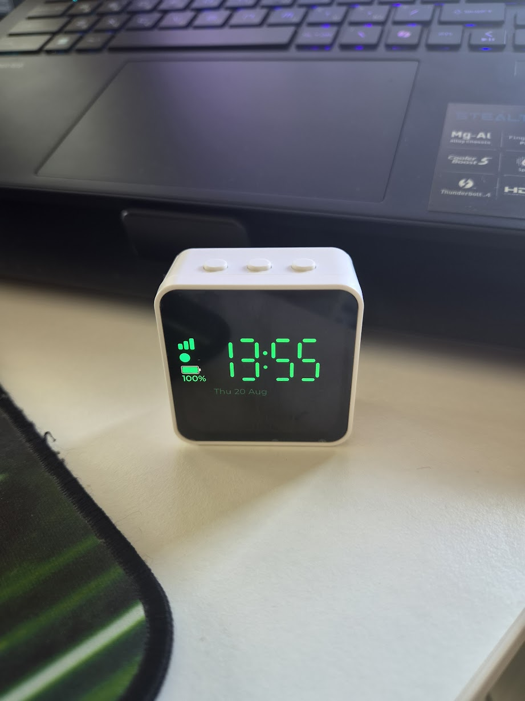

That press is the whole point. The verdict is signed with a key that lives on
this board and nowhere else, and the machine that asked for permission cannot
produce one. Nothing on the phone site, nothing on the console and nothing on the
network can answer for you.

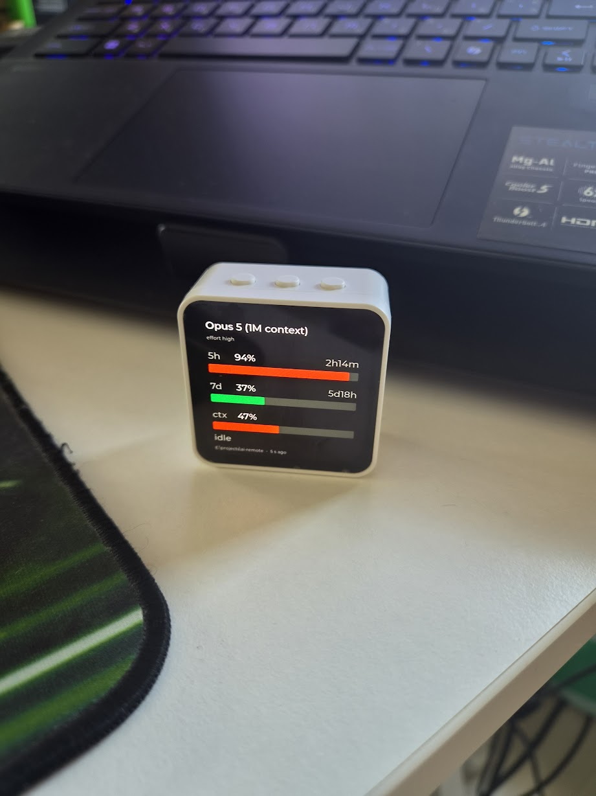

> This is the manual for **using** the device. Why it is built the way it is
> lives in the design documents — [`CLAUDE.md`](CLAUDE.md) is their map, and
> §10.2 there is the short version of where this device sits in the protocol.
> Every console command is in [`commands.md`](commands.md); flashing, ports and
> toolchain are in [`working-with-code.md`](working-with-code.md).

## Contents

- [The three buttons and the glass](#the-three-buttons-and-the-glass)
- [Turning it on](#turning-it-on)
- [The screens](#the-screens)
- [Getting around](#getting-around)
- [Setting it up the first time](#setting-it-up-the-first-time)
- [The configuration site, on a phone](#the-configuration-site-on-a-phone)
- [When it will not approve anything](#when-it-will-not-approve-anything)
- [Living with it](#living-with-it)
- [Where the rest of it is](#where-the-rest-of-it-is)
- [Inspiration](#inspiration)

## The three buttons and the glass

Three buttons on the top edge, and what each does depends on what is on the
screen. There are only three meanings to remember:

| Button | On a request card | Everywhere else |
|--------|-------------------|-----------------|
| **BOOT** | **ALLOW** | steps forward: the next row, the next status page, the next network |
| **KEY** — the free one | nothing | presses the selected row; **held two seconds** it opens settings |
| **PWR** | **DENY** | goes back one level. **Held six seconds it switches the board off**, whatever the firmware thinks |

Most screens that expect a press spell the mapping out along their bottom edge —
the request card, the touch test, the Wi-Fi screen and the scan all do — so it
rarely has to be remembered from here.

The glass is a touchscreen: tap a row to press it, drag a list to scroll it,
swipe up from the clock to open settings, swipe sideways to leave a screen.

**A request card takes the buttons away from everything else.** While one is up
there is no navigation, no back, and no way to hide it — a card can be answered
or it can expire, and that is all. There is deliberately no third button and no
✕, because "skip" is not one of the answers the protocol has.

## Turning it on

Press **PWR**. White katakana rains down the glass while the boot chime plays —
about three seconds — and then the clock appears.


Nothing else is needed on a device that has been set up once: the key, the
registration, the Wi-Fi networks and the bus address all survive a power cut.

## The screens

Seven of them, and two arrive on their own rather than being navigated to.

### Clock — where it lives

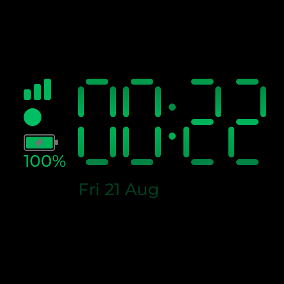

The time, the date, and three indicators down the left: the **Wi-Fi bars**, the
**bus dot**, and the **battery** with its percentage.

- The digits **drift a few pixels** around the panel and a wave of light runs
  through them. That is not a fault: this is an AMOLED, and a static bright shape
  left in one place for months burns in.
- `--:--` means the clock has never been set. A plausible wrong time would be
  worse.
- **The bus dot is the one to read.** Filled green means a message arrived in the
  last two minutes. Hollow means nothing has been asked of it. Red means it is
  not connected — and a device that is not connected cannot approve anything.

### Limits — what the session is spending

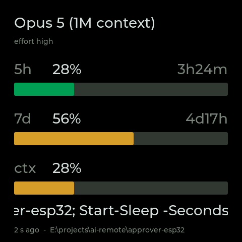

**This screen arrives by itself** and leaves a minute after the last update. The
model that is answering, the effort level, how much of the **5h** and **7d**
windows is spent with the time until each resets, how full the **context** window
is — and one line at the bottom saying what that session is *doing* right now,
with how old the numbers are and which directory they came from under it.

The gauges are green to half spent and amber past that; the context window turns
amber sooner. **PWR** dismisses the screen for the current burst of work — it
stays away until the stream goes quiet and starts again.

**Read the bottom-left corner before you trust the bars.** It says how long ago
the numbers arrived — `3 s ago` while a session is working — and if it says
`stopped` next to that, nothing has come for over a minute: the numbers are the
last ones there were, not the current ones. You can also reach this screen
yourself, by swiping left or right on the clock; reached that way it shows the
last numbers for a minute and then goes back to the clock on its own.

### Request — the screen it exists for

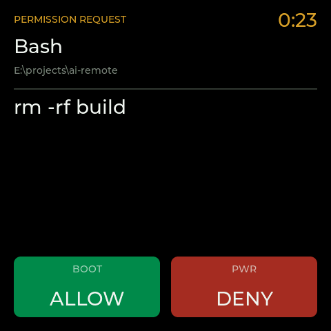

The tool name, the directory it would run in, **the whole command** — never
truncated — and a countdown.

- **BOOT allows. PWR denies.** Nothing else does either.
- **Press nothing and nothing is sent.** The request times out on the other end
  and Claude Code asks in its own terminal instead. That is the designed
  outcome, not a failure — silence is always the safe answer.
- Presses in the first third of a second after a card appears are ignored, so a
  tap already on its way down cannot become an answer.
- One short chirp per new card. Several cards arriving together make one sound.

### Settings — a list of places to go

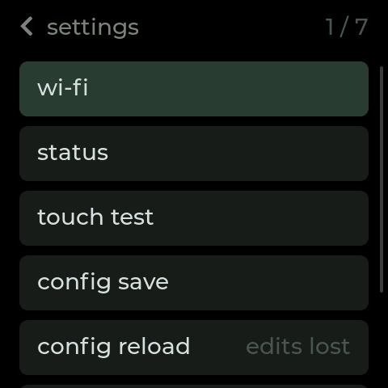

Swipe up, or hold **KEY** for two seconds. Seven rows, five on the glass at a
time — **drag the list** for the rest.

| Row | What it does |
|-----|--------------|
| **wi-fi** | the radio, the saved networks, and what is on the air |
| **status** | three pages of what the board is doing |
| **touch test** | check the glass, and correct it |
| **config save** | write everything set since boot to `config.json`, so it survives a restart |
| **config reload** | read the file back — **every unsaved edit is lost** |
| **reboot** | restart. Asks twice |
| **power off** | switch off at the power chip. Asks twice, and is **refused while the USB cable is in** — the hardware would bring it straight back up |

Anything picked with a finger or typed on the console is **in memory only** until
`config save`. A restart is exactly where unsaved settings go.

### Status — three pages

Press **BOOT**, or tap the body, to turn the page.

| Power | System | Motion |
|---|---|---|
| 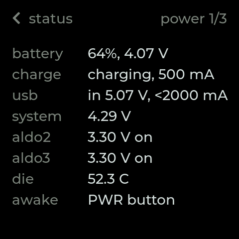 | 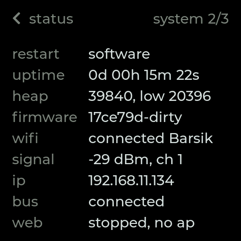 | 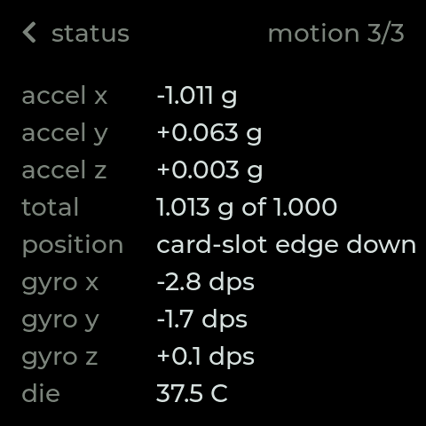 |
| the battery and its voltage, whether it is charging and at what current, whether the cable is in and what may be drawn through it, the regulators, the die temperature | why it last restarted, how long it has been up, free memory, the firmware build, the network, the bus, the web server | which way up it is standing, and what the accelerometer and gyro say |

**About the two currents on the power page.** The board cannot actually measure a
current — there is no meter in it — so those numbers are what the charger is *set
to*: `charging, 500 mA` means it is in the phase where it holds that current, so
that is about what is going into the battery, and `charging, <500 mA` means it is
finishing the charge somewhere under that. The `usb` row's number is how much the
device is allowed to draw from the cable, which is the other half of why a charge
does not go faster.

### Touch test — check the glass, and correct it

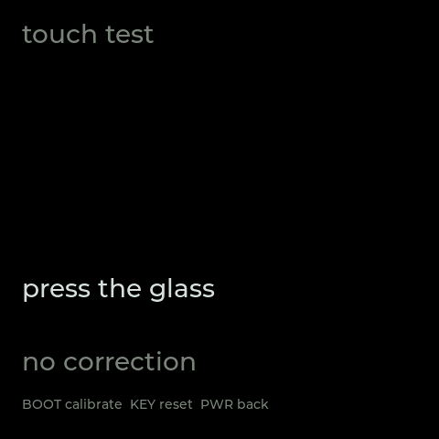

Press the glass and a mark follows the finger. If it does not land where you
pressed, **BOOT** starts the calibration: press each cross in turn and the
correction is applied at once. **KEY** throws the correction away.

A correction is a setting like any other — `config save` on the settings list is
what makes it survive a restart.

### Wi-Fi — the radio and one network

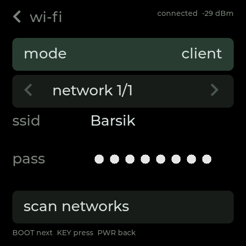

The mode across the top — **off**, **client** or **access point** — then one
network record at a time, and a way into the scan. **BOOT** moves the selection,
**KEY** presses it, **PWR** goes back.

There is **no keyboard on this screen yet**, so a network *name* can be picked
out of the air but a *password* still has to arrive over the USB console or the
phone site. The password is shown on the glass in full to whoever is holding the
device — it is blanked in the screenshot above, and it is never in a console
dump, because those get pasted into chat windows.

### Networks — what is on the air

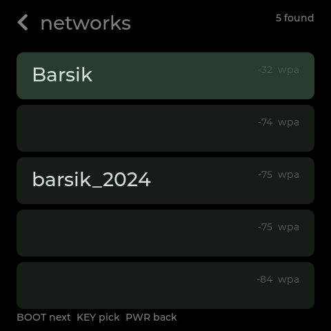

Opening this list starts a scan; the rows appear a second or two later, strongest
first, with the signal and the security of each. **KEY** picks the highlighted
one into the record that was on the Wi-Fi screen. Neighbouring networks are
blanked in the screenshot above; the device shows their names.

## Getting around

| To do this | Do this |
|---|---|
| open settings | swipe up, or hold **KEY** two seconds — from the clock and from the limits |
| go back one level | **PWR**, a swipe sideways, or tap the title |
| press a row | tap it, or **KEY** |
| move the selection | **BOOT**, or drag the list with a finger |
| leave the limits screen | **PWR** — it stays away until the work stops and starts again |
| answer a request | **BOOT** to allow, **PWR** to deny — and nothing else, ever |
| switch the board off | hold **PWR** six seconds, or the settings row with the cable out |

## Setting it up the first time

A new board needs three things: a network, a bus address, and a registration.
The first two can be done with a finger or from a phone; the third needs the USB
cable once, because the token is fifty characters that have to be transcribed
exactly.

Plug the cable in and open the console — [`working-with-code.md`](working-with-code.md)
has the port and the one command for it. Then:

```
wifi join <ssid> <password>        # or pick the name on the Wi-Fi screen
nats url nats://<host>:4222        # where the permission requests come from
config save                        # make both survive a restart
```

Check that both came up:

```
wifi        # state: connected, and an address
nats        # state: connected, and 'subs approvals.* in group approvers'
```

Then mint a one-time token on the machine running the registration handler, and
give it to the device:

```
register approver-esp32.<secret>
registered as approver-esp32, handler key Q15Mkg…
```

**Compare that handler key, once, against what the handler printed when it
started.** That comparison is the whole of trust on first use: after it the key
is pinned, and a reply signed by anything else is refused rather than believed.

One line says whether the device is actually answering:

```
request
answering  yes - listening on approvals.* in the group approvers
```

`yes` needs all three — a key, a registration, and a bus connection. When it says
`no` it names which one is missing.

> **Only one responder answers each request.** A device left powered on will
> quietly take requests away from the YubiKey responder and the browser page,
> because they all share the same queue group. That is the intended end state,
> and it is also the first confusing symptom while setting things up.

## The configuration site, on a phone

The device can serve a small site off its own filesystem — the state of the
board, the whole console dump, the Wi-Fi and bus settings, and a restart.

By default it comes up **only while the device is its own access point**, which
is the case it exists for: a board that cannot reach any network puts up
`approver-esp32`, you join it with a phone, and the page is there. `web on` on the
console serves it on the normal network too; `web auto` puts it back.

| The front page | Wi-Fi | The bus |
|---|---|---|
| 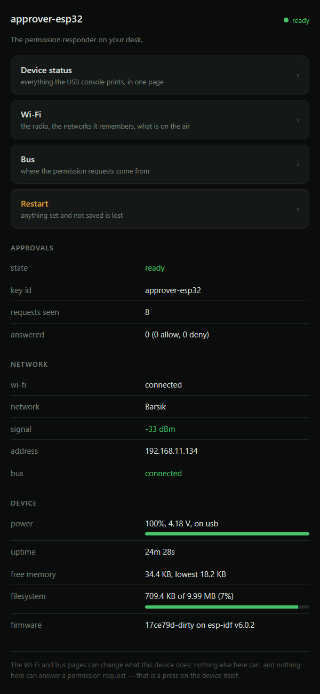 | 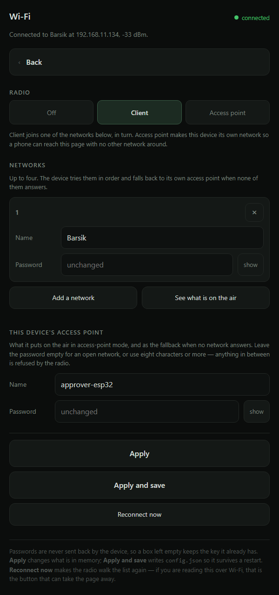 | 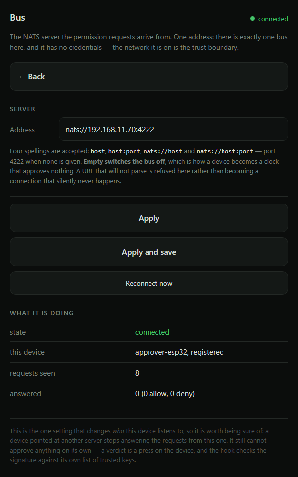 |
| where to go, and whether it could approve something right now | the mode, up to four networks, the device's own access point, and a scan | one address, and what the connection is doing with it |

| Device status | Restart | Anything else |
|---|---|---|
| 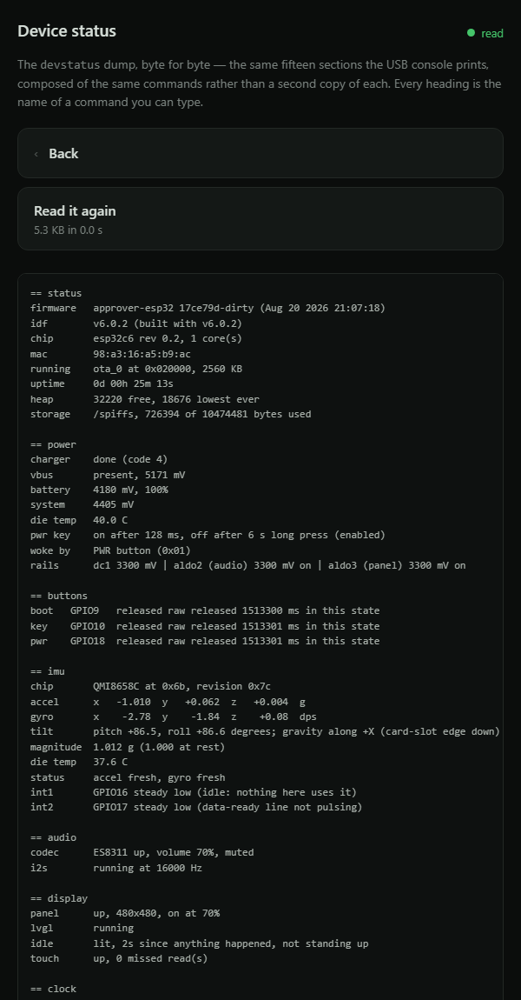 | 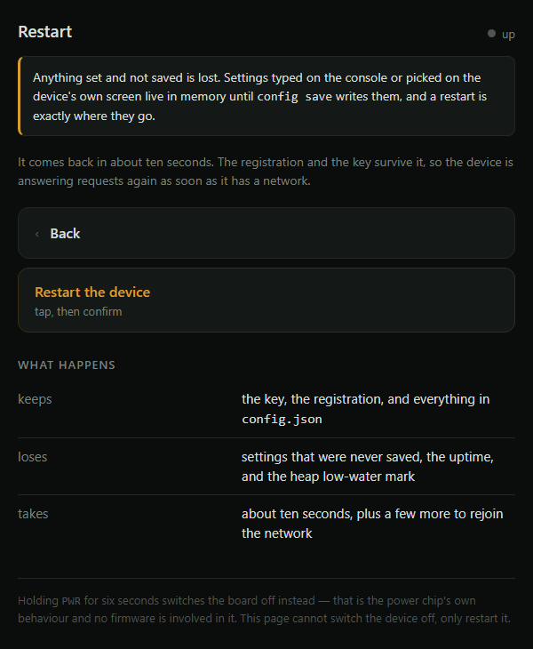 | 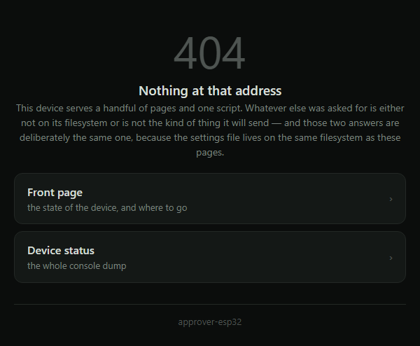 |
| the whole console dump, byte for byte, and a button that reads it again | asked for twice, and it says what an unsaved setting costs | one answer for a page that is not there and for a file it will not send |

Three things to know before using it:

- **Passwords are never sent back by the device.** A box that reads `unchanged`
  keeps the key it already has, so a form cannot lose one by being submitted.
- **Apply** changes what is in memory; **Apply and save** writes `config.json`.
  Same rule as the glass.
- **It is not TLS, and by default there is no password on it.** `web login <user>
  <password>` on the console puts basic auth on every route, including the reads.
  Anyone who can reach the device on the network can otherwise read these pages —
  and **nothing on them can approve anything**, which is the line that matters.

## When it will not approve anything

The clock says so in words rather than hiding it, and each of these has its own
console command to go and look at.

| What you see | What it means | What to do |
|---|---|---|
| bus dot **red** | not connected to NATS | `nats` — wrong address, no network, or the server is down |
| bus dot **hollow** | no bus address set at all | `nats url nats://<host>:4222`, then `config save` |
| Wi-Fi bars **hollow** | the radio is off | `config set wifi on`, or the Wi-Fi screen |
| the clock says it is not registered | it has a key but no registration | `keys`, then mint a token and `register <token>` |
| the boot self-test failed | this firmware would sign something nothing trusts | do not approve anything with it; it is a build problem, not a board problem |
| requests appear on another responder | they share the queue group | expected — stop the other one, or let it have them |
| nothing arrives at all | `request` says `answering no` and names the missing half | fix that half |
| a card timed out that you did answer | the press never reached the bus | `request`, line `unanswered` — the fail-safe working |
| `--:--` instead of a time | the clock has never been set | `date sync`, or `date set utc …` |

## Living with it

- **The panel dims** to 30 % after fifteen minutes of nothing happening, and goes
  **off** after twenty-five — but only when the board is standing on its USB
  edge, buttons up. Lying flat it dims and stops there, because a black square on
  the desk says nothing about whether the loop is alive. A live Claude Code
  session counts as something happening, so the screen stays lit while the work
  does.
- **The first touch after the screen has gone dark only wakes it.** It does not
  press what was underneath.
- **A request always wakes the panel**, whatever the timers say.
- **On the cable** it stays charged, and the settings row that switches the board
  off is refused — the power chip would bring it straight back up.
- **Restarting keeps** the key, the registration and everything in `config.json`,
  and **loses** anything set and not saved.
- **Volume and brightness** are `config set volume 0..100` and `config set
  brightness 0..100` on the console; `display brightness <0..100>` changes it
  without touching the setting.

## Where the rest of it is

| Question | Document |
|---|---|
| what every console command does | [`commands.md`](commands.md) |
| what the screens are, and why they behave that way | [`screens.md`](screens.md) — §10.8 |
| the phone site in detail | [`web.md`](web.md) — §10.16 |
| the board, the chips and the pins | [`hardware.md`](hardware.md) — §10.1 |
| the key, registration, and the wire protocol | [`protocol.md`](protocol.md) — §10.5–§10.7 |
| Wi-Fi, the settings file, the language rules | [`firmware.md`](firmware.md) — §10.9, §10.14, §10.15 |
| how to flash it, and how these screenshots were taken | [`working-with-code.md`](working-with-code.md) |
| what actually works, row by row | [`status.md`](status.md) |

## Inspiration

Two projects that put Claude Code on a small screen on the desk before this one
did:

- **[Clawdmeter](https://github.com/HermannBjorgvin/Clawdmeter)** — an ESP32 desk
  display for Claude Code usage: session and weekly utilisation on a Waveshare
  AMOLED board, paired to the computer over Bluetooth, with a Clawd mascot that
  gets busier as the rate climbs.
- **[clawdmeter-plus](https://github.com/sorryhumans/clawdmeter-plus)** — a fork
  that adds a second screen: weather, the health of background agents as a row of
  coloured dots, an animated pixel mascot, and a spoken greeting twice a day.

The limits screen here is the same idea reached from the same annoyance, and
[`statusline/`](../statusline/) is where its numbers come from. What this device
adds is the screen those two do not have: **the permission request, and a button
that answers it.**
