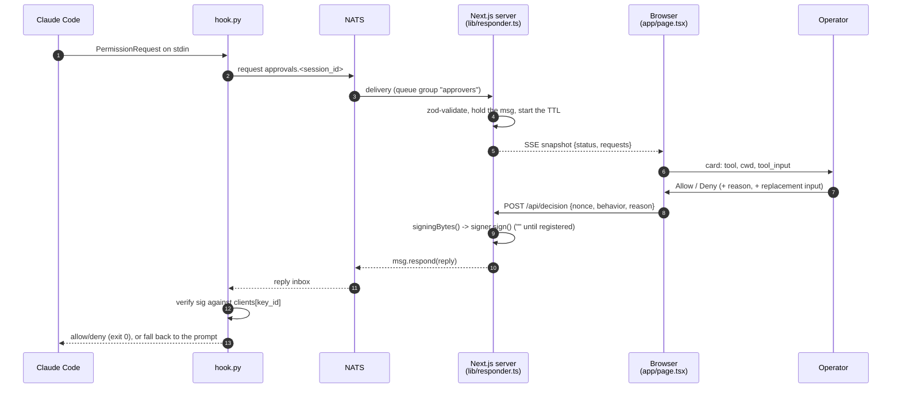

# approver-web — the responder as a web page

A third responder for the approval flow described in
[`../approver/CLAUDE.md`](../approver/CLAUDE.md) §6/§7, alongside
`approver/responder.py` (software key) and
`approver/responder_yubikey.py` (key on a YubiKey, the primary one). Same
subjects, same `handler-config.json` allowlist, same signing bytes — the hook,
the protocol module and the registration handler know nothing about this app and
did not change for it.

The difference is only the front end: instead of a console prompt, the operator
gets a page that lists pending requests and answers them with a button.

## Status: the loop closes

| Scope | State |
|-------|-------|
| See requests off the bus, answer allow/deny, reply into the request's inbox | done |
| Register a key with a one-time token (§6), from the page | done |
| Sign each decision so `hook.py` accepts it (§7) | done |
| Key custody: **non-extractable WebCrypto key in the browser**, surviving restarts | done |
| Several browsers at once, one `key_id` and one key each | done |
| All of the above as a committed, unattended test tier | done — `scripts\web-approval.cmd` |

**There is no private key on disk anywhere.** The pair is generated in the
browser with `extractable: false` and the `CryptoKey` is kept in IndexedDB, so
the private half cannot be exported by anything — including this app's own
server, which sees every request, answers the bus, and still cannot forge a
decision.

Verified end to end against the real `registration_handler.py` and
`hook.verify_reply`: a token minted by the handler, registered from the page,
then a decision the browser signed coming back `trusted=True`, with a flipped
`behavior` rejected. Persistence was verified the only way that means anything —
register, **close the browser completely**, relaunch it against the same profile,
and sign again: still `trusted=True`.

**And none of that is a claim about one afternoon any more.** All of it is
`tests/test_web_browser.py` — sixteen tests that start a handler and a dev server,
drive a real browser, and hand what it signs to `hook.verify_reply`, including the
close-and-relaunch and a second browser under a second `key_id`. See "Testing".

**A browser with no key cannot answer at all** — the decision form says so
instead of offering buttons, and the request simply expires, which is the §7
fail-safe: no reply, the hook times out, Claude Code asks in its own terminal.
Never a silent allow.

## Architecture



### Why the *server* holds the NATS connection

A browser cannot open a TCP socket to `:4222`. There were two ways out and this
app takes the second:

1. **`nats.ws` in the browser.** Requires a `websocket { … }` listener on the
   NATS server, i.e. editing `nats/docker-compose.yml` and opening another port.
   The page then *is* a NATS client — appealing, and worth revisiting if this ever
   has to run on a machine that is not the one the hook runs on.
2. **The Next.js server is the NATS client; the browser drives it over
   SSE + POST.** ← chosen.

Reasons for (2), in order of weight:

- **No infrastructure change.** The existing compose file and the Python
  responders keep working untouched; this app is additive.
- **The reply inbox has to be held somewhere.** A `Msg` is answerable only by the
  process that received it. Server-side, a page reload costs nothing; with
  `nats.ws` a reload drops every in-flight request on the floor.
- **`config.json` is read and written with `fs`,** exactly like the Python
  responders handle theirs — including the registered private key.
- **It keeps both custody options open.** The signing seam is a
  `sign(bytes) -> b64` callable (see "Key custody"); it can live on the server
  *or* in the browser (WebCrypto) without touching the transport.

Cost of (2), stated plainly: the machine running the Next server is a trusted
component. It sees every `tool_input` and it is what actually answers the bus.
That is the same trust level as the Python responders, which run on that machine
too — but it is *not* the same as "the browser is the responder", so a remote
operator on a phone is trusting the host in a way they would not with `nats.ws`.

### Modules

```
config.json              runtime config (git-ignored; config.example.json is the reference)
src/lib/
  protocol.ts            port of approver/protocol.py — canonical JSON, sha256, both signing-bytes shapes
  protocol.test.ts       cross-language parity vectors (node:test)
  keys.test.ts           parity vectors for the handler's ed25519 replies (node:test)
  schemas.ts             every zod schema: config, bus request, token, both POSTs, the registration reply
  config.ts              config.json loader + atomic save (server), plus the `clients` map: which key a decision is checked against, and the pre-`clients` migration
  config.test.ts         that map — two browsers coexisting, the lookup, the migration, a file round trip (node:test)
  keys.ts                verify a P-256 DER signature and an ed25519 one (server) — it cannot sign
  browser-key.ts         the key itself: generate, IndexedDB, sign (client only)
  browser-key-context.tsx  shares that key between the register panel and the cards
  reply.ts               signing bytes + reply assembly, used by BOTH sides
  responder.ts           server-only: NATS connection (named `approver-web` in /connz, `nats/CLAUDE.md` §4), pending map, TTL sweep, decide(), register()
  types.ts               types shared with the browser (kept out of responder.ts on purpose)
  use-approval-stream.ts client: EventSource -> snapshot, plus a ticking clock
  alert-sound.ts         the chirp, synthesised (client) — no asset, no dependency
  use-request-alert.ts   diffs snapshots for NEW nonces; sound + tab-title count
  statusline.ts          the status line's document off `status` (§9.7): schema, gauge scales, countdown
  statusline.test.ts     that wire format and the §9.2 scales, pinned
  activity.ts            what Claude is doing, off `activity` (§9.10): schema, headline, staleness
  activity.test.ts       that wire format pinned, including the `v` that makes a document ours
src/app/
  layout.tsx providers.tsx page.tsx      the single page
  theme.ts               the whole visual system (see "Look and feel")
  api/stream/route.ts    GET  — SSE, full snapshot per frame; opening it starts NATS
  api/decision/route.ts  POST — validate, sign, respond into the reply inbox
  api/register/route.ts  POST — one-time token -> a registered key (§6)
src/components/
  RegisterPanel.tsx StatusBar.tsx RequestCard.tsx DecisionForm.tsx SoundToggle.tsx
  StatuslinePlaque.tsx   the model and the limits, read-only (see "The model and limits plaque")
  ActivityLine.tsx       what Claude is doing, read-only (see "The activity row")
```

Mirrored from the Python side on purpose: `protocol.ts` ↔ `protocol.py`,
`reply.ts` ↔ `responder.build_signed_reply`. Keeping those seams in the same
places is what makes "does the web responder still match?" a question you can
answer by reading two short files.

The seam that differs: `responder.py` takes a `sign(bytes) -> b64` **callable**,
because its signer is in-process (a local key, or a YubiKey). Here the signer is
across an HTTP boundary and in a different runtime, so the split is data, not a
function: the browser computes `decisionSigningBytes()` and signs, the server
re-derives the same bytes and verifies. `reply.ts` is deliberately isomorphic so
both sides compute them with one implementation — which is also why
`protocol.ts` hashes through Web Crypto rather than `node:crypto`.

### Transport contract (browser ↔ our own server)

| Route | Shape |
|-------|-------|
| `GET /api/stream` | `text/event-stream`. Every frame is a **whole** `{status, requests, statusline, activity}` snapshot, so a reconnect needs no resync. `: ping` every 15 s. Opening the stream is what triggers the NATS connect — there is no connect button, because having the page open *is* being a responder. |
| `POST /api/decision` | `{nonce, behavior, reason, updated_input?, sig, key_id?}` → `{ok}`. The signature is made in the browser; the server re-derives the signing bytes **from the pending request it holds** and verifies before answering, so a caller cannot post one decision with a signature over another. `key_id` says which registered browser signed it — it *selects* a key and grants nothing, since the signature still has to verify under it. Absent, it resolves only while exactly one browser is registered. `409` = gone (expired/answered), no key registered, an unknown `key_id`, or the signature does not match. |
| `POST /api/register` | `{token, public_key, public_key_raw}` → `{ok, key_id}` \| `{ok:false, error}`. Only public material crosses; the private half never leaves the browser. `409` = the handler or the bus said no (bad/spent token, nothing listening), or the answer was not the registration handler's (unsigned, replayed, or signed by a key other than the pinned one) — and **nothing was persisted**. |

`nonce` is the entry id: it is unique per request and already on the wire.

### config.json

```json
{ "v": 1, "servers": "nats://127.0.0.1:4222", "subject": "approvals.*",
  "queue": "approvers", "request_ttl": 120,
  "status_subject": "status", "activity_subject": "activity",
  "clients": {
    "approver-web": { "key_type": "p256", "registered_ts": 1787240184,
                      "public_key": "<b64 33-byte compressed>",
                      "public_key_raw": "<b64 65-byte>" }
  },
  "server_key": "<b64 32-byte ed25519 — the registration handler>" }
```

**Public material only** — there is no private key to store. `public_key` is what
the allowlist holds; `public_key_raw` exists solely so the server can verify a
signature without recovering `y` from a compressed point (a modular square root);
`server_key` is the registration handler's own public key, pinned at registration
(§6) so a later registration can only be answered by the same handler.

**`clients` is keyed by `key_id`, deliberately the same shape as the allowlist in
`handler-config.json`** — one entry per registered browser, and the reason there
can be more than one (see "Registering more than one browser"). A registration
writes exactly one entry, so a second browser joins rather than evicting the
first, while re-registering the same `key_id` still rotates it — the handler's own
rule, kept on this side of the wire too.

**The single-key shape this app wrote before `clients`** — top-level `key_id`,
`key_type`, `public_key`, `public_key_raw` — is still accepted and migrated into
`clients` when the file is read, with a line on the console saying so. Reading a
config must not write one, so the file stays as it is until the next registration
saves the new shape. `config.test.ts` pins both directions.

Every field has a default, so the app runs with **no config file at all**;
`register` then writes it atomically (temp + fsync + rename, the way
`lib/config.py` does). `AI_REMOTE_WEB_CONFIG` overrides the location — how the
e2e run keeps its state out of the repo working copy.

**Two halves that can drift.** The server's `config.json` says *which keys are
registered*; IndexedDB says *this browser holds one of them*. Losing either is a
normal state, and each is reported separately: a browser with no key gets no
decision buttons, and a browser that finds no entry under its own `key_id` — or an
entry with a different key — gets a red line in the register panel (someone
rotated that `key_id` elsewhere, or this browser registered against another
config) instead of silently signing replies the hook throws away. That is the
check `responder_yubikey.py serve` does at startup, moved to where the mismatch is
visible. A browser looks itself up **by its own `key_id`**, not by "the"
registered key: with two browsers registered, the other one's entry says nothing
about this one.

`request_ttl` should be ≥ the hook's own `timeout` in `handler-config.json`,
otherwise a card disappears while Claude Code is still waiting.

`status_subject` and `activity_subject` are the two fields here that have
nothing to do with approving anything — they are the status line's subjects
(`statusline/CLAUDE.md` §9.7 and §9.10) and must match `subject` /
`activity_subject` in that binary's own `statusline-config.json` (§9.9). They
exist as config for the same reason the subject above does: all of them are names
on a shared bus, and none is worth a rebuild to change.

## Rules this app inherits (do not soften them)

- **No reply is the safe outcome.** Expiry, a signing failure, a closed tab —
  all end in silence, the hook times out, Claude Code shows its own prompt.
  Never invent a verdict, and never answer with a guess. There is no "skip"
  button because skipping is exactly *not pressing anything*.
- **Untrusted input on an open subject.** `approvals.*` is public to anyone on
  the bus. A non-JSON payload, a malformed request, a message with no reply
  inbox: dropped with one warning line, never crashes the subscription loop.
  Same rule as `lib/bus.py`.
- **The signature covers `updated_input`, which never travels as a hash.** The
  hook recomputes `sha256(canonical(updated_input))` from the object it received;
  if the responder signed something else, the signature simply fails.
- **`key_type` is pinned by the allowlist**, not by the reply. Nothing this app
  sends can select the verification algorithm.

### Canonical JSON: the one real interop trap

`approver/protocol.py` builds hashes with
`json.dumps(obj, sort_keys=True, separators=(",", ":"))` — and `ensure_ascii`
defaults to **True**, so Python escapes every non-ASCII character as `\uXXXX`
(lowercase). `JSON.stringify` emits it literally. Without the re-escape pass in
`canonicalJson`, any `updated_input` containing a non-ASCII character produces a
different hash on each side and every such decision is rejected with no
explanation beyond "signature verification failed".

`protocol.test.ts` pins this with vectors generated by the Python implementation
itself. Regenerate them with:

```powershell
py -c "import sys; sys.path.insert(0, r'E:\projects\ai-remote'); from approver import protocol as p; print(p.canonical_json({'text':'привет'}), p.canonical_sha256({'text':'привет'}))"
```

Known remaining gap: floats. Python's `repr` and JS number formatting agree for
everything realistic in a `tool_input`, but they are not the same algorithm. If a
tool ever ships a float in its input, add a vector.

## Look and feel

**The direction the repository owner asked for: soft rounded panels, green.**
The reference they pointed at is a modern SaaS marketing page — content sitting
on generously rounded cards over a calm background, green as the single brand
colour carrying buttons, badges and highlights. Concretely, for this app:

- **Generously rounded surfaces.** Cards, panels, inputs and buttons all
  visibly rounded; pills fully rounded. The radius is the signature, so it is
  consistent everywhere rather than tuned per component.
- **Green is the house colour.** One green as the primary accent, used with
  restraint on the things that matter, not painted across every surface.
- **A light green page, white cards floating on it.** The background itself is
  green (`#e9f7dd`, lettuce rather than mint), which is what makes the white
  cards lift; shadow rather than a heavy 1px outline separates them.
- **Quiet type, generous whitespace.** Spacing does the work; the type stays
  plain. No display face — see the dependency constraint below.

### How it is built

It all lives in **`src/app/theme.ts`** — `createSystem(defaultConfig,
defineConfig(…))`, handed to `ChakraProvider` by `providers.tsx`. Four levers,
chosen so that nothing has to be restyled component by component:

| Lever | What it does |
|-------|--------------|
| `semanticTokens.colors.bg.canvas`, used by `globalCss` on `html, body` | The page tint, `#e9f7dd` light / `brand.950` dark. Deliberately a **token, not a literal in `globalCss`** — one place to retune, and dark mode does not end up with a light-green page. It extends Chakra's `bg` group; `bg.subtle` and `bg.panel` are untouched, so the cards keep lifting off it. The hue leans warmer than the brand ramp: a light tint *of* `#2a8256` reads mint, not lettuce. |
| `semanticTokens.radii` `l1`/`l2`/`l3` → `lg`/`2xl`/`3xl` (0.5 / 1 / 1.5 rem) | Chakra's recipes never hardcode a radius: `Card` uses `l3`, `Button` / `Input` / `Textarea` / `Badge` use `l2`. Remapping three tokens rounds the whole UI, including components nobody has used yet. Defaults were xs/sm/md — barely rounded at all. |
| a `brand` palette (scale + the 8 semantic entries) | `brand.solid` = `#2a8256`, 4.7:1 against white so button labels stay AA-legible. Chakra's built-in `green` is left alone for success semantics. Without the semantic entries (`solid`, `fg`, `subtle`, …) `colorPalette="brand"` renders unstyled. |
| recipe defaults: `badge.base.borderRadius: full`, `card` variant `elevated` | Pills, and raised panels instead of outlined boxes, repo-wide. Both merge into Chakra's recipes rather than replacing them (verified: the badge base keeps its `display`/`gap`/`fontWeight`; `Code`, which borrows badge's *variants* but has its own base, correctly stays `l2` and does not become a pill). |

There is deliberately **no global `colorPalette: "brand"`**. Green is the
accent, not the paint — see constraint 1 below for why that matters more here
than it would on a marketing page. It is applied by hand in exactly three
places: the Allow button, the healthy status badges, and one dot next to the
page title.

Verified twice over: at the token level (`system.token(...)` resolves the radii
to 0.5/1/1.5 rem, `--chakra-colors-brand-600` to `#2a8256` and
`--chakra-colors-bg-canvas` to `#e9f7dd`), and in a real browser via
`agent-browser` against
`run.cmd --prod`, with requests parked on the bus so the cards had something to
render.

That browser pass is also how the **decision options ended up collapsed**. With
`Reason` and `Replacement input` open on every card, four requests ran to a
4 400 px page and the buttons were buried; collapsed behind one
`Collapsible.Root` trigger the same page is 2 900 px and every card ends in its
two buttons. Both fields are optional, so nothing needed is hidden — and the
panel is **forced open whenever `errors.reason || errors.updatedInput`**, since
a validation message nobody can see is worse than a tall page.

**Two constraints that outrank the aesthetic.** They are not style preferences:

1. **This is a decision surface, not a landing page.** Allow and deny must stay
   instantly distinguishable at a glance and must never be separated by colour
   alone. If green becomes the house colour, `Allow` cannot simply be "the green
   one" — deny keeps its own weight (colour *and* shape/label/position), and the
   thing an operator is agreeing to has to stay more prominent than the button
   agreeing to it. A prettier page that makes it easier to click Allow by reflex
   is a worse page.

   How `DecisionForm` and `RequestCard` currently honour that: both buttons are
   **solid, `size="lg"`, the same width** — neither is the quiet secondary one
   you dismiss, and they are told apart by their labels, not only by green vs
   red. Above them, the `tool_input` is the heaviest element on the card (its
   own labelled block, `size="lg"`, generous padding) while the metadata around
   it is small and muted. Collapsing the optional fields serves this too: what
   a card now ends with is the command, then the two answers, with nothing
   between them. Keep it that way — if a redesign makes Allow the obvious
   default, it has regressed regardless of how it looks.
2. **No new dependencies for looks.** Root §1 requires sign-off for any package,
   which includes web-font, icon and animation libraries. The direction above is
   reachable with Chakra tokens and system fonts alone; if it genuinely is not,
   ask before installing.

The `frontend-design` skill (see "Skills") is the one that fires on this work.
Read it for judgement, but this section wins where they differ: it is written for
distinctive brand identity, and this page is a tool.

## Stack

Everything here was named in the request, plus the two things it implies:

| Dependency | Why |
|------------|-----|
| `next`, `react`, `react-dom` | app router, server routes for the NATS half |
| `@chakra-ui/react` + `@emotion/react` | UI (emotion is Chakra's required peer) |
| `react-hook-form` + `@hookform/resolvers` + `zod` | the decision form, and zod also validates config + everything off the bus |
| `@nats-io/transport-node` | the NATS client. **Not `nats`** — that package is published-deprecated in favour of this one |
| dev: `typescript`, `@types/*` | — |

**No test-runner dependency.** Tests are `node:test` + Node's native TypeScript
type stripping: `npm test`. The repo's TDD rule (root §1) applies here as it does
to pytest — behavior changes come with tests.

Conventions worth knowing before editing:

- Imports are **extensionless** everywhere except `protocol.test.ts`, which
  imports `./protocol.ts` with the extension because Node's ESM resolver
  requires it. `allowImportingTsExtensions` is on for that one file. If a future
  test needs a module that imports others, either add the extensions along that
  chain or give in and add a runner.
- `serverExternalPackages: ["@nats-io/transport-node"]` in `next.config.ts`
  keeps the Node client out of the bundler.
- `loadConfig()` reads a runtime path, so the `readFileSync` call carries a
  `/* turbopackIgnore: true */` comment — without it the build traces the whole
  project into the server output.
- The responder is a single instance parked on `globalThis`, so dev-server hot
  reload does not leave a second subscriber in the queue group.
- **Never branch on the environment during render.** The first client render has
  to produce the same HTML the server did, or React throws a hydration error and
  regenerates the tree. `useRequestAlert` got this wrong once: it called
  `audioSupported()` (which tests for `window`) while computing the label, so the
  server rendered `Sound unavailable` and the browser `Sound — click to enable`.
  The rule that fixes it: initialise such state to a **constant** and correct it
  in a mount effect. Assume the capable case, so the common path never flashes.
  Same trap applies to `localStorage` and to `Date.now()` — `useNow` gets away
  with the latter only because nothing renders a card server-side.
- `<body suppressHydrationWarning>` in `layout.tsx` is for a different cause:
  extensions (Grammarly and friends) add attributes to `<body>` before React
  hydrates, and each one is reported as a mismatch nobody can fix from here. It
  suppresses exactly that element's attributes, not anything inside it.
- **A hydration warning that is not a bug: emotion class names after a long dev
  session.** A `next dev` left running for hours can serve HTML whose emotion class
  differs from the one its freshly compiled client computes. React then reports
  "some attributes of the server rendered HTML didn't match", pointing at whichever
  `<Text>` renders first — which looks like a real mismatch in whatever component
  you touched last. Measured here: server `css-ap60qa` = `{font-size; color}`,
  client `css-1rb706t` = `{color; font-size}` — the **same two declarations in a
  different order**, nothing rendering differently, and 38 of the page's 39 rules
  byte-identical. Chakra's own `css()` normalises to `color` first in both its CJS
  and ESM builds, and a **freshly started** dev server, `next start` on a
  production build, and the browser all agree on `css-1rb706t`. So it is stale
  module state: the emotion cache is a module-level singleton and survives Fast
  Refresh — touching a file recompiles the component but does not clear it.
  **Restart the dev server before investigating a class-name-only mismatch**, and
  do not try to fix it by reordering style props: the order in the JSX is not what
  ends up in the CSS.
- `agentRules: false` in `next.config.ts`. Without it `next dev` appends a
  generated block to this file on every run. Its actual point is worth keeping,
  so: **Next 16 is not the Next.js most training data describes** — app router,
  Turbopack by default, `serverExternalPackages`, async request APIs. The version
  in use ships its own docs in `node_modules/next/dist/docs/`; read those rather
  than recalling Next 13/14 conventions.

## Skills

Five skills are installed **for this folder only**:

| Skill | Source | What it is |
|-------|--------|------------|
| `vercel-react-best-practices` | `vercel-labs/agent-skills` | React/Next performance rules from Vercel Engineering (78 of them: re-renders, bundle, server components, async) |
| `vercel-composition-patterns` | `vercel-labs/agent-skills` | component API design — compound components, children over render props, React 19 without `forwardRef` |
| `web-design-guidelines` | `vercel-labs/agent-skills` | reviewing UI code against the Web Interface Guidelines (accessibility, UX) |
| `frontend-design` | `anthropics/skills` | visual design direction when building or reshaping UI |
| `next-dev-loop` | `vercel/next.js` | verify a change in a *running* app, not just that it compiles — pairs `/_next/mcp` with a browser |

They live in `approver-web/.claude/skills/`, and Claude Code scopes skills by
directory: they surface as `approver-web:<name>` and win only while the work is
inside this subtree. The Python half of the repo never sees them — which is the
point, since every one of them is about React or Next.

### How they sit with this app

Checked once, deliberately, because five overlapping rule sets pointed at one
small app is how contradictory advice gets followed. No two of them contradict
each other: names are unique, frontmatter matches the directories, nothing
shadows a user-level skill (there are none), and `frontend-design` (build) and
`web-design-guidelines` (review) are opposite halves of the same job. What
matters is where each one meets *this* codebase:

- **`next-dev-loop`'s prerequisite is now installed.** It names
  `agent-browser >= 0.31.1` and `/_next/mcp` as "hard floors, not soft
  preferences", and stops rather than degrading to grep. Next 16.3 + Turbopack
  satisfies its half; `agent-browser` 0.33.2 is installed globally, plus its own
  Chrome via `agent-browser install` (~190 MB under `~/.agent-browser`).
  **Drive it from Git Bash, not PowerShell** — every `agent-browser` command run
  through the `agent-browser.ps1` shim hung with no output until it was killed
  (three attempts, 180–300 s each); the same commands return instantly under
  `bash`. Both shells are available here, so this costs nothing once you know.
- **`web-design-guidelines` downloads its actual rules at review time** from
  `raw.githubusercontent.com/vercel-labs/web-interface-guidelines`. The skill
  itself is a 30-line wrapper, so `skills-lock.json` pins the wrapper, not the
  instructions that end up executing — and offline it does nothing.
- **`frontend-design` is written for brand work**: name a subject, pick display
  typefaces, take an aesthetic risk, build a signature element. This page is a
  utilitarian panel on Chakra defaults, and the repo bans new dependencies
  without sign-off (root §1) — which is where "characterful typography" usually
  starts. Useful for judgement, not a mandate to redesign.
- **`server-no-shared-module-state` (impact HIGH) does *not* condemn
  `responder.ts`.** The rule is about request-scoped data in module scope; its
  Safe exceptions list "process-wide singletons that do not store request- or
  user-specific mutable data", which is exactly what the `globalThis` responder
  is. Do not "fix" it into per-request state — that would open a second NATS
  subscription per viewer.
- **`bundle-barrel-imports` (impact CRITICAL) points at `@chakra-ui/react`** — a
  large barrel that Next's built-in optimize list genuinely does not cover
  (`@chakra-ui` appears nowhere in `next/dist`, while `lucide-react`,
  `@mui/material` and dozens more do). Its remedy is
  `experimental.optimizePackageImports`, not deep imports. **Tried, measured,
  reverted:** clean builds with and without the flag both produce 1 134 KB of
  client JS across 12 files, with build time inside the noise. The option is not
  being ignored — Turbopack supports it (its entry is commented out of
  `lib/turbopack-warning.js`'s unsupported list) — there is simply nothing left
  to strip, because Turbopack's own tree-shaking already got there. Do not
  re-add it on the strength of the rule's CRITICAL label; re-measure instead.
- **Two Next skills suggest `npx @next/codemod agents-md`**, which writes into
  `CLAUDE.md` / `AGENTS.md` — the thing `agentRules: false` exists to prevent.
  They do say to ask first. The answer for this repo is no.

**Removed on purpose:** `next-cache-components-adoption`,
`next-cache-components-optimizer`, `next-partial-prefetching-adoption`. They
arrived with the `vercel/next.js` set and actively fight this app — Cache
Components requires every route to be prerenderable and the migration deletes
`export const dynamic = "force-dynamic"`, which both API routes need (an SSE
stream and a held reply inbox are dynamic by definition). The payoff would have
been zero anyway: one dynamic page has nothing to prerender or prefetch.

**Git: the skills are ignored, `skills-lock.json` is committed.** 94 files of
third-party markdown do not belong in this repository's history; the lock file
pins each skill to its source and content hash, and restores them:

```powershell
npx skills experimental_install      # rebuild .claude/skills from the lock file
npx skills list                      # what is installed
npx skills update                    # refresh + rewrite the lock file
```

Adding another one — list first, then install by name:

```powershell
npx -y skills@latest add <owner>/<repo> -l                       # what is in there
npx -y skills@latest add <owner>/<repo> -a claude-code -s <name> --copy
```

Every one of these was learned the hard way:

- **`-a claude-code` and `--copy` keep the tree clean.** The default installs for
  ~19 agents at once and produces `.agents/skills/` (real files) plus junctions
  in `.claude/skills/` and `agent/skills/`. On Windows **git walks through
  junctions**: `git add -A` then stages the same files three times.
- **`-s` takes no comma-separated list.** It silently prints the available skills
  and exits 1. Repeat the flag: `-s one -s two`.
- **Never `-s "*"` on a repository that is not a skills repository.** `vercel/next.js`
  advertises 4 skills through `-l`; `*` matched **21**, dragging in the skills the
  Next.js team uses to maintain the framework itself — `backport-pr`, `react-vendoring`,
  `v8-jit`, `sandbox-bench`, `pr-status-triage`. Removing them afterwards works
  (`remove -s <name>` repeated, the lock file is rewritten correctly), but `-l`
  first costs nothing.
- **`vercel-labs/next-skills` is an empty pointer now.** The CLI reports "No
  skills found" and exits 1; the Next.js skills moved into the framework
  repository so they stay version-matched, and install from `vercel/next.js`.

The CLI prints a third-party risk assessment per skill and warns that skills run
with full agent permissions — `web-design-guidelines` came back "Med Risk" from
Snyk, everything else "Low"/"Safe". They are instruction markdown, not code, but
that is a reason to read a skill before trusting it, not a reason to skip reading.

## The new-request alert

The page exists to be watched while you look at something else, so an arriving
request chirps and the tab title carries the count — `(2) approver-web`.

- **Synthesised, not a file.** Two sine tones through a gain envelope
  (`alert-sound.ts`): no asset in the repo, no dependency to approve (root §1),
  nothing fetched at runtime. The envelope is not decoration — ramping the gain
  over 8 ms at each end removes the click a bare start/stop produces, which
  otherwise reads as a fault rather than a notification.
- **The first snapshot never sounds.** Opening the page with four requests
  already waiting is not four events, and a beep on every reload trains you to
  ignore it. `use-request-alert.ts` adopts the first snapshot silently, then
  diffs **nonces** — not lengths, because one request expiring as another
  arrives leaves the count unchanged.
- **The toggle is also the gesture.** Browsers refuse audio until the page has
  had a real user interaction, so the context starts suspended and the button
  reads `Sound — click to enable`. Clicking it in that state **unlocks** rather
  than switching the preference off — an early version did the opposite of its
  own label. The preference itself lives in `localStorage`.

Verified in a real browser: a synthetic `element.click()` does **not** count as
a user gesture (the context stays suspended), while `agent-browser click`, which
dispatches a real input event, unlocks it — worth knowing before concluding the
audio is broken. With sound on, one new request produced exactly two oscillators
(one two-note chirp) and six seconds of ordinary snapshot churn produced none.

## The model and limits plaque

The page also watches the **status line's** subject — `status`, the document in
`statusline/CLAUDE.md` §9.7 — and draws it under the requests, above the register
panel:

```
Opus 5 (1M context)  (high)  claude-opus-5[1m]                    2s
5h   ▬▬▬▬▭▭▭▭▭▭  22%  4h22m      7d  ▬▬▬▬▬▭▭▭▭▭  31%  3d20h
ctx  ▬▬▬▭▭▭▭▭▭▭  15%
E:\projects\ai-remote
```

`(high)` is `effort.level` as a pill next to the name — the same pairing the
terminal line makes with `· high`, since the effort is what *this* model is
currently doing. On the wire it is a sibling of `model`, not a field inside it,
because §9.7 keeps the payload's shape.

**Nothing about the approval flow changed for it.** It is a second subscription on
the connection that was already open, it is never answered, and the request path
does not read it. Removing `StatuslinePlaque` from `page.tsx` would leave a
working responder — which is the test for whether this stayed a readout.

- **Where it sits.** Under the requests and above the register panel. It was
  briefly at the top, on the argument that "95% of the five-hour window is gone"
  is input to the decision on the card below — but that is an argument for having
  it on the page, not for putting it ahead of the cards, and the ordering rule
  here does not bend for a readout: nothing that only needs a glance may push the
  requests down. Ahead of registration, because unlike that once-per-browser
  errand these numbers keep changing.
- **Three rows, and the two windows share one.** `5h` and `7d` are the same
  measurement over two periods and are read as a pair — as they are on the
  terminal line — so they sit side by side and wrap to two rows only when the card
  is too narrow for both. `ctx` gets its own row below them.
- **Quiet by construction.** Thin bars capped at `9rem` rather than full-width,
  small type, no control on it. Full-width bars were tried first and made three
  green lines the loudest thing on the page — which loses to constraint 1 under
  "Look and feel": the two buttons on a card must stay the heaviest elements.
- **The traffic light is §9.2's, not a new one.** `GAUGE_SCALES` in
  `statusline.ts` carries `render.rs`'s two scales — a rate-limit window is green
  to 50% spent and yellow to 80%, the context window green to 20% and yellow to
  45% — and a test pins both plus the fact that they cannot drift into each other,
  mirroring the Rust test that does the same. Yellow maps to Chakra's `orange`,
  the palette the status bar already uses for warnings: a literal yellow does not
  survive a white card.
- **The countdown is recomputed here.** `resets_in_text` arrives already resolved
  against the publisher's clock at `ts`, which is right for a subscriber that
  distrusts its own clock and wrong for a page left open for an hour. So the
  plaque recomputes from `resets_at` against its ticking clock (the same `useNow`
  the cards use) and keeps the published text only as the fallback for a window
  that came with no reset time. `countdown()` is a port of `render.rs::countdown`,
  tested against the same cases, so the two spell `1h59m` and `<1m` alike.
- **Silence is not freshness.** The line publishes on every render and nothing is
  persisted (§9.7: a current value, no stream), so an idle session simply stops
  publishing and there is nothing to catch up on when this app starts. The plaque
  therefore always shows the document's age, and past `STALE_AFTER_MS` (2 min) adds
  a `stale` badge instead of dropping the numbers — a stale percentage is still
  the best available answer, as long as it does not claim to be current.
- **One subject, every session.** Every Claude Code session on the machine
  publishes to `status`, so this is whichever rendered last, not necessarily the
  session that sent the requests above it. Hence the `cwd` line and the age:
  without them the plaque reads as belonging to those cards. If that ever needs
  fixing properly, the document carries `session_id` and so does every request —
  the join exists, it is just not worth the state today.
- **Junk is dropped, the last good document stays.** `status` is as open as
  `approvals.*`: `statusDocSchema` rejects a non-JSON payload, a document missing
  `ts`/`line` (the two fields §9.7 always sends — on an open subject that is the
  cheapest way to tell it is ours) or a percentage that is not a number, with one
  warning line, and the readout keeps what it had. Percentages are clamped 0–100
  a second time here, because a bar drawn from someone else's `130` overflows its
  track.
- **No queue group on this subscription**, unlike `approvals.*`. A decision must
  be made exactly once; a broadcast of a current value is meant to reach every
  subscriber, and joining a group would mean sharing it with other watchers.

Every status message calls `notify()`, so each one becomes an SSE frame with the
whole snapshot. That is a handful of bytes on loopback at status-line cadence, and
it keeps one rule: the browser never has a partial view.

Verified live against the real publisher — this repo's own Claude Code session,
whose status line was publishing to `status` throughout — with the app pointed at
an isolated `approvals-verify.*` via `AI_REMOTE_WEB_CONFIG` so it could not steal
that session's actual permission requests out of the `approvers` queue group.
**Do that too when checking this**: the alternative is a page that catches your
own prompts while you work. All five states were driven through a browser: a full
document, a synthetic stale one at 95%/70%/60% (red, orange, red — and `stale`
with a `10m` age), junk on the subject (warned, previous document kept), a
`{ts, line}`-only document (`limits n/a`), and nothing published at all.

## The activity row

Under the plaque, one line, off the **`activity`** subject — the document in
`statusline/CLAUDE.md` §9.10, published by the same binary from Claude Code's
`PreToolUse` / `PostToolUse` / `Stop` hooks:

```
● running   Bash · py -m pytest -q                                        2s
○ idle                                                                   4m
```

The plaque above says what the session is *spending*; this says what it is
*doing*. Same posture as the plaque in every way that matters — a second
subscription on the connection that was already open, never answered, no queue
group, and the request path does not read it. Deleting `ActivityLine` from
`page.tsx` leaves a working responder.

- **A card of its own, not a fourth row in the plaque.** The two publishers are
  independent: hooks fire on tool calls, the status line on renders, and either
  document can arrive with the other absent. Folding them into one card would mean
  one placeholder having to explain two silences.
- **Quieter than the plaque, which is already quiet.** A dot, the state, the
  headline in mono, the age. No badge, no bar, no control — and **nothing red**:
  a busy session is not a problem, and red on this page belongs to a denial.
  The dot is filled while there is work and hollow when the turn is over, the same
  lamp shape as the connection dot in the header and the one at the head of the
  terminal line (§9.2).
- **The headline is `tool · summary`,** prefixed with the subagent when there is
  one (`Explore › Grep · TODO`). The tool name comes first because it is the part
  that is always there; the summary is what makes the row worth reading. A tool
  with nothing worth quoting (`TodoWrite`) shows its name alone, and a document
  with no tool at all — every `stop` — shows its state.
- **Truncated with a `title`.** The publisher already cut the summary to 80
  characters (§9.10) and a narrow window may not have room even for that, so the
  line truncates and the full text stays recoverable on hover.
- **`idle` never goes stale; busy does, after ten minutes.** Longer than the
  plaque's two minutes and for a different reason: the status line republishes on
  every render, so silence there means something stopped, while hooks only fire
  when a tool runs — a session thinking hard, or parked on a permission request,
  legitimately says nothing for a while. Ten minutes is where "running Bash"
  stops being believable, and past it the row greys out rather than disappearing.
  A `stop` document is exempt: "idle" stays true until something else happens, and
  greying it would suggest the session vanished when it is simply done.
- **`v` is what makes a document ours.** `activity` is as open as every other
  subject, and unlike the status document there is no always-present pair of
  fields to recognise (§9.10). So `activityDocSchema` requires `v: 1` and rejects
  an event or state outside the two enums — a page older than the publisher says
  nothing rather than rendering a word it cannot colour — and a rejected message
  leaves the previous row exactly as it was.
- **One subject, every session**, with the same caveat as the plaque: this is
  whichever session ran a tool last, not necessarily the one that sent the cards
  above. The document carries `session_id`, so the join exists if it is ever worth
  the state.

Verified against the real publisher — this repo's own session, its hooks
publishing to `activity` while the work was being done, `nats sub activity`
showing `pre_tool` / `post_tool` pairs with matching `tool_use_id` and the `Stop`
document carrying none of the assistant's prose.


## Run — `run.cmd`

The front door. It resolves its own directory first, so it works from anywhere:

```bat
REM plain console, no elevation:
approver-web\run.cmd                REM dev server on http://localhost:3000/

REM or from inside approver-web\:
run.cmd --port 3100                 REM a different port
run.cmd --prod                      REM npm run build, then serve that build
run.cmd --install                   REM force npm install (after editing package.json)
run.cmd --help
```

A normal start looks like this — three numbered steps, then Next takes over:

```
[1/3] dependencies ok
[2/3] NATS port 4222 is listening
[3/3] starting the dev server on http://localhost:3100/ - Ctrl+C to stop

> approver-web@0.1.0 dev
> next dev --port 3100

  Next.js 16.3.0 (Turbopack)
  - Local:   http://localhost:3100
```

- Step 1 runs `npm install` when `node_modules` is missing (first clone) or when
  `--install` says so.
- Step 2 is a **warning only**: with nothing listening on 4222 it prints how to
  start NATS and carries on. The app runs fine without a bus and reports the
  broken link in its own status bar — better than a script refusing to start.
- Exit codes: `0` the server exited cleanly (Ctrl+C), `1` it could not start —
  no node/npm on PATH, `npm install` failed, or `--prod` failed to build. Each
  prints which one.

**`allowedDevOrigins` in `next.config.ts` is why any of the spellings work.**
`next dev` serves its own client chunks and HMR socket to the origin it prints —
`localhost` — and *only* that one; `http://127.0.0.1:3000/` is a different origin
by that rule. Hit it without the setting and the page arrives server-rendered and
looks right, never hydrates, and every live part of it — the cards, the buttons,
the register panel — sits in its loading state forever, with nothing to go on but
a `Blocked cross-origin request to Next.js dev resource` line in this server's own
output that nobody is reading.

So the config lists both spellings of loopback and the private LAN ranges, the
last of those because a second responder on a phone ("Registering more than one
browser") reaches this machine by address rather than by name. Verified on all
three: `localhost`, `127.0.0.1` and this machine's LAN address all hydrate and
answer, with no blocked-resource line left in the log.

**It opens nothing** — it gates who may fetch a chunk, not who may reach the page.
`next dev` binds every interface either way, and the page has no authentication
(the last section here). Whether this app may be reachable off this machine at all
is that decision; this list only stops the dev server lying about it.

Unlike everything in `scripts\`, this needs **no elevation and no venv**: it is
the Node half of the repo and touches no FIDO device. The file is CRLF and opens
no parenthesised `if` blocks, for the reason `scripts\yubikey-approval.cmd`
documents at length.

## Testing

Two tiers, and the split is where the key is.

```powershell
npm test        # protocol parity vs. the Python vectors, plus the §9.7 status
                # document, the §9.2 gauge scales, the §9.10 activity document
                # and the `clients` map — no NATS, no browser
npm run build   # type-checks everything, including the tests
```

```powershell
scripts\web-approval.cmd    # the browser tier: a real browser, a real key,
                            # a reply hook.verify_reply calls trusted
```

**`npm test` can never see a signature.** It checks byte strings, which is most of
the interop risk (canonical JSON, both signing-bytes shapes, the two watch-only
documents) — but the private key exists in no file this suite can read, so the
one thing it cannot check is the thing this app is for.

That is `tests/test_web_browser.py`, on the Python side because the judge is
`hook.verify_reply` (`tests/CLAUDE.md`, "And one that is about a browser"). It
starts a registration handler and a dev server, drives a real browser through the
`Register` panel with `agent-browser`, sends a §7 request, clicks Allow, and hands
the reply to the hook — then closes the browser, relaunches it on the same
profile, and does it again to show the key survived; then registers a *second*
browser and has both answer. Sixteen tests, about 35 seconds, opt-in on
`AI_REMOTE_WEB_BROWSER=1`, and it gives the app under test its own subject and
queue group so it cannot answer a live request or lose one.

**Two things about running the node tests unbundled.** `node --test` resolves ESM
specifiers strictly, so the two modules the `clients` test reaches — `config.ts`
and `schemas.ts` — import their neighbours with an explicit `.ts` extension
(`allowImportingTsExtensions` is already on, and Turbopack resolves them too).
Every other module here is only ever bundled and keeps the extensionless form.
And `config.test.ts` writes real files, because `saveConfig` → `loadConfig` losing
a registration is exactly the failure that costs a spent token.

For a live check by hand — one request, and the alert firing on demand —
`scripts\test-request.cmd` is the short way in.

A live check without Claude Code: bring NATS up (`cd nats && docker compose up
-d`), start the app, then from the repo root send a §7 request with
`lib/bus.py` and answer it with a `POST /api/decision`. The reply comes back on
the requester's inbox and `hook.verify_reply` rejects it for exactly one reason —
`signature verification failed` — with every echoed field already correct. That
is the phase-1 finish line, and it has been run.

**A running instance joins the `approvers` queue group and competes with the
Python responders for real traffic.** This was observed during that check: the
app started catching live `PermissionRequest`s from the Claude Code session in
this very repository. Run **one** responder at a time. It is also a fine way to
watch what the hook sends — just be aware that whatever it catches, the YubiKey
responder does not see.

## Registration and signing

### The `Register` panel

**Below** the requests, collapsed once **this browser** holds a key and open
while it does not — because until then it cannot answer anything. It sits under
the cards rather than above them (with the status bar last) so that registering,
a once-per-browser errand, does not push every request down the page: what the
page is watched for is what you see without scrolling. It takes the one-time token
from `py approver/registration_handler.py --get-token approver-web` and runs the
§6 exchange:

1. The browser validates the token's shape in Zod — `<key_id>.<secret>`, one dot,
   no spaces, the same rule as `responder.parse_key_id` — so a typo is caught
   before the bus sees it.
2. It generates the P-256 pair **in the browser**, `extractable: false`, and
   `POST /api/register` carries only the two public encodings.
3. `responder.register()` publishes the public half over `registrations` with
   `key_type: "p256"` and a fresh 32-byte `nonce`, then **verifies the handler's
   signature over the answer** before reading the verdict, and only on `ok: true`
   writes `config.json`.
4. Only then does the browser put the `CryptoKey` in IndexedDB. A rejected
   registration leaves the old key untouched on both sides — the same ordering
   both Python responders use, for the same reason.

**Why step 3 verifies before it believes.** `registrations` is an open subject, so
an unsigned `{"ok": false, "error": "expired"}` from anyone on the bus would read
as a rejection and send the operator hunting a problem that does not exist — which
is why the handler signs rejections too, and why `verifyRegistrationReply` runs
before `reply.ok` is looked at. It is a port of
`responder.verify_server_reply`: version, `nonce` echo, and an Ed25519 signature
over `registrationReplySigningBytes` (`keys.verifyEd25519`; the bare 32-byte key
is wrapped in its SPKI prefix because `node:crypto` will not import a raw one).
The handler's key is pinned in `config.json` on first use and required to match
after that. The first registration is trust-on-first-use — the panel prints
`handler key <b64>` so it can be compared with the `server key (ed25519): …` line
the handler prints on startup.

The token is a bearer credential for one `key_id`: it is not kept in component
state after the request and the form clears it on success. Re-registering rotates
`clients[key_id]`, which the handler allows by design.

### Registering more than one browser

**One `key_id` holds one key** — on the handler's side (§6) and on this app's side
— and a browser profile holds one key too, so *browser* and *key_id* are the same
unit. Two operators, or a desktop and a phone, therefore need two tokens under two
names:

```powershell
py approver\registration_handler.py --get-token approver-web         # the desktop
py approver\registration_handler.py --get-token approver-web-phone   # the phone
```

Both end up in `config.json`'s `clients` map and in the handler's allowlist, and
each browser answers under its own name: the decision POST carries the `key_id`
the posting browser holds, the server verifies the signature against *that* entry,
and the reply the hook receives says who answered. So `/connz`, the allowlist and
the audit trail all distinguish them — which is the whole reason not to share one
`key_id` between two browsers.

Sharing one anyway is not an error, it is a **rotation**: the second registration
replaces the key under that `key_id`, the first browser keeps a key nothing knows
any more, and the register panel there turns red and says so rather than letting
it sign replies the hook throws away. That is the old single-key behaviour, now
reachable only by asking for it.

Nothing about this makes the page multi-*user*: there is still no authentication
(below), so two browsers are two keys, not two identities with different rights.
What it buys is telling two responders apart, and being able to revoke one of them
by rotating a single `key_id`.

### Key custody

| Option | Key custody | Verdict |
|--------|-------------|---------|
| **Browser, WebCrypto P-256, non-extractable, IndexedDB** | never exists as bytes; survives closing the browser | **implemented.** Closest in spirit to the YubiKey responder — the server relays and verifies but cannot forge a decision |
| Server, software key in `config.json` | a private key on disk | was implemented first, then removed. Simplest, and the exact equivalent of `responder.py`, but it puts a signing key next to the process that already sees everything |

Why IndexedDB and not `localStorage`: `localStorage` stores strings, so a key
kept there would have to be extractable — the one property worth having. A
`CryptoKey` is structured-cloneable, so IndexedDB stores the *handle* while the
material stays inside the browser's key store, non-extractable and persistent.
Clearing site data destroys it; that is equivalent to losing
`responder-config.json` — mint a new token and register again.

Two custody ideas ruled out earlier and still ruled out:

| Option | Why not |
|--------|---------|
| Browser + WebAuthn / passkey (touch per decision) | WebAuthn signs `authenticatorData ‖ sha256(clientDataJSON)`, not our signing bytes, so `hook.py` rejects it. Supporting it means teaching the *hook* a second verification shape — a protocol change (§7), not a front-end change |
| Browser + YubiKey ARKG (`previewSign`) | not reachable: `previewSign` is a CTAP2 extension and the browser WebAuthn API does not expose it. That path stays with `responder_yubikey.py` |

### The two encodings WebCrypto gets wrong for us

`lib/crypto.py` `key_type="p256"` expects, and the hook verifies against:

- **public key** — base64 of the **33-byte compressed SEC1 point**
  (`0x02|0x03` by y-parity, then x). WebCrypto's `raw` export is the **65-byte
  uncompressed** point, so `browser-key.compressPoint` converts. The YubiKey
  responder needed the same conversion — `lib/yubikey.p256_public_b64`.
  Both forms are returned from `generateKey()` at once, because WebCrypto's
  `raw` **import** does not accept compressed points: that is the only moment
  the uncompressed form is available.
- **signature** — **DER** (`SEQUENCE { r, s }`, variable length). WebCrypto
  emits **raw `r ‖ s`**, 64 bytes fixed. `browser-key.toDer` converts, minding
  the two DER integer rules: strip leading zeros, then re-pad when the top bit
  is set. Skip it and every signature is rejected with nothing to go on beyond
  "signature verification failed".

And hash exactly once: `crypto.verify(..., "p256")` runs `ECDSA(SHA256)` over the
signing bytes, and so does WebCrypto with `hash: "SHA-256"`. Do not pre-hash.

### What is still missing

**One thing, and it is the one below** — the three that used to be here are done:

- the cross-language checks are committed, as `tests/test_web_browser.py`
  ("Testing" above): a browser signature `hook.verify_reply` calls trusted, and
  the key surviving a full browser restart, both driven by `agent-browser` in an
  opt-in tier;
- `scripts\web-approval.cmd` runs that loop end to end, unattended;
- **multiple browsers work.** `config.json` holds a `clients` map, one entry per
  `key_id`, so a second browser registering with its own token joins instead of
  rotating the first one out ("Registering more than one browser"). Two of them
  answering, each under its own name, is the third section of the browser tier.

What is left is **authentication**, below — which was never on this list because
it is not a gap in the app, it is a decision about where it may run.

### Not in scope, but worth deciding before shipping to anyone else

The page has **no authentication**. Anyone who can open it in *this browser
profile* can approve a `rm -rf` and have it signed — the key is bound to the
profile, not to a person — and anyone who can reach the port at all can hand
`POST /api/register` a token. Moving custody to the browser removed the *server*
as a forgery risk; it did not add a lock to the page. Acceptable for a local
single-user tool, unacceptable the moment it binds to anything but the loopback
interface. Root §7 already says the bus itself must not be exposed; this page is
one more thing on that list.

**And it approves for real now.** With a key registered, a page left open will
answer live `PermissionRequest`s from any Claude Code session on this machine —
including the session of whoever is working on this repo. That happened during
testing: cards for this repo's own session appeared alongside the test ones and
were nearly clicked. Close the tab when you are not the operator.
