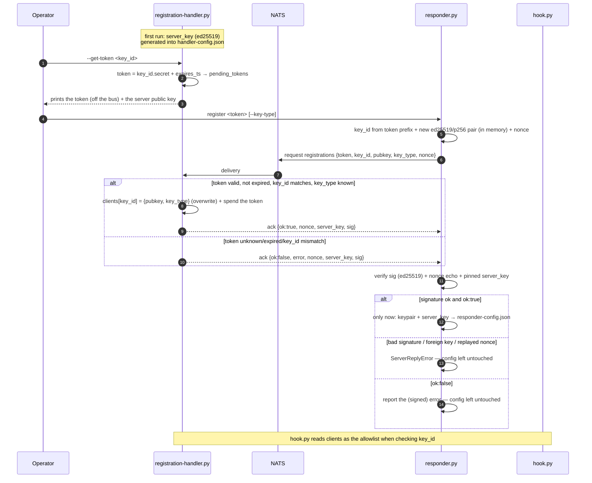
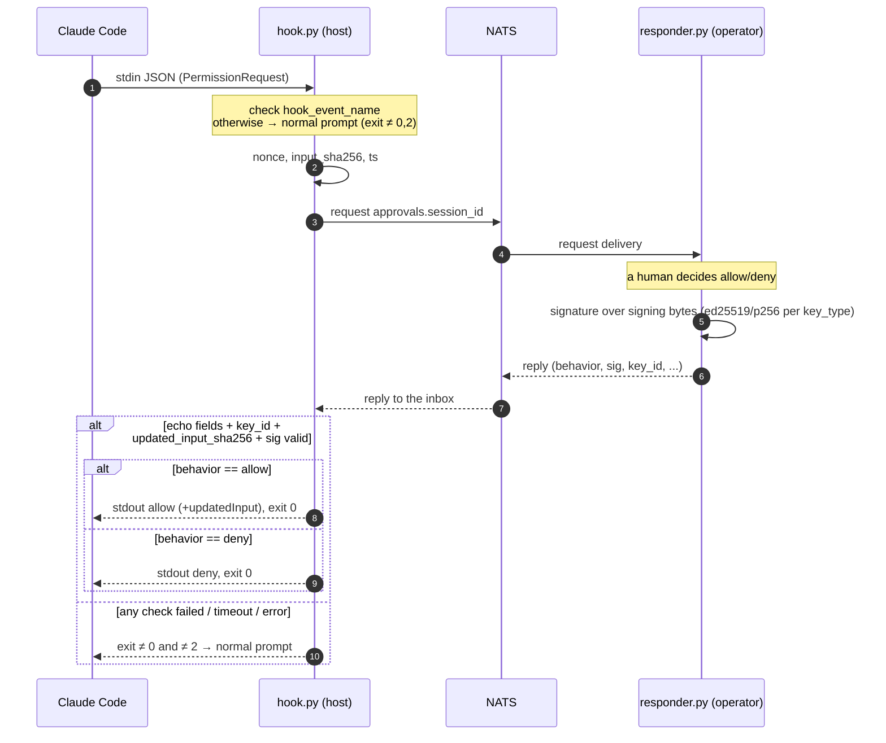

# approver/ — the approval flow: one server, two clients

The permission-approval code (NATS request-reply + Ed25519 / ECDSA P-256). One
**server** — `registration_handler.py`, which owns the allowlist — and two
**clients** that answer approval requests: `responder.py` (software key on disk)
and `responder_yubikey.py` (the key inside a YubiKey, and the primary one). A
third client lives in [`approver-web/`](../approver-web/CLAUDE.md); it speaks
exactly this protocol, which is why nothing here changed for it.

Alongside them: `hook.py`, which is the Claude Code end of the flow rather than a
responder, and `protocol.py`, the wire format every side assembles identically.

This file owns sections **6**, **7** and **8.7** of the project docs. The
numbering is global — see [`../CLAUDE.md`](../CLAUDE.md) §2 for the map — and
project-wide rules (TDD, the dependency allowlist, the `py` launcher) stay in
that root file. The YubiKey library the §8.7 responder is built on is §8 in
[`lib/CLAUDE.md`](../lib/CLAUDE.md).

## Modules

- `approver/protocol.py` — the shared wire-format contract (§6/§7): `PROTOCOL_VERSION`, `canonical_json` (sort_keys, no spaces), `canonical_sha256`, `signing_bytes(...)` (fixed field order joined by `\n`, `reason` last). One implementation for both sides — the responder signs, the hook re-verifies. Also the **server key** contract of §6: `SERVER_KEY_TYPE` (`ed25519`, fixed), `REGISTRATION_REPLY_CONTEXT` (the domain separator, so a registration signature can never be replayed as an approval one) and `registration_reply_signing_bytes(...)` — signed by `registration_handler`, verified by every approver.
- `approver/responder.py` — the human responder. `register <token> [--key-type ed25519|p256]`: generates a new key pair of the chosen scheme (default `ed25519`), registers the public key + `key_type` over `registrations` using a one-time token, verifies the handler's signature over the reply, saves the pair (with `key_type`, and the handler's `server_key`) to `responder-config.json` **only on `ok:true`** (a rejection does not clobber a working config). The §6 server-key seam lives here and is shared by all three approvers: `new_nonce`, `verify_server_reply(reply, nonce=, pinned_pubkey=)` (returns the handler's public key, raises `ServerReplyError` on anything it cannot vouch for — unsigned, foreign-signed, replayed, or signed by a key other than the pinned one) and `pinned_server_key(config_path)`. `serve`: subscribes to `approvals.*` (queue group `approvers`), prompts the operator on the console (`prompt_operator` — a/d/s plus an optional free-text `reason`; the request display itself is `print_request`, reused by the YubiKey responder's own prompt), signs the reply with the config's `key_type` (§7). Pure functions `parse_key_id` / `build_registration_request` / `build_reply` — tested without NATS. Two seams shared with the YubiKey responder (§8.7): `build_signed_reply(request, *, behavior, key_id, sign, …)` assembles the §7 reply and delegates the signature to a `sign(bytes) -> b64` callable (`build_reply` is that with `crypto.sign`), and `make_approval_handler(*, key_id, sign, prompt, on_signed=None)` builds the `approvals.*` handler — prompt **and** signature run in a worker thread (both block on a human, and the event loop must stay free for NATS heartbeats), a signer that fails prints why and replies with nothing, so the hook falls back to the normal prompt, and `on_signed(reply)` (optional, called guarded just before the reply goes out) lets a front end echo what was signed. Run: `py approver/responder.py {register|serve}`.
- `approver/responder_yubikey.py` — the same responder with the key on a **YubiKey** (§8.7): no private key on disk, one touch per decision. `register <token> [--credential FILE] [--ctx] [--ikm] [--rp-id] [--attest|--require-yubikey|--roots|--intermediates|--no-require-root]`: `makeCredential` on the device (one touch) or reuse a saved credential (no device at all), derive an ARKG key, register its public half as `key_type=p256`, verify the handler's signature over the reply through the same `responder.verify_server_reply`, write `responder-yubikey-config.json` (including the pinned `server_key`) **only on `ok:true`**. `serve`: re-derives offline at startup, then signs each decision on the key. Its own `prompt_operator` takes a single `a`/`d`/`s` keystroke and **asks for no `reason`** (the touch is the ceremony; `reason` still travels empty and signed) — it reuses `responder.print_request` for the display; `print_decision` / `signature_fingerprint` then echo the signed `behavior` plus the full `sha256` of the signature (wired as `on_signed=`, never raises). Pure/offline functions `config_from_derivation` / `derived_from_config` / `device_signer` (the `sign` callable `make_approval_handler` takes) — tested without hardware. Error `NotAYubiKey` (carries the `AttestationCheck`) → exit 2. Exit codes: `0` ok, `1` error, `2` `--require-yubikey` said no. Run: `py approver/responder_yubikey.py {register|serve}` (Windows: elevated, venv interpreter by path — see §8 in [`lib/CLAUDE.md`](../lib/CLAUDE.md)).
- `approver/registration_handler.py` (in §6 — `registration-handler.py`; underscore so the module is importable) — the allowlist owner. `--get-token <key_id>`: mints a one-time token `<key_id>.<secret>` (TTL 15 min), writes it to `pending_tokens`, prints the token to stdout. Without the flag — listens on `registrations`: finds the token, checks `key_id`/expiry/`key_type`, writes `clients[key_id]` (with the pinned `key_type`; rotation), consumes the token (one-time, only on success). `--once` (serve mode): exit after the first **successful** registration (`flush()` first, so the ack is on the wire before draining) — used by the e2e scripts instead of a background process that must be killed. Pure functions `validate_key_id` / `add_pending_token` / `sweep_expired` (expired tokens are dropped on every mint) / `get_token` / `handle_registration` + `make_handler` (reloads the config from disk on every message + `asyncio.Lock` around the read-modify-write). Errors: `bad request|token unknown|key_id mismatch|expired`. It also owns the §6 **server key**: `ensure_server_key(data)` (mints one on first use, validates but never replaces an existing one), `load_server_key(config_path)` (ensure + persist + return the public half, called by `serve` and by `--get-token`, both of which print it on stderr), `regenerate_server_key(data)` / `rotate_server_key(config_path)` (the deliberate replacement, behind `--new-server-key`; returns `(new, previous)`) and `sign_reply(data, reply, request, now)` — every reply that leaves the handler goes through it, rejections included. `--new-server-key`: generate or **replace** the handler's key, print the new public half to stdout (the key alone, so it can be piped) and to stderr what it replaced plus the approvers that now have to register again; the allowlist and pending tokens are untouched. Run: `py approver/registration_handler.py [--get-token <key_id>] [--new-server-key] [--once] [--config <path>] [--servers <url>] [--ttl <sec>]`.
- `approver/hook.py` — the Claude Code `PermissionRequest` hook (see §7). Reads the payload from stdin, checks `hook_event_name`, sends `nats request approvals.<session_id>` (with nonce/`input_sha256`/ts), verifies the signed reply against the allowlist (`clients` from `handler-config.json`), and prints the `decision` to stdout. Pure functions `build_request` / `verify_reply` / `decision_output` + `allowlist_from_config` / `servers_from_config` / `timeout_from_config` + `request_decision` (orchestration). **Fail-safe:** any error / invalid signature / mismatch / untrusted `key_id` → exit ≠0 and ≠2 (the normal prompt); the decision is delivered only via exit-0 JSON, never a "silent allow". The NATS server(s) and the approval timeout (default 60s) are read from `handler-config.json` (`servers` / `timeout` keys); only the config-file location is external — env `AI_REMOTE_HANDLER_CONFIG` or `--config`. To activate it, wire it up **yourself**: a `PermissionRequest` hook, matcher `*`, running `<repo>\approver\hook.py` under the **venv interpreter named by path** — not `py`, which selects `.venv` only when `VIRTUAL_ENV` is set in the calling shell (root §5) and Claude Code sets nothing (the exact snippet is under "Wire it into Claude Code" in [`README.md`](../README.md)). It belongs in the **per-machine** `.claude/settings.local.json`, which is git-ignored — this checkout's entry is `"E:\\...\\.venv\\Scripts\\python.exe" "E:\\...\\approver\\hook.py"`, quoted inside the JSON string for the reason §9.5 spells out. **Not because of the absolute path**, which is worth being straight about: the committed `.claude/settings.json` names an absolute path too, four times over (§9.5), so portability is not what separates the two files. What separates them is that this hook *takes over a decision* — wiring it is a choice each machine makes about whether its permission prompts leave the terminal at all, and a committed entry would make that choice for every checkout, including one with no responder anywhere on the bus. The status line and the three activity hooks are additive and fail silently (§9.3); this one is the approval path. `.claude/settings.json` is the committed half: it wires the status line and the three hooks that publish the `activity` subject (§9.5, §9.10), all four of which name the same built binary and none of which is this hook.
- **Runtime configs with secrets** (`responder-config.json` — the private key; `handler-config.json` — token secrets in `pending_tokens` **and** the server key's private half) are not committed to git (see `.gitignore`). `responder-yubikey-config.json` is git-ignored too, though it holds **no** private key (that never leaves the device) — it identifies the credential behind a registered key. Committed alongside them are `handler-config.example.json` (a usable starter: `servers`/`timeout` set, empty `clients`/`pending_tokens`), `responder-config.example.json` and `responder-yubikey-config.example.json` (format references — the real files are generated by the respective `register`).

## The scripts that drive these flows

How to run them — arguments, expected output, exit codes — is in
[`scripts/README.md`](../scripts/README.md). What follows is why each one is
built the way it is.

### `scripts/e2e-registration.cmd`

A command-file e2e of registration (§6): mints a token → brings up the handler with `--once` (it exits itself after the first successful registration) → `responder register` (with retries until ready) → checks `clients[key_id].pubkey` against the responder's `public_key`, and the handler's `server_key.public_key` against the `server_key` the responder pinned. Throwaway configs in `%TEMP%`, does not touch the repository. Requires NATS on localhost and the `py` launcher. Exit 0 = PASS, 1 = FAIL. Run: `scripts\e2e-registration.cmd`.

### `scripts/e2e-approval.cmd`

A command-file e2e of the approval loop (§7): registers a responder → starts real `responder.py serve` in the background (the operator's `allow` is fed from a redirected answers file instead of typed) → pipes a `PermissionRequest` into real `hook.py` (retries until the responder is subscribed) → verifies the hook emits a signed `allow` decision. Exercises the actual processes / stdin-stdout / exit codes, not just in-process calls. Throwaway configs in `%TEMP%`, does not touch the repository. Requires NATS on localhost and the `py` launcher. Exit 0 = PASS, 1 = FAIL. Run: `scripts\e2e-approval.cmd`.

### `scripts/yubikey-approval.cmd`

The §8.7 flow end to end, in **six steps**: throwaway handler config + token → `yubikey-exec make-credential` (**first touch**) → `responder_yubikey register --credential` (no device) → `responder_yubikey serve` (offline re-derivation, own window) → `hook.py` fed a `PermissionRequest` (**second touch**) → check the printed decision. Real processes over real NATS; only the operator's `a`/`d` keystroke is scripted (redirected answers file, as in `e2e-approval.cmd`) — the touch cannot be. Args: `[--ctx LABEL] [--credential FILE] [--out FILE] [--rp-id ID] [--attest] [--require-yubikey] [--deny] [--timeout SEC]`. Exit 0 = PASS, 1 = FAIL, 2 = `--require-yubikey` said no.

- **`make-credential` deliberately runs before `register`**: `register --credential FILE` needs no device, so the touch is spent once and a re-run (`--credential <kept file>`) costs none. The credential is kept in `%TEMP%` and its path printed; the throwaway configs are deleted.
- The hook timeout goes into the **handler config** (`timeout`, default 120s here) — `hook.py` has no such flag, and 60s is tight when a human has to notice a blinking key. Step 3 also prints `clients[key_id]` so the `key_type=p256` + compressed-point allowlist entry is visible; a non-p256 entry fails the run.
- Everything except the two touches is verifiable without hardware: point `--credential` at a credential built by `tests/test_yubikey_fido2.make_result` + `save_result` and steps 1–4 pass, with step 5 timing out at exactly the signature (that is how this script was tested).
- **Keep this file CRLF.** With LF endings `cmd` resumed at the wrong offset after `goto :parse` and skipped whole `if` blocks, so a second option died as `unknown argument`. It is offset-dependent — the shorter LF scripts here happen to get away with it.
- Like `yubikey-arkg.cmd` it must be started from an already-elevated console and calls `.venv\Scripts\python.exe` by path (elevation drops `VIRTUAL_ENV`). Needs NATS on localhost. Run: `scripts\yubikey-approval.cmd`.

## 6. Responder registration (bootstrapping trusted keys)

How the responder's public key gets into the allowlist that `hook.py` checks. Keys are not written by hand — the responder generates its own pair and registers the public half using a one-time token. Registration is a prerequisite step: without a trusted key the approval flow (section 7) will not work.

Registration is mutually authenticated: the token proves the approver may claim its `key_id`, and the **server key** (below) proves the answer came from the allowlist owner.

**Roles and configs:**
- `registration-handler.py` — the allowlist owner. Stores it in its own JSON config next to the script (`handler-config.json`); this same config is read by `hook.py` when checking `key_id`. Issues one-time tokens and listens on the `registrations` subject. Has an **Ed25519 key of its own** (`server_key`, generated on first use) and signs every reply with it.
- `responder.py` — stores its `key_id` and **private** key in its own JSON config (`responder-config.json`), together with the handler's **public** `server_key` it pinned at registration. The private key never leaves for the bus. The `key_id` is not chosen by the responder — it comes inside the token (see below).
- `responder_yubikey.py` (§8.7) — **the primary responder** (`responder.py` is the software stand-in used by tests and hardware-free development); it registers through exactly this protocol with `key_type: p256`, except the key pair is derived from a YubiKey, so there is **no private key to store**: `responder-yubikey-config.json` keeps only what re-derives the public half. To the handler and to `hook.py` it is indistinguishable from a software P-256 responder — that is the design goal, and why neither needed changing.

`handler-config.json`:
```json
{
  "v": 1,
  "servers": "nats://127.0.0.1:4222",
  "timeout": 60,
  "pending_tokens": [
    { "key_id": "approver-1", "token": "approver-1.<b64 32 bytes>", "expires_ts": 1737346500 }
  ],
  "clients": {
    "approver-1": { "pubkey": "<b64 public>", "key_type": "ed25519", "registered_ts": 1737345600 }
  },
  "server_key": {
    "key_type": "ed25519",
    "private_key": "<b64 32B — SECRET>",
    "public_key": "<b64 32B — what every approver pins>"
  }
}
```
- `clients` (a map `key_id → {pubkey, key_type, …}`) is precisely the allowlist for `hook.py`. `key_type` (`ed25519`/`p256`) is the signature scheme pinned for this key at registration; an entry without it is treated as `ed25519` (backward compatible). The hook verifies with **this** scheme, never one chosen by the reply.
- `servers` / `timeout` (both optional) configure `hook.py`'s NATS connection and how long it waits for a human decision; absent/invalid values fall back to `nats://127.0.0.1:4222` / 60s. The registration handler preserves these keys across writes.
- `server_key` — **the handler's own identity** (see "The server key" below). Generated on first use (`serve` or `--get-token`) and never rotated on its own; `hook.py` neither reads nor needs it. Its presence is why `handler-config.json` now holds a private key as well as token secrets — it stays git-ignored, and `handler-config.example.json` deliberately does **not** ship a placeholder for it (a placeholder would fail validation instead of being replaced).

`responder-config.json`:
```json
{
  "v": 1,
  "key_id": "approver-1",
  "key_type": "ed25519",
  "private_key": "<b64 private>",
  "public_key": "<b64 public>",
  "server_key": "<b64 32B ed25519 public — the handler this approver trusts>"
}
```
- `key_type` (`ed25519`/`p256`) records the responder's own scheme so `serve` signs with it; absent → `ed25519`.
- `server_key` is the handler's **public** key, pinned at registration. It is public material (safe to compare, print, copy) and is read only by `register`, to insist that the next registration is answered by the same handler.

**The server key (the handler signs everything it says).** `registrations` is an open subject: anyone who can publish on the bus can answer a registration request, and a forged `{"ok": false, "error": "expired"}` is as damaging as a forged ack — it stops a key from being registered and sends the operator hunting for a problem that does not exist. So the handler has an Ed25519 pair of its own and signs **every** reply, acceptances and rejections alike; each approver verifies that signature before reading the verdict, and stores the public half.

- **Generated, not configured.** On the handler's first run (`serve`, or `--get-token` — whichever comes first) `ensure_server_key` mints the pair into `handler-config.json`. An existing one is validated (the stored public half must be the one the private half produces) and **never** replaced by that path: a silent rotation would lock out every approver that pinned the old key. A corrupt record is a `ConfigError`, not a quiet re-mint.
- **Rotation is an explicit act:** `registration_handler.py --new-server-key`. It mints a fresh pair over whatever was there (so it is also the repair for the corrupt record `ensure_server_key` refuses to touch), prints the new public key to stdout and to stderr what it replaced and which approvers are affected. `clients` and `pending_tokens` are left alone — a new handler identity says nothing about the responder keys the hook verifies.

  **The cost is the pin, and it is meant to be felt.** Every approver holding the old key will refuse to re-register (`registration failed: the reply is signed by a different key than the registration handler this approver already trusts`). Recovery is per approver, and deliberately manual: delete its config (`responder-config.json` / `responder-yubikey-config.json`, or `approver-web`'s `config.json`) — or just the `server_key` field in it — and register again with a fresh token, comparing the printed key. Rotate only when you mean it: a key that turns over quietly is a key nobody checks.
- **Ed25519, fixed.** `protocol.SERVER_KEY_TYPE`. Unlike the responder keys there is no `key_type` negotiation here: an approver pins one key *and* one algorithm, so nothing in a reply can select either.
- **Trust on first use, pinned after.** The first registration has nothing to compare against, so the key is accepted and written to the approver's config; every registration after that must be signed by exactly it, or `register` refuses (`ServerReplyError`) and touches nothing. To close the first-use gap, compare it by eye: both `serve` and `--get-token` print `server key (ed25519): <b64>` on stderr, `responder-config.json` / `responder-yubikey-config.json` hold it as `server_key`, and the web approver shows it as `handler key` in the register panel.
- **What the signature covers** — `registration_reply_signing_bytes` (`approver/protocol.py`), `\n`-joined, utf-8:

  ```
  "registration-reply" + "\n" + str(v) + "\n" + ("true"|"false" for ok) + "\n" + key_id + "\n" + nonce + "\n" + str(ts) + "\n" + error
  ```

  The leading context string is domain separation: a server signature must never be replayable as a §7 approval signature, and both are `\n`-joined field lists. `nonce` is echoed from the request (32 random bytes the approver generated), which binds the reply to this exchange and makes an old `ok:true` useless. `error` is last for the same reason `reason` is last in §7 — it is the only free-text field.
- **Not the approval path.** The server key signs registration replies only; `hook.py` and the `approvals.*` flow (§7) are untouched by it. There is no other server→approver message today, so "the handler signs everything it says" and "registration replies are signed" currently describe the same set.

**The token is bound to a `key_id`.** The token format is `<key_id>.<b64 32 random bytes>`: a readable `key_id` on the left, the secret on the right. A `key_id` cannot contain `.` (the first dot is the separator). The token authorizes registration of **only** that `key_id` — it cannot be used to claim or hijack someone else's slot.

**Flow:**
1. `registration-handler.py --get-token <key_id>` — generates a secret (32 bytes b64), assembles the token `<key_id>.<secret>`, puts a record `{key_id, token, expires_ts}` into `pending_tokens` (`expires_ts` defaults to now+15 min), and prints the token to stdout (and the server public key to stderr). The token is handed to the operator off the bus.
2. `responder.py register <token> [--key-type ed25519|p256]` — parses `key_id` from the token prefix, generates a new pair of the chosen scheme (default `ed25519`) plus a fresh `nonce`, and sends `nats request registrations` with the message (see below). The pair (`key_id` + `key_type` + private + public + the handler's `server_key`) is written to `responder-config.json` **only after** the handler's signature verifies **and** it acks `ok:true` — the order matters twice over: an answer that is not the handler's is not a verdict at all, and a rejected registration must not clobber a working config.
3. `registration-handler` listens on `registrations`. For each message: it finds the token in `pending_tokens`, checks that it has not expired, **that the `key_id` in the message matches the `key_id` the token is bound to**, and that `key_type` (if present) is a known scheme → writes `clients[key_id] = {pubkey, key_type, registered_ts}`, **overwriting** the client key with this `key_id` (rotation) → removes the token from `pending_tokens` (one-time use) → signs the reply with the server key and sends it to the reply-inbox. From this moment `hook.py` trusts the new key for this `key_id`.

Request (`responder.py` → `registrations`):
```json
{
  "v": 1,
  "token": "approver-1.<b64 from --get-token>",
  "key_id": "approver-1",
  "pubkey": "<b64 public>",
  "key_type": "ed25519",
  "nonce": "<b64, 32 random bytes>",
  "ts": 1737346000
}
```
- `key_id` must match the prefix of `token` — the handler verifies this (mismatch → `ok:false`).
- `key_type` (`ed25519`/`p256`) is optional; absent → `ed25519`. An unknown value is rejected as `bad request`. It is stored in `clients[key_id]` and pins the scheme the hook verifies with.
- `nonce` is echoed inside the handler's signature over the reply. Optional on the wire (an older approver omitting it gets `""` echoed), but omitting it gives up replay protection — every approver in this repo sends one.

Reply (`registration-handler` → reply-inbox):
```json
{
  "v": 1,
  "ok": true,
  "key_id": "approver-1",
  "nonce": "<echo from request>",
  "ts": 1737346001,
  "server_key": "<b64 32B ed25519 public>",
  "sig": "<b64 signature over the registration-reply signing bytes>"
}
```
- On error — `{ "v": 1, "ok": false, "error": "<token unknown|expired|key_id mismatch|bad request>", … }` with the same `nonce`/`ts`/`server_key`/`sig` fields: **rejections are signed too**. A token is considered spent only on success; a spent (or otherwise unrecognized) token comes back as `token unknown`.
- Checks in the approver before the verdict is read (any failure → `ServerReplyError`, nothing persisted): `v` matches; `ok` is a real boolean; `server_key` is present and, if one is already pinned, is exactly it; `nonce` echoes what was sent; `ts` is an integer; `sig` verifies as Ed25519 over the signing bytes. `key_id`/`error` are covered by that signature, so a rejection cannot be turned into an acceptance or vice versa.

**Multiple clients.** `clients` may hold several `key_id`s. But `approvals.<session_id>` is a regular subject: if several responders are running in parallel, the request reaches **all** of them, and each can reply (the hook takes the first valid reply). Hence the rule: keep **one** responder running at a time, or subscribe responders to `approvals.*` via a **queue group** (then each message goes to exactly one instance). The `registrations` subject is fan-out, but the token is one-time, so duplicate registrations are safe.

**When that bites, `/connz` is where you look**, and it is worth something now: every client here names itself, `responder:<key_id>` and `responder-yubikey:<key_id>` among them, so "who is subscribed and answering" is a list of names rather than of ports ([`nats/CLAUDE.md`](../nats/CLAUDE.md) §4, "Naming a connection"). One row is still anonymous — the ESP32, whose client cannot send a name — so the `name: null` line is the board.

**Token trust model.** A token = authorization to register, bound to its `key_id`. The holder of a valid, unexpired token can register/rotate the key of **only** that `key_id` — claiming or hijacking someone else's slot is impossible. Rotating the key of the same `key_id` (overwriting `clients[key_id]`) is intentional. Tokens are short-lived, issued off the bus, and not logged. The `key_id` is not a secret (it is visible in the token) — only the right-hand part is the secret. The server key is the other half of that model: the token authenticates the approver to the handler, the server key authenticates the handler to the approver.




## 7. Feature: PermissionRequest hook → NATS Request-Reply (signed)

Replacing Claude Code's interactive permission prompt with external confirmation over NATS.

- **Hook event:** `PermissionRequest` (not `PreToolUse`). It fires only when Claude would actually reach the prompt; a rule-based auto-allow does not go onto the bus.
- **Matcher:** `*` (all tools).
- **Flow:** `hook.py` (on the host) reads stdin JSON, **checks `hook_event_name == "PermissionRequest"`** (otherwise the payload is not ours → fall through to the normal prompt) → sends `nats request approvals.<session_id>` with a nonce → `responder.py` (manual human input) signs the decision (Ed25519 or ECDSA P-256, per its configured `key_type`) — or `responder_yubikey.py` (§8.7), which produces the identical reply with the signature made **inside** a YubiKey — and replies to the request's reply-inbox → the hook verifies the signature using the scheme pinned in the allowlist for that `key_id` → prints `hookSpecificOutput.decision.behavior` (`allow`/`deny`) to stdout. There is no separate `.decision` subject: the reply travels over the request-reply channel.
- **We sign the entire content of the reply** — the concatenation `v + session_id + nonce + tool_name + input_sha256 + behavior + updated_input_sha256 + ts + reason` (nonce = anti-replay; `input_sha256` = the hash of `tool_input`, so the decision cannot be replayed onto a different command; `updated_input_sha256` is under the signature, otherwise what actually gets executed could be swapped; `reason`/`v`/`ts` are under the signature too). The exact format is in the "Signing bytes" section below.
- **Fail-safe:** any error (NATS unavailable, timeout, a bad/absent signature, a foreign nonce/key_id) → exit ≠ 0 and ≠ 2 → fall through to the **normal prompt**. Never a "silent allow". (Exit 2 is a blocking error: stdout is ignored, stderr goes to Claude; for `PermissionRequest` this is probably deny, but the exact semantics are not pinned down in the docs — so do NOT use it on errors, the decision is delivered only via exit-0 JSON.)
- **Client:** `nats-py`; **cryptography:** `cryptography` (Ed25519 or ECDSA P-256, chosen per key via `key_type`).

### 7.1 Sequence diagram



`PermissionRequest` hook contract:
- stdin: `{ hook_event_name, session_id, prompt_id, transcript_path, tool_name, tool_input, permission_mode, cwd }` — the hook must check `hook_event_name == "PermissionRequest"`. (`prompt_id` was added in Claude Code v2.1.196+; the hook does not need it, but it arrives in the payload.)
- stdout (exit 0): `{"hookSpecificOutput":{"hookEventName":"PermissionRequest","decision":{"behavior":"allow"|"deny","updatedInput"?:{…}}}}`
- exit codes: `0` — stdout is parsed as JSON (JSON is processed only on exit 0); `2` — a blocking error (stdout is ignored, stderr goes to Claude; the effect depends on the event, for `PermissionRequest` — probably deny, but the exact semantics are not pinned down in the docs); anything else (including `1`) — a non-blocking error, the normal prompt. The allow/deny decision is always delivered via exit-0 JSON, not via exit 2.

NATS message contract:

Request subject: `approvals.<session_id>`. The reply goes to the reply-inbox (request-reply).

Request (`hook.py` → the bus):
```json
{
  "v": 1,
  "session_id": "abc123",
  "tool_name": "Bash",
  "tool_input": { "command": "rm -rf build" },
  "input_sha256": "<hex sha256 of canonical JSON of tool_input: sort_keys=True, separators=(',',':')>",
  "permission_mode": "default",
  "cwd": "E:\\projects\\ai-remote\\nats",
  "nonce": "<b64, 32 random bytes>",
  "ts": 1737345600
}
```

Reply (`responder.py` → reply-inbox). The fields `v/session_id/tool_name/input_sha256/nonce/ts` are echoed from the request; `behavior/reason/updated_input` come from the responder:
```json
{
  "v": 1,
  "behavior": "allow",
  "reason": "approved by operator",
  "session_id": "abc123",
  "tool_name": "Bash",
  "input_sha256": "<echo from request>",
  "nonce": "<echo from request>",
  "ts": 1737345600,
  "updated_input": { "command": "npm ci" },
  "key_id": "approver-1",
  "sig": "<b64 signature over the signing bytes; scheme per the key's key_type>"
}
```
- `updated_input` (optional, object) — overrides the tool arguments; if set, the hook prints it in `decision.updatedInput`. It enters the signature as `updated_input_sha256` (see below).
- The field is optional and applied only when `behavior == "allow"`. If it is absent — the signing bytes use an empty string `""` in the `updated_input_sha256` position.

**Signing bytes** (signed by the responder, verified by the hook) — a raw concatenation of the fields in a **fixed order** with the `\n` separator, utf-8:
```
str(v) + "\n" + session_id + "\n" + nonce + "\n" + tool_name + "\n" + input_sha256 + "\n" + behavior + "\n" + updated_input_sha256 + "\n" + str(ts) + "\n" + reason
```
- `updated_input_sha256` = hex sha256 of the canonical JSON of `updated_input`, or `""` if the field is absent. The hook recomputes the hash from the received `updated_input` and compares — just like with `input_sha256`. The JSON canonicalization for both hashes is the same: `json.dumps(..., sort_keys=True, separators=(',',':'))`, utf-8 → sha256.
- `reason` comes **last** on purpose: it is the only free-text field and may contain `\n`; being the tail of the string, it stays unambiguous. None of the other fields contain a newline.

The order and separator must not be changed — both sides assemble the string identically.

Checks in `hook.py` before trusting a reply (any that fails → fall through to the normal prompt):
- `v` matches the expected protocol version;
- `nonce`, `session_id`, `tool_name`, `input_sha256`, `ts` match what was sent (anti-replay + binding to the command);
- `key_id` is present in the allowlist of trusted public keys (the allowlist is populated through registration — see section 6 "Responder registration" above; `key_id` itself is not part of the signing bytes — it is bound to the signature indirectly: it selects the public key **and the `key_type`**, and a signature made by a different key or a different scheme will not pass verification). The allowlist entry's `key_type` (default `ed25519`) selects the verification scheme; an unknown `key_type` is a fail-safe reject. `key_type` is taken from the trusted allowlist, never from the reply — so a reply cannot downgrade or swap the algorithm;
- `reason` is a string (it defaults to `""` when absent). A non-string `reason` cannot be assembled into the signing bytes, so it is rejected before the signature check rather than raising;
- if `updated_input` is present — the hook recomputes `sha256(canonical(updated_input))` and substitutes it into the signing bytes in the `updated_input_sha256` position (this hash is **not** transmitted as a separate field in the reply, unlike `input_sha256`, which is echoed back in the reply). Consistency is guaranteed by the `sig` check itself: if the responder signed a different `updated_input_sha256`, the signature will not match. If the field is absent — an empty string (`""`) takes its place in the signing bytes;
- `sig` is valid for the signing bytes under the corresponding public key (after this `behavior`/`reason`/`updated_input` can be trusted);
- `behavior ∈ {allow, deny}`; `updated_input` is honored only on `allow`.

**Privacy:** `tool_input` goes onto the bus as-is — for Bash that is the full command, for Write the file contents. The `approvals.<session_id>` subject and access to NATS must be restricted; do not connect untrusted subscribers.


### 8.7 The YubiKey-backed responder (`approver/responder_yubikey.py`)

The §6/§7 flow with the responder's key **on the YubiKey**: no private key anywhere on the host, and every allow/deny costs a physical touch. Same subjects, same `handler-config.json` allowlist, same signing bytes — `hook.py`, `protocol.py` and `registration_handler.py` are untouched and know nothing about YubiKeys.

**Why nothing on the verifying side had to change.** An ARKG derived key *is* a P-256 key, and the authenticator signs ECDSA-P256 over SHA-256, DER-encoded — precisely `lib/crypto.py`'s `key_type="p256"` scheme (§7). The only missing piece was encoding: `previewSign` yields a COSE key (`x`/`y`), while `crypto.verify` wants the base64 **33-byte compressed SEC1 point**. `yubikey.p256_public_b64` converts one to the other (pure, no `fido2`), and that string is what registration publishes. So a YubiKey reply is verified by the same code path as a software one — and the same fail-safes apply.

The hashing chain has to line up exactly, and it does: `device_signer` calls `sign_with_derived_key(data=signing_bytes)`, which hashes to `tbs = sha256(signing_bytes)` and the device signs **that digest as-is** (§8.1); `crypto.verify(..., "p256")` runs `ECDSA(SHA256)` over `signing_bytes`, i.e. hashes once itself. One hash on each side — do not "help" by pre-hashing.

**Two seams in `responder.py`, no duplicated protocol code:** `build_signed_reply(..., sign=…)` (a `sign(bytes) -> b64` callable instead of a private key) and `make_approval_handler(key_id=, sign=, prompt=)`. The YubiKey responder supplies `device_signer(result, derived)` as that callable; everything about the reply's shape stays in one place.

`responder-yubikey-config.json`:
```json
{
  "v": 1,
  "key_id": "approver-yk",
  "key_type": "p256",
  "public_key": "<b64 33B compressed point — exactly what clients[key_id].pubkey gets>",
  "server_key": "<b64 32B ed25519 public — the registration handler pinned at registration (§6)>",
  "ctx": "ai-remote-approvals",
  "ikm": "<hex, 32 bytes>",
  "rp_id": "example.com",
  "credential": { "…": "result_to_dict() of the makeCredential result" }
}
```
- **No private key** — `credential` + `ctx` + `ikm` re-derive the *public* half offline, and the device rebuilds the private half from the key handle when it signs. Losing this file means re-registering; leaking it does not leak a signing key (but it does identify the credential, so it stays git-ignored).
- `rp_id` is persisted because a `getAssertion` must use the RP the credential was created for. A credential imported with `--credential` was not saved with its RP, so pass the matching `--rp-id`.
- `serve` re-derives at startup and **refuses to start** unless the result matches `public_key`. Otherwise an edited `ikm`/`ctx` would yield a responder that signs replies the hook always rejects — visible only as an unexplained fall-back to the interactive prompt.

**Flow.** `register <token>`: `makeCredential` on the device (**touch**) or `--credential FILE` to reuse one saved by `yubikey-exec make-credential --out` (**no device at all** — derivation is offline) → optional attestation check → derive with `ctx`/fresh `ikm` → publish the derived public key over `registrations` as `key_type=p256` → verify the handler's signature over the reply (§6, `responder.verify_server_reply` — shared, not reimplemented) → write the config **only on `ok:true`**. `serve`: re-derive (offline) → per request, prompt the operator, then `sign_with_derived_key` (**touch**) → reply.

**Its prompt asks for no `reason`.** `responder_yubikey.prompt_operator` shows the request through the shared `responder.print_request` and takes a single `a`/`d`/`s` keystroke — the decision already costs a physical touch, and a free-text question between the keystroke and the touch is one step too many. `reason` still goes on the wire (empty) and is still covered by the signature (§7). The software `responder.py` keeps its reason prompt.

**And it echoes the outcome.** Neither the keystroke nor the touch tells the operator what actually left the machine, so `print_decision` (the `on_signed=` callback of `make_approval_handler`, third seam) prints the `behavior` and the full `sha256` of the signature bytes (`signature_fingerprint`) right after the key signs:

```
allow / deny / skip? [a/d/s]: a
>>> touch your YubiKey to sign this decision <<<
  decision  : allow
  signature : sha256:7faff4db5669b2433dc98cd9f75df674ee998f265b21d1c8670c7a3e1dfda221
  sent to the hook
```

The whole digest, not a truncated one — the DER signature itself is longer (72 bytes) and unreadable, and half a hash cannot be compared against anything.

`on_signed` runs **guarded** in `responder.py` and `print_decision` never raises: reporting is a courtesy, and a broken console must not turn a signed decision into silence (which would send Claude Code back to its own prompt, §7).

| Step | Device? | Touch? |
|------|---------|--------|
| `register` (no `--credential`) | yes | one — `makeCredential` |
| `register --credential FILE` | no | none |
| `serve` startup / re-derivation | no | none |
| each allow / deny | yes | one |

- **The attestation check is opt-in**, as everywhere else (§8.5): `--attest` reports, `--require-yubikey` aborts before anything is published or persisted (exit 2, `NotAYubiKey` carrying the `AttestationCheck`). Recommended here — registration is the moment you pick the key you will trust. `--roots` / `--intermediates` / `--no-require-root` behave as in `yubikey-exec`.
- **`device_signer` self-verifies** each signature against the derived public key before it goes on the wire. A signature the registered key cannot check is useless, and this is the only place where the failure can be explained to the operator.
- **A missing touch is not a deny.** `make_approval_handler` turns any signing failure (unplugged key, timeout, `ExtensionUnsupported`) into *no reply*: the responder loop survives, the hook times out and Claude Code shows its own prompt. Never a silent allow (§7).
- Re-registering the same YubiKey yields an **unlinkable** new key (fresh `ikm`) and rotates `clients[key_id]`. Both responders share the `approvers` queue group, so run only one — with both up, each request reaches exactly one of them, arbitrarily.
- Windows: **administrator terminal** (else `previewSign` output is dropped), and elevation loses the venv, so call `.venv\Scripts\python.exe` by path (§8).
- `scripts\yubikey-approval.cmd` drives this whole flow against real hardware in one command file (six steps, two touches — described at the top of this file).
